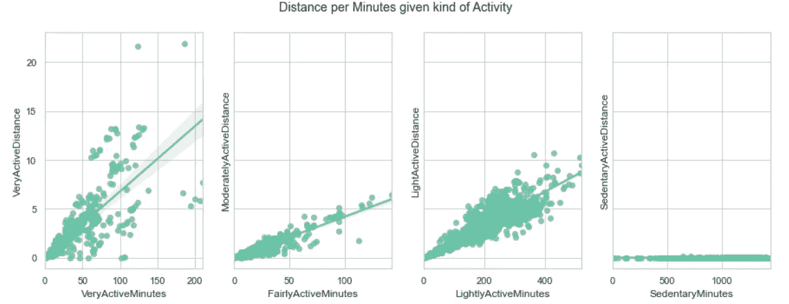
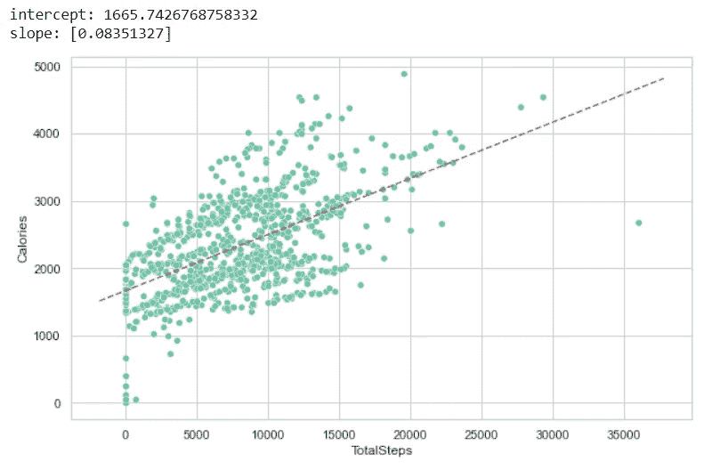
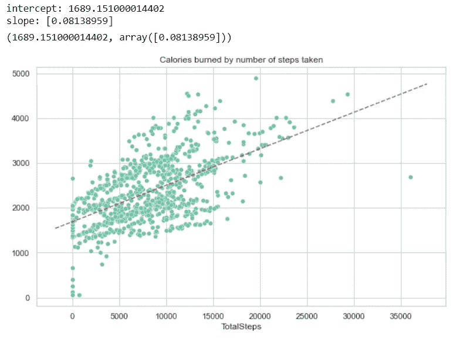
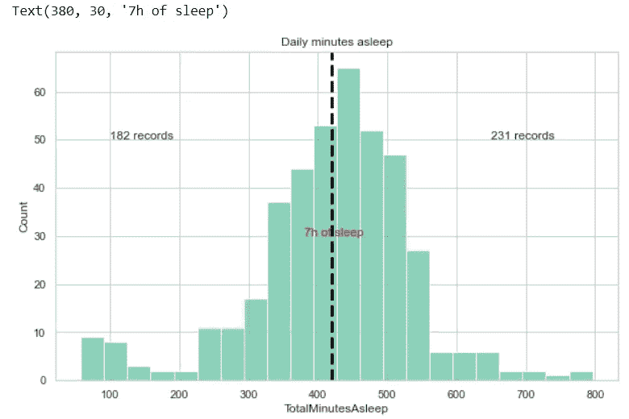
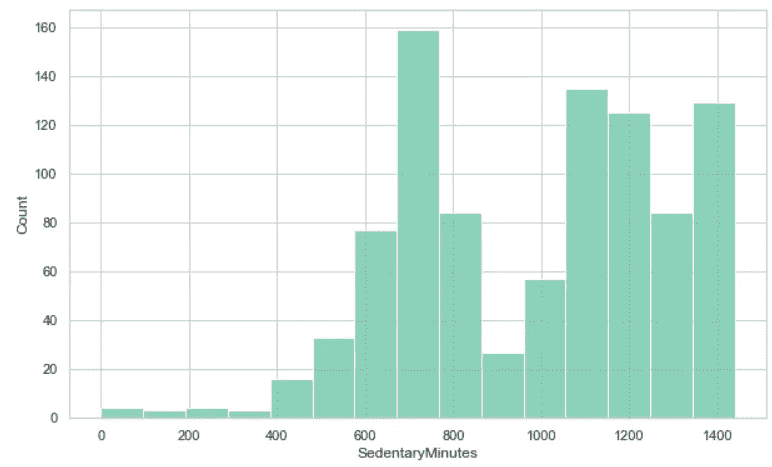
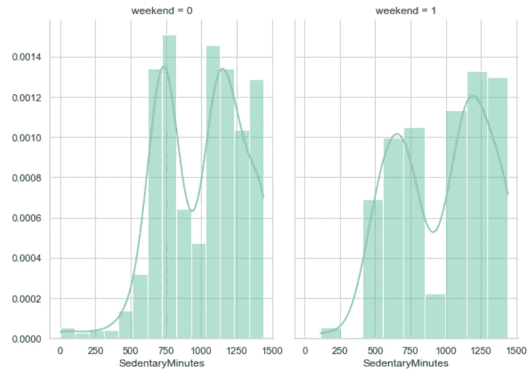
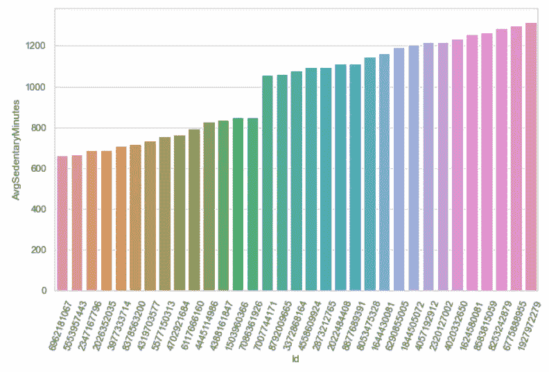
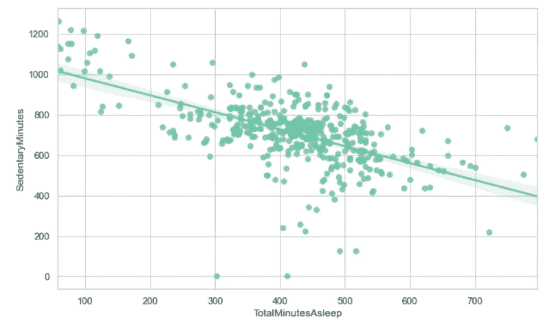

# 使用 SQL 和 Seaborn (SNS)在 Python 中进行探索性数据分析(EDA)

> 原文：<https://towardsdatascience.com/exploratory-data-analysis-eda-in-python-using-sql-and-seaborn-sns-d1f3bfcc78af?source=collection_archive---------9----------------------->

探索性数据分析(EDA)是一种分析数据集以总结其主要特征的方法，通常使用统计图形和其他数据可视化方法。可以使用或不使用各种统计模型，但 EDA 主要用于查看数据可以告诉我们什么，而不仅仅是正式的建模或假设检验任务。

你猜怎么着…总是…


图片来自 unsplash.com

# 为什么我首先要做 EDA？

我认为更合适的问题是:

> 哪种情况下不应该用 EDA？

EDA 是数据科学中至关重要的一步，它允许我们**获得某些洞察力，并对我们正在处理的数据进行统计测量**。这对无穷无尽的用户来说是必不可少的，包括业务经理、利益相关者、数据科学家等等。

对于数据科学家来说，EDA 有助于定义和完善我们的重要特征变量选择，这将用于尚未训练的机器学习模型。

在这个故事中，出于演示目的，我们将使用一些 [FitBit 数据](https://github.com/quaesito/ml-fitbit/tree/main/data)。

健身追踪器数据是数据科学家、统计学家、医学专家、生理学家和心理学家的热门研究领域，仅举几个学术研究领域为例。检测复杂时间序列数据(如 FitBit Fitness Tracker 数据)中的关系可以是建立日常生活模式的一种方式，也是检测这些模式偏差的一种方式。

一个好的 EDA 可以帮助发现这些…

# 分析

对 Fitbit 数据进行彻底的分析。重点介绍并讨论了关键发现。本文提供的分析使用从 33 个不同用户收集的 940 个数据点来执行。

在阅读这个故事的同时，我希望向你传达驱动代码编写的推理和逻辑。

首先，为了了解这些用户的生活方式，我们根据用户的活动水平绘制了分钟数和距离。



正如预期的那样，*非常活跃的*距离用更短的时间行驶(也就是说，它们用更陡的回归线表示更大的速度)。这里一个有点出乎意料的结果是*轻活动分钟*比*公平活动分钟*导致更高的速度。了解这种分类是如何进行的，以便真正理解“轻度”活动和“中度”活动之间的区别，这将是很有趣的。

让我们对*总步数*与*卡路里…* 做一些简单的线性回归



再一次，正如预期的那样，随着用户走的步数增加，一天燃烧的卡路里量也增加了。一个有趣的事实是，回归线的截距代表了不采取措施的一天燃烧的卡路里量。这是使用者在久坐的一天中燃烧的卡路里量。根据[健康线](http://healthline.com)部位，这个数字对应的是基础代谢率。

如果我们知道用户的性别、体重、身高和年龄，就可以计算出这个值。例如，他们报告称，体重 175 磅、身高 5 英尺 11 英寸的 35 岁男性的基础代谢率为 1816 卡路里，而体重 135 磅、身高 5 英尺 5 英寸的 35 岁女性的基础代谢率为 1383 卡路里。为了将这些估计值与我们的数据进行比较，我们可以使用线性回归得到截距值。预测的基础代谢率约为 1665.74(介于 35 岁女性和男性的预测值之间)。

如果我们只过滤零步骤的数据点，并获得卡路里分布的统计数据，我们可以进一步获得用户的基础代谢率信息。



让我们看看*非常活跃分钟*、*公平活跃分钟*和*轻微活跃分钟……*的数据分布


这里有一个问题:不清楚是否所有用户在分析期间的一整天都在使用健身追踪器。如果用户记录了一整天，那么*VeryActiveMinutes*+*FairlyActiveMinutes*+*LightlyActiveMinutes*+*sedentaryments*的总和应该等于 1440 分钟(一天的总分钟数)。


从上面的代码片段中，我们得出

```
There are 474 (out of 936) rows where users logged the whole day.There are 462 rows where users logged parts of the day.
```

*LightlyActiveMinutes* 分布非常对称，在活动的几分钟内没有峰值。记录一整天的用户可能最终会注册大量的 *LightlyActiveMinutes* ，而那些只记录一天中一部分时间的用户可能只注册需求较高的活动。


现在，让我们来看看睡眠习惯…



星期几有什么不同吗？现在我们已经看了一下我们的数据及其分布，一周中的哪一天会对用户行为产生相当大的影响吗？


周末久坐分钟有什么变化？



这种分布如何依赖于周末？



我们现在已经根据*日均分钟数*的分布区分了两组用户



似乎我们已经发现了一个趋势，这两个组有一个明显的偏移，似乎在边界线附近。让我们验证一下…



在这里，我们发现了一个明显的趋势，即睡眠时间越长的用户越少久坐。这表明睡得最多的用户往往在白天也更活跃。

# 数据洞察

仅使用我们 33 个用户的日常活动，我们得出了一些有趣的结论！

在这里，我包括了从上面的 EDA 中得到的一些高层次的见解:

*   在一周的不同日子里，用户活动没有明显的区别；平均每天走的步数在 7670 左右。
*   根据来自 [CDC](https://www.cdc.gov/prc/index.htm) : *的一些研究，“……较高的每日步数与较低的各种原因的死亡风险相关。”*疾病预防控制中心还告诉我们:*“…与成人每天走 4000 步相比，这个数字被认为是低的，每天走 8000 步与全因死亡率(或全因死亡)降低 51%相关。每天走 12000 步比走 4000 步的风险低 65%。”*

> 如果目标是燃烧一些卡路里，我们发现所采取的步骤和燃烧的卡路里之间存在线性关系。因此，我们可以使用用户数据来拟合模型，并预测用户应该走多少步才能达到一定的卡路里燃烧量。

*   关于睡眠习惯，随着睡眠时间的增加，久坐时间明显减少。

# 接下来呢？

EDA 通常是为了获得数据洞察力，这可以帮助我们完成机器学习任务。在接下来的故事中，我们使用相同的数据集和衍生的见解来训练几个机器学习模型，以解决回归问题。

[](/solution-of-a-regression-problem-with-machine-learning-in-python-using-sklearn-and-xgboost-and-ea19afdfc067) [## 使用 Sklearn、XGBoost 和 PySpark 在 Python 中进行回归

### 机器学习常用于解决回归问题。更具体地说，回归的应用…

towardsdatascience.com](/solution-of-a-regression-problem-with-machine-learning-in-python-using-sklearn-and-xgboost-and-ea19afdfc067) 

如果你喜欢我的故事，并想跳到有代码和完整数据集的笔记本，我已经在我个人的 [git](https://github.com/quaesito) 上的 [repo](https://github.com/quaesito/ml-fitbit) 中发布了它。

给回购打个星:)

如果你在数据科学和/或人工智能项目上需要任何帮助，请随时通过 [Linkedin](https://www.linkedin.com/in/micheledefilippo/) 或 [midasanalytics.ai](http://midasanalytics.ai) 联系我