# Seaborn 数字营销的探索性数据分析

> 原文：<https://towardsdatascience.com/exploratory-data-analysis-for-digital-marketing-with-seaborn-11d5f707fcce?source=collection_archive---------15----------------------->

## 数据可视化

## 比点击率还高。


来自 [Unsplash](https://unsplash.com/) 的照片 [Carlos Muza](https://unsplash.com/@kmuza)

# 什么是 EDA，为什么它很重要？

探索性数据分析(EDA)通常是您手头有数据并想要分析它的第一步。在 EDA 中，没有假设，没有模型。你正在从数据中寻找模式和真相。

EDA 对于数据科学项目至关重要，因为它可以:1 .帮助你获得对数据的直觉；2.在分布之间进行比较；3.检查数据是否在您期望的范围内；4.找出数据丢失的地方或是否有异常值；5.汇总数据，计算平均值、最小值、最大值和方差。

EDA 的基本工具是绘图、图表和汇总统计。

# 为什么是 Seaborn？

[Seaborn](https://seaborn.pydata.org/introduction.html) 是一个用 Python 制作统计图形的库。它建立在 matplotlib 之上，并与 pandas 数据结构紧密集成。它相当于 Python 中 R 的 ggplot2。

# 关于数据

在文章中，我们将使用 Seaborn 对模拟的数字营销数据进行 EDA。这是 Rachel Schutt 博士和 Cathy O'Neil 博士的书[做数据科学](https://www.oreilly.com/library/view/doing-data-science/9781449363871/)中的第一个练习。

你可以在这里下载数据[。 *dds_ch2_nyt* 文件夹中的每个 CSV 文件代表 2012 年 5 月纽约时报主页上一天的广告显示和点击记录。每行代表一个用户。有五栏:年龄，性别(0 =女性，1 =男性)，印象数，点击数，登录数。](https://github.com/oreillymedia/doing_data_science/blob/master/dds_datasets.zip)

我已经将 zip 文件下载到我的本地机器上，并将使用 Google Colab 进行分析，但是也可以随意使用其他 ide。你可以在这里找到笔记本。

是时候开始探索了！

让我们首先探索第一个 CSV 文件:五月第一天的信息。

```
# Upload data from local machine to Google Colab
from google.colab import files
uploaded = files.upload()# Convert dataset to pandas dataframes
import pandas as pd
df = pd.read_csv("nyt1.csv")
df.shape
```

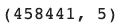

数据集的形状(图片由作者提供)

```
df.head()
```

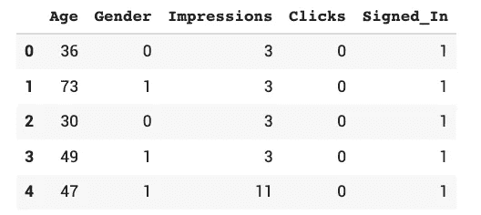

数据集的前五行(图片由作者提供)

```
df.describe()
```

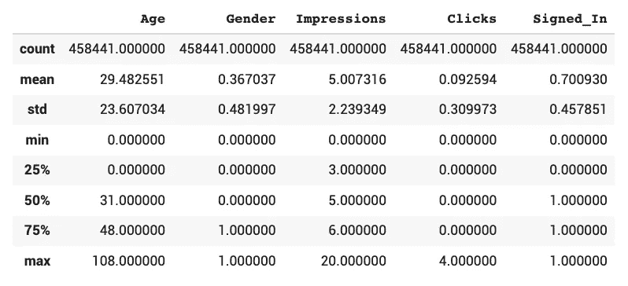

数字特征统计(图片由作者提供)

从上面的统计数据中，我们知道特性没有丢失值。年龄组在 0 到 108 岁之间。让我们把年龄分成七个组。

```
# Create a new variable 'age_group' to categorize users by age
bins = [0, 18, 25, 35, 45, 55, 65, 110]
labels = ['<18', '18-24', '25-34', '35-44', '45-54', '55-64', '65+']
df['age_group'] = pd.cut(df.Age, bins, labels = labels,include_lowest = True)
df.head()
```

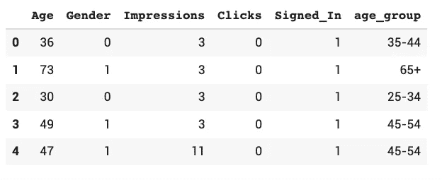

创建了一个新的功能“年龄组”(图片由作者提供)

按性别分每个年龄段有多少人？

我们可以使用 [*countplot*](https://seaborn.pydata.org/generated/seaborn.countplot.html) 用条形显示每个分类箱中的观察计数。

```
import warnings
import seaborn as sns
warnings.filterwarnings('ignore')
# Set default theme and figure size
sns.set_theme()
sns.set(rc={'figure.figsize':(20,10)})sns.countplot(x='age_group', hue='Gender', data=df)
```


按性别分列的各年龄组人数(图片由作者提供)

我们可以发现大多数用户是 18 岁以下的女性。在 18 至 64 岁年龄组中，男性使用者多于女性。但是对于 65 岁以上和 18 岁以下的用户，女性用户多于男性用户。

这里，用户指的是阅读《纽约时报》文章的人。我们更感兴趣的是他们是否会点击广告。

从统计图像中，我们知道用户没有点击或者点击了 4 次。

我们来看看在所有年龄段中，哪个群体的点击量更多。

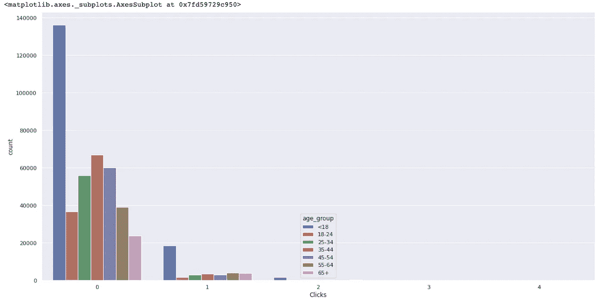

点击量与年龄组(图片由作者提供)

所以大多数人没有点击广告，18 岁以下的年轻人比其他群体点击得更多，也许这个群体是广告公司的目标群体？

接下来的问题是:会有人点击一个没有印象的广告吗？我认为不是，我们可以通过以下方式来验证:

```
df[(df['Clicks']>0) & (df['Impressions']==0)].shape[0]
```

输出为 0。酷，这正是我们所期待的。只有当有印象(显示的广告)时，用户才会点击它。

让我们看看广告是如何推广的，也就是说，印象在不同年龄段的分布情况如何。

我们可以使用 [*直方图*](https://seaborn.pydata.org/generated/seaborn.histplot.html) 来显示数据集的分布。

```
sns.histplot(df, x='Impressions', hue='age_group', stat='count', binwidth=1, multiple='stack')
```

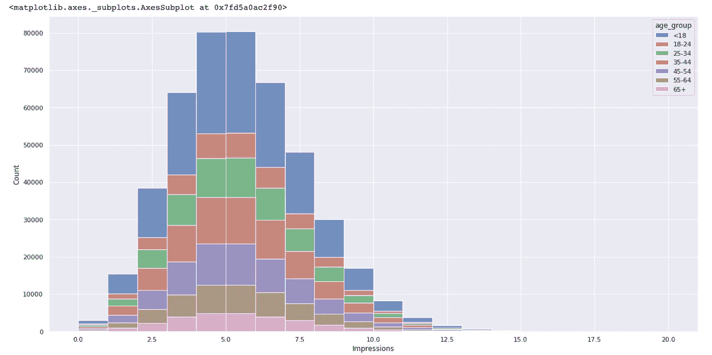

按年龄组的印象分布(图片由作者提供)

大部分用户都被展示过 0 到 13 次广告，最有可能的频率是 5 次。不同年龄段之间没有太大区别。

我们还可以使用核密度估计来查看分布。

```
sns.displot(df, x='Impressions', hue='age_group', kind='kde', bw_adjust=2, multiple='stack')
```

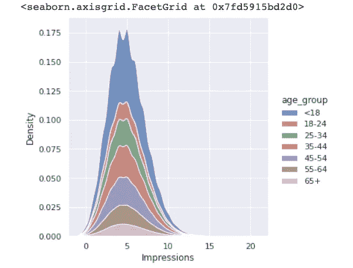

按年龄组的印象分布(图片由作者提供)

让我们用一个箱线图来看看是否有异常值。

```
sns.boxplot(y=df['Impressions'], x=df['age_group'])
```

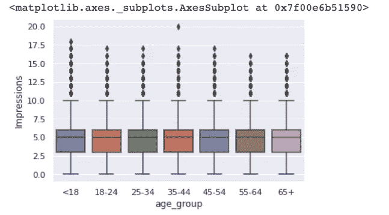

我们可以确认，对于每个年龄组，印象分布是相似的，而偶尔，广告会向 35 至 44 岁的年龄组显示 20 次。

现在，我们探讨了印象和点击。让我们把它们结合起来，看看点击率如何。

让我们创建一个新变量“CTR”

```
df['CTR'] = round(df['Clicks']/df['Impressions'], 5)
```

由于数据集非常大，使用箱线图无法告诉我们太多信息。我们将使用一个箱线图来代替。 [Boxenplots](https://seaborn.pydata.org/generated/seaborn.boxenplot.html) 特别擅长总结大型数据集的分布情况。

```
# Plot the distribution of Click-through rate by age group
sns.boxenplot(x=df['age_group'], y=df['CTR'])
```

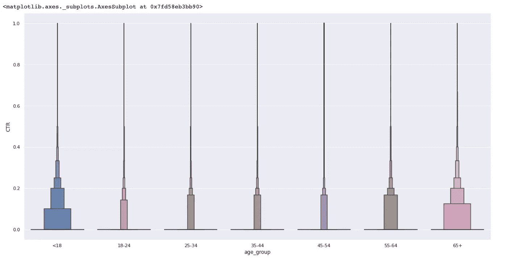

各年龄段点击率分布(图片由作者提供)

我们可以发现，50%的 18 岁以下用户的点击率低于 10%，而对于 18 至 65 岁的年龄组，点击率低于约 18%。75%的用户点击率低于 20%。

有多少人的点击率是 0？

让我们根据用户的点击行为对他们进行分组。

```
bins = [-1, 0, 0.1, 0.2, 0.4, 1]
labels = ['0', '<10%', '10%-20%', '20%-40%', '>40%']
df['CTR_group'] = pd.cut(df.CTR, bins, labels = labels,include_lowest = True)
df.CTR_group.value_counts(normalize=True, sort=True)
```

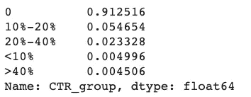

因此，91.2%的用户从未点击过任何广告，5.4%的用户点击率为 10%-20%，2.3%的用户点击率为 20%-40%。

我们可能希望更多地挖掘点击率在 10%到 20%之间的 7.7%的用户，并推广更适合他们的广告。

让我们进一步了解点击广告的用户。我们将为它们创建一个子集。

```
df_Clicked = df[df['CTR'] > 0]
df_Clicked.head()
df_Clicked.shape
```

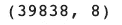

人们点击广告时数据集的形状(图片由作者提供)

```
df_Clicked.age_group.value_counts(normalize=True)
```

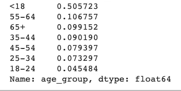

按年龄组划分的点击人数比例(图片由作者提供)

在点击广告的所有用户中，50%的人年龄在 18 岁以下。

```
sns.boxenplot(x=df_Clicked['age_group'], y=df_Clicked['CTR'])
```

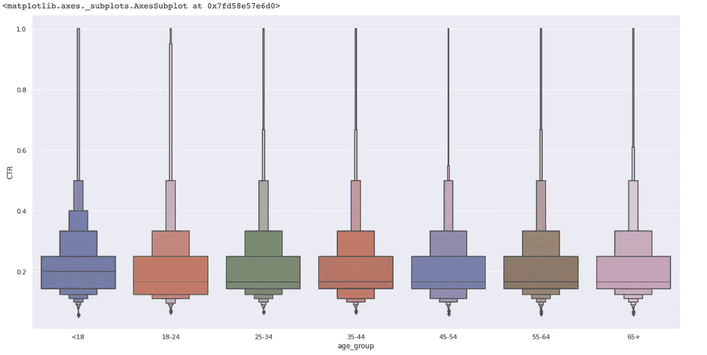

所有点击用户中按年龄组划分的点击率分布(图片由作者提供)

在点击广告的用户中，18 岁以下的用户有一半点击率超过 20%。

```
sns.countplot(x='age_group', hue='Gender', data=df_Clicked)
```

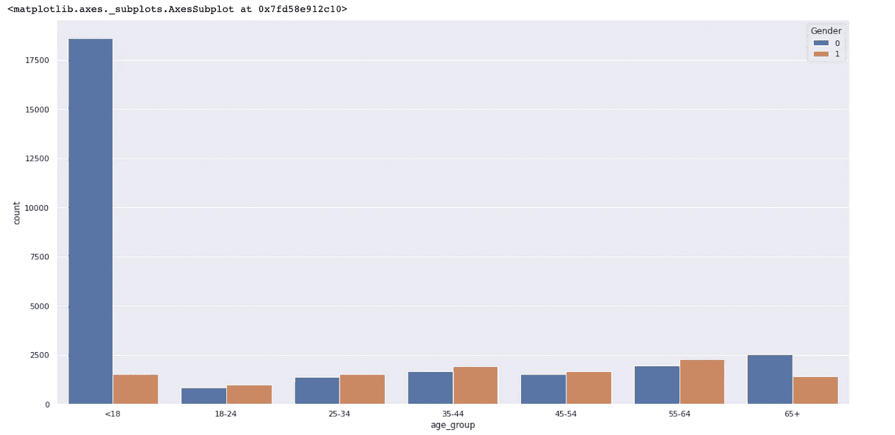

按性别分列的点击用户中各年龄组的人数(图片由作者提供)

```
sns.countplot(x='age_group', hue='Signed_In', data=df_Clicked)
```

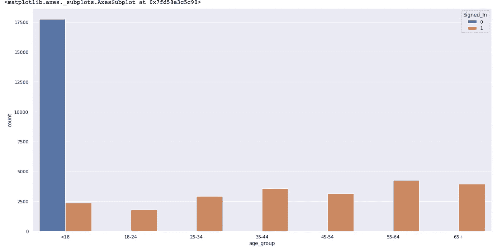

按登录状态划分的点击用户中各年龄组的人数(图片由作者提供)

18 岁以下的女性用户在点击广告的用户中所占比例最大。年轻人也不喜欢登录，而其他年龄段的用户倾向于在点击广告前登录。

```
sns.countplot(x='CTR_group', hue='age_group', data=df_Clicked)
```

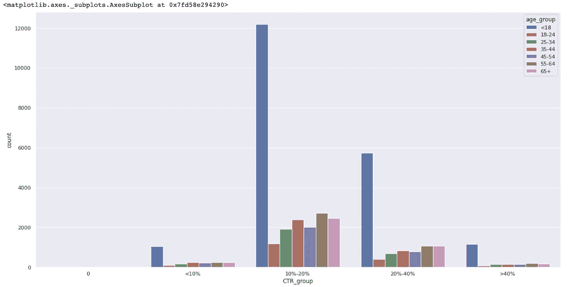

CTR 组的年龄组分布(图片由作者提供)

从上图我们可以得出结论，在所有点击广告的用户中，18 岁以下的用户往往点击率更高。点击率最高的是 10%-20%的群体。

让我们为这些人创建另一个子集。

```
df_Clicked1020 = df_Clicked[df_Clicked['CTR_group'] == '10%-20%']# Plot the distribution of impressions by age group 
sns.histplot(df_Clicked1020, x='Impressions', hue='age_group', binwidth=1, stat='count', multiple='stack')
```

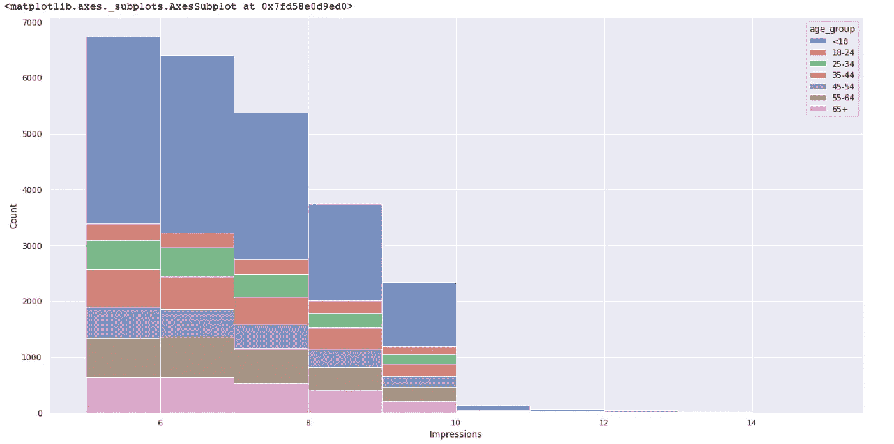

我们可以看到，大多数人都有 5 倍以上的印象；因此，更多的广告出现对获得更好的点击率至关重要。

# 我们从数据中解读出了什么？

1.  91.3%阅读《纽约时报》的用户根本不会点击广告。
2.  18 岁以下的用户是在《纽约时报》杂志上推广广告的广告公司的目标受众。他们占所有用户的 34%，占所有点击用户的 50%。他们也是对广告反应最大的群体。然而，广告对不同的年龄组没有不同的显示。一个建议是在《纽约时报》上推广更多适合年轻女性口味的广告。
3.  点击率在 10%-20%之间的那 7.7 %的用户，才是广告公司更需要关注的。其中 49%不满 18 岁，70%为女性，56.8%倾向于登录《纽约时报》。
4.  为了获得更高的点击率，推荐的印象频率在 5 到 10 之间。

我希望你喜欢这次旅行。欢迎在 Linkedin 上留言和我联系。

[](https://www.linkedin.com/in/fangyiyu/) [## 余-助教-安大略理工大学| LinkedIn

### 我喜欢摆弄数据，寻找见解，并将最先进的技术应用于数据。我喜欢做…

www.linkedin.com](https://www.linkedin.com/in/fangyiyu/) 

# 参考

*   [字母值图:Hofmann 等人的大数据箱线图](https://vita.had.co.nz/papers/letter-value-plot.pdf)