# R 中的探索性数据分析:数据汇总、可视化和预测模型

> 原文：<https://towardsdatascience.com/exploratory-data-analysis-in-r-data-visualization-summarising-and-machine-learning-model-da79439b3952?source=collection_archive---------16----------------------->


考特尼·库克在 [Unsplash](https://unsplash.com?utm_source=medium&utm_medium=referral) 上的照片

## 提取数据集的含义

探索性数据分析对于理解任何数据集都是不可避免的。它包括数据汇总、可视化、一些统计分析和预测分析。本文将关注使用 R 和 R 的不同包的数据故事或探索性数据分析。

本文将涵盖:

1.  一些关键点的总结和可视化

2.一些基本统计数据

3.预测模型

如果您经常关注我的文章，您可能已经在 Python 中看到过另一个使用相同数据集的探索性数据分析项目。以下是链接:

[](/exploratory-data-analysis-visualization-and-prediction-model-in-python-241b954e1731) [## Python 中的探索性数据分析、可视化和预测模型

### 在 Python 中使用 Pandas、Matplotlib、Seaborn 和 Scikit_learn 库

towardsdatascience.com](/exploratory-data-analysis-visualization-and-prediction-model-in-python-241b954e1731) 

我在这里使用相同的数据集来执行 r 中的探索性数据分析。

开始吧！[请随意从此链接](https://www.kaggle.com/andrewmvd/heart-failure-clinical-data)下载数据集。

## 总结和可视化

我将数据集与 RStudio 文件放在同一个文件夹中。因此，我可以在 RStudio 中读取 CSV 文件:

```
df = read.csv("heart_failure_clinical_records_dataset.csv")
```

我没有展示截图，因为数据集相当大。这些是数据集中的列:

```
colnames(df)
```

输出:

```
[1] "age"                      "anaemia"                  "creatinine_phosphokinase" "diabetes"                 "ejection_fraction"       
 [6] "high_blood_pressure"      "platelets"                "serum_creatinine"         "serum_sodium"             "sex"                     
[11] "smoking"                  "time"                     "DEATH_EVENT"
```

数据集有不同的健康参数、年龄、性别和死亡事件。有许多方法可以处理数据集。我想先看一个相关图。最好先看看哪些变量是相关的。它需要“corrplot”库。

```
library(corrplot)
corrplot(cor(df), type = "upper")
```

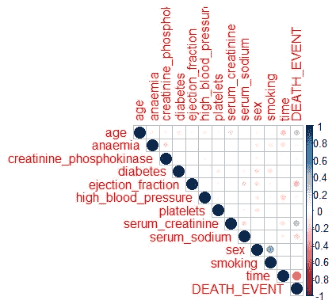

我将用这个情节作为决定下一步行动的指南。

这个数据集中有六个连续变量。让我们检查它们的分布。首先，这六个变量将被分离为不同的数据集，然后使用基数 R 制作直方图:

```
df1 = df[, c('age', 'creatinine_phosphokinase', 'ejection_fraction', 'platelets', 'serum_creatinine', 'serum_sodium')]hist.data.frame(df1, title = "Histograms of all Numerical Variables")
```

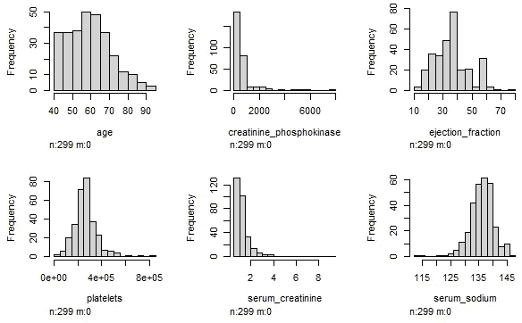

该分布提供了关于这六个变量的概念。有一些数据会更有帮助。我将使用给出一些基本统计参数的汇总函数。

```
summary(df1)
```

输出:

```
age        creatinine_phosphokinase ejection_fraction   platelets     
 Min.   :40.00   Min.   :  23.0           Min.   :14.00     Min.   : 25100  
 1st Qu.:51.00   1st Qu.: 116.5           1st Qu.:30.00     1st Qu.:212500  
 Median :60.00   Median : 250.0           Median :38.00     Median :262000  
 Mean   :60.83   Mean   : 581.8           Mean   :38.08     Mean   :263358  
 3rd Qu.:70.00   3rd Qu.: 582.0           3rd Qu.:45.00     3rd Qu.:303500  
 Max.   :95.00   Max.   :7861.0           Max.   :80.00     Max.   :850000  
 serum_creatinine  serum_sodium  
 Min.   :0.500    Min.   :113.0  
 1st Qu.:0.900    1st Qu.:134.0  
 Median :1.100    Median :137.0  
 Mean   :1.394    Mean   :136.6  
 3rd Qu.:1.400    3rd Qu.:140.0  
 Max.   :9.400    Max.   :148.0
```

同样，为了方便起见，将分类变量作为单独的数据集:

```
df2 = df[, c('anaemia', 'diabetes', 'high_blood_pressure', 'sex', 'smoking', 'DEATH_EVENT')]head(df2)
```

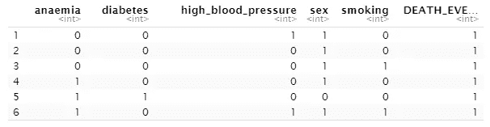

尽管相关图显示死亡事件和“性别”变量之间没有相关性。还是想看看男女死亡人数。在此之前，最好将这些列的 0 和 1 改为一些有意义的字符串。

```
df$death = ifelse(df$DEATH_EVENT == 1, "Yes", "No")
df$sex = ifelse(df$sex == 1, "Male", "Female")table(df$sex, df$death)
```

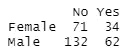

总体而言，数据集中男性多于女性。男女比例是多少？

```
data = table(df$sex)
data1 = round(data/sum(data)*100)
data1 = paste(names(data1), data1)
paste(data1, "%", sep = "")
```

输出:

```
[1] "Female 35%" "Male 65%"
```

为了进一步了解数据集中的人口，让我们分别检查男性和女性人口的年龄分布:

```
ggplot(df, aes(x = age)) + 
  geom_histogram(fill = "white", colour = "black") + 
  facet_grid(sex ~ .)
```

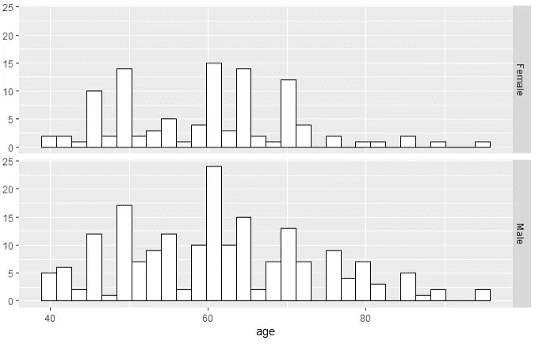

上面的直方图表明，男性人口总体上比女性人口年龄大。

血清肌酐和血清钠有一定的相关性。散点图将清楚地显示:

```
ggplot(df) + geom_point(aes(x = serum_creatinine, y = serum_sodium, colour = death, shape = death)) + ggtitle("Serum Creatinine vs Serum Sodium")
```

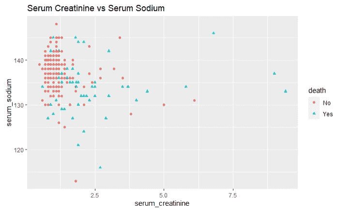

由于一些异常值，大部分数据都聚集在一个地方。在这种情况下，一个好的做法是检查没有这些异常值的同一个图。

```
df_scr = df[df$serum_creatinine < 4.0 & df$serum_sodium > 120,]ggplot(df_scr) + geom_point(aes(x = serum_creatinine, y = serum_sodium, colour = death, shape = death)) + ggtitle("Serum Creatinine vs Serum Sodium")
```

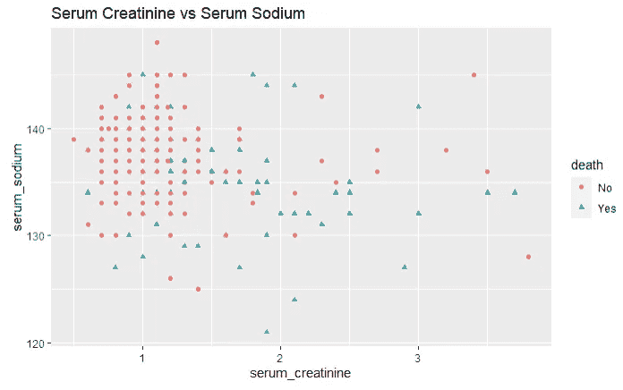

该图清楚地显示了血清钠和血清肌酸酐之间的关系。这些点被死亡事件用不同的颜色和形状分开。

下一个图是射血分数对死亡事件。它将显示抖动图，实际上是散点图的修改版本。当散点图中的一个变量是分类变量时，点保持在一条直线上，它们重叠。变得难以理解。这就是为什么在抖动图中，他们会稍微偏移点，以便更好地理解数据。此外，我们将添加一个红点来显示数据的平均值。

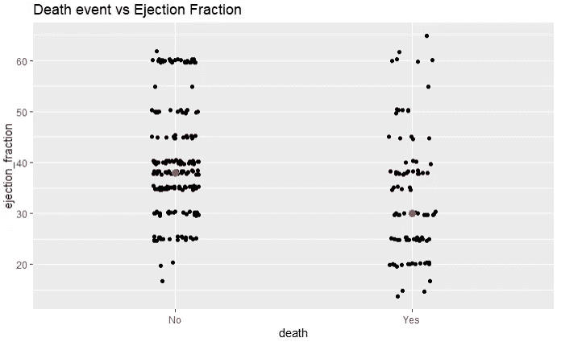

如果你注意到我稍微整理了一下数据。我剔除了两个异常值。

时间变量与死亡事件有很强的相关性。我希望看到一个显示死亡事件和无死亡事件的“时间”差异的箱线图:

```
ggplot(df, aes(death, time))+geom_point() + labs(title="Death Event with Time Variable Segregated by Gender",
                                                 x = "Death",
                                                 y = "Time") +
  geom_boxplot(fill='steelblue', col="black", notch=TRUE) + facet_wrap(~ sex)
```

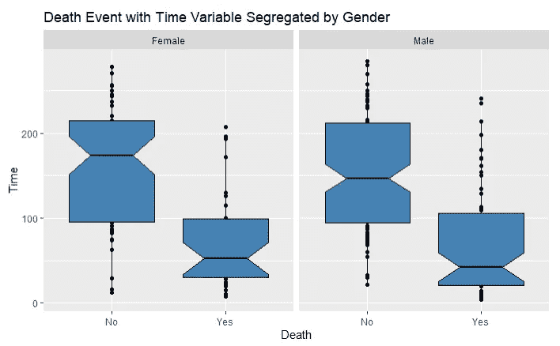

肌酐磷酸激酶与死亡事件有一定的相关性。下一个图用直方图探索了这个问题:

```
ggplot(df, aes(x=creatinine_phosphokinase, fill=death)) + geom_histogram(bins=20) + labs(title = "Distribution of Creatinine Phosphokinase", x = "Creatinine Phosphokinase", y = "Count")
```

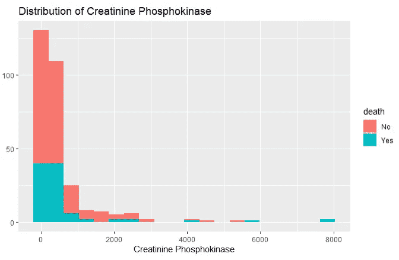

贫血也与肌酐磷酸激酶有关。这种分布可以按贫血症来区分，以便按贫血症分别观察分布情况:

```
ggplot(df, aes(x=creatinine_phosphokinase, fill=death)) + geom_histogram(bins=20)+facet_wrap(~anaemia) + labs(title = "Distribution of Creatinine Phosphokinase", x = "Creatinine Phosphokinase", y = "Count")
```

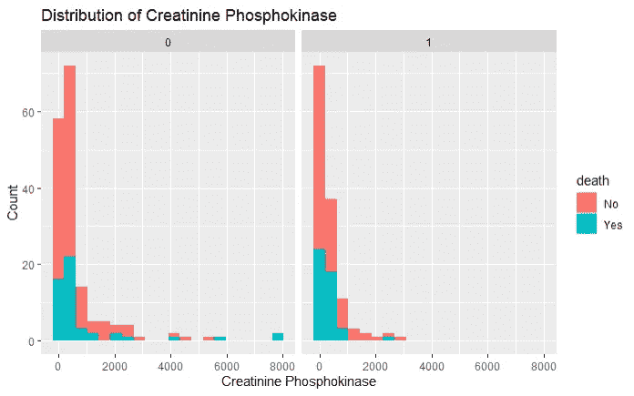

贫血症和非贫血症人群的分布差异很大。

“时间”变量与死亡事件有很强的相关性。这个年龄与时间散点图用不同的颜色显示死亡事件。

```
ggplot(df, aes(x = age, y = time, col = death))+geom_point() + labs(title = "Age vs Time", x = "Age", y = "Time")
```

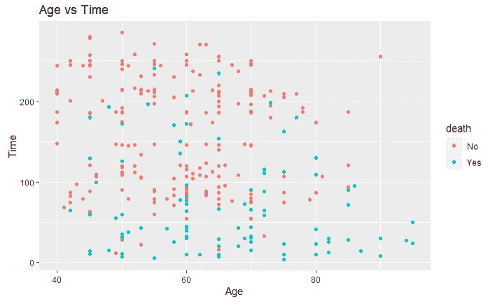

下图显示了死亡事件中不同颜色的血清肌酐分布:

```
ggplot(df, aes(x = serum_creatinine, fill = death))+geom_histogram() + labs(title = "Distribution of Serum Creatinine different colors for death event", x = "Serum Creatinine", y = "Count")
```

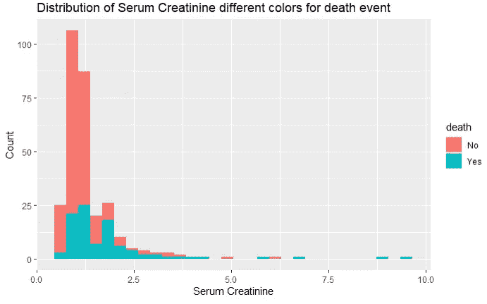

极少数异常值在最右边。让我们检查没有这些异常值的相同分布:

```
df_sc = df[df$serum_creatinine < 4.0,]ggplot(df_sc, aes(x = serum_creatinine, fill = death))+geom_histogram() + labs(title = "Distribution of Serum Creatinine different colors for death event", x = "Serum Creatinine", y = "Count")
```

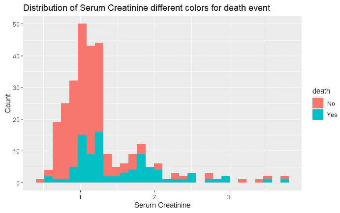

现在分布更加清晰了。

死亡事件的射血分数可能不同。观察射血分数是否也因性别而异也将是有趣的。

```
ggplot(df, aes(death, ejection_fraction, fill = as.factor(sex))) + 
  geom_bar(stat = "summary", fun = "median", col = "black",
           position = "dodge") + geom_point(position = position_dodge(0.9)) + labs(title = "Ejection Fraction per Death Event", x = "Death", y = "Ejection Fraction")
```

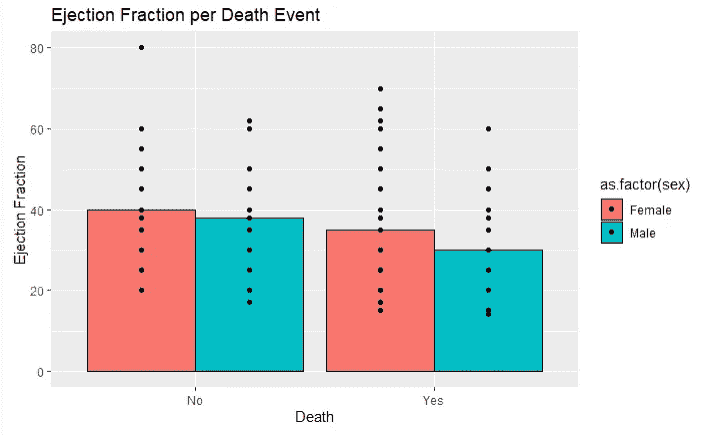

那些黑点显示了数据中的差异。

下一个图分别探索了死亡事件和非死亡事件中贫血和肌酸酐磷酸激酶之间的关系。

```
ggplot(df, aes(x = as.factor(anaemia), y = creatinine_phosphokinase, fill = death)) + geom_violin() +
  stat_summary(aes(x= as.factor(anaemia), y = creatinine_phosphokinase), fun = median, geom='point', colour = "red", size = 3)+facet_wrap(~death)+
geom_jitter(position = position_jitter(0.1), alpha = 0.2) + labs(title = "Creatinine Phosphokinase for Anaemia State Segregated by Death Event", x = "Anaemia", y ="Creatinine Phosphokinase")
```

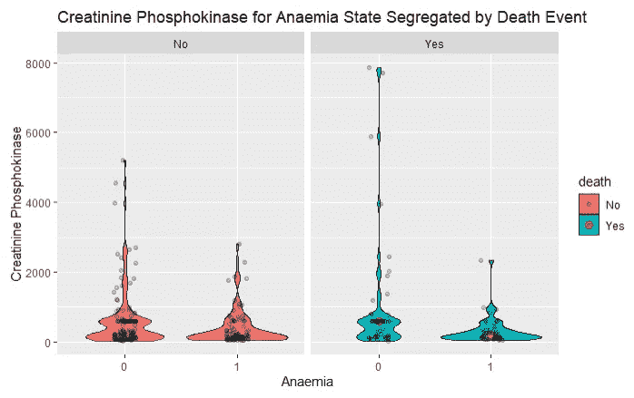

在这个情节中，你可以同时看到几个不同的角度。violin 图显示了分布和异常值。同时，我将抖动图放入其中，红点指向相应数据的中值。

## 预测模型

在本节中，我们将尝试使用数据集中的其他特征来预测死亡事件。首先，我们应该检查死亡事件的比例:

```
data = table(df$death)
round(data/sum(data), 2)
```

输出:

```
 No  Yes 
0.68 0.32
```

对于这个预测模型，我将再次导入数据集，因为我对之前导入的数据集做了一些更改。

```
df1 = read.csv("heart_failure_clinical_records_dataset.csv")
```

现在，我将数据集分为训练数据和测试数据。

```
library(caTools)
set.seed(1243)
split = sample.split(df1$DEATH_EVENT, SplitRatio = 0.75)
```

这种分割应该为每个 DEATH_EVENT 提供布尔值。其中 75%是真的，25%是假的。基于该分割值，训练数据和测试数据将被分离:

```
training_data = subset(d, split == TRUE)
test_data = subset(d, split == FALSE)
```

数据集已准备好用于分类器。我为这个项目选择一个支持向量机分类器。

```
library(e1071)svm_fit = svm(formula = DEATH_EVENT ~ .,
                 data = training_data,
                 type = 'C-classification',
                 kernel = 'linear'
              )
```

训练数据被拟合到分类器中，分类器现在被训练。现在可以用测试数据测试分类器了。使用测试数据，我将预测死亡事件。所以，我们需要从测试数据中排除死亡事件。

```
y_pred = predict(svm_fit, newdata = test_data[-13])
```

预测完成了。现在让我们检查一下预测的准确性。此处的“caret”包中使用了 ConfusionMatrix 函数。因为这个 ConfusionMatrix 函数只用一行代码就提供了如此多的信息:

```
library(caret)confusionMatrix(y_pred, as.factor(test_data$DEATH_EVENT))
```

输出:

```
Confusion Matrix and StatisticsReference
Prediction  0  1
         0 47  5
         1  4 19

               Accuracy : 0.88            
                 95% CI : (0.7844, 0.9436)
    No Information Rate : 0.68            
    P-Value [Acc > NIR] : 5.362e-05       

                  Kappa : 0.7212          

 Mcnemar's Test P-Value : 1               

            Sensitivity : 0.9216          
            Specificity : 0.7917          
         Pos Pred Value : 0.9038          
         Neg Pred Value : 0.8261          
             Prevalence : 0.6800          
         Detection Rate : 0.6267          
   Detection Prevalence : 0.6933          
      Balanced Accuracy : 0.8566          

       'Positive' Class : 0
```

总体准确率为 88%。

看上面的混淆矩阵！它准确地预测了 47 个无死亡事件，4 个无死亡事件被错误地预测为死亡事件。另一方面，19 个死亡事件被准确预测，5 个死亡事件被错误预测为无死亡事件。

这里真阳性是 19，假阳性是 4，假阴性是 5。使用此信息，F1 分数计算如下:

true _ positive/(true _ positive+0.5 *(false _ positive+false _ negative))= 0.81

我不是在评论预测模型的效果是好是坏。这取决于期望值，期望值因项目而异。

## 结论

探索性数据分析是非常动态的。你可以用很多不同的方法来处理数据集。这是我的方法之一。如果你以前在 Python 中检查过我在相同数据集上的工作，你会看到一种不同的方法。请随意尝试一些其他类型的可视化和分类器。感谢阅读！

欢迎在推特上关注我，喜欢我的 T2 脸书页面。

## 更多阅读

[](/a-complete-free-course-on-inferential-statistics-for-data-scientists-in-r-129483f5f522) [## 一个完全免费的 R 语言数据科学家推断统计学课程

towardsdatascience.com](/a-complete-free-course-on-inferential-statistics-for-data-scientists-in-r-129483f5f522) [](/exploratory-data-analysis-of-text-data-including-visualization-and-sentiment-analysis-e46dda3dd260) [## 文本数据的探索性数据分析，包括可视化和情感分析

towardsdatascience.com](/exploratory-data-analysis-of-text-data-including-visualization-and-sentiment-analysis-e46dda3dd260) [](/a-complete-beginners-guide-to-data-visualization-in-ggplot2-121f1eee23cd) [## ggplot2 中数据可视化的完全初学者指南

### 这是一个丰富的图书馆。今天就开始使用吧

towardsdatascience.com](/a-complete-beginners-guide-to-data-visualization-in-ggplot2-121f1eee23cd) [](/text-files-processing-cleaning-and-classification-of-documents-in-r-394c6b4f1504) [## R 语言中文本文件的处理、清理和分类

### 使用了一些很棒的包和 K 近邻分类器

towardsdatascience.com](/text-files-processing-cleaning-and-classification-of-documents-in-r-394c6b4f1504) [](/python-or-r-which-one-is-better-for-data-scientists-or-data-analysts-3be038f6c74c) [## Python 还是 R？数据科学家和数据分析师哪个好？

towardsdatascience.com](/python-or-r-which-one-is-better-for-data-scientists-or-data-analysts-3be038f6c74c) [](/do-you-need-a-masters-degree-to-become-a-data-scientist-ab894c2a8d41) [## 成为数据科学家需要硕士学位吗？

### 我作为波士顿大学数据分析专业硕士学生的经历和体会

towardsdatascience.com](/do-you-need-a-masters-degree-to-become-a-data-scientist-ab894c2a8d41)