# 圣保罗政策谋杀报告的探索性数据分析

> 原文：<https://towardsdatascience.com/exploratory-data-analysis-of-s%C3%A3o-paulos-policy-murder-reports-23f9bcc9431f?source=collection_archive---------35----------------------->

## 详细看看巴西人口最多的州的凶杀案数字


玛丽亚·卡斯泰利在 [Unsplash](https://unsplash.com?utm_source=medium&utm_medium=referral) 上的照片

根据世卫组织、[世界卫生组织](https://www.who.int/data/gho/data/indicators/indicator-details/GHO/estimates-of-rates-of-homicides-per-100-000-population)(查看日期:2021 年 18 月 3 日)，巴西的凶杀率为每 10 万居民 32.59 起，比全球平均水平(每 10 万居民 6 起)高出五倍，在这一可悲的统计数据中，巴西排名第九。

巴西是一个幅员辽阔的国家，有 2 亿多居民，被 27 个联邦单位分割，存在极端的不平等。这些不平等的一个很好的例子是暴力地图集(第 18 页)报告的这些州的杀人率。这份报告向我们显示，2018 年，罗赖马州的凶杀率是全国最高的，每 10 万居民中有 71.8 起凶杀案。相比之下，圣保罗州的凶杀率在全国最低，每 10 万居民中只有 8.2 起凶杀案。

在这项工作中，将在 2018 年至 2020 年期间对圣保罗州涉及凶杀案的警方报告进行探索性分析。

# 工具和代码

Python 是用于开发这一分析的编程语言，如果你想检查代码，你可以点击这个链接上的[。](https://github.com/ghermsen/sao_paulo_murder_eda)

# 获取数据

本项目中使用的所有数据都在圣保罗州公共安全部长的网站上。

对于此探索性数据分析，下载了以下文件并将其合并到一个文件中:

***下载的文件***

*   类别——homícidio doloso**(谋杀、故意杀人)**
*   期间-2018 年 1 月至 2020 年 12 月之间的每个月

***储存库文件***

*   路径—[https://github . com/ghermsen/Sao _ Paulo _ murder _ EDA/tree/main/db](https://github.com/ghermsen/sao_paulo_murder_eda/tree/main/db)
*   file—[https://raw . githubusercontent . com/ghermsen/Sao _ Paulo _ murder _ EDA/main/db/dados bo . CSV](https://raw.githubusercontent.com/ghermsen/sao_paulo_murder_eda/main/db/dadosbo.csv)

***注:为了保留受害者的身份，我在处理完数据后已经删除了受害者的个人信息。出于这个原因，下面的分析只显示了在受害者匿名化后剩下的数据集的数据处理。***

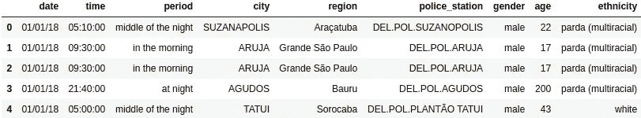

# 了解数据集

理解数据是任何数据科学项目的基本步骤。这个过程将向我们展示数据集中可用的变量以及这些变量是如何构造的。这一步有助于我们了解问题的类型以及我们将如何解决它。

## 变量字典:

*   *“日期”* —谋杀发生的日期。
*   *【时间】* —命案发生的时间。
*   *【时段】* —谋杀发生的当天时段。
*   *【城市】* —命案发生的城市。
*   *【地区】* —城市所属的行政区域。
*   *“派出所”* —登记命案的派出所。
*   *【性别】* —受害者的性别。
*   *【年龄】* —受害者的年龄。
*   *“种族”* —受害者的种族(巴西地理统计局[使用的分类](https://educa.ibge.gov.br/jovens/conheca-o-brasil/populacao/18319-cor-ou-raca.html))。

## 数据集大小和变量类型

下面，您可以看到数据集的大小及其变量的类型。

```
# Dataset Size

    Number of Entries:	     11793
    Number of Variables:	 9

# Types of Variables

    date              object
    time              object
    period            object
    city              object
    region            object
    police_station    object
    gender            object
    age                int64
    ethnicity         object

    dtype: object
```

可以看出，*【日期】**【时间】*变量是*【对象】*。由于这些变量代表时间，这些变量经过一个合并的过程，然后转换成 *"datetime64[ns]"* 。

## *清理数据集*

查看变量字典和数据集中呈现的变量类型，可以看到一个与分析无关的变量，即*“police _ station】*。为了更清晰更客观的分析，我删除了这个变量。

## 特征工程

在这个项目中，我将创建从现有变量派生的变量，以协助未来的分析。变量如下:

*   *“年”* —命案发生的年份。
*   *“月”* —命案发生的月份。
*   *【日】* —命案发生的那一天。
*   *“小时”* —谋杀发生的小时。
*   *“星期几”* —谋杀发生的那一天。
*   *“周末”* —如果一周中的某一天是周末(周六或周日)，则该值等于 1。如果不是，则该值等于 0。
*   *“年龄组”* —受害者所属的年龄组。

完成此过程后，数据框就可以进行分析了。

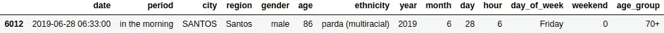

# 数据分析

数据分析将涉及地域、社会和时间方面:

***领地***

*   圣保罗州

1.  圣保罗州在 2018 年、2019 年和 2020 年期间的谋杀受害者总数是多少？
2.  在所分析的几年间，谋杀受害者的总体变化是多少？

*   行政区域

1.  圣保罗州不同地区谋杀受害者人数的分布情况如何？
2.  在所分析的几年间，圣保罗州各地区谋杀受害者的总体变化是多少？

***社交***

*   性别

1.  受害者的主角性别是什么？
2.  不同性别的谋杀受害者之间的百分比差异是多少？

*   种族划分

1.  遇难者的主导民族是什么？
2.  不同种族的谋杀受害者之间的百分比差异是多少？

*   年龄层

1.  受害者的主要年龄组是什么？
2.  按年龄组划分，谋杀受害者的百分比差异是多少？

*   受害者简介

1.  男性和女性受害者的主要特征是什么？

***太阳穴***

1.  谋杀受害者最多的月份是哪个月？
2.  谋杀受害者最多的一天是哪一天？
3.  一天中的哪个时间段有更多的谋杀受害者？
4.  一天中哪一小时谋杀案受害者最多？工作日和周末的时间有区别吗？

## 地域分析


圣保罗州的总面积为 248，209 平方公里，如果我们将圣保罗州的面积与一个国家相比，它将略大于英国的 242，495 平方公里。据 SEADE 统计，2020 年，圣保罗州 645 个市有 4463 万居民。

数据显示，在分析期间，该州有 505 个城市登记了谋杀受害者，只有 140 个城市在此期间没有登记任何谋杀受害者。

***圣保罗州***


如上所述，在圣保罗，505 个城市在分析期间登记了谋杀受害者。当我们检查受害者人数时，我们得到总共 11，793 名谋杀受害者。

逐年分析显示，最近三年，这一数字一直在下降，2019 年下降了 3.65%，2020 年下降了 4.03%，导致谋杀受害者人数下降了 7.52%。

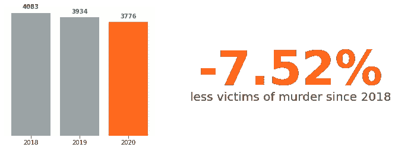

***圣保罗*** 行政区域

上面，我对整个圣保罗州的数字进行了分析。然而，根据圣保罗州公共安全秘书的警方报告，圣保罗州分为 12 个地区。

```
# regions of são paulo state

df.region.sort_values(ascending = True).unique()

array(['Araçatuba', 'Bauru', 'Campinas', 'Capital', 'Grande São      Paulo ', 'Piracicaba', 'Presidente Prudente', 'Ribeirão Preto', 'Santos', 'Sorocaba', 'São José do Rio Preto', 'São José dos Campos'],
      dtype=object)
```

既然我们已经知道了圣保罗州的所有行政区，就有可能看到这些行政区的受害者总数有很大差异。出现这种差异是因为一些地区的人口比其他地区多得多。


左边的图像显示了首都地区和总统普鲁登特地区的总人数之间的差异。然而，首都区大约有 1200 万居民，而普鲁登特总统区大约有 86 万居民。

因此，在按区域分析时，百分比值的分析将比按区域总值的分析显示更多的相关信息。

在百分比结果中，我们注意到三个地区(Piracicaba、Bauru 和 Araç atuba)的谋杀受害者人数近年来有所增加。相比之下，在其他地区，受害者人数有所下降。降幅最大的地区是普鲁登特总统、圣若泽多里奥普雷托和桑多斯。

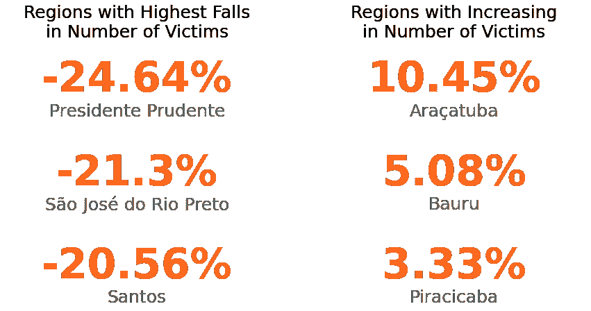

## 社会分析

在进行基于社会方面的分析之前，有必要了解圣保罗州的人口构成。通常，巴西每十年进行一次人口普查，由于新冠肺炎疫情，上一次人口普查仅在 2010 年进行。因此，涉及人口性别、种族和年龄组的数字是非官方的预测。

***性别***

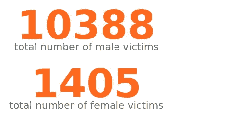

根据 SEADE 的数据，2020 年，圣保罗的人口为 44，639，899 名居民，其中男性占 48.67%，女性占 51.33%。

我们可以看到，在分析期间，10，388 名谋杀受害者是男性，圣保罗州有 1，405 名受害者是女性。

通过按性别分列的受害者总数，可以看出，尽管圣保罗女性人口的比例高于男性人口，但该州谋杀受害者的人数差异很大，男性受害者占 88%，女性受害者占 11%。

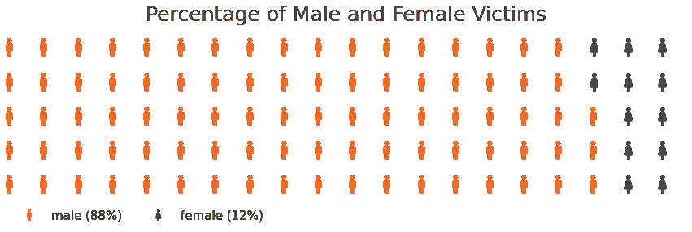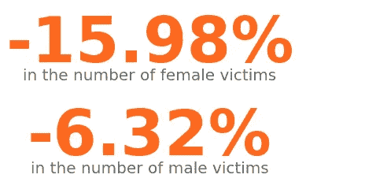

然而，为了更好地理解不同性别受害者数量的演变，我分析了每年的受害者数量。分析显示，男女受害者人数逐年下降。在这一时期结束时，女性受害者的人数大幅下降了 15.98%，而男性受害者的人数下降了 6.92%。

***种族***

巴西是一个多种族国家，在其人口普查中，人口分为五个种族群体:亚洲人、黑人、土著人、Parda(多种族)和白人。

据该协会称，2010 年，圣保罗州的人口分布如下:

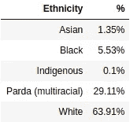

注:一些谋杀案的受害者在警方报告中没有透露他们的种族。对于这些事件，警察局的系统自动为这些受害者标注“无信息”。

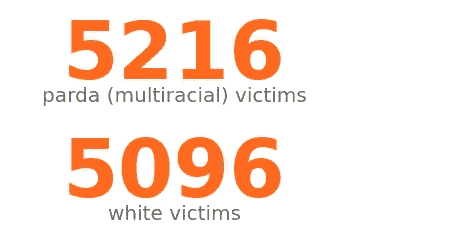

在按种族分析受害者总数后，我们看到 87%以上的案件由 parda(多种族)和白人受害者组成，分别有 5216 名受害者和 5096 名受害者。紧接着，我们有 991 名黑人受害者，463 名没有种族信息的受害者，23 名亚裔受害者，和 4 名土著受害者。

分析圣保罗的人口，我们可以看到多种族人口大约是白人人口的一半。考虑到按种族划分的谋杀受害者人数，就有可能看到不平等。在圣保罗州，多种族受害者占大多数，白人受害者占 44.23%，黑人受害者占 8.4%。经过对每年数字差异的研究，我发现白人受害者下降了 9.31%，其次是多种族受害者，8.24%，黑人受害者，6.73%。


***年龄***

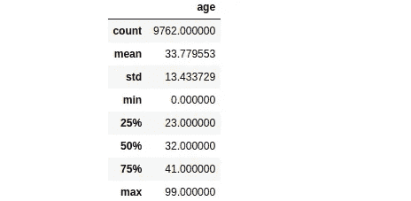

在警方的报告中，许多受害者的年龄没有被指出。在这些受害者的案例中，增加了 200 岁，这样他们就被列入了*【未知】*年龄组。生成汇总统计数据时，不会选择这些受害者。

汇总统计显示，受害者的平均年龄和中位数分别为 33.77 岁和 32 岁。25%的受害者年龄在 23 岁以下，75%的受害者年龄在 41 岁以下。这一信息已经表明，大多数受害者集中在 20-29 岁年龄组，集中在 30-39 岁年龄组，如下所示。

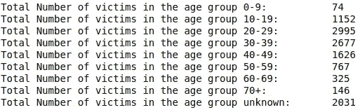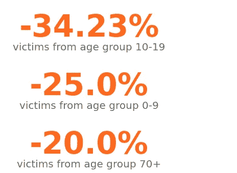

得出总结果后，我进行了一项研究来验证每年的差异，所有年龄组的值都有所下降。然而，10-19 岁年龄组的受害者人数下降了 34.23%，0-9 岁年龄组的受害者人数下降了 25.00%，70 岁以上年龄组的受害者人数下降了 20.00%。

***受害者简介***

在分析了变量*【性别】**【种族】**【年龄】**【年龄组】*之后，我们可以描绘出最常见的谋杀受害者的轮廓。男性受害者的资料显示，大多数男性受害者是多种族的，年龄在 20-29 岁之间。该档案显示在分析期内共有 1285 名受害者。

另一方面，女性侧写有不同的特点。女性受害者的资料显示，大多数女性受害者是白人，年龄在 30-39 岁之间。该档案显示在分析期间共有 174 名受害者。

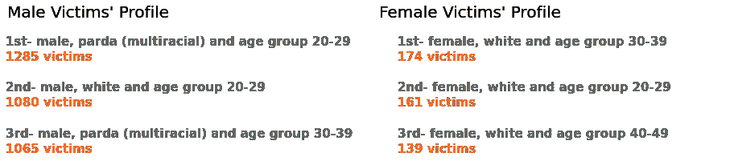

## 时间分析

时间分析将试图获得每个时期受害者总数的简单信息。该分析将回答以下问题:

1.  谋杀受害者最多的月份是哪个月？
2.  谋杀受害者最多的一天是哪一天？
3.  一天中的哪个时间段有更多的谋杀受害者？
4.  一天中哪一小时谋杀案受害者最多？工作日和周末的时间有区别吗？

***1 —凶杀案受害者最多的月份是哪个月？***

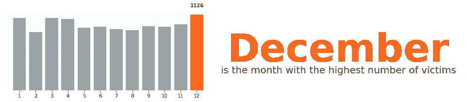

***2 —哪一天被害人数最多？***

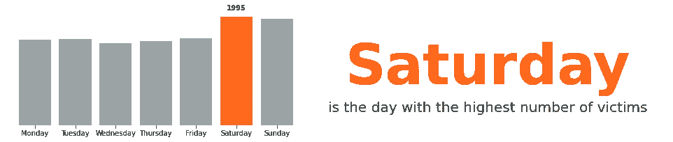

***3 —一天中哪个时段的谋杀受害者多？***

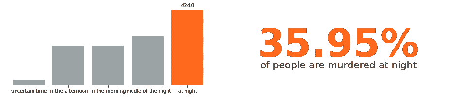

***4 —一天中哪一个小时谋杀案受害者最多？工作日和周末的时间有区别吗？***

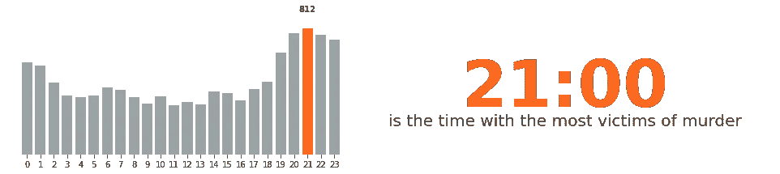

当我们分析工作日和周末的受害者总数时，可能会发现时间上有微小的差异。

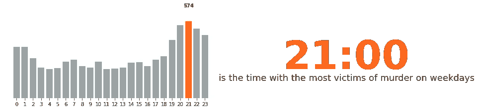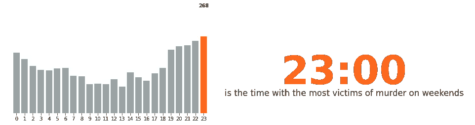

# 结论

该分析提供了关于圣保罗州谋杀数据的激动人心的信息。首先，可以看到，在过去几年里，圣保罗州的谋杀案数量一直在下降。一些州的受害者人数大幅下降，而 12 个州中有 3 个州的受害者人数有所增加。

还可以观察到男性和女性受害者之间的巨大差异，并了解女性受害者人数的下降幅度如何明显大于男性受害者。通过性别和其他特征，有可能根据简单的受害者概况确定比其他人更有可能成为受害者的群体。

在研究结束时，有可能得出结论，12 月是谋杀受害者人数最多的月份，周六是大多数人被谋杀的日子。大多数谋杀发生在晚上，当比较工作日和周末时，可以在谋杀数据中发现小时的细微差异。

由于我之前处理了该项目中发布的数据集以保护受害者的身份，因此完整的数据集提供了更多信息，例如凶杀案发生在城市中的位置。继续这项研究的下一步是

*   根据这项研究，利用这些犯罪发生的地区进行新的分析，目的是绘制特定城市内的凶杀地图；
*   将这些数据与城市的社会指标进行比较，如人类发展指数等。

欢迎提问、改进建议、指正，也感谢你到目前为止和我一起分析数据！

*这个项目的全部代码可以在我的* [*Github*](https://github.com/ghermsen/airbnb_munchen) 上找到

*原载于*[*https://www.linkedin.com*](https://www.linkedin.com/pulse/exploratory-data-analysis-s%25C3%25A3o-paulos-policy-murder-reports-hermsen/?trackingId=pbGOYKp6QAaNDk2rCICk0A%3D%3D)*。*