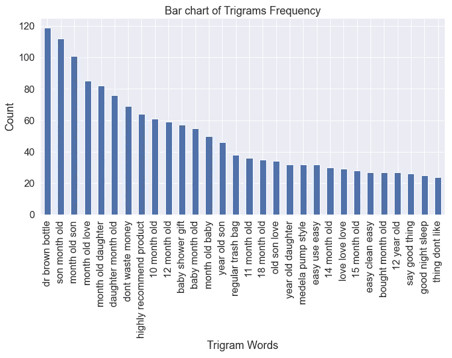

# 文本数据的探索性数据分析，包括可视化和情感分析

> 原文：<https://towardsdatascience.com/exploratory-data-analysis-of-text-data-including-visualization-and-sentiment-analysis-e46dda3dd260?source=collection_archive---------17----------------------->


柴坦尼亚·皮拉拉在 [Unsplash](https://unsplash.com?utm_source=medium&utm_medium=referral) 上的照片

## 文本数据的预处理、分析、可视化和情感分析

文本数据分析一天比一天简单。Python 和 R 等著名的编程语言都有很好的文本数据分析库。曾经有一段时间，人们认为你需要成为编码专家来完成这些复杂的任务。但是随着库版本的不断开发和改进，只需要简单的初级编码知识就可以更容易地执行文本数据分析。

在本文中，我将使用主要是文本数据集的数据集。该数据集包含亚马逊婴儿产品和评级的客户评论。请随意从[下载数据集和此链接](https://www.kaggle.com/sameersmahajan/reviews-of-amazon-baby-products)并跟随。这是一个用于机器学习的很好的数据集，因为它有评论评级。但是本文将只关注探索性的数据分析。我们仍然会讨论情感，但这不是情感分析机器学习。

让我们跳进来吧！

## 资料组

首先，导入数据集，然后我们将进一步讨论它。

```
import pandas as pd
import numpy as npdf = pd.read_csv("amazon_baby.csv")
df.head()
```


作者图片

如您所见，我们在数据集中有产品名称、客户评论和评级。我喜欢从检查数据集中有多少行数据开始:

```
len(df)
```

输出:

```
183531
```

这是大量的数据。我决定缩小数据集。因为当我试图处理这个大数据集时，需要花费太多时间来完成一些可视化、计算和数据操作。为了使运行代码更容易、更省时，我决定缩小数据集。一种方法是简单地从数据集中取出 5000 到 10000 或任何你想要的数字。

但在此之前，让我们检查每个产品的评论的价值计数。

```
df['name'].value_counts()
```

输出:

```
Vulli Sophie the Giraffe Teether                                            785
Simple Wishes Hands-Free Breastpump Bra, Pink, XS-L                         562
Infant Optics DXR-5 2.4 GHz Digital Video Baby Monitor with Night Vision    561
Baby Einstein Take Along Tunes                                              547
Cloud b Twilight Constellation Night Light, Turtle                          520
                                                                           ... 
Mud Pie Baby Stroller Bear Buddy (Set of 4)                                   1
Baby Mod Modena 3 in 1 Convertible Crib, White                                1
Britax Kick Mats                                                              1
Camouflage Camo print Cloth Diaper                                            1
Baby Gear Blue Bear with Dots and Circles Security Blanket Lovey              1
Name: name, Length: 32415, dtype: int64
```

您可以从输出中看到，有些产品只有一个评论。仅仅通过一次回顾是不可能得出任何结论的。在这里，我选择了至少有 20 条评论的产品。

```
df = df[df.groupby("name")["name"].transform('size') > 20]
```

我再次检查数据集的长度，发现我们现在有 89691 个数据。那也很多。这次演示我只需要 10000 个数据。如果你不担心运行时间，或者如果你有一个更高容量的计算机，请随意使用所有的数据。

```
df= df.head(10000)
```

现在，我有一个包含 10000 个数据的数据集。

## 预处理

在进入分析之前，一些文本清理和处理是必要的。预处理和数据清理是数据分析的一大部分。首先，我将把“review”列设为字符串格式。它看起来像字符串。但是万一有一些数据不是字符串格式的，我会简单地将整列转换为字符串。

```
df['review'] = df['review'].astype(str)
```

评论是这个数据集中的主要信息。如果任何一行遗漏了评审，我们就不需要那一行。

```
df = df[~df["review"].isnull()]
```

我还有 10000 个数据。这意味着 review 列中没有空值。

> 删除特殊字符

评论可能包含许多对任何分析都没有帮助的特殊字符。一开始就清洗它们是很好的。

```
def clean(txt):
    txt = txt.str.replace("(<br/>)", "")
    txt = txt.str.replace('(<a).*(>).*(</a>)', '')
    txt = txt.str.replace('(&amp)', '')
    txt = txt.str.replace('(&gt)', '')
    txt = txt.str.replace('(&lt)', '')
    txt = txt.str.replace('(\xa0)', ' ')  
    return txtdf['review'] = clean(df['review'])
```

> 转换为小写

转换成小写是必要的。否则，它会将带有大写字母的同一个单词视为不同的单词。像‘我’和‘我’会被认为是不同的词。我们不想那样。

```
df['review1'] = df['review'].apply(lambda x: " ".join(x.lower() for x in x.split()))
df['review1'].head()
```

输出:

```
153    we bought these for our son when he turned two...
154    my son loves stacking cups, so a friend recomm...
155    my son cameron just loves these great little s...
156    my one year old son received these as a birthd...
157    i purchased this toy for my great grandson\'s ...
Name: review1, dtype: object
```

> 删除标点符号

这一步是删除标点符号。由于标点符号的原因，一个单词可能会被以不同于原来的方式处理。例如,“use”和“use:”会因为标点而变成不同的单词。

```
df['review1'] = df['review1'].str.replace('[^\w\s]', '')
df['review1'].head()
```

输出:

```
153    we bought these for our son when he turned two...
154    my son loves stacking cups so a friend recomme...
155    my son cameron just loves these great little s...
156    my one year old son received these as a birthd...
157    i purchased this toy for my great grandsons fi...
Name: review1, dtype: object
```

如你所见，标点符号不见了！在第 157 行，“孙子”一词中有标点符号。我们最终会在词汇化或词干部分去掉“孙子”中的“s”。

> 删除停用词

停用词是一些语法或约束词，如“是”、“the”、“and”、“so”、“my”等。这些是出现频率很高的词。但是可能不会给分析增加任何价值。虽然有争议。有些人认为他们有时很重要。在一些人工智能项目中，停用词可能很重要，但在这个例子中，停用词是不必要的。

```
import nltk
nltk.download('stopwords')
from nltk.corpus import stopwordsstop = stopwords.words('english')
df['review1'] = df['review1'].apply(lambda x: " ".join(x for x in x.split() if x not in stop))
df['review1'].head()
```

输出:

```
153    bought son turned two seen playmates home love...
154    son loves stacking cups friend recommended toy...
155    son cameron loves great little stacking cars e...
156    one year old son received birthday gift loves ...
157    purchased toy great grandsons first christmas ...
Name: review1, dtype: object
```

看，所有的停用词都没了！

> 去掉生僻字

有些词只出现过一次。那些生僻字并没有增加任何东西。所以我们可以安全地丢弃它们。首先，找出每个单词的频率，然后找出只出现过一次的单词。

```
freq = pd.Series(' '.join(df['review1']).split()).value_counts()
less_freq = list(freq[freq ==1].index)
less_freq
```

输出:

```
['djgs',
 'now7monthold',
 'joseph',
 'area8',
 'activing',
 'tea',
 'productdespite',
 'worth3the',
 'aroundand',
 '80lb',
 'combinedit',
 'hikesnow',
 'bubblesbeing',
 'cheast',
 'inexcusable',
 'heavyeven',
```

这是输出的一部分。这个列表总共有 14352 个单词。如果你注意到这些单词中的大部分甚至看起来是有线的。大多是错别字或者拼写错误。让我们把它们从评论中去掉:

```
df['review1'] = df['review1'].apply(lambda x: " ".join(x for x in x.split() if x not in less_freq))
```

> 拼写纠正

简单的拼写错误可以使用 correct()函数来纠正。

```
from textblob import TextBlob, Word, Blobberdf['review1'].apply(lambda x: str(TextBlob(x).correct()))
df['review1'].head()
```

输出:

```
153    He bought these for our son when he turn two H...
154    By son love stick cups so a friend recommend t...
155    By son cameron just love these great little st...
156    By one year old son receive these a a birthday...
157    I purchase the toy for my great grandson first...
```

只是一个警告！运行这段代码需要几个小时。你必须有耐心。如果你愿意，你可以避免这样做以节省时间。

> 词干化和词汇化

词干将从单词中删去像“ly”、“ing”、“ed”这样的部分。我们之前谈过一点。

```
from nltk.stem import PorterStemmer
st = PorterStemmer()
df['review1'] = df['review'].apply(lambda x: " ".join([st.stem(word) for word in x.split()]))
```

输出:

```
153    We bought these for our son when he turn two. ...
154    My son love stack cups, so a friend recommend ...
155    My son cameron just love these great littl sta...
156    My one year old son receiv these as a birthday...
157    I purchas thi toy for my great grandson\' firs...
```

查看输出中的第 157 行。在‘孙子’这个词后面，标点符号又回来了。别担心，我们以后会处理的。

下一步是将单词词根化。您可以选择词干化或词汇化。词干化之后，您可能看不到词汇化的很多变化。我仍然展示它是为了演示的目的。

```
df['review1'] = df['review1'].apply(lambda x: " ".join([Word(word).lemmatize() for word in x.split()]))
df['review1'].head()
```

输出:

```
153    We bought these for our son when he turn two. ...
154    My son love stack cups, so a friend recommend ...
155    My son cameron just love these great littl sta...
156    My one year old son receiv these a a birthday ...
157    I purchas thi toy for my great grandson\' firs...
```

现在我们应该再次删除标点符号:

```
df['review1'] = df['review1'].str.replace('[^\w\s]', '')
df['review1'].head()
```

输出:

```
153    We bought these for our son when he turn two H...
154    My son love stack cups so a friend recommend t...
155    My son cameron just love these great littl sta...
156    My one year old son receiv these a a birthday ...
157    I purchas thi toy for my great grandson first ...
Name: review1, dtype: object
```

实际上，我多做了一步。你可以避免删除开头的标点符号，在这一点上做。那会省去你不必要的一步。

## 数据分析

让我们从向数据集中添加更多要素开始分析。在这里，我加上评论的长度和每篇评论的字数。

```
df['review_len'] = df['review'].astype(str).apply(len)
df['word_count'] = df['review'].apply(lambda x: len(str(x).split()))
```

我想再增加一个特性，叫做极性。极性表现了一段文字的情绪。它计算消极和积极的话，并确定极性。该值的范围从-1 到 1，其中-1 代表负面情绪，0 代表中性情绪，1 代表正面情绪。

```
from textblob import TextBlob, Word, Blobberdf['polarity'] = df['review1'].map(lambda text: TextBlob(text).sentiment.polarity)df.head()
```

输出:


> 分布

我想先看一下 word_count、review_len 和 polarity 的分布。

```
df[["review_len", "word_count", "polarity"]].hist(bins=20, figsize=(15, 10))
```


作者图片

评论长度和字数的分布与预期相似。大多数人口处于较低的范围。严重向右倾斜的分布。极性几乎正常。多数极性大于零。这意味着大多数评论都是正面的。

> 极性与额定值

因为有一个评级栏可用，我们应该检查极性是否与评级相符。以下是各等级极性的箱线图:

```
plt.figure(figsize = (10, 8))
sns.set_style('whitegrid')
sns.set(font_scale = 1.5)
sns.boxplot(x = 'rating', y = 'polarity', data = df)
plt.xlabel("Rating")
plt.ylabel("Polatiry")
plt.title("Product Ratings vs Polarity")
plt.show()
```


作者图片

等级越高，平均极性越大。尽管在等级 1 和 5 中有很多异常值。也许看看这些数字会更有帮助。

```
mean_pol = df.groupby('rating')['polarity'].agg([np.mean])
mean_pol.columns = ['mean_polarity']fig, ax = plt.subplots(figsize=(8, 6))
plt.bar(mean_pol.index, mean_pol.mean_polarity, width=0.3)#plt.gca().set_xticklabels(mean_pol.index, fontdict={'size': 14})

for i in ax.patches:
    ax.text(i.get_x(), i.get_height()+0.01, str("{:.2f}".format(i.get_height())))plt.title("Polarity of Ratings", fontsize=22)
plt.ylabel("Polarity", fontsize=16)
plt.xlabel("Rating", fontsize=16)
plt.ylim(0, 0.35)
plt.show()
```


作者图片

我原以为评分 1 和 2 的极性接近-1。但是看起来它们更接近于 0。这意味着评论中可能没有那么多负面词汇。我只是通过观察极性来猜测。请阅读几篇评级为 1 的评论以进行复查。

> 每个评分的评论数

下面是一个计数图，显示了数据集中每个评分的评论数。

```
plt.figure(figsize=(8, 6))
sns.countplot(x='rating', data=df)
plt.xlabel("Rating")
plt.title("Number of data of each rating")
plt.show()
```


作者图片

该数据集的大多数评论的评级为 5。

> 评论的长度与评分

看看评论的长度是否会随着评分的变化而变化将会很有趣。

```
plt.figure(figsize=(10, 6))
sns.pointplot(x = "rating", y = "review_len", data = df)
plt.xlabel("Rating")
plt.ylabel("Review Length")
plt.title("Product Rating vs Review Length")
plt.show()
```


作者图片

当评分为 5 时，评论长度显著下降。所以，客户高兴的时候，也没写太多！

> 基于极性的 20 大产品

这些是基于极性的前 20 个产品

```
product_pol = df.groupby('name')['polarity'].agg([np.mean])
product_pol.columns = ['polarity']
product_pol = product_pol.sort_values('polarity', ascending=False)
product_pol = product_pol.head(20)
product_pol
```


作者图片

> WordCloud

Wordcloud 是一种常见且漂亮的文本数据可视化工具，用于绘制单词的频率。如果您还没有 wordcloud，您可能需要使用以下命令安装它:

```
conda install -c conda-forge wordcloud
```

我使用 Anaconda 包。这就是为什么我给出了 anaconda 包的安装命令。

为了创建单词 cloud，我将 review1 列中的所有文本组合在一起，形成了一个 bid 文本块。

```
text = " ".join(review for review in df.review1)
```

使用这个文本块，我创建了单词 cloud。在造云这个词之前，我去掉了一些我认为没有必要的词。如果你愿意，你可以进一步清理。

```
from wordcloud import WordCloud, STOPWORDS, ImageColorGenerator
stopwords = set(STOPWORDS)
stopwords = stopwords.union(["ha", "thi", "now", "onli", "im", "becaus", "wa", "will", "even", "go", "realli", "didnt", "abl"]) wordcl = WordCloud(stopwords = stopwords, background_color='white', max_font_size = 50, max_words = 5000).generate(text)
plt.figure(figsize=(14, 12))
plt.imshow(wordcl, interpolation='bilinear')
plt.axis('off')
plt.show()
```


作者图片

文本中出现频率越高的单词越大。

> 频率图表

这是文本数据分析中制作词频图表的常见做法。这很好地说明了人们在这篇文章中谈论最多的是什么。首先，找出每个单词在数据集的 review 列中的出现频率。然后根据频率画出前 20 个单词。

```
def get_top_n_words(corpus, n=None):
    vec=CountVectorizer().fit(corpus)
    bag_of_words = vec.transform(corpus)
    sum_words = bag_of_words.sum(axis=0)
    words_freq = [(word, sum_words[0, idx]) for word, idx in vec.vocabulary_.items()]
    words_freq =sorted(words_freq, key = lambda x: x[1], reverse=True)
    return words_freq[:n]common_words = get_top_n_words(df['review1'], 20)df1 = pd.DataFrame(common_words, columns = ['Review', 'count'])
df1.head()
```


作者图片

下面是前 20 个单词出现频率的柱状图:

```
df1.groupby('Review').sum()['count'].sort_values(ascending=False).plot(
    kind='bar',
    figsize=(10, 6),
    xlabel = "Top Words",
    ylabel = "Count",
    title = "Bar Chart of Top Words Frequency"
)
```


作者图片

这些是评论中出现频率最高的词。但比起只看到一个单词，两个或三个连续的单词更有帮助。它们提供了一些意义。下图显示了最常见的二元模型:

```
def get_top_n_bigram(corpus, n=None):
    vec = CountVectorizer(ngram_range=(2,2)).fit(corpus)
    bag_of_words = vec.transform(corpus)
    sum_words = bag_of_words.sum(axis=0)
    words_freq = [(word, sum_words[0, idx]) for word, idx in vec.vocabulary_.items()]
    words_freq =sorted(words_freq, key = lambda x: x[1], reverse=True)
    return words_freq[:n]common_words2 = get_top_n_bigram(df['review1'], 30)
df2 = pd.DataFrame(common_words2, columns=['Review', "Count"])
df2.head()
```


作者图片

这是最高发生二元模型的条形图:

```
df2.groupby('Review').sum()['Count'].sort_values(ascending=False).plot(
    kind='bar',
    figsize=(12,6),
    xlabel = "Bigram Words",
    ylabel = "Count",
    title = "Bar chart of Bigrams Frequency"
)
```


作者图片

看看这些二元模型。它们是一些更有意义的短语。下一个图是三元模型。也许这将为我们提供更多关于人们在评论中说什么的想法。

```
def get_top_n_trigram(corpus, n=None):
    vec = CountVectorizer(ngram_range=(3, 3), stop_words='english').fit(corpus)
    bag_of_words = vec.transform(corpus)
    sum_words = bag_of_words.sum(axis=0)
    words_freq = [(word, sum_words[0, idx]) for word, idx in vec.vocabulary_.items()]
    words_freq =sorted(words_freq, key = lambda x: x[1], reverse=True)
    return words_freq[:n]common_words3 = get_top_n_trigram(df['review1'], 30)df3 = pd.DataFrame(common_words3, columns = ['Review' , 'Count'])
df3.groupby('Review').sum()['Count'].sort_values(ascending=False).plot(
    kind='bar',
    figsize=(12,6),
    xlabel = "Trigram Words",
    ylabel = "Count",
    title = "Bar chart of Trigrams Frequency"
)
```



作者图片

> 词性标注

这是一个用词性标注单词的过程，如名词、代词、动词、形容词等。使用 TextBlob API 很容易做到这一点。

```
blob = TextBlob(str(df['review1']))
pos_df = pd.DataFrame(blob.tags, columns = ['word', 'pos'])pos_df = pos_df.pos.value_counts()[:30]
pos_df.plot(kind='bar',
            xlabel = "Part Of Speech",
           ylabel = "Frequency",
           title = "Bar Chart of the Frequency of the Parts of Speech",
           figsize=(10, 6))
```


作者图片

> 情感分析

探索性数据分析也包括机器学习。在这里，您将发现使用相同数据集对产品评论进行的情感分析。

</a-complete-sentiment-analysis-algorithm-in-python-with-amazon-product-review-data-step-by-step-2680d2e2c23b>  

## 结论

我试图提出一些很好的方法来理解或从一篇文章中提取信息。在预处理部分，我介绍了几种在机器学习中也很有用的预处理技术。在所有的分析或机器学习中，您可能不会使用我在这里介绍的所有预处理技术。你可以选择任何你觉得合适的。然后，介绍了一些通用的探索性分析技术。还有很多技术可以利用。希望你能在自己的数据集中尝试这些，并做一些很酷的分析。

欢迎在推特上关注我，喜欢我的 T2 脸书页面。

## 更多阅读

</an-ultimate-cheatsheet-of-data-visualization-in-seaborn-be8ed13a3697>  </exploratory-data-analysis-visualization-and-prediction-model-in-python-241b954e1731>  </a-full-length-machine-learning-course-in-python-for-free-f2732954f35f>  </text-files-processing-cleaning-and-classification-of-documents-in-r-394c6b4f1504>  </an-ultimate-guide-to-time-series-analysis-in-pandas-76a0433621f3> 