# DeFi 贷款用户健康的探索性数据分析

> 原文：<https://towardsdatascience.com/exploratory-data-analysis-on-defi-lending-users-health-d8f8ff7cabbc?source=collection_archive---------38----------------------->

## 使用 Graph 协议中的数据分析 Aave 和 Compound 用户的健康状况


杰瑞米·多洛在 [Unsplash](https://unsplash.com?utm_source=medium&utm_medium=referral) 上的照片

*免责声明:本帖内容纯属信息性，不能视为投资建议。分析的数据可能包含错误*

# 介绍

在这篇文章中，我将围绕两个最著名的 DeFi 借贷协议的用户健康进行探索性的数据分析。如果你不熟悉用户的健康状况以及这个指标对避免清算的重要性，我写了[这篇文章](https://medium.com/coinmonks/creating-a-liquidation-script-for-aave-defi-protocol-ef584ad87e8f)用一个在 Aave 上清算的例子来解释它。

# 获取数据

为了获取数据，我将使用我最喜欢的协议之一，Graph。在[上一篇文章](https://medium.com/coinmonks/defi-protocol-data-how-to-query-618c934dbbe2)中，我解释了如何使用它们的子图获取数据。对于复合协议，所有数据直接来自子图，对于 Aave，需要使用 [aavejs](https://github.com/aave/aave-js) 库来转换一些数据。

将成为数据集一部分的字段如下

*   **健康度**:用户健康度，以总 ETH 抵押存款与总 ETH 借款之差计算，健康度值小于 1 时允许清算用户抵押。
*   **协议**:用户已投资的协议。
*   **totalBorrowETH:** 用户借入的 ETH 总额，以 ETH 价格借入的所有资产的总和。
*   **Total deposites:**用户存入的 ETH 总额，以 ETH 价格借入的所有资产的总和。
*   **assetsBorrowedCount:** 用户借入的资产数量。
*   **assets depositedcount:**用户存放的资产数量。
*   **stableBorrowedCount:** 本金为稳定硬币的借款总额。
*   **stableDepositedCount:** 抵押品为稳定币的存款总额。
*   **count liked**:用户被清算的次数。

选择的用户应该是那些当前有多个有效借出的用户。

创建数据集后，我们可以通过运行。

```
df_users.head()
```

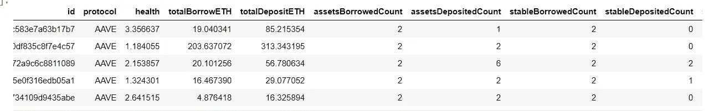

# 清理数据

第一部分是清理数据和检测异常值，以查看健康数据是如何分布的。首先，我们可以运行

```
df_users.health.describe()
```

这将为健康变量返回以下值


正如我们所看到的，有一个最小值-1，这个值对于 health 变量是不可能的，所以我们要删除它，为此，我们可以运行

```
df_users.drop(df_users[df_users['health']<0].index, inplace=True)
```

再次运行相同的命令，我们可以看到这个值不再是数据的一部分

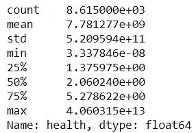

现在，我们将检查数据集的大小，以及有多少用户从 Aave 借钱，有多少用户从 compound 借钱，我们可以用下面的代码来查看

```
aave_borrowers = df_users[df_users.protocol=='AAVE'].shape[0]
compound_borrowers = df_users[df_users.protocol=='COMPOUND'].shape[0]
user_size = df_users.shape[0]print("Total users in the dataset {}".format(user_size))
print("Number of Aave borrowers {}".format(aave_borrowers))
print("Number of Compound borrowers {}".format(compound_borrowers))
```

结果是

```
Total users in the dataset 8615
Number of Aave borrowers 1145
Number of Compound borrowers 7470
```

# 检测异常值

要查看用户的健康状况是分布的，我们可以使用箱线图来检测数据中的异常值，运行

```
sns.boxplot(x=df_users['health'])
```

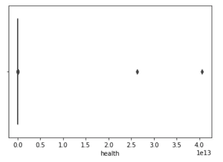

我们可以看到，有一些非常厌恶风险的用户可以被视为异常值，因此我们可以使用 IQR 方法来删除这些异常值，为此，我们可以执行

```
Q1 = df_users.health.quantile(0.25)
Q3 = df_users.health.quantile(0.75)
IQR = Q3 — Q1
print(IQR)
3.902646865965031
```

并为数据集移除它们

```
df_users = df_users[~((df_users.health < (Q1–1.5 * IQR)) |(df_users.health > (Q3 + 1.5 * IQR)))]
print(“Total users in the dataset after remove outliers {}”.format(df_users.shape[0]))Total users in the dataset after remove outliers 7297
```

之后，我们可以看到已从数据集中删除，再次查看箱线图，我们可以看到大多数用户在 1 到 3 岁之间

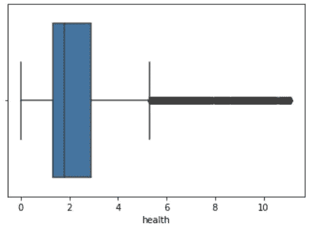

# 直方图

在清理数据并删除异常值后，我们有兴趣了解用户风险是如何分布的，了解用户是如何管理风险的，我们可以看到每个协议中的健康直方图

```
df_users['health'].hist(by=df_users['protocol'])
```

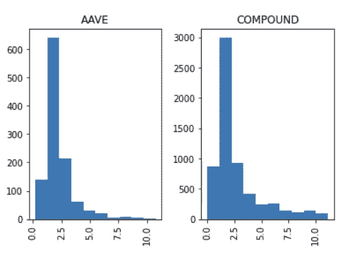

他们中的大多数都接近清算限制，其中少数人的风险较低，为了更仔细地了解大多数用户的位置，可以运行相同的直方图，但通过运行以下内容按大多数用户的位置进行筛选

```
df_users[df_users['health']<4].health.hist(by=df_users['protocol'])
```

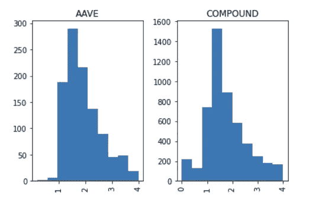

我们可以看到，它们大多数在 1 和 2 之间，为了证实这一点，可以在每个方案中使用该字段的箱线图

```
df_users.boxplot(column=’health’, by=’protocol’)
```

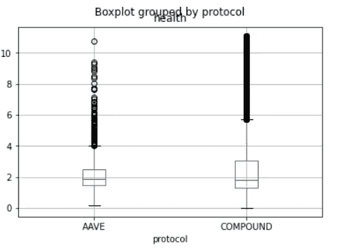

# 相关

数据集的变量不是随机选择的，其想法是试图找到用户健康和他们在协议中的行为之间的某种相关性。一种策略可以是，使用稳定的硬币来降低波动风险，其他策略可以使用多种资产来分散抵押品和本金，并且还可以有趣地了解拥有高或低抵押品的用户是否更有风险，或者之前的清算是否会使用户更加厌恶风险。

一旦所有这些变量都在数据集中，我们就可以使用热图来绘制变量之间的相关性，方法是运行

```
corr = df_users.corr()
sns.heatmap(corr)
```

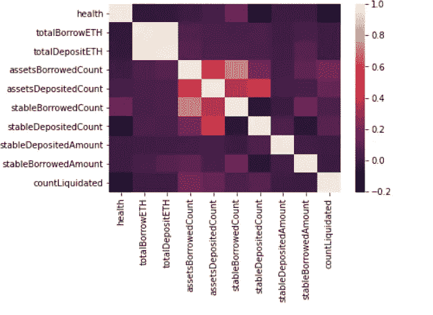

这些变量与用户健康之间没有很高的相关性，countLiquidated 和 stableDepositCount 的值较高，这表明负相关，表明当用户存放不太稳定的硬币或被清算次数较多时，健康往往较高。

为了检验这些变量，我们可以通过运行

```
fig, ax = plt.subplots(figsize=(10,6))
ax.scatter(df_users['health'], df_users['stableDepositedCount'])
ax.set_xlabel('health')
ax.set_ylabel('stableDepositedCount')
plt.show()
```

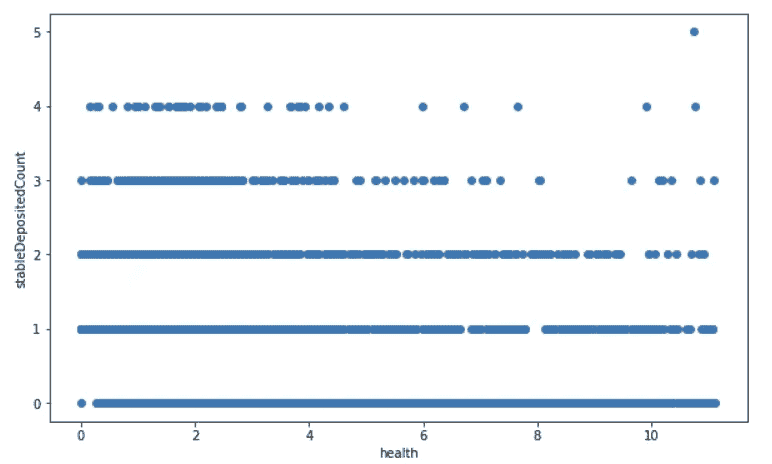

我们可以看到，当用户存入更多稳定硬币时，健康通常更集中在 1 附近，借款稳定变量也是如此。

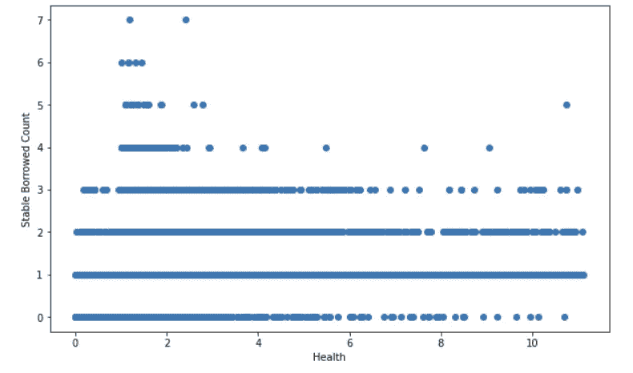

在清算计数的情况下，不存在明确的相关性，存在多次清算且同样承担高风险的用户，以及没有清算且风险较低的用户。我尊重那些有超过 25 次清算，但仍然接近一次健康清算的人。

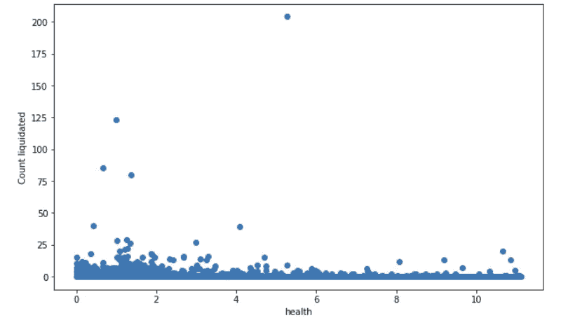

# 结论

通过这种简单的分析，我们可以了解用户在租借协议中的行为，同样，我们可以看到从 DeFi 获取数据并对其进行分析是多么容易，而不仅仅是实际数据，在区块链中，我们在每个块中都保存了所有历史记录。