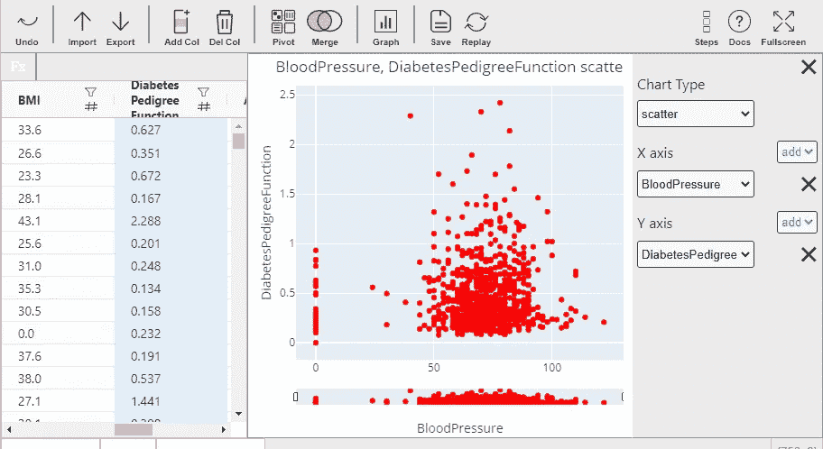
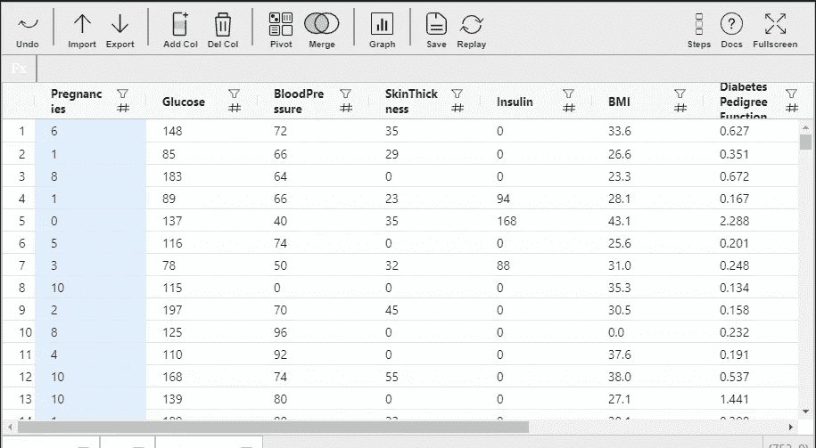
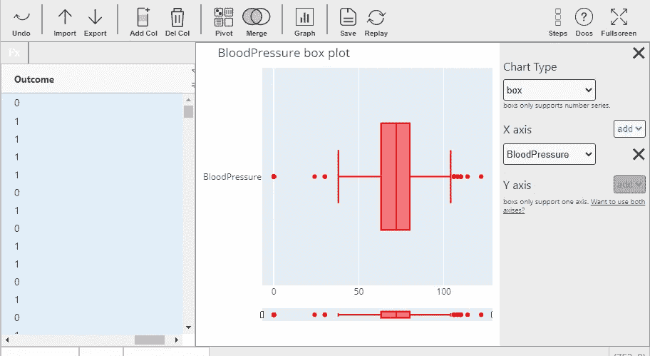
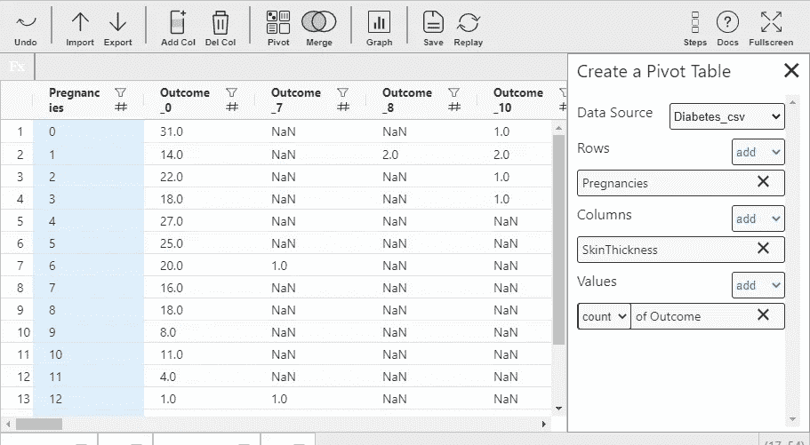

# 使用米托的探索性数据分析

> 原文：<https://towardsdatascience.com/exploratory-data-analysis-using-mito-1a12b9584718?source=collection_archive---------16----------------------->

使用 Mitosheet 实现 EDA 过程自动化



来源:作者

探索性数据分析是数据科学中最重要和最关键的步骤。它不仅为我们提供了有关数据点和特征的信息，而且有助于找出不同的数据模式、关联、数据相关性等。

这是一个耗时的过程，因为我们需要使用不同的统计方法和可视化来分析数据。有大量的 python 库可以在 EDA 过程中提供帮助，但它们要么不用户友好，要么我们需要使用不同库的组合来完成所有 EDA 步骤。

MitoSheet 是一个开源 python 库，用于创建高度交互式的仪表板，我们可以在其中分析数据，可视化不同的功能并相应地操作数据。在本文中，我们将探讨如何使用 MitoSheet 的不同功能。

让我们开始吧…

# 安装所需的库

我们将从使用 pip 安装 MitoSheet 开始。下面给出的命令可以做到这一点。对于这篇文章，我们将使用 Jupyter 实验室。

```
!pip install mitoinstaller
!python -m mitoinstaller install
```

接下来，我们将通过在命令提示符下运行下面给出的命令来启动 Jupyter 实验室。

```
!python -m jupyter lab
```

# 导入所需的库

在这一步中，我们将导入创建 MitoSheet 所需的库。

```
import mitosheet
```

# 运行有丝分裂表

接下来，我们将从运行 MitoSheet 仪表板开始，并对我们选择的数据执行探索性数据分析。

```
mitosheet.sheet()
```


来源:作者

这里你可以看到 MitoSheet 的主页。在这张图片中，您可以看到突出显示的导入按钮，我们将使用它来导入我们正在处理的数据集，对于本文，我将使用著名的糖尿病数据集。但是你可以选择任何你想要的数据集。



数据集(来源:作者)

**创建可视化效果**

我们将使用导航面板上的图形按钮来创建可视化效果。所有的可视化效果都是使用 [Plotly](https://medium.com/u/5fdd6522cd45?source=post_page-----1a12b9584718--------------------------------) 创建的，这使得它们具有高度的交互性，并且易于下载。



可视化(来源:作者)

您还可以使用导航面板中的按钮来添加和删除列。类似地，我们可以使用选项创建数据透视表并合并数据。



数据透视表(来源:作者)

继续使用不同的数据集进行尝试，并执行探索性数据分析。如果您发现任何困难，请在回复部分告诉我。

本文是与[皮尤什·英加尔](https://medium.com/u/40808d551f5a?source=post_page-----1a12b9584718--------------------------------)合作完成的。

# 在你走之前

***感谢*** *的阅读！如果你想与我取得联系，请随时通过 hmix13@gmail.com 联系我或我的* [***LinkedIn 个人资料***](http://www.linkedin.com/in/himanshusharmads) *。可以查看我的*[***Github***](https://github.com/hmix13)**简介针对不同的数据科学项目和包教程。还有，随意探索* [***我的简介***](https://medium.com/@hmix13) *，阅读我写过的与数据科学相关的不同文章。**