# Python 中的探索性数据分析、可视化和预测模型

> 原文：<https://towardsdatascience.com/exploratory-data-analysis-visualization-and-prediction-model-in-python-241b954e1731?source=collection_archive---------5----------------------->


卡伦·艾姆斯利在 [Unsplash](https://unsplash.com?utm_source=medium&utm_medium=referral) 上的照片

## 在 Python 中使用 Pandas、Matplotlib、Seaborn 和 Scikit_learn 库

本文主要关注一个数据故事项目。换句话说，探索性数据分析。在看了一个大数据集甚至一个小数据集之后，很难马上理解它。从数据集中提取一些有意义的信息需要努力、更多的工作和分析。

在本文中，我们将采用一个数据集，并使用一些流行的 python 库，如 Numpy、Pandas、Matplotlib、Seaborn，从中找到一些有意义的信息。最后，我们将运行 scikit-learn 库中的预测模型。

> 作为一名数据科学家或数据分析师，您可能不得不处理您不太熟悉的主题数据。这个数据集可能就是其中之一。很多专栏都是医学术语。但这应该不是什么大问题。借助伟大的工具和技术，探索数据集仍然是可能的。

> **本文将涵盖:**

如何处理数据集以从中提取有意义的信息或理解数据

使用机器学习模型进行预测

## 从数据集中提取信息

这里使用的数据集称为“心力衰竭临床记录”数据集。请随意从 [Kaggle](https://www.kaggle.com/andrewmvd/heart-failure-clinical-data) 下载数据集并跟随。

让我们在 jupyter 笔记本环境中导入必要的包和数据集:

```
import pandas as pd
import numpy as np
import matplotlib.pyplot as pltdf = pd.read_csv("heart_failure_clinical_records_dataset.csv")
```

数据集对于在这里显示截图来说有点大。数据集有 299 行数据，以下是数据集的列:

```
df.columns
```

输出:

```
Index(['age', 'anaemia', 'creatinine_phosphokinase', 'diabetes',
       'ejection_fraction', 'high_blood_pressure', 'platelets',
       'serum_creatinine', 'serum_sodium', 'sex', 'smoking', 'time',
       'DEATH_EVENT', 'sex1', 'death'],
      dtype='object')
```

这里，“年龄”、“肌酸酐磷酸激酶”、“T8”、“射血分数”、“血小板”、“T9”、“血清肌酸酐”、“血清钠”、“时间”是连续变量。

“贫血”、“糖尿病”、“T10”、“高血压”、“性别”、“吸烟”、“T11”、“死亡事件”是分类变量。所有分类变量只有 0 和 1 值。因此，“性别”只说是男性还是女性，“高血压”说的是这个人是否有高血压，“贫血”说的是这个人是否患有贫血。

我喜欢通过观察连续变量的分布来开始大部分 EDA 项目。

```
df[['age', 'creatinine_phosphokinase', 
    'ejection_fraction', 'platelets', 'serum_creatinine', 'serum_sodium']].hist(bins=20,
                                                                               figsize=(15, 15))
plt.show()
```

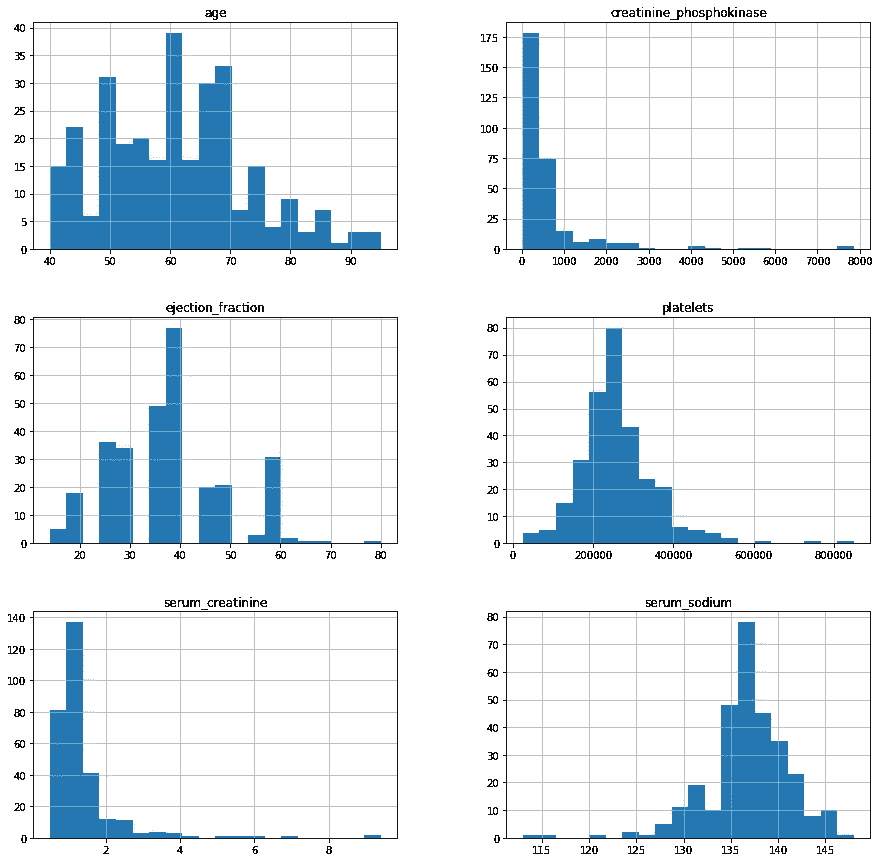

它一目了然地显示了大多数人口所在的位置和分布的性质。

为了理解数据，找到一些常用的描述性变量数据是有帮助的，例如平均值、中值、最大值、最小值、标准差和四分位数。

```
continous_var = ['age', 'creatinine_phosphokinase', 
    'ejection_fraction', 'platelets', 'serum_creatinine', 'serum_sodium']df[continous_var].describe()
```

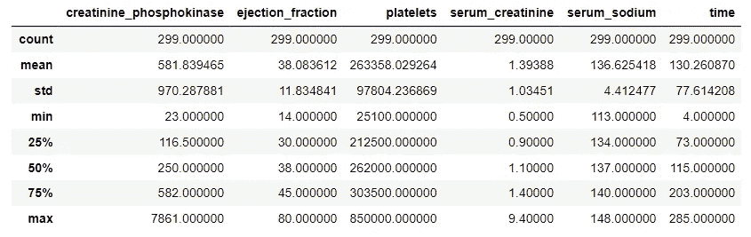

现在，我们已经分别看到了分布和统计参数，tt 将很高兴看到这些变量如何与“死亡事件”相关联。此列有 0 和 1 值。我会把它改成‘是’和‘不是’。我还想更改“性别”列，将 0 和 1 替换为“男性”和“女性”。

```
df['sex1'] = df['sex'].replace({1: "Male", 0: "Female"})
df['death'] = df['DEATH_EVENT'].replace({1: "yes", 0: "no"})
```

如果您现在检查这些列，您将看到数据集中的两个附加列:“sex1”和“death”。在下一个图中，我们将看到一个 pairplot，它将显示每个连续变量与其余变量之间的关系。我们也将为死亡事件使用不同的颜色。

```
sns.pairplot(df[["creatinine_phosphokinase", "ejection_fraction",
                       "platelets", "serum_creatinine",
                       "serum_sodium", "time", "death"]], hue = "death", 
            diag_kind='kde', kind='scatter', palette='husl')
plt.show()
```

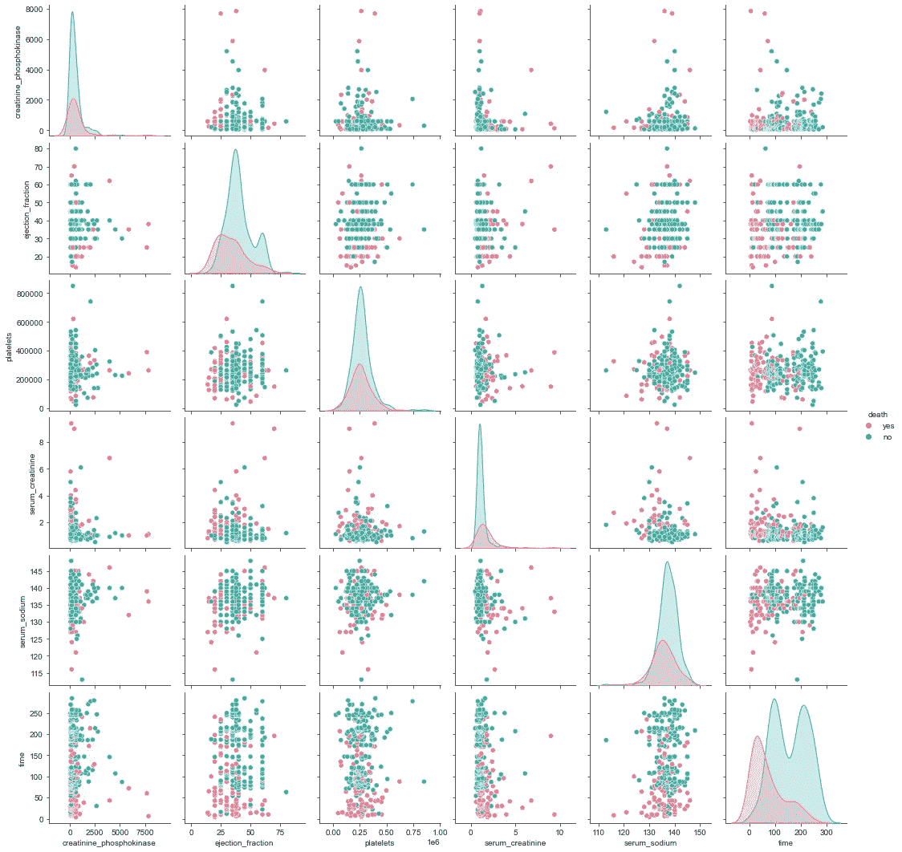

这里，红色表示死亡事件，绿色表示没有死亡。该图显示了这些变量在死亡事件之间是如何分离的。此外，散点图和中间的密度图显示了死亡事件和非死亡事件数据的明显区别。箱线图将更清晰地说明这一点:

```
continous_var = ['age', 'creatinine_phosphokinase', 
    'ejection_fraction', 'platelets', 'serum_creatinine', 'serum_sodium']plt.figure(figsize=(16, 25))for i, col in enumerate(continous_var):
    plt.subplot(6, 4, i*2+1)
    plt.subplots_adjust(hspace =.25, wspace=.3)

    plt.grid(True)
    plt.title(col)
    sns.kdeplot(df.loc[df["death"]=='no', col], label="alive", color = "green", shade=True, kernel='gau', cut=0)
    sns.kdeplot(df.loc[df["death"]=='yes', col], label="dead",  color = "red", shade=True, kernel='gau', cut=0)
    plt.subplot(6, 4, i*2+2) 
    sns.boxplot(y = col, data = df, x="death", palette = ["green", "red"])
```

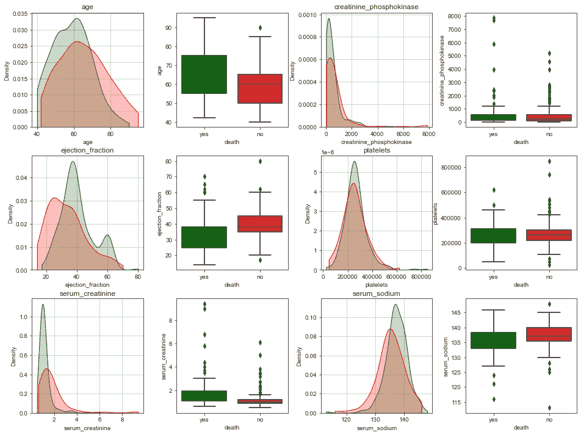

死亡事件和无死亡事件的每个连续变量的平均值的一些数字数据对于一个好的报告是必要的。一些可靠的数字数据有助于讨论。在这里，我们将找到死亡事件和无死亡事件的每个连续变量的平均值和中值。正如我们之前在分布和密度图中看到的，并非所有变量都是正态分布的。有些是倾斜的。所以，平均并不能代表每一个。

```
y = df.groupby("death")["creatinine_phosphokinase", "ejection_fraction", "platelets", "serum_creatinine", "serum_sodium", "time"].agg([np.mean, np.median])
y
```

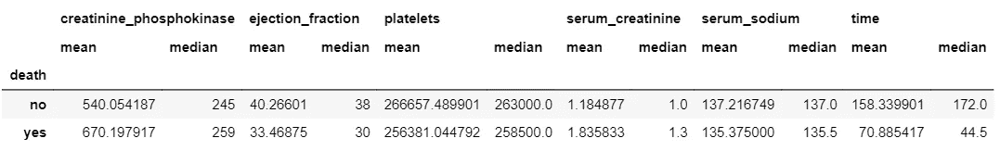

看起来死亡事件之间的“时间”变量非常不同。

我们稍后可能会对“时间”变量进行更多的探索。

让我们看看高血压是否在性别死亡中起作用。

```
df.groupby(['sex1', 'high_blood_pressure', 'death']).size().unstack().fillna(0).apply(lambda x: x/x.sum(), axis=1)
```

输出:

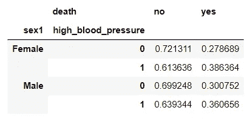

现在，你可以看到一些比例上的差异。但是这种差异在高血压的情况下比在性别上更明显。但是即使在高血压的情况下，这种差异也不会太大。在女性人口中，28%的死亡发生在没有高血压的女性身上，39%的死亡发生在有高血压的女性身上。这看起来显然有很大的不同。但也不要太激烈。它需要一些统计推断来做出更好的结论，这不是本文的范围。

除了“死亡”变量，我们在这个数据集中还有五个其他分类变量。值得研究它们与“死亡”变量的关系。我将使用 barplot 或 seaborn 库中的 countplot 来完成这项工作。

```
binary_var = ['anaemia', 'diabetes', 'high_blood_pressure',
             'sex1', 'smoking']plt.figure(figsize=(13, 9))for i, var in enumerate(binary_var):
    plt.subplot(2, 3, i+1)
    plt.title(var, fontsize=14)
    plt.xlabel(var, fontsize=12)
    plt.ylabel("Count", fontsize=12)
    plt.subplots_adjust(hspace = 0.4, wspace = 0.3)
    sns.countplot(data= df, x = var, hue="death", palette = ['gray', "coral"]
```

输出:

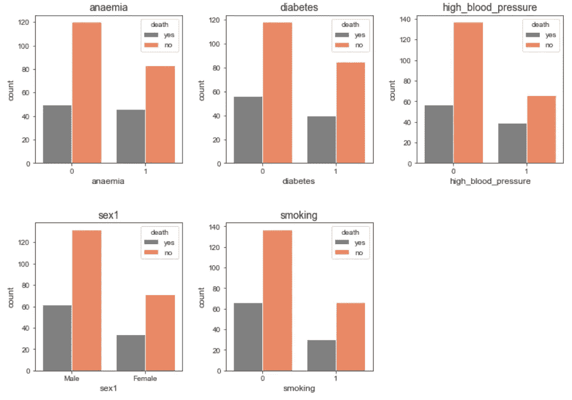

在上面的图中，它清楚地显示了不同性别(在该数据集中只有男性和女性)、高血压、吸烟和糖尿病状态之间的死亡事件数量的差异。但与此同时，它也表明了数据集在吸烟和不吸烟的人数或患糖尿病或不患糖尿病的人数，或男性和女性的人数上是不平衡的。所以，看看这个比例会让我们有一个清晰的概念。

此时，我可以考虑在这些变量和死亡变量之间做交叉表。让我们从 sex1 变量开始:

```
x = pd.crosstab(df["sex1"], df['death'])
x
```

输出:

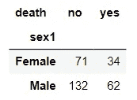

你可以看到这些数字。男性人口中有多少人死亡，女性人口中有多少人死亡。但是在这种情况下，比例会提供更多的信息。因为显然男性和女性的数量是不一样的。

```
x.apply(lambda z: z/z.sum(), axis=1)
```

输出:

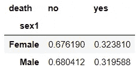

看啊！男性和女性人口的死亡率均约为 32%。所以他们是一样的。我对其他四个分类变量也做了同样的处理。

**贫血 vs 死亡**

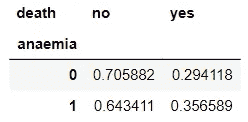

贫血患者的死亡比例更高一些。

**糖尿病 vs 死亡**

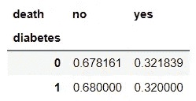

这里，糖尿病患者和非糖尿病患者的死亡比例完全相同。

**吸烟 vs 死亡**

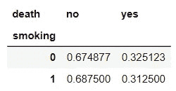

吸烟者和不吸烟者的死亡比例几乎相同。

**高血压 vs 死亡**

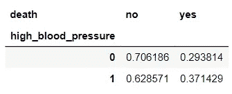

在这里，高血压患者的死亡比例更高。

在所有上述分析中，我们只试图确定所有其他变量与‘死亡’变量的关系。我们能做的远不止这些。我们试试看能不能提取一些有趣的信息。

接下来，元素是小提琴图，显示了吸烟和不吸烟男性和女性的“时间”分布。

```
plt.figure(figsize=(8, 6))
a = sns.violinplot(df.smoking, df.time, hue=df.sex1, split=True)
plt.title("Smoking vs Time Segregated by Gender", fontsize=14)
plt.xlabel("Smoking", fontsize=12)
plt.ylabel("Time", fontsize=12)
plt.show()
```

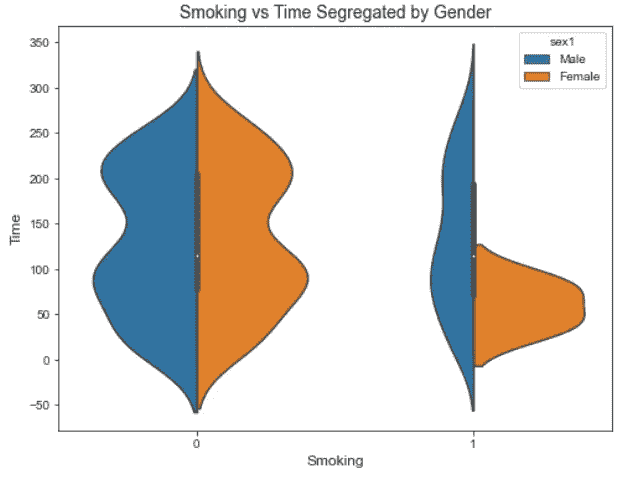

在不吸烟的人群中，男性和女性的分布是一样的。另一方面，就吸烟者而言，男性和女性的分布非常不同。大多数女性处于大约 0 到 140 的狭窄范围内。而男性人口的范围从-50 到 350。

现在我想看看‘射血分数’和‘死亡’所分隔的‘时间’之间的关系。

```
sns.lmplot(x="ejection_fraction", y="time", 
           hue="death", data=df, scatter_kws=dict(s=40, linewidths=0.7,
                                            edgecolors='black'))
plt.xlabel("Ejection Fraction", fontsize=12)
plt.ylabel("Time", fontsize=12)
plt.title("Ejection fraction vs time segregated by death", fontsize=14)
plt.show()
```

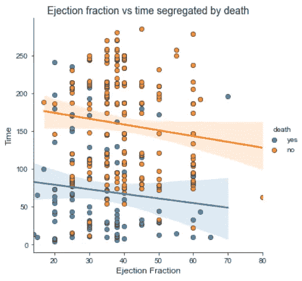

这个图暂时没有提供太多的信息。但是你可以看到回归线和置信带。正如所料，置信带在数据密度较高的中间较窄，在数据密度较低的两侧较宽。

接下来的剧情，我们再来看一个男女人口的对比。“时间”如何随“年龄”而变化:

```
fig = plt.figure(figsize=(20, 8), dpi=80)
g = sns.lmplot(x='age', y='time', 
               data = df, 
               robust = True,
              palette="Set1", col="sex1",
              scatter_kws=dict(s=60, linewidths=0.7, edgecolors="black"))
for ax in g.axes.flat:
    ax.set_title(ax.get_title(), fontsize='x-large')
    ax.set_ylabel(ax.get_ylabel(), fontsize='x-large')
    ax.set_xlabel(ax.get_xlabel(), fontsize='x-large')
```

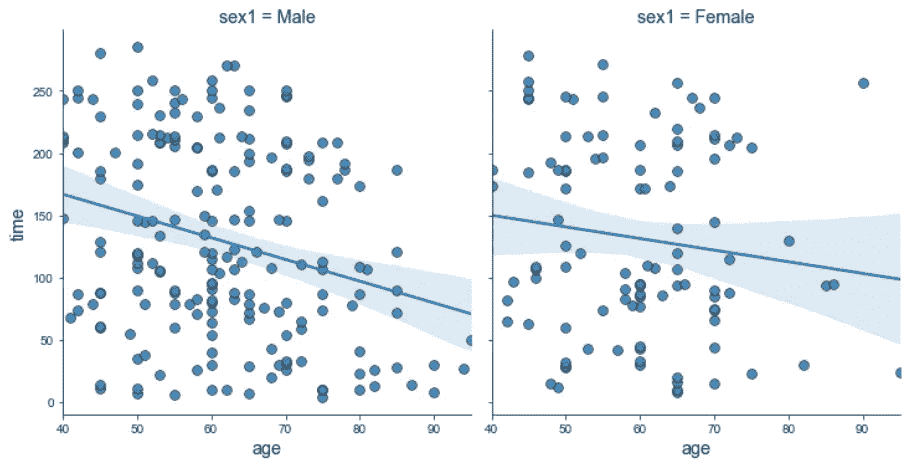

注意这里的回归线，对于男性人口，回归线要陡得多。随着“年龄”的增长，“时间”也在减少。

在上面的大多数图中，我们试图找出变量之间的关系。显示所有变量之间相关性的热图非常有用。热图用于机器学习的特征选择，也用于数据分析以了解变量之间的相关性。

```
plt.figure(figsize=(10, 10))
sns.heatmap(df.corr(), annot=True, linewidths=0.5, cmap="crest")
plt.show()
```

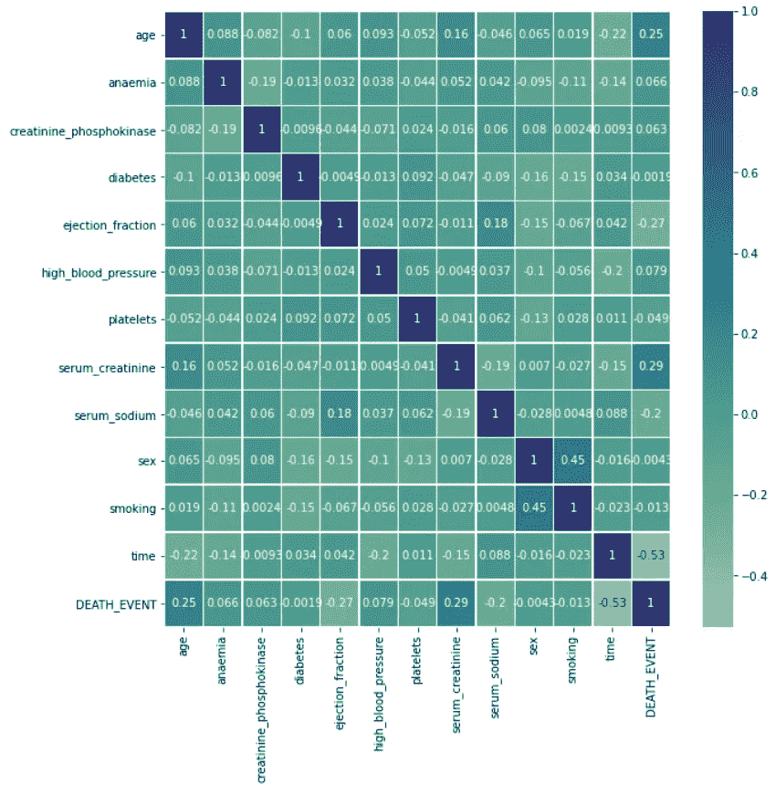

您将在下一节看到这些相关性的使用。

## 死亡预测

利用数据集中的所有变量，我们可以训练一个机器学习模型来预测死亡。对于这个项目，我将简单地从 scikit_learn 库中导入一个机器学习模型并使用它。

> 数据准备

在这个数据集中，所有的列最初都是数字，这是机器学习模型所需要的。我们在开始创建了两个带有字符串的列。这些列需要删除。

```
df = df.drop(columns=['sex1', 'death'])
```

另外，我将在数据集上使用 dropna()函数。数据集非常干净。但是万一有空值，它会删除那些行。

```
df = df.dropna()
```

正如我之前提到的，上面的相关变量可以用于机器学习的特征选择。请注意热图中 DEATH_EVENT 和热图最后一列中的其他变量之间的相关性。死亡事件与“贫血”、“糖尿病”、“性别”、“吸烟”、“肌酸酐磷酸激酶”之间的相关性非常低。

我将简单地从数据集中删除这些列。

```
df = df.drop(columns=['anaemia', 'diabetes', 'sex', 'smoking', 
                       'creatinine_phosphokinase'])
```

将数据集中的所有变量放在同一个尺度上是个好主意。看，不同的变量有不同的范围。像“血小板”有一个非常高的范围。另一方面，血清肌酸酐具有非常低的范围。为了使所有的连续变量范围相似，我将每个变量除以它们的最大值。

在此之前，我将把数据集 df 复制到变量 df2 中，以保持原始值不变。

```
df2 = dfcontinuous_var = ['age', 'ejection_fraction', 'platelets', 'serum_creatinine', 'serum_sodium']for i in continous_var:
    df2[i] = df2[i]/max(df2[i])
```

分类变量不需要改变。它们已经是 0 或 1 值。

这个机器学习模型将用于预测死亡事件。所以，DEATH_EVENT 是输出变量。

```
y = df2['DEATH_EVENT']
```

我将使用其余的变量作为输入变量。DEATH_EVENT 从将成为输入变量列表的 df2 中删除。

```
X = df2.drop(columns=['DEATH_EVENT'])
```

> 训练和测试数据的分离

训练模型前的最后一步。通常，在机器学习中，一部分数据与训练数据是分开的。以便在训练模型之后，您可以使用模型看不到的一些数据来检查模型。但是标签或者输出是你知道的。

scikit_learn 库为此提供了一个 train_test_split 函数。

```
from sklearn.model_selection import train_test_split
X_train, X_test, y_train, y_test = train_test_split(X, y, test_size=0.25, random_state=22)
```

> 使用决策树分类器

我在这个例子中使用了决策树分类器。下面是分类器和结果:

```
clf_tree = DecisionTreeClassifier(random_state=21, max_depth = 7, max_leaf_nodes=6).fit(X_train,y_train)
y_pred = clf_tree.predict(X_test)
print("Accuracy:",metrics.accuracy_score(y_test,y_pred))
print("Precision:",metrics.precision_score(y_test,y_pred,pos_label=0))
print("Recall:",metrics.recall_score(y_test,y_pred,pos_label=0))
print("F Score:",metrics.f1_score(y_test,y_pred,pos_label=0))
print("Confusion Matrix:\n",metrics.confusion_matrix(y_test,y_pred))
```

输出:

```
Accuracy: 0.84
Precision: 0.9215686274509803
Recall: 0.8545454545454545
F Score: 0.8867924528301887
Confusion Matrix:
 [[47  8]
 [ 4 16]]
```

准确率 0.84 或者 84%。还有，F 分 0.89。F 值越接近 1，模型越好。

现在，如果你知道一个人的“年龄”、“射血分数”、“高血压”、“血小板”、“血清肌酸酐”、“血清钠”、“时间”，你就可以预测这个人是死是活。这个预测几乎有 84%是正确的。

## 结论

在本次演示中，我试图向您展示一些技术来理解该数据集并运行预测模型。有许多不同的方法来完成探索性数据分析任务。这是我对这次演示的选择。

欢迎在推特上关注我，喜欢我的 T2 脸书页面。

## 更多阅读:

[](/an-ultimate-cheatsheet-of-data-visualization-in-seaborn-be8ed13a3697) [## 用 Python 的 Seaborn 库实现数据可视化的终极指南

### 对学习者来说也是一个很好的资源

towardsdatascience.com](/an-ultimate-cheatsheet-of-data-visualization-in-seaborn-be8ed13a3697) [](/take-full-control-over-the-subplots-in-matplotlib-71b3bc11ff0b) [## 完全控制 Matplotlib 中的支线剧情

### 使用支线剧情和 GridSpec 一起更好地控制

towardsdatascience.com](/take-full-control-over-the-subplots-in-matplotlib-71b3bc11ff0b) [](/a-full-length-machine-learning-course-in-python-for-free-f2732954f35f) [## 免费的 Python 全长机器学习课程

### 吴恩达用 Python 写的机器学习教程

towardsdatascience.com](/a-full-length-machine-learning-course-in-python-for-free-f2732954f35f) [](/do-you-need-a-masters-degree-to-become-a-data-scientist-ab894c2a8d41) [## 成为数据科学家需要硕士学位吗？

### 我作为波士顿大学数据分析专业硕士学生的经历和体会

towardsdatascience.com](/do-you-need-a-masters-degree-to-become-a-data-scientist-ab894c2a8d41) [](/a-collection-of-advanced-visualization-in-matplotlib-and-seaborn-with-examples-2150e6c3f323) [## Matplotlib 和 Seaborn 中的高级可视化集合，带有示例

### 丰富可视化技术和技能

towardsdatascience.com](/a-collection-of-advanced-visualization-in-matplotlib-and-seaborn-with-examples-2150e6c3f323) [](/sort-and-segment-your-data-into-bins-to-get-sorted-ranges-pandas-cut-and-qcut-7785931bbfde) [## 数据宁滨与熊猫削减或 Qcut 方法

### 当你在寻找一个范围而不是一个确切的数值，一个等级而不是一个分数

towardsdatascience.com](/sort-and-segment-your-data-into-bins-to-get-sorted-ranges-pandas-cut-and-qcut-7785931bbfde)