# Python 中的探索性数据分析和可视化

> 原文：<https://towardsdatascience.com/exploratory-data-analysis-visualization-in-python-1bf7a817bc01?source=collection_archive---------4----------------------->

[Firmbee.com](https://unsplash.com/@firmbee?utm_source=medium&utm_medium=referral)在 [Unsplash](https://unsplash.com?utm_source=medium&utm_medium=referral) 上拍照

在本文中，我将使用 Python 来探索和可视化经典的泰坦尼克号数据。

这个分析的重点是回答这个问题——“泰坦尼克号幸存者的特征是什么？”。

泰坦尼克号的数据可以从[的 Kaggle 网站](https://www.kaggle.com/c/titanic/data)下载。我将使用 train.csv 进行数据探索，其中包含了解泰坦尼克号幸存者特征所需的生存数据。

我们先来看看数据是什么样子的。

1.  **快速浏览数据**

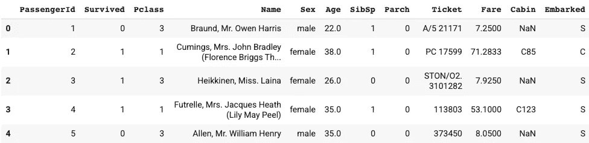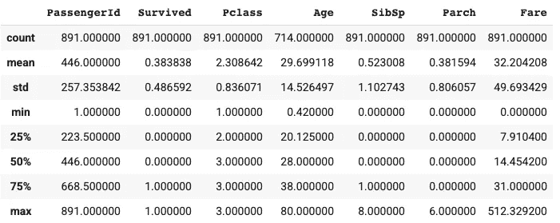

在列车数据中，有 891 名乘客，平均存活率为 38%。年龄范围从 0.42 岁到 80 岁，平均年龄为 30 岁。至少 50%的乘客在泰坦尼克号上没有兄弟姐妹/配偶，至少 75%的乘客在泰坦尼克号上没有父母/孩子。费用变化很大。

让我们将乘客 Id、Survived 和 Pclass 的类型改为 string。

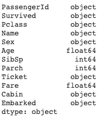

对于 fare 需要注意的一点是，最小值是 0。会不会是数据错误？

以上是票价为 0 美元的乘客名单。我抽查了一些乘客，看看 0 美元的票价是否是有意的。

根据 www.encyclopedia-titanica.org 的说法，托马斯·安德鲁斯是皮尔里勋爵的侄子，皮尔里勋爵是哈兰德·沃尔夫(泰坦尼克号的建造者)的主要所有者。他持 112050 号赠票登机。

威廉·亨利·马什·帕尔先生是一名电气工程师，被选中监督泰坦尼克号首航的顺利进行。

约翰·维尔赫姆·亨里克·特伦奎斯特先生和他的美国航运公司同事(小威廉·卡胡恩·约翰逊、阿尔弗雷德·约翰逊、莱昂内尔·伦纳德)在他们的泰坦尼克号上被给予三等舱，以便返回纽约(机票号码 370160)，在那里他们可以继续工作。

根据这些信息，0 美元的票价似乎不是数据错误。

拥有相同机票号码的乘客似乎属于同一个旅行团。我可以为团队旅行创建一个布尔变量，看看团队旅行的人是否更有可能幸存。这将在特性工程文章中讨论。

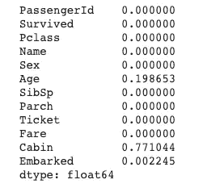

~20%的年龄数据缺失，77%的客舱数据缺失，0.2%的上船数据缺失。我们需要在建模前处理缺失的数据。这也将在特性工程文章中涉及。

**2。数值变量**

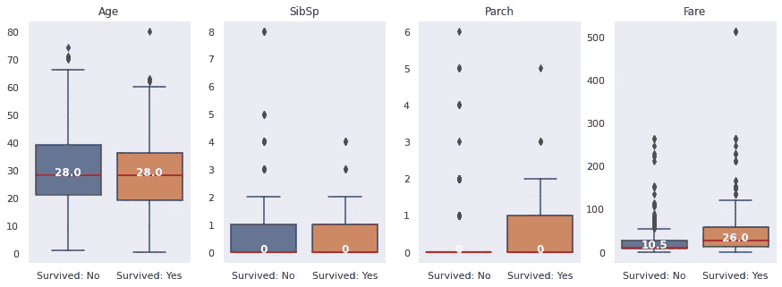

至于箱线图，幸存者和受害者在年龄和 SibSp 上有相似的四分位数。与受害者相比，幸存者更有可能有父母/孩子在泰坦尼克号上，并且有相对更贵的船票。

箱线图通过四分位数提供数字数据的快速视图。让我们使用直方图来检查数据分布，以发现更多的模式。

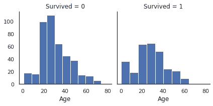

注意，当比较两组数据的分布时，最好使用相对频率而不是绝对频率。以年龄为例，绝对频率直方图表明，20-30 岁年龄组的受害者比幸存者多得多。这是真的吗？

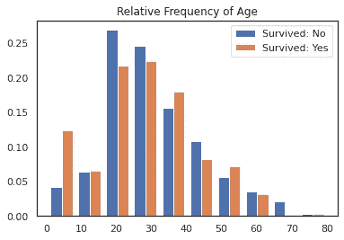

在年龄相对频率直方图中，真正突出的是年龄组< 10\. Children were more likely to survive compared to victims among all age groups.

In the earlier step to check missing values, we found ~20% of Age data is missing. The histograms for Age above are based on non na values. Does the missing data in Age contain any useful information?

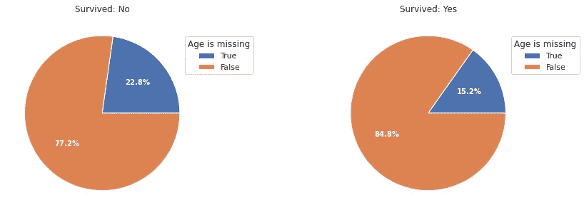

From the pie plots, we can tell that passengers with missing age were more likely to be victims. If this view of the pie plots isn’t very clear, let’s try a different way to slice the data (see below).

Regarding feature engineering for Age, I’ll probably create a categorical variable including categories for Children, Adult, Senior and Missing Values respectively.

Let’s take a look at the histograms for the four numerical variables based on the relative frequency.

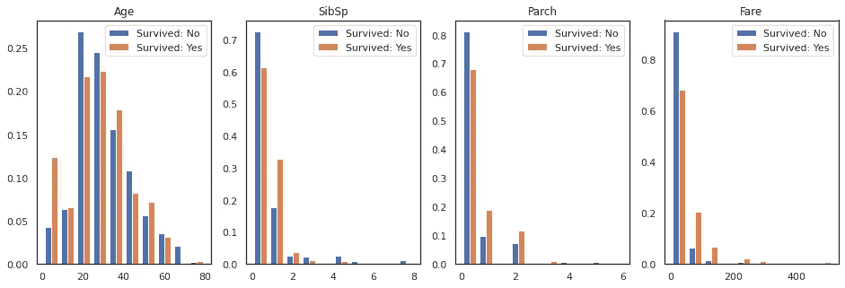

**3。分类变量**

让我们快速浏览一下分类变量。

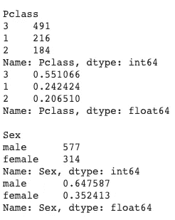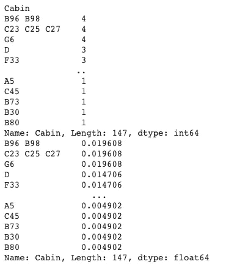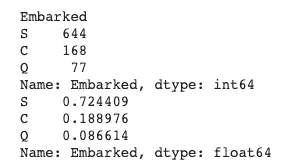

在前面的步骤中，我们发现 77%的客舱数据丢失，0.2%的装船数据丢失。我将用占位符' _n/a '替换丢失的值，并且只保留 Cabin 中的第一个字母。

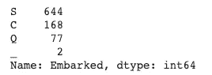

也许更好的清理客舱数据的方法是用共享相同机票号码的乘客的客舱号码替换丢失的值。调查那些在一个区域中有多个机舱号码的人，看看是否有任何有意义的模式，这也是很有趣的。我将把这个留到特性工程文章中。

在对数据进行一些简单的清理后，我们可以使用柱状图检查分类变量中的存活率。

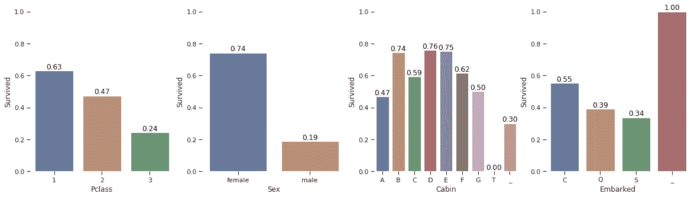

至于 https://www.kaggle.com/c/titanic/data 的[的可变音符，pclass 是社会经济地位(SES)的代理。从柱状图中，我们可以看出，SES 较高的乘客更有可能幸存。](https://www.kaggle.com/c/titanic/data)

此外，女性比男性更有可能存活下来。是因为整体乘客的分布偏向女性吗？其实恰恰相反。在快速浏览分类变量时，我们看到 65%的乘客是男性，35%是女性。

舱室有很多缺失值，所以不同舱室之间存活率的比较可能意义不大。在特性工程之后，我将再次讨论这个问题。

在瑟堡上船的乘客比在皇后镇和南安普顿上船的乘客有更大的生还机会。没有客舱号码的乘客 100%生还，但乘客数量只有两个。

总结一下，以下是幸存者与受害者相比的特征。

*   幸存者更可能有父母/孩子在泰坦尼克号上，并且有相对更贵的船票。
*   与所有年龄组的受害者相比，儿童更有可能幸存。
*   失踪年龄的乘客不太可能是幸存者。
*   具有较高 pclass (SES)的乘客更有可能存活。
*   女性比男性更有可能存活下来。
*   在瑟堡上船的乘客比在皇后镇和南安普顿上船的乘客有更大的生还机会。

我还发现一些变量需要进一步清理/转换。

*   年龄:给定年龄组< 10 岁和缺少年龄的乘客的有用信息，我将为年龄创建一个分类变量来表示这些类别。
*   客舱:77%的客舱数据丢失。一些没有客舱数据的乘客可能与有客舱号码的乘客共享同一张机票。我可以用这个来恢复一些机舱数据。
*   客舱计数(新功能):一些乘客有多个客舱号码。可能还有其他信息需要调查。
*   票价:票价与存活率正相关。正如我们之前看到的，一些乘客持赠票登机。我应该对车费做些什么吗？我需要对此多加考虑。
*   旅游团队(新特性):我可以使用门票号码为旅游团队创建一个布尔变量，看看人们在团队中旅行是否更有可能幸存。
*   名字:这是我唯一没有分析的变量。名字里有什么信息吗？我需要对此多加考虑。

感谢阅读。我希望这篇文章对你有所帮助。如果您有任何问题或建议，请留下评论。

在下一篇文章中，我将使用 Python 对大量数据进行特征工程，为构建机器学习模型做准备。请继续关注。:)