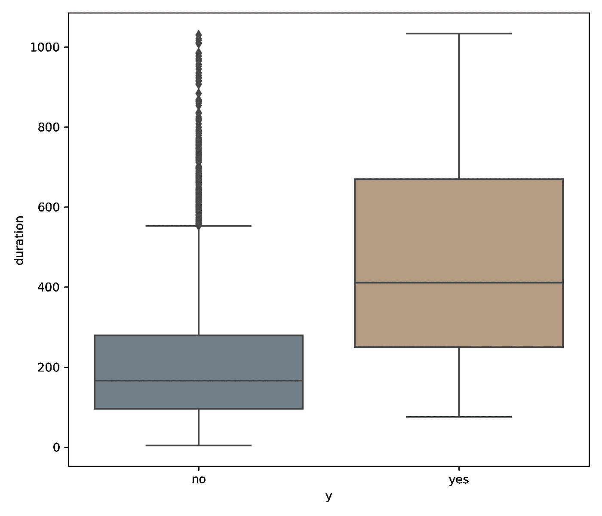
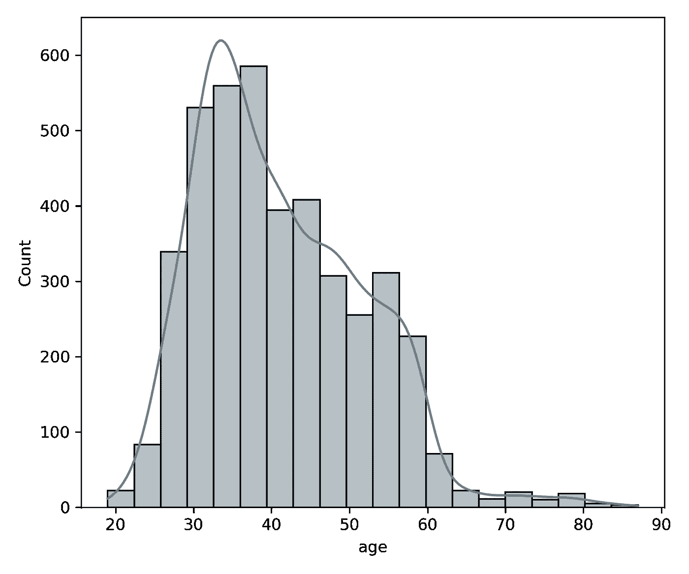
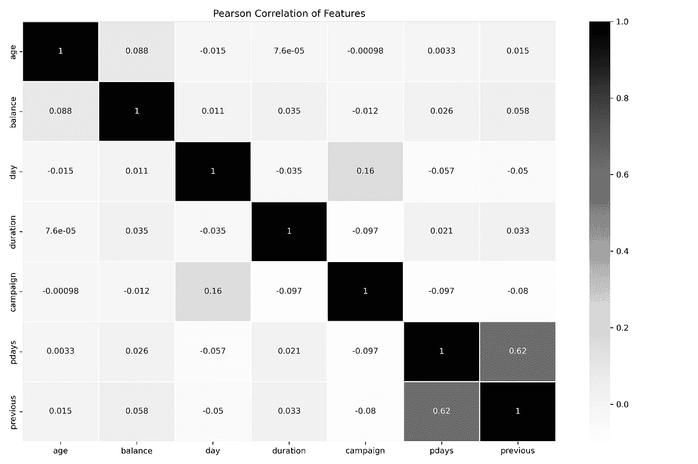
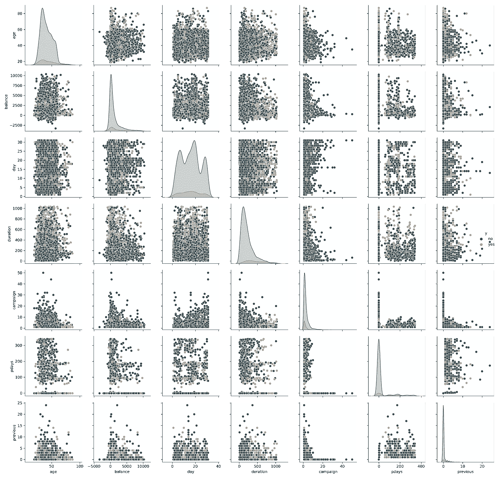

# 使用 Python 进行探索性数据分析的 My Goto 过程

> 原文：<https://towardsdatascience.com/exploratory-data-analysis-with-python-1b8ae98a61c5?source=collection_archive---------7----------------------->

## 探索新数据集的结构化方法


照片由[阿曼达·桑德林](https://unsplash.com/@amanda_sandlin?utm_source=medium&utm_medium=referral)在 [Unsplash](https://unsplash.com?utm_source=medium&utm_medium=referral) 上拍摄

# EDA 是什么？

EDA 或探索性数据分析是检查和理解数据集结构的过程。这是任何机器学习项目的关键部分，它是你工具箱中的工具，允许你接近你从未见过的数据，并适应各种特征。

我发现许多人在没有正确执行 EDA 的情况下就直接进入他们的数据。尤其是在他们做了几个项目并认为他们知道自己在做什么之后。对我来说，这是关键的第一步，它揭示了数据中如此多的隐藏宝石，是不可或缺的。

在这个过程中，我将使用 [Kaggle](https://www.kaggle.com/prakharrathi25/banking-dataset-marketing-targets) 上的银行数据集。

# 我的 EDA 方法

本文描述了我用来执行 EDA 的一般过程。根据数据的类型、复杂性和混乱程度，它会因数据集而异。然而，这些步骤对于所有数据集通常是相同的。

1.  基础探索
2.  检查空值和重复值
3.  处理异常值
4.  将数据可视化

# 基础探索

从导入所需的包开始。这些是我所有新探索的默认设置。我倾向于发现`seaborn`是在`matplotlib`之上的一个方便的包装器，有助于更快地构建可视化。

```
import numpy as np
import pandas as pd
import seaborn as sns
import matplotlib.pyplot as plt
```

# 查看大小、列和示例行

在我导入数据后，有几个来自`pandas`的函数我会先运行。让我们过一遍。

```
df.shape
```

```
(4521, 17)
```

我们可以从输出中看到，有带有`17`列的`4,521`观察值。

```
df.info()
```

```
<class 'pandas.core.frame.DataFrame'>
RangeIndex: 4521 entries, 0 to 4520
Data columns (total 17 columns):
 #   Column     Non-Null Count  Dtype 
---  ------     --------------  ----- 
 0   age        4521 non-null   int64 
 1   job        4521 non-null   object
 2   marital    4521 non-null   object
 3   education  4521 non-null   object
 4   default    4521 non-null   object
 5   balance    4521 non-null   int64 
 6   housing    4521 non-null   object
 7   loan       4521 non-null   object
 8   contact    4521 non-null   object
 9   day        4521 non-null   int64 
 10  month      4521 non-null   object
 11  duration   4521 non-null   int64 
 12  campaign   4521 non-null   int64 
 13  pdays      4521 non-null   int64 
 14  previous   4521 non-null   int64 
 15  poutcome   4521 non-null   object
 16  y          4521 non-null   object
dtypes: int64(7), object(10)
memory usage: 600.6+ KB
```

`pandas`导入数据的方式是给出数据类型的最佳猜测。如果它们没有正确导入，您可以在以后更改它们。在我上面的例子中，看起来大多数数据类型是`integers`和`objects`或者字符串。

接下来，显示第一行和最后几行数据。

```
df.head()
```

和

```
df.tail()
```

# 查看统计摘要

有一个超级强大的命令，在一个函数中，`df.describe()`可以给你一个数据的鸟瞰图。它将显示计数，平均值，标准差，最小值，最大值，等等。有了这些数据，你就能很好地意识到你面临的是什么；然而，以后将它可视化会增加你的分析。

```
# Without any parameters passed into the describe function, it will return numerical only.
df.describe().round(2)
```

```
age   balance      day  duration  campaign    pdays  previous
count  4521.00   4521.00  4521.00   4521.00   4521.00  4521.00   4521.00
mean     41.17   1422.66    15.92    263.96      2.79    39.77      0.54
std      10.58   3009.64     8.25    259.86      3.11   100.12      1.69
min      19.00  -3313.00     1.00      4.00      1.00    -1.00      0.00
25%      33.00     69.00     9.00    104.00      1.00    -1.00      0.00
50%      39.00    444.00    16.00    185.00      2.00    -1.00      0.00
75%      49.00   1480.00    21.00    329.00      3.00    -1.00      0.00
max      87.00  71188.00    31.00   3025.00     50.00   871.00     25.00
```

# 检查分类值

以下函数在处理分类数据时非常方便。它首先只选择类型为`object`的列；在我们的例子中，所有的文本字段都是绝对的。然后，它遍历这些列中的每一列，并打印每一列的`value_counts`。

```
# get categorical data
cat_data = df.select_dtypes(include=['object'])
# show counts values of each categorical variable
for colname in cat_data.columns:
    print (colname)
    print (cat_data[colname].value_counts(), '\n')
```

下面是单个列的示例输出。注意总结分类数据有多棒。

```
marital
married     2797
single      1196
divorced     528
Name: marital, dtype: int64
```

# 检查空值和重复值

空值和重复值最终都是机器学习模型中的一个问题，所以让我们检查并处理它们。

# 空值

首先，我从测试空值开始。要知道*你想如何*处理他们，需要一点探索和解释。它可以是当数量很少时简单地删除它们，用默认值如`0`填充它们，或者基于相邻值填充它们。基于相邻值填充它们对于时间序列数据来说是很常见的，在这种情况下，您可以使用前一个和后一个值的平均值*来填充缺失值。熊猫的`fillna()`功能得到了广泛的支持，你可以在这里阅读[。](https://pandas.pydata.org/docs/reference/api/pandas.DataFrame.fillna.html)*

在这个例子中，我将探索是否有，并把它们从数据集中删除。

```
# check for nan/null
df.isnull().values.any()
# count of nulls per column
df.isnull().sum()
```

放下它们

```
# Drop NULL values
df.dropna(inplace=True)
```

# 重复值

接下来，是寻找重复的。重复值类似于空值，因为它们需要被解释为真正干净、有用的数据或错误的数据。重复也可能是机器学习中的一个问题，因为它们可能会导致您的模型过度偏向不属于真实数据集的观察值。您可以使用下面的代码来检查重复项或删除重复项，如下所示:

```
len_before = df.shape[0]
df.drop_duplicates(inplace=True)
len_after = df.shape[0]

print(f"Before = {len_before}")
print(f"After = {len_after}")
print("")
print(f"Total Removed = {len_before - len_after}")
```

```
Before = 4521
After = 4521

Total Removed = 0
```

在这种情况下，没有重复的行或空值，但是对于您的用例，检查并适当地处理它们是非常重要的。

# 处理异常值

离群值是数据中另一个极其常见的问题。如果异常值是数据集中的良好观察值，或者是错误，则需要对其进行评估。首先，你可以测试有多少。对于正态分布的数据，最常用的方法是寻找任何位于+/- 3 标准偏差之外的观察值。如果你还记得你的统计课，68–95–99.7 规则。该规则规定，正态分布中 99.7%的数据位于平均值的三个标准偏差内。当您的数据高度向左或向右倾斜时，这将不是真的。你可以利用箱线图或直方图来检验正态性。我将在下面讨论这个问题。

```
def get_outliers(df):
    '''Identify the number of outliers +/- 3 standard deviations. 
    Pass this function a data frame and it returns a dictionary'''

    outs = {}

    df = df.select_dtypes(include=['int64'])

    for col in df.columns:

        # calculate summary statistics
        data_mean, data_std = np.mean(df[col]), np.std(df[col])

        # identify outliers
        cut_off = data_std * 3
        lower, upper = data_mean - cut_off, data_mean + cut_off

        # identify outliers
        outliers = [x for x in df[col] if x < lower or x > upper]

        outs[col] = len(outliers)

    return outs
```

然后将`dataframe`传递给函数，返回异常值的数量。

```
get_outliers(df)
```

```
{'age': 44,
 'balance': 88,
 'day': 0,
 'duration': 88,
 'campaign': 87,
 'pdays': 171,
 'previous': 99}
```

# 移除异常值

如果您选择从数据集中删除异常值，这里有一个简单的方法。从`scipy.stats`开始，你可以使用`zscore`函数来识别异常值，类似于上面的方法很容易:

```
from scipy import stats

# build a list of columns that you wish to remove ouliers from
out_list = ['balance', 'pdays', 'duration']

# overwrite the dataframe with outlier rows removed.
df = df[((np.abs(stats.zscore(df[out_list])) < 3)).all(axis=1)]
```

# 将数据可视化

我喜欢把我的想象分成两个不同的部分。明确地首先仅利用单变量图或图，例如关于*单个*变量的直方图和箱线图。然后，我倾向于将不同变量的二元(或多元)图分层。这个过程帮助我将分析分解成对数据理解的层次。

# 单变量图

单变量图就像它听起来一样——一个针对单个变量的图。让我们从查看数据集中所有数值变量的箱线图开始。让我们从两个最常见的开始，一个是箱线图，一个是直方图。

## 箱线图

箱线图采用单个变量，并显示关于数据如何在其[四分位数](https://en.wikipedia.org/wiki/Quartile)中分布的信息，这实质上意味着将数据分成四分之一。这个简单的图形包包含了很多信息，可以作为一个方便的工具来比较两个或更多不同的分类子段。下例显示了方框图中的`duration`变量，然后用分类模型中的`y' variable, in this case the`y’变量作为目标对其进行切片(是/否)。

```
plt.figure(figsize=(7,6))
sns.boxplot(x="y", y="duration", data=df, showfliers=True)
```



作者图片

利用该图，我们可以看到中位数(方框中心的线)以及四分位数范围(IQR)，或者方框的上部和下部作为一个整体，对于`yes`值来说大于`no`值。

一篇关于如何解读箱线图的关于数据科学的精彩文章:[理解箱线图](/understanding-boxplots-5e2df7bcbd51)

## 直方图

直方图根据值出现的频率显示单个变量在“箱”或数据组中的分布。那些不熟悉它们的人一开始可能会觉得阅读困难，因为它们可能会与条形图混淆。然而，一个条形图在 X 轴*和 Y 轴*上绘制了两个变量，而直方图中的 X 轴*和 Y 轴*是容器，Y 轴*是容器中的计数。***

```
sns.histplot(x='age', data=df, bins=20, kde=True)
```



作者图片

当您查看用直方图绘制的`age`变量时，您可以看到数据集中年龄在 30 到 40 岁之间的人数出现频率最高。因为直方图不是居中的，所以我们称之为偏斜度。在这种情况下，歪斜被称为 [**右歪斜**](https://en.wikipedia.org/wiki/Skewness) ，因为右尾较长。

# 二元图

## 相关矩阵

您需要运行的绝对二元(或多元)图是相关矩阵。这是一个矩阵，显示了数据集中所有变量之间的相关性。它将帮助您识别哪些变量是强相关的，例如简单的线性回归或不相关的变量，以及当您尝试使用多个特征来增加模型性能时的情况。

```
corr = df.corr()
f, ax = plt.subplots(figsize=(12, 8))
sns.heatmap(corr, annot=True, square=False, ax=ax, linewidth = 1)
plt.title('Pearson Correlation of Features')
```



作者图片

在大多数情况下，除了`pdays`和`previous`之间有一个`0.62`正相关值之外，没有任何强相关变量。了解为什么会这样，以及它们是否与类似的行为有关，将会很有价值。

## 配对图

接下来是一个奇妙的工具，叫做配对图。类似于相关矩阵，但是给出了每个 X 和 Y 对的散点图。对角线下方是变量的 KDE 或直方图。

```
g.fig.set_size_inches(12,12)
g=sns.pairplot(df, diag_kind = 'auto', hue="y")
```



作者图片

只需一行代码，您就可以快速、直观地评估关联矩阵中显示的关系。我们现在可以直观地看到，变量`pdays`和`previous`之间似乎没有太大的相关性。

## 附加图

从这里，您可以创建任意数量的视觉效果来帮助您更好地理解数据。由你来决定数据中有什么故事。我在 Github 上的笔记本里还有很多其他的例子。

# 结论

EDA 是一种强大的技术，每次开始处理新的数据集时，您都应该能够熟练掌握它。除了这些基础知识，还有很多其他的技术可以添加进来。在投入机器学习之前，走出去，探索并了解你的数据。

如果你喜欢阅读这样的故事，并想支持我成为一名作家，可以考虑报名成为一名媒体成员。一个月 5 美元，让你可以无限制地访问成千上万篇文章。如果你使用[我的链接](https://medium.com/@broepke/membership)注册，我会赚一小笔佣金，不需要你额外付费。

# 参考

1.  [机器学习如何去除离群点](https://machinelearningmastery.com/how-to-use-statistics-to-identify-outliers-in-data/)
2.  [了解方块图](/understanding-boxplots-5e2df7bcbd51)