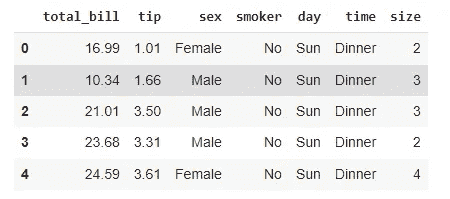
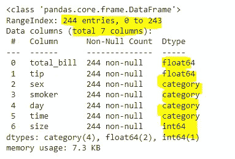
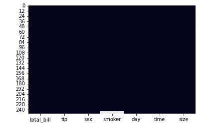
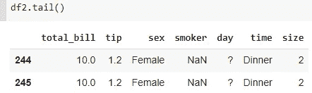
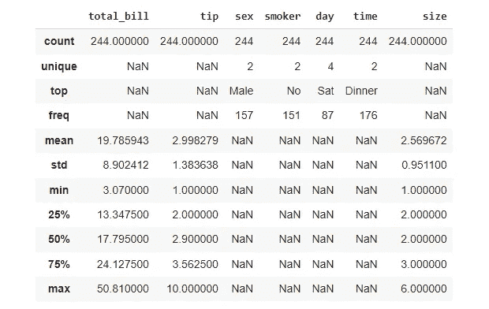

# 使用 Python 进行探索性数据分析—第 1 部分

> 原文：<https://towardsdatascience.com/exploratory-data-analysis-with-python-part-1-b6248b28dc85?source=collection_archive---------13----------------------->

## 让您开始使用 Python 和 Pandas 分析数据的模板


由[马库斯·温克勒](https://unsplash.com/@markuswinkler?utm_source=unsplash&utm_medium=referral&utm_content=creditCopyText)在 [Unsplash](https://unsplash.com/s/photos/database?utm_source=unsplash&utm_medium=referral&utm_content=creditCopyText) 上拍摄

数据科学没有秘方。不要认为每个数据集都有一个模板可以遵循。没有。

我将在这一系列文章中提出的只是一个建议，一个开始的地方。显然，从那里开始，您将被您的数据所牵引，以执行其他符合您的项目需求的检查。它不应该被理解为一个要遵循的模型或一套规则，而只是让你行动起来并帮助你从数据中提取第一个见解的东西。

## 摘要

探索性数据分析(EDA)是理解数据集并从中提取初步见解的艺术，因此您可以为数据科学流程的下一阶段做准备，例如数据清理、数据格式化、要素工程和建模。

本系列包括以下主题:

*   库导入和加载数据
*   检查数据类型
*   查找空值或缺失值
*   描述性统计剖析
*   单变量分析
*   相关
*   多变量分析

## 数据集和库

当我创建一些例子时，我喜欢使用 seaborn 包中的数据集*提示*,因为我发现它真的很有教育意义。我们有不同的数据类型——浮点数、整数、字符串、类别——这有助于我们展示概念。所以我们来装吧。

我通常还导入其他基本模块来帮助我处理数据。

```
# Basics
import pandas as pd
import numpy as np# Visualizations
import seaborn as sns
import matplotlib.pyplot as plt
import plotly.express as px# Loading the dataset
df = sns.load_dataset('tips')
```

现在，加载数据集本身就是分析的一部分。在这篇文章中，我有一组很好的代码片段，可以帮助你在将数据加载到 Python 会话时更上一层楼:

[](https://medium.com/gustavorsantos/go-next-level-with-pandas-read-csv-29e3c207a66d) [## 熊猫的下一关 read_csv()

### 众所周知的 Pandas 的 read_csv()方法的 9 个使用不足的参数。

medium.com](https://medium.com/gustavorsantos/go-next-level-with-pandas-read-csv-29e3c207a66d) 

首先要做的是查看数据集。重要的是实际查看它，如果导入顺利，查看数据集是大还是长，了解每个变量中的内容。

这是用`head`完成的，带来数据集的前 5 行。

```
df.head()
```



数据集提示的 df.head()。图片由作者提供。

因此，我们看到数据显然是好的，它被正确地导入，至少在前几行没有奇怪的值。如果你想查看最后 5 行，你也可以使用`df.tail()`。

## 检查数据类型

了解数据类型至关重要。为什么？

> 软件中的数据类型对软件如何处理数据起着信号的作用。(Bruce，Peter 和 Bruce，Andrew——数据科学家实用统计，2017 年)

当你查看数据集头部时，你的大脑会自动发现 *total_bill、tip* 和 *size* 是数字，其他变量是文本，其中一些可能是二进制的(只有两个可能的值)。因此，您知道数字列可以进行计算。但是如果我们不检查计算机是否正确理解了它们，例如，当你试图为这些数字创建统计数据时，你肯定会看到错误。

有一些方法可以完成这项任务。

```
# Info will show the shape and data types.
df.info()
```



df.info()信息。图片由作者提供。

请注意，它带来了一些有用的信息，如行数、列数、数据类型，以及是否有空值(我们在这里没有看到空值！).

```
# Another way is to look at it separately#Shape
df.shape
(244, 7) #(number of rows, number of columns)#Types
df.dtypestotal_bill     float64 
tip            float64 
sex           category 
smoker        category 
day           category 
time          category 
size             int64 
dtype: object
```

## 查找空值或缺失值

我们不是刚看过吗？

是的，我们看到现在有了。但也有可能。因此，我将在这里展示一些检测这些值的好方法。

第一种方法是最基本的。我们运行一个返回布尔值(True 或 False)的命令，知道 Python 中 True = 1 和 False = 0，我们可以对这些值求和。当我们看到一个大于零的值时，这意味着数据丢失。

```
# Checking for missing values
df.isnull().sum()total_bill    0 
tip           0 
sex           0 
smoker        0 
day           0 
time          0 
size          0 
dtype: int64
```

视觉方式也很有趣。我们可以使用 seaborn 的热图来查看数据丢失的地方。我在那里插入了一行 NAs，以便您可以看到它在视觉效果中的样子。

```
# Heatmap of null values
sns.heatmap(df.isnull(), cbar=False)
```



为示例目的插入的 NAs:请参见“smoker”变量。作者图片

整洁！我个人喜欢热图的视觉效果。这使得查看整体并找出空值或缺失值变得非常容易。

现在，我还加了一些“？”故意的。而那些在你运行`df.isnull()`的时候是检测不到的。空值并不总是像`NaN`一样。有时候他们会扮成。或者别的什么。



'?'为此示例添加了空值。图片由作者提供。

检查的一个好方法是使用正则表达式和 Pandas 的字符串包含方法。

```
# Checking possible null values - [?.,:*] only on text columnsfor col in df2.select_dtypes(exclude='number').columns:
    print(f"{col}: {df2[col].str.contains('[?.,:*]').sum()} possible   null(?.,:*) values")**[OUT]:** sex: 0 possible null(?.,:*) values 
smoker: 0 possible null(?.,:*) values 
**day: 5 possible null(?.,:*) values** 
time: 0 possible null(?.,:*) values
```

您可以替换“？”用`NaN`使用`replace`的方法。

```
# If you want to replace the '?' values
df2.replace({'?':np.nan})
```

一旦您知道丢失的值在哪里，您就可以使用许多技术来替换它们。这将是你必须根据你的项目做出的决定。一个很好的经验法则是，如果它少于数据集的 5%，就应该放弃 NAs。但是你也可以使用平均值，中间值，最频繁值，[使用 missingpy 来预测值](https://medium.com/gustavorsantos/input-missing-data-with-missingpy-e055899442eb)。对于那个任务，你可以使用`df.fillna(value)`

最简单的方法就是扔掉它们。

```
# Find the most common value for variables
most_common_smoker = df.smoker.value_counts().index[0]
most_common_day = df.day.value_counts().index[0]# Fill NA Values with the most common value
df2.fillna(value={'smoker':most_common_smoker, 'day':most_common_day})# Drop the NA values
df2.dropna(inplace=True)
```

## 描述性统计剖析

按照流程，一旦您的数据清除了缺失值，就该开始检查描述性统计数据了。有些人喜欢在清除丢失的值之前检查统计数据，因为如果您丢失一些值，您的分布将会改变。但是，如果您只是删除几行，我不认为会有太大的变化。此外，使用干净的数据，您已经可以获得良好的统计数据，显示数据在更改后是如何分布的。

这一部分是非常必要的，这样你就会知道数据是如何分布的，你可以开始得到第一手的见解。只需一个简单的命令，您就可以在屏幕上打印统计数据。如果需要，使用参数`include='all'`查看分类数据。

```
# Since the fake NAs were all deleted, I will come back to using df.
df.describe(include='all')
```



df.describe(include='all ')结果。图片由作者提供。

从这里我们可以读到很多东西。例如:

*   大部分的观察都是在周六和晚餐时间。
*   数据集有更多的男性和不吸烟者。
*   标准差相当高，表明数据是分散的，可能有异常值。
*   平均小费是 2.99 美元。
*   每桌平均人数在 2 到 3 人之间。

我相信你能够看到这些统计数据对理解你的数据有多么强大。

## 在你走之前

好了，第一部分到此结束。我们已经介绍了一半的内容，现在您已经了解了如何加载数据集、检查数据类型、理解这一点的重要性、找到缺失值以及从数据集中清除缺失值的几种方法。

这篇文章的完整代码。

下一篇文章我们将继续这个过程。

如果这是你感兴趣的内容，请关注我的博客。

[](https://medium.com/gustavorsantos) [## 古斯塔夫·桑托斯

### 让我们做出更好的决定。数据驱动的决策。我用 Python，R，Excel，SQL 创建数据科学项目。

medium.com](https://medium.com/gustavorsantos)