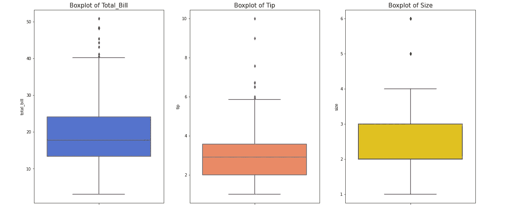
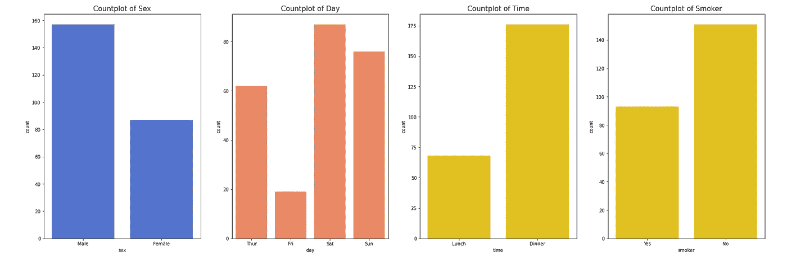
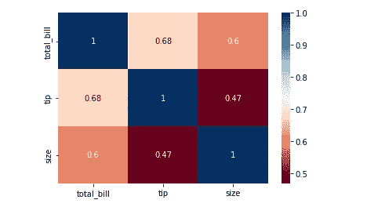
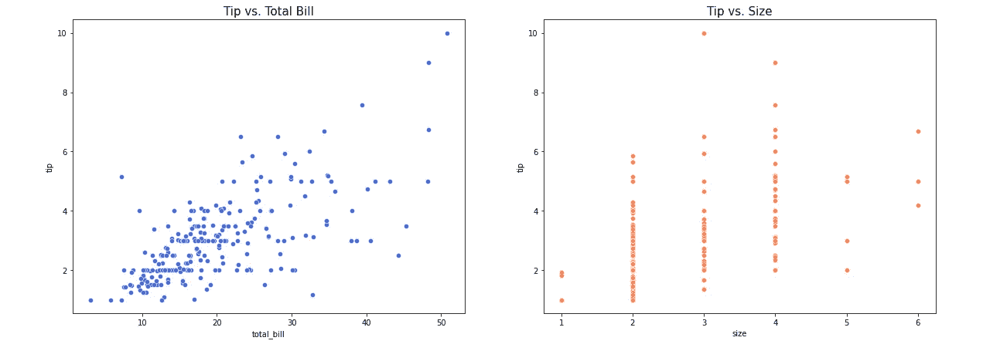
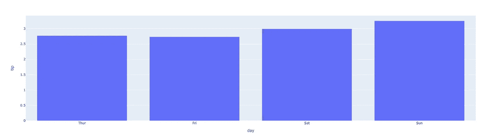
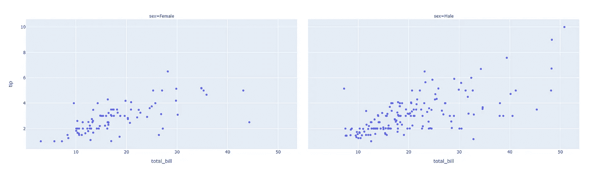
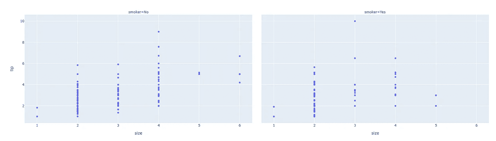

# 使用 Python 进行探索性数据分析—第 2 部分

> 原文：<https://towardsdatascience.com/exploratory-data-analysis-with-python-part-2-9b0b6c1402c2?source=collection_archive---------29----------------------->

## 让您开始使用 Python 和 Pandas 分析数据的模板


亚历山大·辛恩在 [Unsplash](https://unsplash.com/s/photos/data?utm_source=unsplash&utm_medium=referral&utm_content=creditCopyText) 上的照片

在第 1 部分中，我们回顾了一些事情，让您开始探索您的数据集。

如果您想重温它，或者如果您首先找到了这一部分并想阅读第 1 部分，这里有链接。

[](https://gustavorsantos.medium.com/exploratory-data-analysis-with-python-part-1-b6248b28dc85) [## 使用 Python 进行探索性数据分析—第 1 部分

### 让您开始使用 Python 和 Pandas 分析数据的模板。

gustavorsantos.medium.com](https://gustavorsantos.medium.com/exploratory-data-analysis-with-python-part-1-b6248b28dc85) 

下面的列表是这个*模板*所遵循的，并且我们覆盖了粗体上的项目符号:

*   **库导入和加载数据**
*   **检查数据类型**
*   **寻找空值或缺失值**
*   **描述性统计概要**
*   单变量分析
*   相关
*   多变量分析

我们继续吧。

## 单变量分析

单变量分析是一次只看一个变量的任务。这很重要，因为这样我们可以捕捉一些潜在的问题，如异常值，任何我们出于某种原因没有发现的空值，还可以了解变量是如何根据值分布的。

因此，知道变量 *total_bill、tip 和 size* 是数字，就可以用 boxt、violin 或 histogram 之类的图来分析它们。我个人喜欢箱线图，因为它们已经显示了分位数和异常值。

```
# Boxplot of numerical variablesfig, g = plt.subplots(1, 3, figsize=(20,9))g1 = sns.boxplot(data=df, y='total_bill', color='royalblue', ax=g[0])
g1.set_title('Boxplot of Total_Bill', size=15)g2 = sns.boxplot(data=df, y='tip', color='coral', ax=g[1])
g2.set_title('Boxplot of Tip', size=15)g3 = sns.boxplot(data=df, y='size', color='gold', ax=g[2])
g3.set_title('Boxplot of Size', size=15);
```



数字变量的箱线图。图片由作者提供。

正如我们在统计数据描述部分所指出的，在这里我们可以确认存在异常值，它们正在拉高平均值。总账单和小费见较长的*胡须*。

查看分类变量，柱状图可用于显示每个类别的计数，让数据科学家清楚地了解哪些变量出现的频率更高。

```
# Countplots of categorical variables
fig, g = plt.subplots(1, 4, figsize=(28,9))g1 = sns.countplot(data=df, x='sex', color='royalblue', ax=g[0])
g1.set_title('Countplot of Sex', size=15)g2 = sns.countplot(data=df, x='day', color='coral', ax=g[1])
g2.set_title('Countplot of Day', size=15)g3 = sns.countplot(data=df, x='time', color='gold', ax=g[2])
g3.set_title('Countplot of Time', size=15)g4 = sns.countplot(data=df, x='smoker', color='gold', ax=g[3])
g4.set_title('Countplot of Smoker', size=15);
```



男性、周末、晚餐、不吸烟者:引导观察的类别。图片由作者提供。

观察到更多的男性，周末，晚餐时间和不吸烟的人。因此，我们可以看到，通过几行代码，我们可以从数据中获得很好的理解和一些见解。

## 相关

相关性是两个数值变量之间线性关系的**统计度量。所以，既然我们要做多元分析，我相信计算相关性是很有趣的。这个任务可以推动你的努力。**

对于这个小小的“玩具”数据集，不会有太大的不同，因为检查所有的组合很容易。然而，从大处着眼:如果你有许多变量，[多重共线性](https://tinyurl.com/2p9beatc)，最好主要检查(如果不是只检查)那些相关性更高的变量。

此外，该部分还有一个警告。许多人只是进行相关性测试，而没有事先进行必要的检查。记得我说过相关性是一个*统计测试*，所以它需要检查先决条件。

人们必须检查被测数据是否正态分布。如果是，默认方法(Pearson)就可以了。如果数据不是正态分布，Spearman 方法更合适。

```
import scipy.stats as scs# Function to test normal distribution with an alpha value of 0.05def test_normality(data):
  stat, p = scs.shapiro(data)
  if p < 0.05:
    print(f'p-Value: {p}. Not normaly distributed.')
  else:
    print(f'p-Value: {p}. Normaly distributed.')**# Tests**
for col in df.select_dtypes(include=['int', 'float']).columns:
  test_normality(df[col])**[OUT]:**
p-Value: 3.3245434183371003e-10\. Not normaly distributed. 
p-Value: 8.20057563521992e-12\. Not normaly distributed. 
p-Value: 3.047565374957781e-20\. Not normaly distributed.
```

由于我们的测试显示了非正态分布，那么让我们使用 Spearman 的方法进行相关分析。

```
# Data not normal, use Spearmancorrelation_calc = df.corr(method='spearman')
sns.heatmap( correlation_calc , annot=True, cmap='RdBu');
```



相关计算。图片由作者提供。

请注意，小费更多地与总账单相关，而不是与聚会的规模相关，这很有道理。我们可以五个人一起去餐馆，每个人喝一杯汽水。小费会很少。或者我们可以两个人一起去吃一顿丰盛的晚餐，这样可以得到更多的小费。

## 多变量分析

现在，我们对相关性有了更多的了解，我们可以开始探索每个变量如何与我们的目标*小费*相关，假设它是为了预测小费的数量。

让我们从 tip 和 other 之间的双变量分析开始。

```
# Scatter plots Numericalfig, g = plt.subplots(1, 2, figsize=(20,9))g1 = sns.scatterplot(data=df, x='total_bill', y='tip', color='royalblue', ax=g[0])
g1.set_title('Tip vs. Total Bill', size=15)g2 = sns.scatterplot(data=df, x='size', y='tip', color='coral', ax=g[1])
g2.set_title('Tip vs. Size', size=15);
```



散点图。图片由作者提供。

*total_bill* 金额具有中度到高度相关性，我们可以看到其中的线性关系。*尺寸*则更为中低。你能理解`total_bill`比大小更适合可能的线性回归吗？

如果我们画一条直线，试图通过尽可能多的点，哪个变量会“得到”更多的点？如果你同意它是左边的图形，那么你就明白了更高的相关性意味着更适合线性回归。

当对照你的目标检查分类变量时，一个好主意是聚集数据，然后绘图。

```
# Day and Tipsmean_by_day = df.groupby('day').tip.mean().reset_index()
px.bar(mean_by_day, x='day', y='tip')
```



周日是平均小费最多的一天。图片由作者提供。

其他可能的检查是多元散点图。使用`plotly.express`库很容易做到这一点。

```
# Triple variable Scatter plotspx.scatter(df, x='total_bill', y='tip', facet_col='sex')
```



更多的男性观察和来自男性的更高数量。图片由作者提供。



不吸烟的人也给更多的小费。图片由作者提供。

还有很多其他的检查可以做，但是我想你已经明白了。

多变量分析的想法是检查其他变量如何与您的目标相关，以及它如何影响您的模型。

> 寻找可以帮助你解释一种行为和预测你的目标的最佳结果的变量。

## 结论

好了，现在就这样了。

我想通过 EDA 的“模板”这一概念向您展示的是，您必须执行一些检查，以帮助您理解数据、数据是如何分布的、如何在建模之前格式化和清理数据，并向您展示哪些变量有助于您解释您试图预测的行为。

所以，概括一下:

*   加载数据`pd.read_csv()`
*   检查形状`df.shape`，数据类型`df.dtypes, df.info()`
*   寻找空值`df.isnull().sum()`
*   使用`df.dropna()`或`df.fillna()`删除或填充 NA 值
*   使用`df.describe()`显示统计数据，帮助您理解数据的分布并提取一些有用的见解。
*   使用一些箱线图进行单变量分析。其他好的选择是直方图，QQ 图，小提琴图。
*   检查数据的正常性
*   检查数值变量的相关性。
*   检查变量与目标变量的关系。此任务将帮助您消除不一致并选择最佳变量。

## 在你走之前

检查这些参考资料。

熊猫文档: [read_csv](https://pandas.pydata.org/pandas-docs/stable/reference/api/pandas.read_csv.html) ， [dropna](https://pandas.pydata.org/pandas-docs/stable/reference/api/pandas.DataFrame.dropna.html?highlight=dropna#pandas.DataFrame.dropna) ， [fillna](https://pandas.pydata.org/pandas-docs/stable/reference/api/pandas.DataFrame.fillna.html?highlight=fillna#pandas.DataFrame.fillna) 。

如果你对这些内容感兴趣，请关注我的博客。

[](https://medium.com/gustavorsantos) [## 古斯塔夫·桑托斯

### 让我们做出更好的决定。数据驱动的决策。我用 Python，R，Excel，SQL 创建数据科学项目。

medium.com](https://medium.com/gustavorsantos)