# 利用 Python 的 Matplotlib 和 Seaborn 库中的高级可视化进行探索性数据分析

> 原文：<https://towardsdatascience.com/exploratory-data-analysis-with-some-cool-visualizations-in-pythons-matplotlib-and-seaborn-library-99dde20d98bf?source=collection_archive---------6----------------------->


霍利·曼达里奇在 [Unsplash](https://unsplash.com?utm_source=medium&utm_medium=referral) 上拍摄的照片

## 探索国际足联数据集

探索性数据分析对于正确理解数据集非常重要。甚至对机器学习也很重要。我之前发表过几个探索性的数据分析项目。但是这次我要带一个大的数据集。让我们看看进展如何。

> 我将使用来自 Kaggle 的名为 FIFA dataset 的公共数据集。这里提到的[是用户许可](https://www.kaggle.com/stefanoleone992/fifa-21-complete-player-dataset/metadata)。

请随意从以下链接下载数据集:

<https://github.com/rashida048/Datasets/blob/master/fifa.csv>  

首先导入包和数据集:

```
import pandas as pd
import numpy as np
import seaborn as sns
import matplotlib.pyplot as plt
df = pd.read_csv("fifa.csv")
```

这个数据集总共有 80 列。原始 Kaggle 数据集有 89 列，我已经删除了 9 列，并上传到上面提供的链接中。所以，你可以从一个更干净的数据集开始。

但是在开始，我删除了一个不必要的列:

```
df = df.drop(columns="Unnamed: 0")
```

现在，这些是剩下的列:

```
df.columns
```

输出:

```
Index(['sofifa_id', 'player_url', 'short_name', 'long_name', 'age', 'dob', 'height_cm', 'weight_kg', 'nationality', 'club_name', 'league_name', 'league_rank', 'overall', 'potential', 'value_eur', 'wage_eur', 'player_positions', 'preferred_foot', 'international_reputation', 'weak_foot', 'skill_moves', 'work_rate', 'body_type', 'real_face', 'release_clause_eur', 'player_tags', 'team_position', 'team_jersey_number', 'loaned_from', 'joined', 'contract_valid_until', 'nation_position', 'nation_jersey_number', 'pace', 'shooting', 'passing', 'dribbling', 'defending', 'physic', 'gk_diving', 'gk_handling', 'gk_kicking', 'gk_reflexes', 'gk_speed', 'gk_positioning', 'player_traits', 'attacking_crossing', 'attacking_finishing', 'attacking_heading_accuracy', 'attacking_short_passing', 'attacking_volleys', 'skill_dribbling', 'skill_curve', 'skill_fk_accuracy', 'skill_long_passing', 'skill_ball_control', 'movement_acceleration', 'movement_sprint_speed', 'movement_agility', 'movement_reactions', 'movement_balance', 'power_shot_power', 'power_jumping', 'power_stamina', 'power_strength', 'power_long_shots', 'mentality_aggression', 'mentality_interceptions', 'mentality_positioning', 'mentality_vision', 'mentality_penalties', 'mentality_composure', 'defending_marking', 'defending_standing_tackle', 'defending_sliding_tackle', 'goalkeeping_diving', 'goalkeeping_handling', 'goalkeeping_kicking', 'goalkeeping_positioning', 'goalkeeping_reflexes'], dtype='object')
```

正如你所看到的那么多变量！你可以从这个数据集中尽可能多的分析出一本大书。但这是一篇博客文章。我只能把我的分析限制在一个范围内。

此外，有太多的变数，我不太明白，因为我不太熟悉足球。但这也是数据科学家生活的一部分。在不了解所有特性的情况下，您可能会创建一些有趣的可视化和分析。

我们开始吧。

第一个可视化是关于工作率和工资之间的关系。该图是散点图和线图的组合。

```
plt.figure(figsize=(10, 6))#Scatter plot
ax = sns.scatterplot(x ='work_rate',
                    y = df['wage_eur'],
                    hue = "league_rank",
                    data = df,
                     palette = ["green", "red", "coral", "blue"],
                     legend="full",
                     alpha = 0.4
                    )#Getting the max wage for each work rate
max_wage_eur = df.groupby("work_rate")["wage_eur"].max()#Making a line plot of max wages
sns.lineplot(data = max_wage_eur,
            ax = ax.axes,
            color="grey")ax.tick_params(axis= "x", rotation=90)
plt.xlabel("Work Rate")
plt.ylabel("Wage EUR")
plt.title("Relationship between work rate and wage by league rank", fontsize = 18)
plt.show()
```

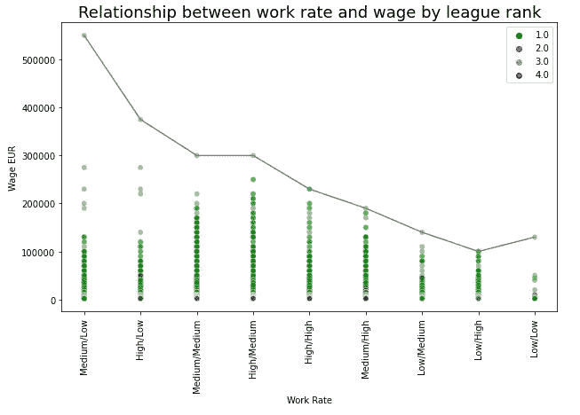

作者图片

有一个国籍栏。看到这方面的一些分析会很有趣。

这个数据集中有多少国籍的玩家？

```
len(df['nationality'].unique())
```

输出:

```
149
```

民族词汇云有助于理解哪些民族占主导地位。为了做到这一点，我们需要加入所有的国籍，然后做一个单词云。

```
nationality = " ".join(n for n in df['nationality'])from wordcloud import WordCloud
plt.figure(figsize=(10, 10))
wc = WordCloud().generate(nationality)
plt.imshow(wc, interpolation='bilinear')
plt.axis('off')
plt.show()
```

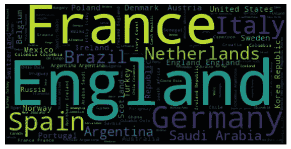

作者图片

这意味着我们有更多来自英国、法国、德国、西班牙、意大利、荷兰等国家的球员。

我很好奇玩家数量排名前 20 的国家。使用熊猫图书馆的 value_counts 函数，我得到了所有民族的值计数，并取前 20 名来找到前 20 名。熊猫值计数功能自动排序的价值。

```
nationality_count = df['nationality'].value_counts()
nationality_count[:20]
```

输出:

```
England                1627
Spain                  1051
France                  958
Argentina               867
Italy                   795
Germany                 701
Colombia                543
Republic of Ireland     460
Netherlands             419
Mexico                  416
Brazil                  416
Chile                   411
Sweden                  398
Saudi Arabia            362
United States           342
Poland                  342
Turkey                  341
Portugal                337
Korea Republic          328
Scotland                323
Name: nationality, dtype: int64
```

足球运动员在他们的生活中有一定的活跃时间。年龄分布在这里:

```
df['age'].hist()
plt.title("Distribution of age of the players")
```

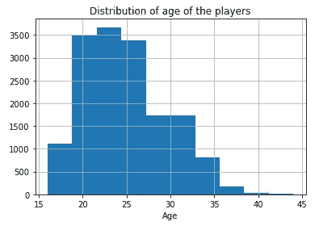

作者图片

这将是一个好主意，检查是否分布匹配的顶级国籍，联赛和俱乐部的球员人数的年龄分布。首先，让我们根据顶级国家、俱乐部和联赛制作数据框架:

```
top_20_nat= nationality_count.index[:20]
df_nationality = df[df.nationality.isin(top_20_nat)]clubs_count = df['club_name'].value_counts()
top_20_club = clubs_count[:20].index
df_clubs = df[df.club_name.isin(top_20_club)]league_count = df['league_name'].value_counts()
top_20_leagues = league_count[:20].index
df_league = df[df.league_name.isin(top_20_leagues)]
```

我想把年龄的分布放在同一个图中，以便恰当地比较分布情况:

```
pd.DataFrame({'nationality': df_nationality['age'], 
              'club': df_clubs['age'], 
              'league': df_league['age']}).hist(bins = 15,
                                                  figsize=(12, 6),
                                                  grid=False,
                                                  rwidth=0.9,
                                                  sharex=True,
                                                  sharey=True)
plt.show()
```

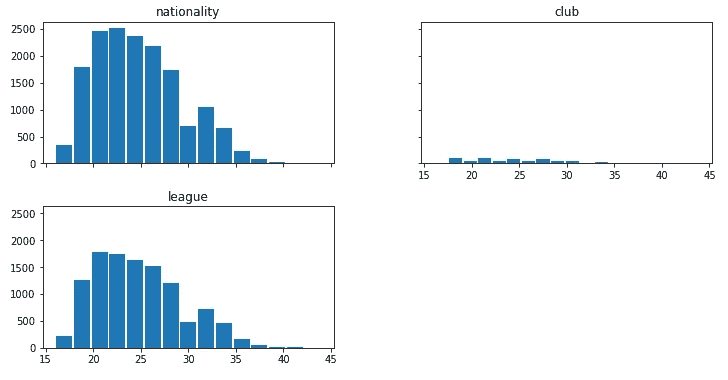

作者图片

看，俱乐部的年龄分布这么低。也许他们是儿童俱乐部。有趣的是，基于数字的更大的俱乐部是儿童俱乐部。

我还检查了所有三个组的身高和体重的分布，得到了相似的分布。请随意自己检查。

让我们来看一个图表，使用我们创建的前 20 个国籍的数据框架，对每个国籍的工资进行点估计。

```
ax = sns.catplot(x = 'nationality', y = 'wage_eur', data = df_nationality,
                hue = 'preferred_foot', height=6, aspect=2,
                capsize=0.2, kind='point')
plt.xlabel("Nationality", fontsize=12)
plt.ylabel("Wage EUR", fontsize=12)
plt.title("Point Estimation of Wages per Top 20 Nationalities", fontsize=20)
plt.xticks(rotation = 60, fontsize=13)
plt.show()
```

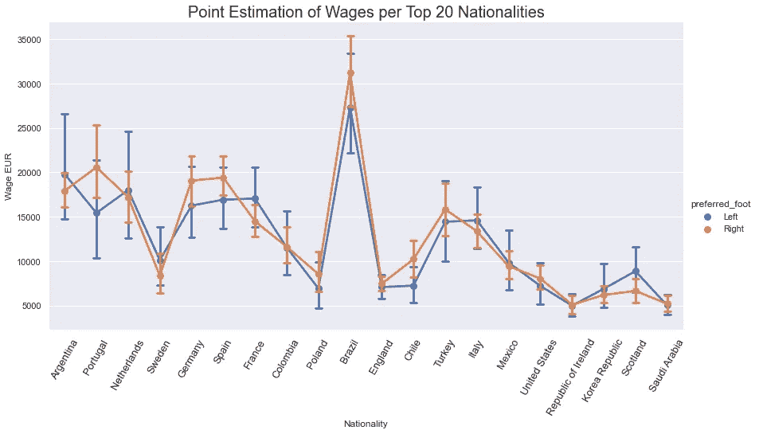

作者图片

上面的工资显示了前 20 名国籍球员的工资。我们也有前 20 名俱乐部的信息。我们来看看俱乐部层面前 20 名国籍球员的工资。

```
fig, ax = plt.subplots(figsize=(16, 6), dpi=80)
sns.stripplot(x = "nationality", y = "wage_eur",
              data=df_clubs, size = 7, ax=ax)
plt.tick_params(axis='x', which='major', labelsize=12, rotation=90)
plt.xlabel("Nationality")
plt.ylabel("Wage")
plt.title("Wages for Nationalities in Club Level")
plt.show()
```

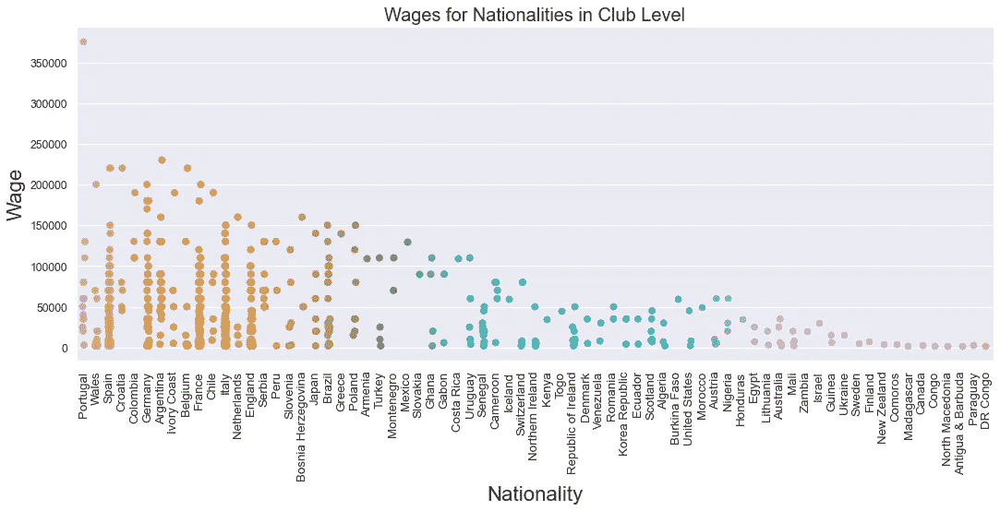

作者图片

你可以在这个俱乐部群中看到一些新的国籍。同样在点估计图中，巴西位于顶部，巴西位于中间。

下一幅图将按国际声誉显示国家职位的工资。我将在这里使用另一个组合图来显示国家职位的平均工资，不同的颜色表示国际声誉。

为此，我们需要将 national_position 列的字符串值转换为 int 值。下面是创建字典的函数，其中键是 nation_position 列的值，值是每个值的唯一整数。

```
def make_dictionary(col):
    dictn = {}
    val = 0
    for i in col.unique():
        if i not in dictn:
            dictn[i] = val+1
            val += 1
    return dictn
```

现在，我们将创建一个名为 nation_position1 的新列，其中数据类型为整数:

```
new_nation_position= make_dictionary(df['nation_position'])
df['nation_position1'] = df['nation_position'].replace(new_nation_position)
```

让我们使用这个新的 national_position1 列进行绘图:

```
plt.figure(figsize=(15, 10))
ax = sns.scatterplot(x= df['nation_position'],
                    y = df['wage_eur'],
                    hue = df['international_reputation'],
                    legend = "full",
                    data = df,
                    x_jitter = 1000)ax = sns.regplot(x= 'nation_position1',
                  y = df['wage_eur'],
                  data = df,
                  ax=ax.axes,
                 x_estimator=np.mean
                 )plt.xlabel("Nation Position")
plt.ylabel("Wage EUR")
plt.title("Wages for National Position by International Reputation", fontsize=18)
plt.show()
```

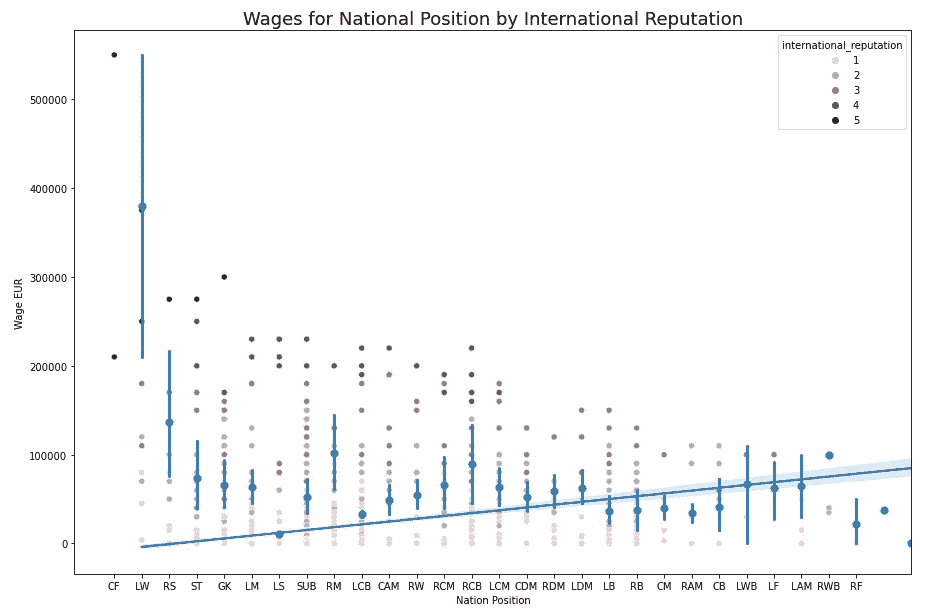

作者图片

你可以看到每个国家职位的平均工资。内部声誉越高，工资越高。

我必须承认，我不能完全理解这个数据集中的所有变量。例如，有一个名为“value_uer”的特性和另一个名为“wage_eur”的特性。他们有关系吗？一些图片可能有助于理解这一点。

下一个图探索了玩家的赌注和价值之间的关系，以及偏好的脚对这两个特征是否有任何影响。

在这个图中，我绘制了工资与数值的关系，其中颜色表示喜欢的脚。因为大部分的点都杂乱的在一个地方，我不得不放大它上面的散点图的一部分。两边是工资和价值的密度图。

```
plt.figure(figsize = (18, 10))
grid = plt.GridSpec(4, 4, wspace =0.3, hspace = 0.8)g1 = plt.subplot(grid[:, 0])
g2 = plt.subplot(grid[:2, 1:3])
g3 = plt.subplot(grid[2:, 1:3])
g4 = plt.subplot(grid[:, 3])g1.set_title("Distribution of Wage", fontsize=12)
sns.kdeplot(x = "value_eur", hue="preferred_foot", 
            vertical=True,
            data=df, ax=g1)sns.scatterplot(x = "wage_eur", y = "value_eur",
              hue = "preferred_foot1", alpha = 0.3,
                palette=['coral', 'blue'], 
                data = df, ax=g2)
g2.set_xlim(0, 50000)
g2.set_ylim(0, 0.05*1e8)
g2.legend(['Left', 'Right'])sns.scatterplot(x = "wage_eur", y = "value_eur",
              hue = "preferred_foot", alpha = 0.3,
              palette=['coral', 'blue'],   
              data = df, ax=g3)g4.set_title("Distribution of Value", fontsize=12)
sns.kdeplot(x = "value_eur", hue="preferred_foot",
            vertical=True,
            data=df, ax=g4)
plt.show()
```

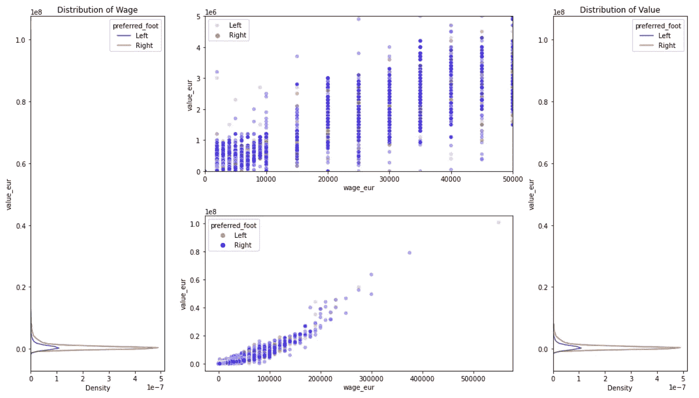

作者图片

身高、体重和体型会影响球员的表现或价值观吗？身高/体重和内部口碑有关联吗？这个图表明。

```
plt.figure(figsize=(12, 8))
fig, (ax1, ax2) = plt.subplots(1, 2, figsize=(20, 8))
#fig.suptitle("International Reputation and Value with Height and Weight, and Body Type")sns.scatterplot(x = "height_cm", y = "weight_kg", 
                 hue = "body_type1",
                     alpha = 0.5, size = "value_eur", sizes = (60, 300),
                     palette=['green','orange','dodgerblue'],
                 data = df.sample(frac=0.25), ax=ax1)ax1.set_ylim([50, 100])
ax1.set_xlim([160, 200])
ax1.set_title("Height vs Weight By Body Type and Value",fontsize=18)
ax1.set_xlabel("Height")
ax1.set_ylabel("Weight")sns.scatterplot(x = "height_cm", y = "weight_kg", 
                 hue = "international_reputation",
                     alpha = 0.5, size = "value_eur", sizes = (60, 300), palette=['green','orange','dodgerblue', 'red', 'black'],
                 data = df.sample(frac=0.25), ax=ax2)ax2.set_ylim([50, 100])
ax2.set_xlim([160, 200])
ax2.set_title("Height vs Weight By International Reputation and Value",fontsize=18)
ax2.set_xlabel("Height")
ax2.set_ylabel("Weight")plt.show()
```

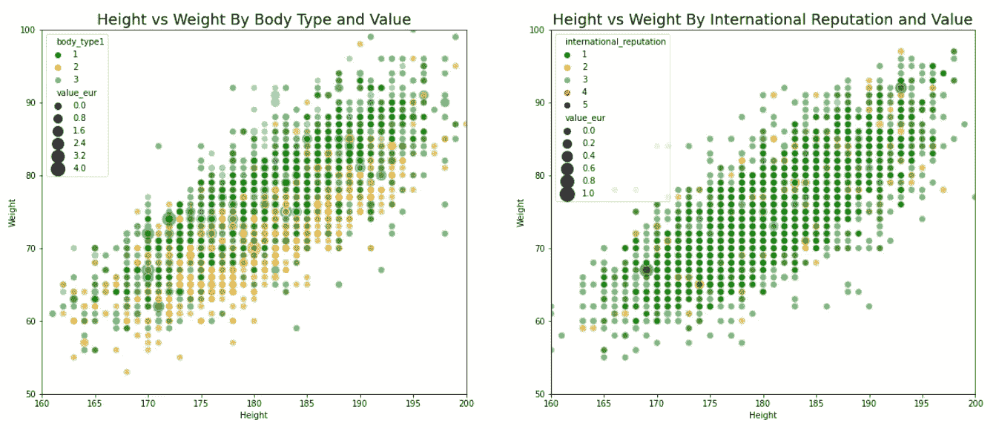

作者图片

这是国际声誉的价值计算。

```
df['international_reputation'].value_counts()
```

输出:

```
1    14512
2     1362
3      235
4       37
5        9
```

名声越高，分数越低。这是意料之中的。

我们有一个有趣的功能叫做“弱脚”。让我们看看弱脚是如何与被偏好脚隔离的价值联系起来的。我会用一个小提琴的情节来说明。

```
plt.figure(figsize=(15, 10))
sns.set()
_, ax = plt.subplots(figsize=(10, 7))
sns.violinplot(x="weak_foot",
              y="value_eur",
              hue = "preferred_foot",
              data=df,
              split=True,
              bw=.4,
              cut = 0.2,
              linewidth=1,
              palette=sns.color_palette(["green", "orange"]))
ax.set(ylim = (-0.1, 1*1e7))
plt.show()
```

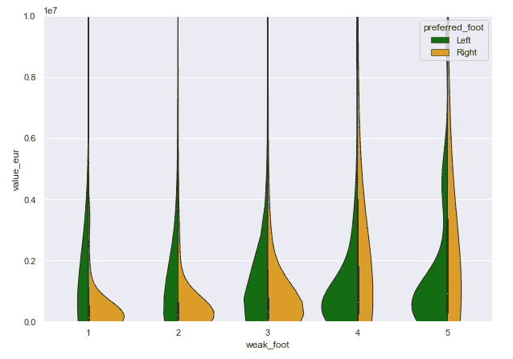

作者图片

你可以看到分布变化很大。我使用了一个“ylim”参数来排除异常值。如果我包括所有的值，小提琴的形状不会显示出来。

接下来的剧情，我想探讨一下体型和射击的关系。用喜欢的脚把它们分开也是很好的。我将使用一个点图来添加组的点估计。这一点代表了这些团体的主要倾向。

```
_, ax = plt.subplots(figsize=(10, 8))
sns.despine(bottom=True, left=True)sns.stripplot(x = "shooting",
       y = "body_type",
       hue = "preferred_foot",
       data = df,
       dodge = 0.8, zorder=1)sns.pointplot(x = "shooting",
              y = "body_type",
              hue = "preferred_foot",
              data=df, dodge=0.5, join=False,
              palette="dark", markers="d",
              scale=0.75, ci=None)
handles, labels = ax.get_legend_handles_labels()
```

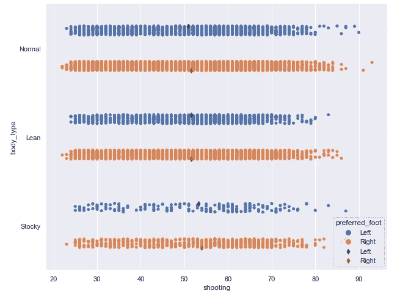

作者图片

所有组的分数估计看起来没有太大的不同。

我们没有过多地探讨民族立场。另外，另一个有趣的特征叫做心态攻击。我们将看到他们之间的关系，也包括联赛排名作为一个“色调”参数。在此之前，我们需要将 nation_position 转换为一个数值变量。我使用前面提到的 make_dictionary 函数创建了一个字典，并最终创建了一个名为“nation_position1”的新列，用整数替换了原来的字符串值。

```
nat_dictn = make_dictionary(df['nation_position'])df['nation_position1'] = df['nation_position'].replace(nat_dictn)
```

这是该图的代码块。“lmplot”和“regplot”在此图中组合在一起:

```
ax = sns.lmplot(x = "nation_position1",
               y = "mentality_aggression",
               data = df, hue = "league_rank", fit_reg = False, height = 5, aspect = 2.2)
sns.regplot(x = "nation_position1",
               y = "mentality_aggression",
               data = df, scatter=False, ax=ax.axes[0, 0], order = 3)
plt.ylabel("Mentality Aggression")
plt.xticks(list(range(1,30)), list(df['nation_position'].unique()))
plt.title("Relationship Between Nation Position and Mentality Aggression", fontsize=18)
plt.xlabel("Nation Position", fontsize=14)
plt.ylabel("Mentality Aggression", fontsize=14)
plt.show()
```

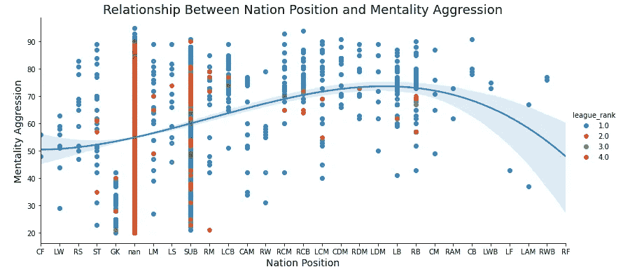

作者图片

你可以看到许多数据是“南”的联赛排名第四。但另一方面，这提供了一个关于民族立场的心理攻击的好主意。

当我们有这么大的数据集和许多连续变量时，我发现做一个配对图很有帮助。它给出了同一图中变量之间的分布和几种关系。这是一个配对图:

```
sns.set(color_codes=True)
plt.rcParams["axes.labelsize"] = 20
g1 = sns.PairGrid(df.sample(frac = 0.2), vars = ['pace', 'shooting',
       'passing', 'dribbling', 'defending', 'attacking_crossing',
       'attacking_finishing', 'attacking_heading_accuracy'],
              hue = 'preferred_foot')
g1.map_lower(sns.regplot)
g1.map_diag(plt.hist, alpha=0.7)
g1.map_upper(sns.kdeplot, shade=True)
g1.add_legend(title='Foot', fontsize=20)
for axes in g1.axes.flat:
     axes.set_ylabel(axes.get_ylabel(), rotation=0, horizontalalignment='right')
```

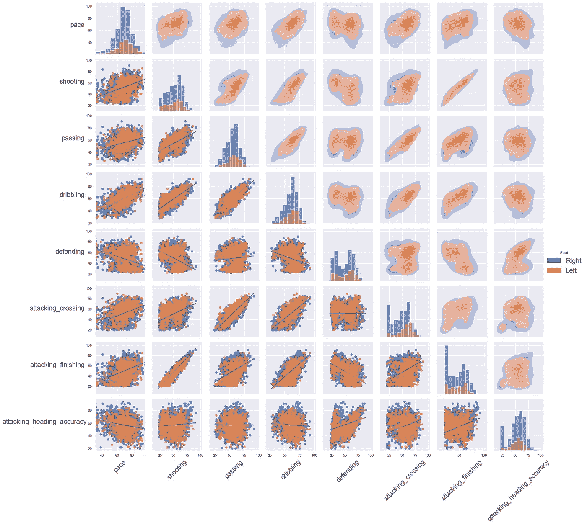

作者图片

我想探索一下进攻和防守之间的关系。我想在这次探索中也包括身体类型和心理攻击性:

```
df2 = df[['attacking_heading_accuracy', 'defending', 'body_type', 'mentality_aggression']]df_encircle=df2[(df2['attacking_heading_accuracy'] >=50) & (df2['attacking_heading_accuracy'] <=70)].dropna()
df_encirclefrom scipy.spatial import ConvexHullplt.figure(figsize=(18, 8))
ax = sns.scatterplot(x = "attacking_heading_accuracy", y = "defending", 
                 hue = "body_type",
                     alpha = 0.5, size = "mentality_aggression", sizes = (20, 300),
                 data = df.sample(frac=0.10))def encircle(x, y, ax=None, **kw):
    if not ax:
        ax=plt.gca()
        p=np.c_[x, y]
        hull = ConvexHull(p)
        poly=plt.Polygon(p[hull.vertices, :], **kw)
        ax.add_patch(poly)

encircle(df_encircle.attacking_heading_accuracy, df_encircle.defending,
        ec = "k", fc="gold",
        alpha = 0.1)encircle(df_encircle.attacking_heading_accuracy, df_encircle.defending,
        ec = "firebrick", fc="None",
        linewidth = 1.5)plt.xlabel("Attacking Heading Accuracy", fontsize=12)
plt.ylabel("Defending", fontsize=12)
plt.title("Defending vs Attacking Heading Accuracy")
plt.show()
```

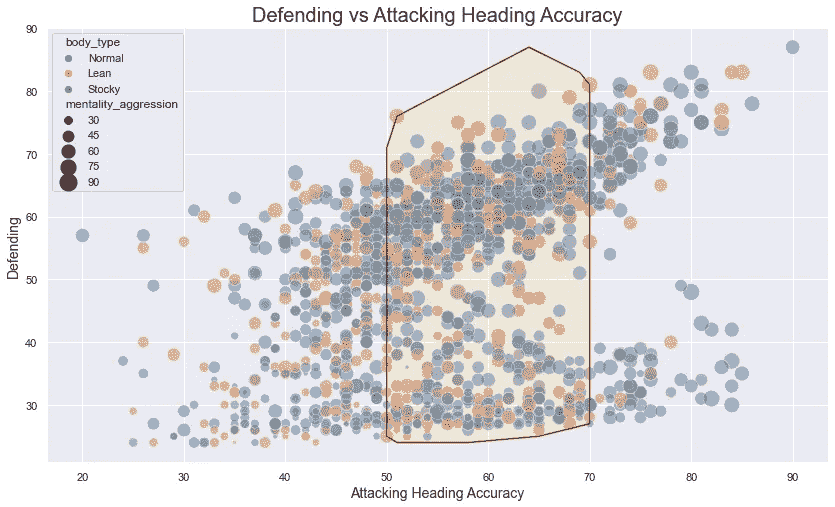

作者图片

你可能会想，为什么我圈了一些区域。如果你注意到以前在配对图中攻击方向准确性的分布，大多数群体位于 50 到 70 的范围内。我只是想把那个区域圈起来，这样我们就可以把注意力集中在那个区域。

下面的图将显示国家位置和运动速度之间的关系。这次我结合了箱线图和带状图。

```
fig, ax = plt.subplots(figsize=(14, 8))ax = sns.boxplot(x = 'nation_position', y = "movement_sprint_speed",
                data = df)
ax.tick_params(rotation=90, labelsize=18)
ax = sns.stripplot(x = 'nation_position', y = "movement_sprint_speed", data=df)
plt.xlabel("Nation Position", labelpad = 16, fontsize=24)
plt.ylabel("Movement Sprint Speed", labelpad = 16, fontsize=24)
plt.title("Nation Position vs Movement Sprint Speed", fontsize=32)
plt.show()
```

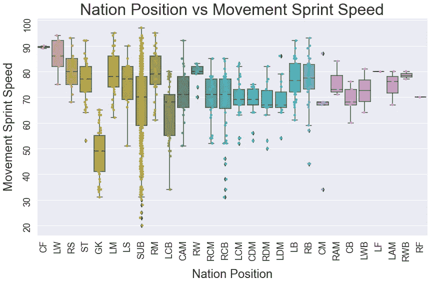

作者图片

接下来，violin plot 和 stripplot 的组合将绘制单词速率与技能曲线。

```
fig, ax = plt.subplots(figsize=(12, 6))
ax=sns.violinplot(x = "work_rate", y = "skill_curve", hue="preferred_foot",
                 data=df, inner=None, color = "0.4")
ax = sns.stripplot(x = "work_rate", y = "skill_curve", alpha = 0.6, data=df)
ax.tick_params(rotation=90, labelsize=12)
plt.xlabel("Work Rate", fontsize = 12)
plt.ylabel("Skill Curve", fontsize = 12)
plt.title("Skill Curve for Work Rate", fontsize=24)
plt.show()
```

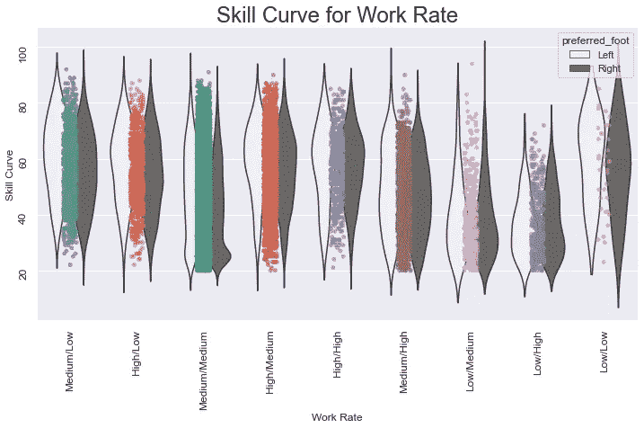

作者图片

在我的下一个情节中，我将探索中值力量耐力。首先，根据中值力量耐力找到前 20 名的国籍，然后创建可视化。

```
d = df.groupby('nationality')['power_stamina'].agg([np.median])
d1 = d[:20].reset_index()
d1 = d1.rename(columns={"median": 'power_stamina'})fig, ax = plt.subplots(figsize=(14, 6))
ax.vlines(x=d1['nationality'], ymin=0, ymax = d1.power_stamina,
        color = 'coral', alpha = 0.7, linewidth = 3)
ax.scatter(x = d1["nationality"], y = d1["power_stamina"],
          s = 70, color = "firebrick")ax.set_ylabel("Median Power Stamina", fontsize = 12)
ax.set_xticklabels(d1.nationality, rotation=90)
ax.set_ylim(0, 80)
ax.set_title("Median Power Stamina in for top 20 nationality", fontsize=18)for row in d1.itertuples():
    ax.text(row.Index, row.power_stamina+1, s = round(row.power_stamina),
           horizontalalignment = 'center', verticalalignment='bottom', fontsize=14)
plt.show()
```

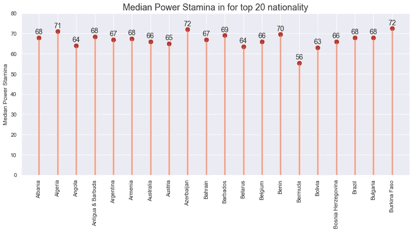

作者图片

这里有相当多的品种。但有趣的事实是，中值力量耐力最高的前 2 个国家不在我们之前看到的前 20 名国籍名单中。

## 结论

正如我之前提到的，可以用如此庞大的数据集创建一本大书。这是一篇博文。所以，我就此打住。我总是喜欢在探索性数据分析中包含一些预测性建模。但是我必须把它留到以后的文章中，因为我不想再写这篇文章了。我试图在这篇文章中包含一些很酷的可视化。希望这是有帮助的。

请随时在 [Twitter](https://twitter.com/rashida048) 、[脸书页面](https://www.facebook.com/Regenerative-149425692134498)上关注我，并查看我的新 [YouTube。频道](https://www.youtube.com/channel/UCzJgOvsJJPCXWytXWuVSeXw)。

## 更多阅读

</developing-a-convolutional-neural-network-model-using-the-unlabeled-image-files-directly-from-the-124180b8f21f>  </convolutional-neural-network-good-understanding-of-the-layers-and-an-image-classification-example-a280bc02c13e>  </zooming-in-and-zooming-out-in-matplotlib-to-better-understand-the-data-b4a5f5b4107d>  </an-ultimate-guide-to-time-series-analysis-in-pandas-d511b8e80e81>  </an-overview-of-data-analysis-with-the-tidyverse-library-in-r-e94c151bf7d1> 