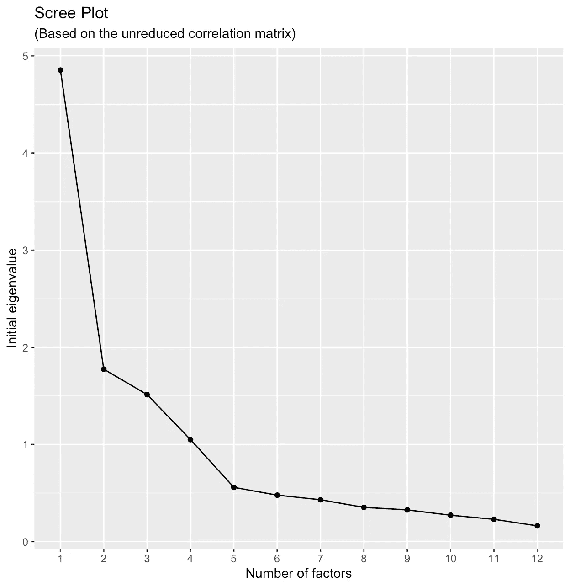

# R 中的探索性因子分析

> 原文：<https://towardsdatascience.com/exploratory-factor-analysis-in-r-e31b0015f224?source=collection_archive---------0----------------------->

## 数据科学家

## 做中学


作者图片

因子分析是一种统计方法，用来从称为因子的观测变量中寻找一些称为因子的未观测变量。

*   这种方法的开端被称为探索性因素分析(EFA)。
*   因子分析的另一种变体是验证性因子分析(CFA ),本文不做探讨。

因素分析被用于统计分析的许多领域，如市场营销、社会科学、心理学等等。

# 加载包(库)

我们需要的库如下:`psych`、`corrplot`、`psynch`等等。

```
**library**(psych)
**library**(corrplot)
**library**("psych")
**library**(ggplot2)
**library**(car)
```

# 数据概述

## 从服务器获取数据

我们首先需要从服务器获取样本数据。这是一个原始数据集，所以每行代表一个人的调查。

```
# Dataset
url <- “[https://raw.githubusercontent.com/housecricket/data/main/efa/sample1.csv](https://raw.githubusercontent.com/housecricket/data/main/efa/sample1.csv)"
data_survey <- **read.csv**(url, sep = “,”)
```

## **描述数据**

在进行任何分析之前，我们还会查看数据集。

```
**describe**(data_survey)
```


我们使用`dim`函数来检索数据集的维度。

```
**dim**(data_survey)
```


## 清理数据

在我们的数据框中，第一列中有一个 ID 变量。因此，我们可以在列索引中使用一个`-1`来删除第一列，并将我们的数据保存到一个新对象中。

```
dat <- **data_survey**[ , -1] 
**head**(dat)
```


## 相关矩阵

我们还应该看看我们的变量之间的相关性，以确定因素分析是否合适。

```
datamatrix <- **cor**(dat[,c(-13)])
**corrplot**(datamatrix, method="number")
```


# **数据的可分解性**

```
X <- data[,-c(13)]
Y <- data[,13]
```

## **KMO**

凯泽-迈耶-奥尔金(KMO)用来衡量抽样充分性是一个更好的衡量因素。

```
**KMO**(r=cor(X))
```


根据 Kaiser(1974 年)的指南，确定样本数据可分解性的建议临界值是`KMO ≥ 60`。总 KMO 为`0.83`，表明基于该测试，我们可以进行因子分析。

## 巴特利特球形试验

```
**cortest.bartlett**(X)
```


小数值(8.84e-290 < 0.05) of the significance level indicate that a factor analysis may be useful with our data.

```
**det**(**cor**(X)
```


We have a positive determinant, which means the factor analysis will probably run.

# The Number of Factors to Extract

## **刮板导向器**

```
**library**(ggplot2)fafitfree <- **fa**(dat,nfactors = **ncol**(X), rotate = "none")
n_factors <- **length**(fafitfree$e.values)
scree     <- **data.frame**(
  Factor_n =  **as.factor**(1:n_factors), 
  Eigenvalue = fafitfree$e.values)
**ggplot**(scree, **aes**(x = Factor_n, y = Eigenvalue, group = 1)) + 
  geom_point() + geom_line() +
  **xlab**("Number of factors") +
  **ylab**("Initial eigenvalue") +
  **labs**( title = "Scree Plot", 
        subtitle = "(Based on the unreduced correlation matrix)")
```



## **平行分析**

我们可以使用 nFactors 包(Raiche & Magis， [2020](http://www2.hawaii.edu/~georgeha/Handouts/meas/Exercises/_book/efa.html#ref-R-nFactors) )中的`parallel()`函数来执行并行分析。

```
parallel <- fa.parallel(X)
```


```
## Parallel analysis suggests that the number of factors =  4 and the number of components =  3
```

# **进行因素分析**

## 用 fa 法进行因子分析

```
fa.none <- fa(r=X, 
 nfactors = 4, 
 # covar = FALSE, SMC = TRUE,
 fm=”pa”, # type of factor analysis we want to use (“pa” is principal axis factoring)
 max.iter=100, # (50 is the default, but we have changed it to 100
 rotate=”varimax”) # none rotation
print(fa.none)
```


## 用因子分析法进行因子分析

```
factanal.none <- factanal(X, factors=4, scores = c("regression"), rotation = "varimax")
print(factanal.none)
```


## 图形因子加载矩阵

```
fa.diagram(fa.none)
```


# 回归分析

## 所有行的分数

```
head(fa.var$scores)
```


## 标记数据

```
regdata <- cbind(dat[“QD”], fa.var$scores)#Labeling the data
names(regdata) <- c(“QD”, “F1”, “F2”,
 “F3”, “F4”)
head(regdata)
```


## 将数据拆分为训练集和测试集

```
#Splitting the data 70:30
#Random number generator, set seed.
set.seed(100)
indices= sample(1:nrow(regdata), 0.7*nrow(regdata))
train=regdata[indices,]
test = regdata[-indices,]
```

## 使用训练数据的回归模型

```
model.fa.score = lm(Satisfaction~., train)
summary(model.fa.score)
```


我们的模型方程可以写成:`Y = 3.55309 + 0.72628 x F1 + 0.29138 x F2 + 0.06935 x F3 + 0.62753 x F4`

## 检查 vif

```
vif(model.fa.score)
```


## 检查测试数据集中模型的预测

```
#Model Performance metrics:
pred_test <- predict(model.fa.score, newdata = test, type = “response”)
pred_test
test$QD_Predicted <- pred_test
head(test[c(“QD”,”QD_Predicted”)], 10)
```


今天，我们回顾了因子分析的初步步骤，包括检查数据和因子分析所需的假设，以及如何确定要保留的因子数量。

很简单，对吧？