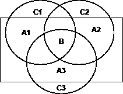
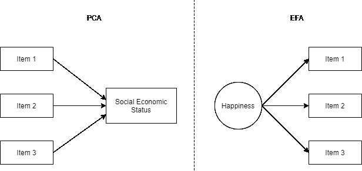
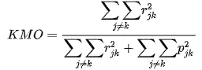
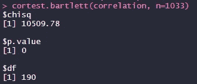
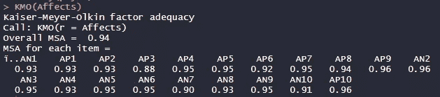
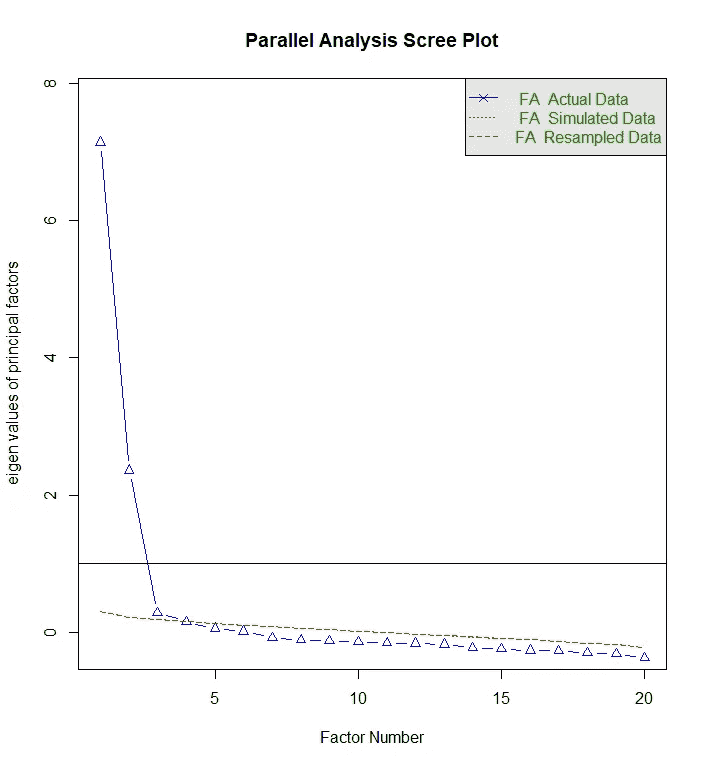
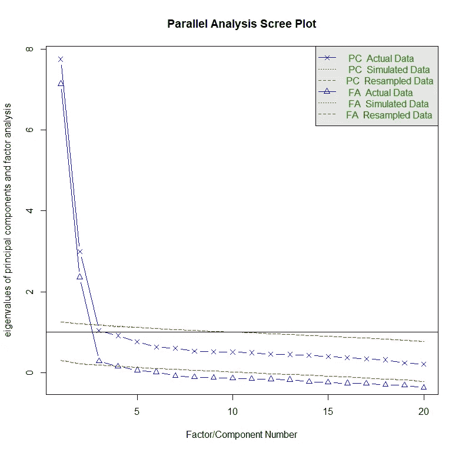
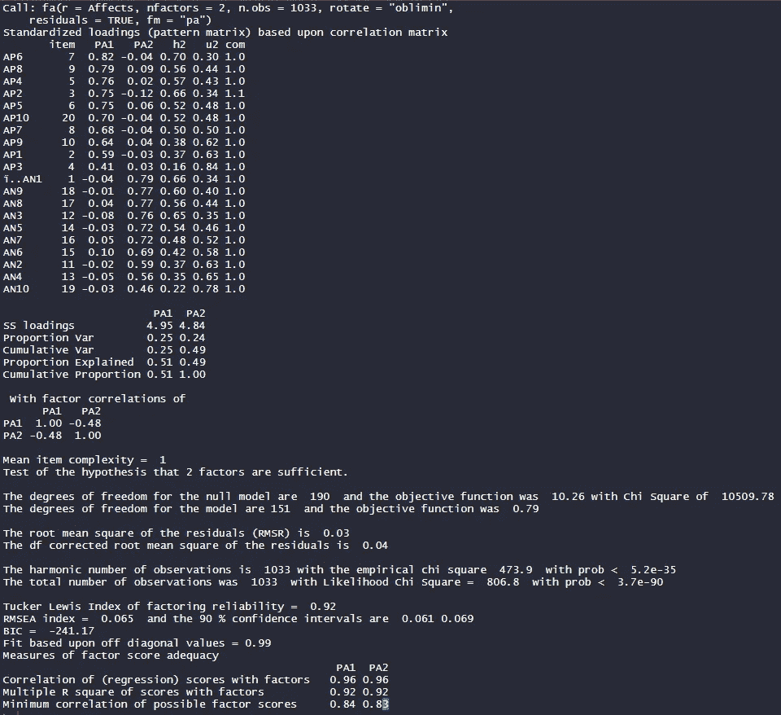
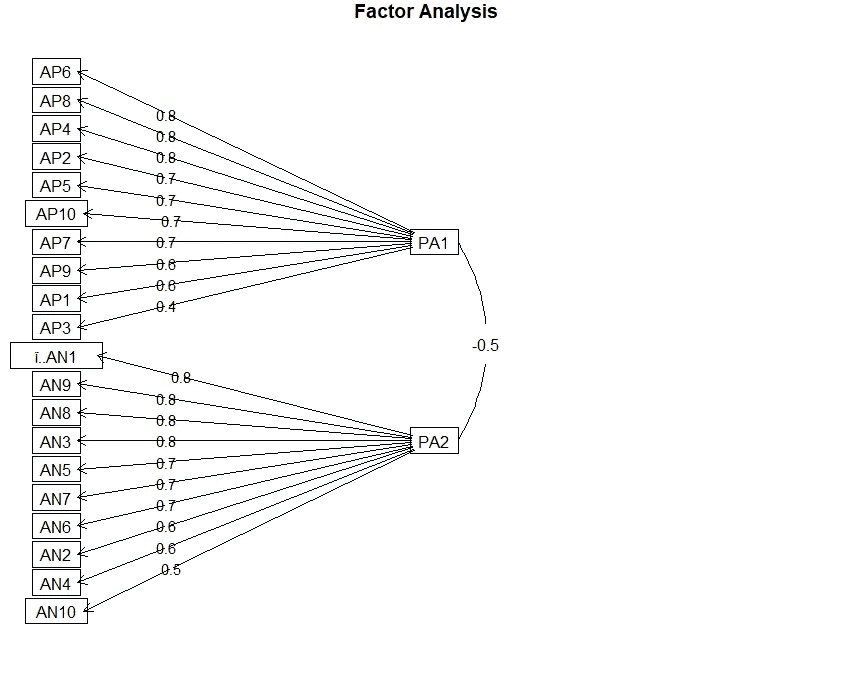
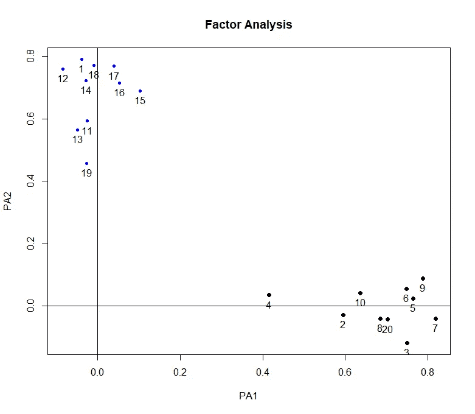

# 探索性因子分析与主成分分析:从概念到应用

> 原文：<https://towardsdatascience.com/exploratory-factor-analysis-vs-principal-components-from-concept-to-application-b67bbbdb82c4?source=collection_archive---------6----------------------->

## 如何用探索性因子分析减少参数


艾萨克·史密斯在 [Unsplash](https://unsplash.com?utm_source=medium&utm_medium=referral) 上拍摄的照片

在数据科学中，我们经常想要测量社会经济地位(SES)等变量。有些变量有很多参数(或项目)，例如，SES 可以基于收入、教育等进行测量。然后，为了进行分析，通常通过主成分分析(PCA)将参数的数量减少到更少的成分。然而，我们将看到为什么一些变量不能通过主成分分析减少，我们将学习如何使用探索性因素分析对我们有利。

# 全民教育和 PCA 的区别

## 模型差异

这两种方法都用于将参数数量减少到更少的变量。此外，这两种方法都假设参数的方差分为特定方差、公共方差和误差方差。

在主成分分析中，当我们保留一个成分时，我们同时考虑特定方差和公共方差。而在全民教育中，我们只考虑普通方差。看到下图，我们可以认为 A 是特定方差，B 是普通方差，C 是误差方差。在 PCA 中我们用 A 的+ B，而在 EFA 中我们只用 B。



三个项目的方差及其与一个假设因素的关系的例子。图片作者。

主成分分析基于形成模型，其中成分的变化基于项目反应的变化(即收入水平将影响社会经济地位)。而全民教育是基于反思模型，其中项目的变化是基于一个结构的变化(即一个人的幸福会改变他们对项目的反应，而不是相反)。我们可以从下图中看到这种表示。



PCA 和 EFA 的区别。图片作者。

也就是说，全民教育的常见应用是测量心理变量。例如，如果你想衡量一个人的幸福水平，我们将只使用共同方差，因为该工具的项目试图衡量他们的共同点(即幸福水平)。

PCA 主要有三个主要步骤。

1.  计算协方差矩阵
2.  计算特征值和特征向量
3.  组件的旋转

在全民教育中，我们有:

1.  数据充分性的验证
2.  协方差/相关矩阵的计算(因子提取)
3.  选择要保留的因素
4.  因素轮换

因为这里有很多关于 PCA 的关于数据科学的帖子，所以从现在开始我将把重点放在 EFA 上。在下一节中，我将描述 EFA 的每个步骤。

# 探索性因素分析步骤

## 数据充分性

我们通常使用两个测试来衡量我们的数据是否足以进行全民教育。

*巴特利特球形度试验*

该检验验证了变量在总体中不相关的假设。因此，零假设是相关矩阵等于单位矩阵。如果相关矩阵等于单位矩阵，我们就不能进行全民教育，因为变量之间没有相关性。该测试背后的统计分析如下:

χ=-[(*n*-1)-(2*v*+5)/6]ln | R |

其中
*n* 是样本大小
*v* 是变量个数
|R|是相关矩阵的行列式

在文献中，我们可以看到，如果显著性水平等于*p*0.05，这意味着我们可以进行全民教育。

*凯泽-迈耶-奥尔金(KMO)*

验证可能由因素引起的项目差异的比例。该测试验证逆相关矩阵是否接近对角矩阵，比较线性相关的值和部分相关的值。



其中:

*r*JK = Xj 和 Xk 的相关系数

jk =和 Xk 之间的相关系数，控制其他 x。

低于 0.5 的值被认为是不可接受的，介于 0.50 和 0.70 之间的值是一般的，介于 0.70 和 0.80 之间的值是好的，高于 0.80 的值被认为是伟大的，高于 0.90 的值是优秀的。

## 因子提取

在全民教育中，我们有许多提取方法可供选择。如果数据呈正态分布，建议使用最大似然法，因为它可以实现各种拟合优度指数、因子负荷的显著性检验、置信区间的计算等。但是，如果数据不符合正态分布，建议使用主轴分解。

## 保留因素

有很多方法可以用来选择项目的数量，我将主要关注其中的三种。

**a)凯泽准则**:它提出如果一个因子的特征值大于 1.0，我们应该保留那个因子。背后的逻辑是:如果一个因子的特征值= 3.0，那就意味着这个因子解释了 3 个项目相同的方差。

注意，这个标准被认为高估或低估了因素的数量。我不建议单独使用它。

**b) Scree 图**:我们评估特征值的幅度何时大幅下降。这种方法也有一些局限性，因为它会产生不明确的结果，并且容易受到主观解释的影响。

**c)平行分析**:计算样本特征值和随机数据特征值。当真实数据的特征值的数量大于来自模拟数据的特征值的数量时，选择因子的数量。这种方法通常效果很好。

# 使用 R 的全民教育

现在我们将看到一个在 r 中计算 EFA 的教程。我们将使用包[*psych*](https://cran.r-project.org/web/packages/psych/psych.pdf)*来进行计算。此外，我们将使用[积极和消极影响量表](https://www.scielo.br/scielo.php?pid=S1413-82712013000200003&script=sci_arttext)，它由关于消极和积极情绪的项目组成。*

## *读取数据*

*我们将使用 R 函数 *read.delim* 读取数据集*

```
*Affects <- read.delim(“[https://raw.githubusercontent.com/rafavsbastos/data/main/Afetos.dat](https://raw.githubusercontent.com/rafavsbastos/data/main/Afetos.dat)")*
```

*我们为数据框选择的名称是 *ffets* 。使用`View(Affects)`我们将看到我们的数据集:*

**

## *装载*心理包**

*要开始操作数据，我们需要下载 *psych* 包。只需运行以下代码。*

```
*install.packages(“psych”)*
```

*好的。现在包在你的电脑上。现在，我们需要让它开始与`library(psych)`一起工作。*

## *数据充分性*

*为了看看用我们的数据做 EFA 是否可以，我们将首先计算 Bartlett 的球度检验。*

*首先，我们计算相关矩阵:*

```
*correlation <- cor(Affects)*
```

*然后，我们用`cortest.bartlett(correlation, n=1033)`来计算 Bartlett 的检验，其中第二个参数是样本量。我们将得到以下输出:*

**

*显著性水平小于 0.05，这意味着我们可以继续进行全民教育(如果我们假设低于 0.05 的值表明我们的数据充分)。*

*现在我们来计算 KMO。使用以下代码`KMO(Affects)`。*

**

*我们可以看到样本充分性的总体衡量标准(MSA)是 0.94，这意味着它是优秀的。我们还可以在总体 MSA 下面看到每个项目的 MSA。基于这些结果，我们可以继续进行全民教育。*

# *探索性因素分析*

## *提取和保留因子*

*仅使用一行代码，我们就能够提取因子的数量，并选择要保留的因子。*

```
*fa.parallel(Affects,fm=”pa”, fa=”fa”,  main = “Parallel Analysis Scree Plot”, n.iter=500)*
```

*其中:*

1.  *第一个论点是我们的数据框架*
2.  *`fm`是提取方法；我们使用主轴分解法(“pa”)*
3.  *`fa = “fa”`；如果我们写“fa ”,我们就是在做 EFA。如果我们写“pc ”,我们将做一个 PCA。因为我们使用的是反思模型，所以我们要做一个 EFA。*
4.  *`main` =我们形象的标题。*
5.  *`n.iter` =我们希望进行的互动次数。*

*我们将得到以下输出:*

**

*它告诉我们，我们需要保留基于平行分析的 3 个因素。同一行代码的另一个输出如下图所示:*

**

*我们可以看到我们的数据特征值(蓝色)和模拟的数据特征值(红色)。查看红色和蓝色特征值之间的交叉点，注意一些随机数据的第四个特征值比我们数据的第四个特征值解释了更多的方差。然而，如果我们考虑凯泽标准(图中的黑线)，我们将只提取两个因素。因为我们希望保留尽可能少的因素，所以我们将只对两个因素进行分析。*

*在我们跳到下一节之前，我想给大家展示一下提取特征值时 PCA 和 EFA 的区别。*

```
*fa.parallel(Affects, fm = "pa", cor = "cor", fa= "both", main = "Parallel Analysis Scree Plot", n.iter=500)*
```

**

*上图中，PC 代表主成分，FA 代表因子分析。如果我们在 PCA 中使用 Kaiser 标准，我们将保留 3 个因子，而如果我们使用平行分析标准，我们将保留 2 个因子。我们还可以注意到，PCA 的特征值比 EFA 的特征值高，这是因为我之前说过，PCA 考虑了共同的和特定的方差，而 EFA 只考虑共同的方差。*

## *项目信息*

*我们可以看到哪些项目解释了更多的因素，基于因素负荷，共性。此外，通过以下代码，我们可以看到双因素模型的解释方差和拟合优度指数:*

```
*fit <- fa(Affects, nfactors = 2, n.obs = 1033 , rotate = “oblimin”, residuals = TRUE, fm = “pa”)print(fit, sort = TRUE)*
```

*会打印出:*

**

*在第一个表中，我们可以看到积极影响项目(AP)对第一个因素(PA1)的影响很大，而消极影响项目(an)对第二个因素(PA2)的影响很大。共性用 h2 表示。*

*在第一张表下面，我们有每个因素的解释方差的比例。积极影响因素(PA1)解释了 25%的数据方差，而消极影响因素(PA2)解释了 24%。*

*还计算了拟合指数的优度。虽然它们在验证性因素分析中被广泛使用，但它们在全民教育中的应用却有点神秘。很少有研究评估全民教育中拟合优度指数的使用，因此可能很难解释这部分数据。*

*为了获得因子加载的可视化表示，我们将使用函数`fa.diagram(fit)`。*

**

*我们还可以看到带有`plot(fit)`的轴中的要素的几何可视化。*

**

*在上图中，我们希望积极影响项目靠得更近，而远离消极影响项目。*

*鉴于目前为止的所有步骤，我们可以看到我们的措施提出了两个因素的结构，这是相同的，由先前的作者理论。此外，我们发现项目加载到它们的给定因子中，这些因子解释了方差的很大一部分。*

*我必须强调的是，虽然我们有统计方法来选择要保留的因子的数量，但是只有研究者才能选择哪种方法是最好的。这意味着选择保留因素的最佳方法的标准是开放的主观解释。此外，我提出了一个统计工具来分析心理数据，其中反射模型更合适。*

# *接触*

*请随时通过以下方式联系我*

> **Gmail:rafavsbastos@gmail.com
> 咨询与合作网站:*[*rafavsbastos.wixsite.com/website*](https://rafavsbastos.wixsite.com/website) *LinkedIn:*[*linkedin.com/in/rafael-valdece-sousa-bastos/*](https://www.linkedin.com/in/rafael-valdece-sousa-bastos/) *Github:*[github.com/rafavsbastos](https://github.com/rafavsbastos)*