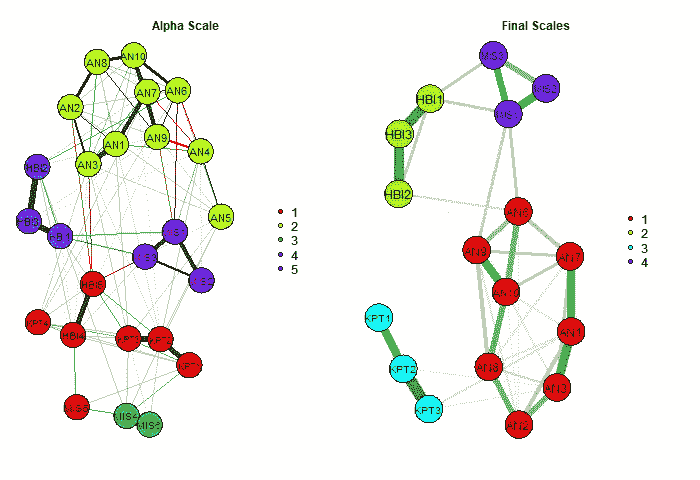
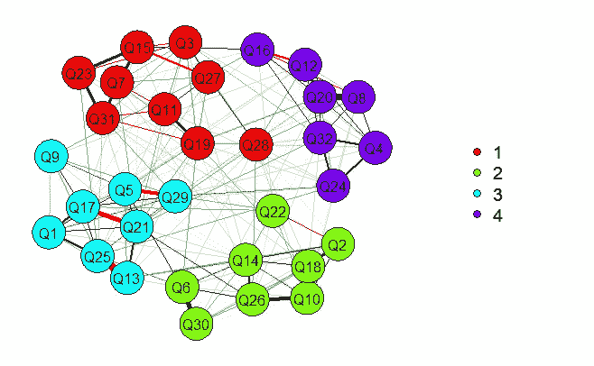
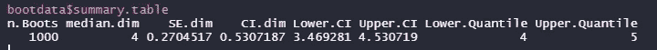
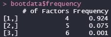
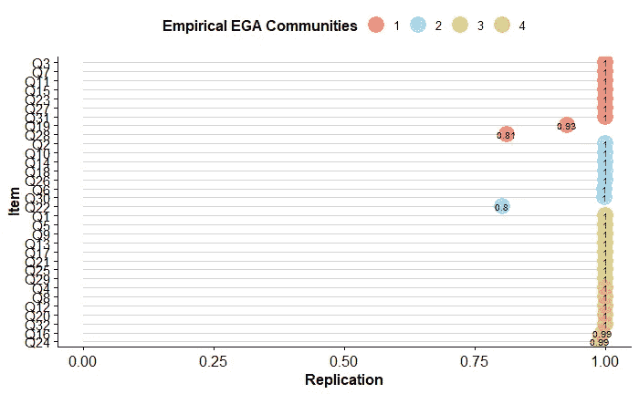

# 用探索性图形分析估计维数

> 原文：<https://towardsdatascience.com/exploratory-graph-analysis-3d4f9c63e92f?source=collection_archive---------19----------------------->

## 来自网络心理测量文献的强大技术的总结和指南



探索性图形分析。作者图片

在心理学、教育学和行为科学中，我们使用量表/仪器来测量给定的结构(例如，焦虑；幸福)。为此，我们通常会有一份包含 *X* 个项目的调查问卷，并希望了解这些项目中潜在因素的数量。这通常通过[探索性因子分析](/exploratory-factor-analysis-vs-principal-components-from-concept-to-application-b67bbbdb82c4) (EFA)来完成，其中维度的数量通常通过检查特征值的模式来估计(参见我的特征值指南[这里](https://rafavsbastos.medium.com/eigenvalues-and-eigenvectors-5cdad2bdffaa))。使用特征值的两种最常见的方法是 Kaiser-Guttman 特征值大于一规则和并行分析。然而，对于这些方法在估计维数方面的性能，已经提出了许多批评。

由于这些限制，Golino & Epskamp (2017)提出了一种新的估计量表维度的方法，称为探索性图形分析(EGA)。本文将简要总结 EGA 的最新发展，旨在传播这一方法。

## 探索性图形分析

网络心理测量方法最近在心理科学文献中得到了关注。这可能是由于对数据中观察到的相关性的理论解释发生了变化。传统上，如 EFA 所做的，心理测量模型假设潜在原因解释观察到的行为(即项目)。网络心理测量学等新兴领域为心理学研究提供了有前途的模型，因为它支持复杂性的理论观点，即它将心理属性视为动态和相互强化的观察行为系统。

传统心理测量中的一个典型潜变量与网络聚类中的一个典型潜变量之间存在联系。正如 Golino & Epskamp (2017)所说:

> 可以直接看出，如果潜在变量模型是真正的潜在因果模型，我们将期望网络模型中的指标以每个潜在变量的强连接聚类为特征。由于边对应于在对网络中的所有其他变量进行调节之后两个变量之间的部分相关系数，并且在对观察到的变量进行调节之后两个指标不能变得独立，因为它们都是由潜在变量引起的，所以两个指标之间的边强度不应该为零。

EGA 是一种不依赖于先验假设的探索性方法，因此，它们不需要研究者的任何指导。在 EGA 中，节点表示变量(即项目)，边表示两个节点之间的关系(即相关性)。

在作者的第一篇论文中，EGA 是这样完成的:

1.  估计可观测变量的相关矩阵。
2.  *图形最小绝对收缩和选择算子* ( *格拉索)*估计用于获得稀疏逆协方差矩阵，正则化参数通过 EBIC 定义在 100 个不同的值上。
3.  *walktrap* 算法用于找出上一步中计算的部分相关矩阵的聚类数。
4.  识别的聚类数量等于给定数据集中潜在因素的数量。

今天，可以估计一维性和多维性；我们可以用三角最大过滤图(TMFG)来代替*glasso*；并使用 *walktrap* 以外的算法(即 louvain)。

Golino 等人(2020)表明，EGA 方法的表现与最佳因子分析技术一样好。因为 EGA(TMFG)在一维结构和多维结构中都表现出了较好的精度，而 EGA 是总体上精度较高的方法之一。

## 估计稳定性项目和因素稳定性

估算 EGA 时，有一点需要考虑。首先，在一项研究中确定的维度数量可能会因其他样本和样本大小不同的研究而异。此外，一些项目可能在一项研究中聚集在维度 *A* 中，而在另一项研究中聚集在维度 *B* 中。正因为如此，克里斯腾森&戈利诺(2019)创造了自举 EGA。

# r 教程

## 安装 EGAnet

为了进行分析，我们将使用 R 包*EGAnet*([CRAN](https://cran.r-project.org/web/packages/EGAnet/index.html)； [GitHub](https://github.com/hfgolino/EGAnet) )，由 Golino 和 Christensen 制作。

首先，我们必须安装软件包(我们将使用 GitHub 版本，因为它是最新的)。

```
library(devtools)
devtools::install_github('hfgolino/EGAnet')
```

这将在您的设备上安装软件包。然后，我们将使用`library(EGAnet)`加载这个包。

## 读取数据

我们将使用来自[开源心理测量项目](https://openpsychometrics.org/_rawdata/)的幽默风格问卷数据。我把它添加到了我的 GitHub 中，这样你就可以轻松下载了。

```
data <- read.delim("[https://raw.githubusercontent.com/rafavsbastos/data/main/HSQ.txt](https://raw.githubusercontent.com/rafavsbastos/data/main/HSQ.txt)"
```

## 增强型图形适配器

我们将使用以下代码运行 EGA:

```
ega.HSQ <- EGA(
               data,
               uni.method = "LE",
               corr = "cor_auto",
               model = "glasso",
               algorithm = "walktrap",
               plot.EGA = TRUE,
               plot.type = "qgraph"
               )
```

其中第一个参数是数据集(即我们的项目)；第二个代表应该使用什么样的一维方法；第三个是要计算的相关矩阵的类型；第四个指示要使用的方法；第五是我们用的算法；第六如果我们想策划 EGA；第七，我们希望什么样的情节。

我们有以下输出:



我们可以看到一个清晰的四维“提取”,正如所料。

## 维度和项目稳定性

为了计算维度稳定性，我们将运行以下代码:

```
bootdata <- bootEGA(
                    data,
                    iter= 1000, 
                    type = "resampling",
                    )
```

其中的参数是:

1.  数据集。
2.  一个整数，包含要从引导分析中生成的复本样本数。
3.  参数或非参数方法。

注意，因为我们使用了一些默认参数，所以我们没有在这里指定它。在进行自己的分析之前，请查看软件包的文档！

现在我们将看到一些有用的信息输入:

`bootdata$summary.table`

其中输出为:



我们可以看到维数的中位数(median.dim)，标准差(SE.dim)，维数的置信区间(CI.dim)，下 CI (Lower。Ci)和上 CI(上。CI)，以及维数的较低分位数(较低。分位数)和上限(上限。分位数)。基于该输出，很明显，具有 4 个维度的模型是精确的(SE = 0.27)，并且 4 个维度最有可能是量表的结构(给定 CI 3.47，4.53)。

现在输入`bootdata$frequency`。它为您提供了以下输出:



我们可以看到，4 个因素被复制了 924 次，而 5 个因素只被复制了 75 次，6 个因素被复制了一次。

现为物品稳定型:`ic.HSQ <- itemStability(bootdata)`。输出是一幅图像:



我们可以看到，项目在其给定的维度中有 80%到 100%的时间是重复的。

# 结束语

正如到目前为止所做的一些分析和最近的论文所示，EGA 可以向我们展示一种评估测量心理属性的工具的维度的准确方法。此外，作者在 *EGAnet* 中实现了一系列函数，为我们提供了关于维度和项目的有用信息。软件包仍在更新，结果加载更快，而且(可能)新功能正在制作中。

# 接触

请随时通过以下方式联系我:

> [LinkedIn](https://www.linkedin.com/in/rafael-valdece-sousa-bastos/)
> 电子邮箱:rafavsbastos@gmail.com
> [咨询与合作网站](http://rafavsbastos.wixsite.com/website)

# 参考

H.F. Golino，S. Epskamp，探索性图形分析:心理学研究中维度数估计的新方法，2017 年， *PloS one* ， *12* (6)，e0174035。

H.F. Golino，D. Shi，A. P. Christensen，L. E .，M. D. Nieto，R. Sadana，…和 A. Martinez-Molina，调查探索性图形分析和传统技术的性能，以确定潜在因素的数量:模拟和指导，2020 年，*心理学方法*。

A.P. Christensen 和 H. F. Golino，通过 Bootstrap 探索性图分析估计因素数量的稳定性:教程，2019 年。