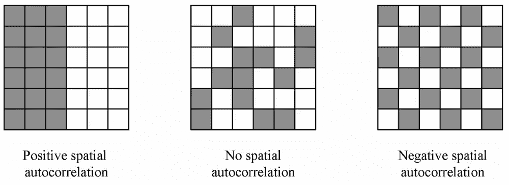
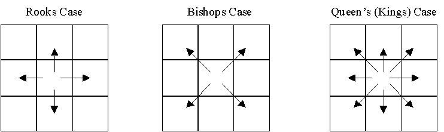
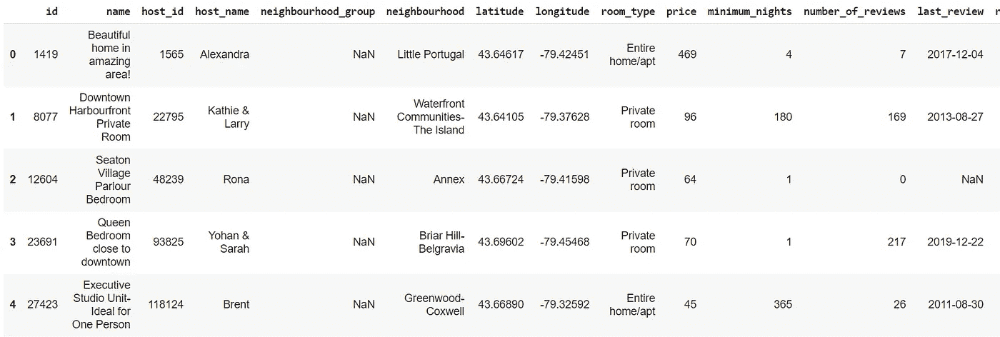
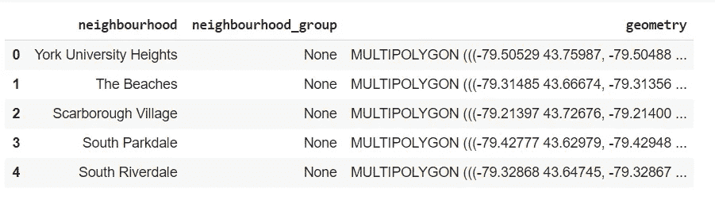
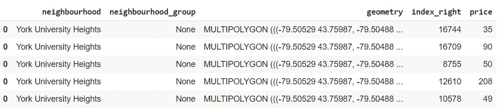
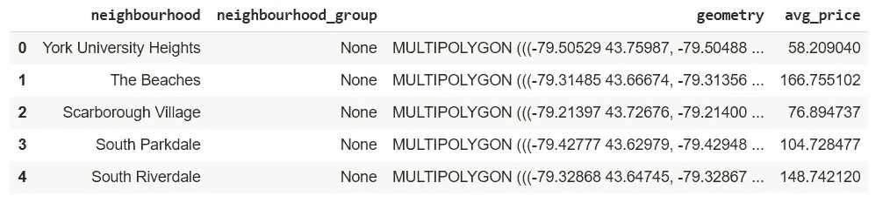
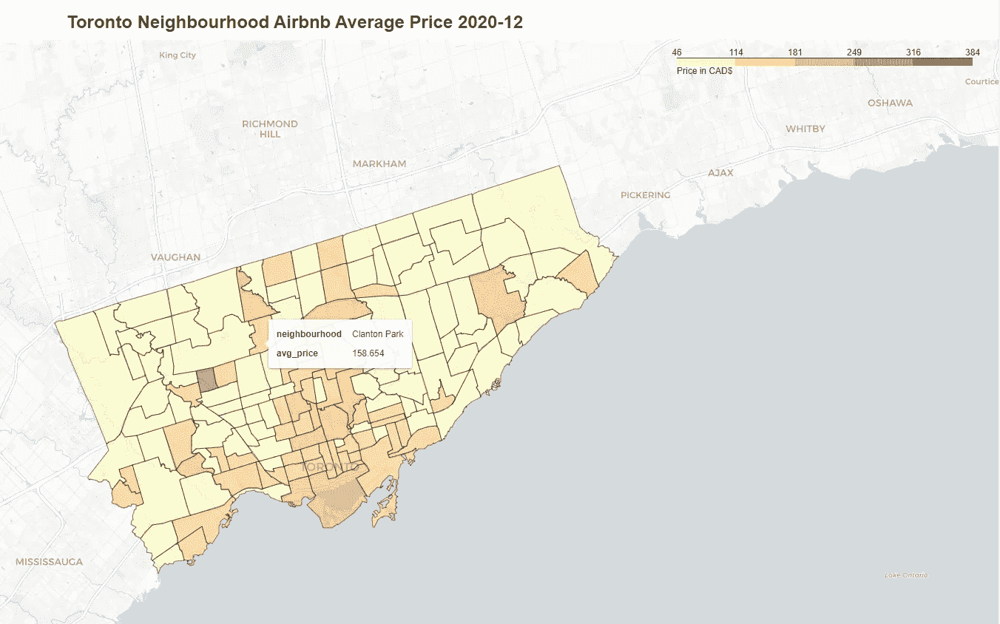
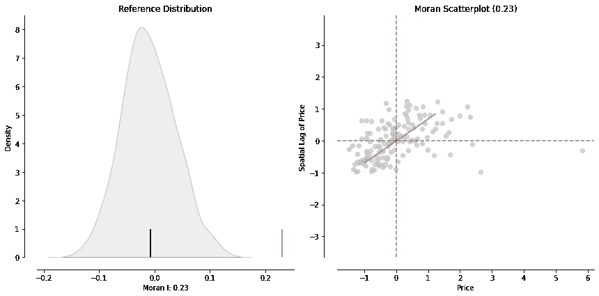
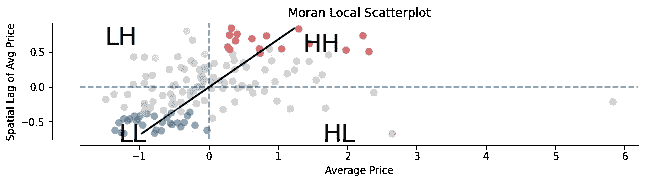
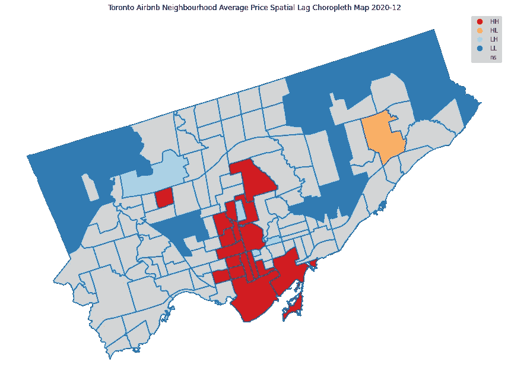

# 探索性空间数据分析(ESDA)-空间自相关

> 原文：<https://towardsdatascience.com/exploratory-spatial-data-analysis-esda-spatial-autocorrelation-7592edcbef9a?source=collection_archive---------36----------------------->

## 探索多伦多附近的 Airbnb 列表价格，并确定热/冷地区

在探索性数据分析(EDA)中，我们经常计算相关系数，并在热图中显示结果。相关系数衡量两个变量之间的统计关系。相关值表示一个参数的变化如何影响另一个参数，例如购买数量与价格。在建立模型之前，相关性分析是预测分析领域中一个非常重要的概念。

但是，我们如何衡量地理位置与空间数据集中的统计关系呢？传统的 EDA 和相关性分析忽略了位置特征，并将地理坐标视为类似于其他规则特征。探索性空间数据分析(ESDA)在基于位置的数据分析中变得非常有用。

# 空间自相关

ESDA 旨在通过空间聚类的正式统计测试来补充地理化，而空间自相关是这些测试的重要目标之一。空间自相关测量变量在空间上的相关性，即与图表上相邻变量的关系。值可以是

*   阳性:附近的病例相似或*聚集*，例如高-高或低-低(下图左图)
*   中性:相邻病例没有特定关系或*随机*，没有模式(下图中心图像)
*   否定:邻近案例不相似或*分散*，例如高-低或低-高(下图右图)



*空间自相关的图解。摘自(Radil，2011 年)。*

两种最常用的空间自相关测量方法是空间相似性和属性相似性。

空间相似性是通过量化(空间权重)位置对之间关系的相对强度来表示数据集的空间结构。邻居关系被定义为车的情况，主教的情况或女王(国王)的情况-见下图。顾名思义，这些非常简单和直观。您可以阅读[基于邻接的空间权重](https://geodacenter.github.io/workbook/4a_contig_weights/lab4a.html)以获得空间权重的更深入的解释。



邻近的定义[http://www.lpc.uottawa.ca/publications/moransi/moran.htm](http://www.lpc.uottawa.ca/publications/moransi/moran.htm)

另一方面，通过空间滞后测量的属性相似性是通过比较属性值和它的邻居为每个属性获得的。空间滞后将对行进行归一化，并在每个加权邻域中取平均值。

# 加载数据集

我们使用 2020/12 年多伦多 Airbnb 房源作为我们的主要数据集。我们还获取了 [Toronto neighborhoods 多边形数据集](https://open.toronto.ca/dataset/neighbourhoods/)，这样我们就可以将我们的空间列表数据点映射到不同的区域。我们的目标是调查 Airbnb 平均列表价格在相邻区域(即热区域、冷区域或随机区域)之间是否存在任何空间相关性。

以下 Python 库用于操作地理数据:

*   [GeoPandas](https://geopandas.org/) 用于存储和操作地理数据
*   [PySAL](https://pysal.org/) 用于空间计算和分析
*   [叶子](https://python-visualization.github.io/folium/)用于创建交互式地理可视化。

Airbnb 房源示例



Airbnb 房源原始数据

Airbnb 数据需要转换为 GeoDataFrame。我们需要用数据集定义 CRS(坐标参考系统)。我们使用`EPSG:4326`，它定义了标准(WGS84)参考椭球上的经纬度坐标。

```
data_gdf = gpd.GeoDataFrame(data_orig, geometry=gpd.points_from_xy(data_orig.longitude, data_orig.latitude), crs='EPSG:4326')
```

多伦多总共有 140 个社区。`geometry` 列中的坐标定义了邻域的多多边形边界。以下是一些例子:



多伦多街区

接下来，我们想找出每个街区的平均房价。给定列表的纬度/经度坐标和邻域的多边形边界，我们可以使用 GeoPanda 中提供的`sjoin` 函数轻松连接两个数据集。

```
temp = data_gdf[['price','geometry']] 
listing_prices = gpd.sjoin(nbr_gdf, temp, op='contains') 
listing_prices.head(5)
```



Airbnb 列出附近的价格

这里我们在`sjoin`中使用 `op='contains'`，这意味着我们希望左边数据框(即邻域数据)中的记录在空间上包含右边数据框(即列表数据)中的*地理记录。在结果数据集中，列`index_right` 是来自列表记录的索引，而`price` 是相应的列表价格。*

我们取每个街区的平均标价，这是一个集合数据集:

```
nbr_avg_price = listing_prices['price'].groupby([listing_prices['neighbourhood']]).mean() 
nbr_final = nbr_gdf.merge(nbr_avg_price, on='neighbourhood') 
nbr_final.rename(columns={'price': 'avg_price'}, inplace=True) nbr_final.head()
```



我们使用 leav 创建了一个交互式 Choropleth 地图。当鼠标悬停在附近时，您可以看到平均列表价格。点击[此处探索](https://ai-journey.com/wp-content/uploads/2021/01/toronto_airbnb_listings.html)互动地图。



到目前为止一切顺利。虽然我们可以直观地看到哪些街区有价格更高或更低的房源，但考虑到不同大小和形状的不规则多边形，并不十分明显地看出是否有任何空间模式以及模式是什么。空间自相关是回答这个问题的好方法。

# 空间权重

如上所述，为了研究空间自相关，我们需要计算空间权重。我们使用 PySal 库进行计算。在这里，我们使用皇后邻接作为空间权重。

```
w = lps.weights.Queen.from_dataframe(nbr_final) 
w.transform = 'r'
```

# 全球空间自相关

全局空间自相关决定了数据集中的总体聚类。如果标价的空间分布是随机的，那么我们在地图上不会看到任何相似值的聚集。用于评估全球空间自相关的统计数据之一是 Moran 的 I 统计数据。

```
y = nbr_final.avg_price 
moran = esda.Moran(y, w) 
moran.I, moran.p_sim (0.23066396579508366, 0.001)
```

莫兰的 I 值范围从-1 到 1，1 表示很强的空间自相关。在我们的示例中，我们的**莫兰 I 值为 0.23** ，而 **p 值为 0.001** ，这被认为在统计上具有高度显著性。因此，我们将拒绝全球空间随机性的零假设，而支持列表价格的空间自相关。我们也可以在莫兰的 I 图上看到这一点。

```
plot_moran(moran, zstandard=True, figsize=(12,6)) 
plt.tight_layout() 
plt.show()
```



莫兰散点图

# 局部空间自相关

全局空间自相关分析非常有助于判断标价与其邻域之间是否存在正的空间自相关。但是它没有显示集群在哪里。空间关联的局部指标(LISA)旨在检测空间聚类并将它们分为 4 类:

*   HH —高值旁边的高值
*   LL —低旁边的低值
*   左侧—高值旁边的低值
*   HL —低值旁边的高值

我们计算莫兰局部分数。

```
m_local = Moran_Local(y, w)
```

用莫兰散点图画出来。

```
P_VALUE = 0.05 
fig, ax = plt.subplots(figsize=(10,10)) 
moran_scatterplot(m_local, p=P_VALUE, ax=ax) 
ax.set_xlabel('Average Price') 
ax.set_ylabel('Spatial Lag of Avg Price') 
plt.text(1.35, 0.5, 'HH', fontsize=25)
plt.text(1.65, -0.8, 'HL', fontsize=25) 
plt.text(-1.5, 0.6, 'LH', fontsize=25) 
plt.text(-1.3, -0.8, 'LL', fontsize=25) 
plt.show()
```



莫兰局部散点图

现在让我们使用`lisa_cluster` 函数在地图中绘制 LISA 结果。

```
fig, ax = plt.subplots(figsize=(12,10)) 
lisa_cluster(m_local, nbr_final, p=P_VALUE, ax=ax) nbr_final.boundary.plot(ax=ax) 
plt.title('Toronto Airbnb Neighbourhood Average Price Spatial Lag Choropleth Map 2020-12') 
plt.tight_layout() 
plt.show()
```



Airbnb 多伦多街区平均价格空间滞后 Choropleth 地图

红色的邻域是附近邻域(HH)中价格较高的区域。蓝色表示被低价包围的低价区域(LL)。有趣的是，我们注意到黄色和浅蓝色显示了与邻近地区(HL 和 LH)价格差异较大的区域。您可以使用上面的交互式社区价格图来验证 LISA 分类。

经过进一步调查，似乎在这个乡村社区(被灰色包围的红色街区)有一个标价为 2000 美元的房源，远高于该地区 60 美元的平均价格。这可能是数据问题或不同类型的属性。

# 结束语

使用空间自相关分析，我们分析了多伦多 Airbnb 价格相对于其邻近地区的全局和局部空间自相关。LISA 分析对于识别具有统计显著性的高值聚类和检测异常值非常有用。它可以帮助许多基于地理的数据分析，包括社会，经济，流行病学研究。

所有代码都可以在 [Google Colab](https://colab.research.google.com/drive/1W-_PkSKurm_RWCnsyW3PxwljdfcHdBUx?usp=sharing) 上找到。

机器学习快乐！

*原载于 2021 年 1 月 4 日*<https://ai-journey.com/2021/01/exploratory-spatial-data-analysis-esda-spatial-autocorrelation/>**。**

*感谢阅读。如果您有任何反馈，请在下面留言，通过我的博客[https://ai-journey.com/](https://ai-journey.com/)联系我，或者通过 [LinkedIn](https://www.linkedin.com/in/peng-wang-cpa/) 给我发消息。*