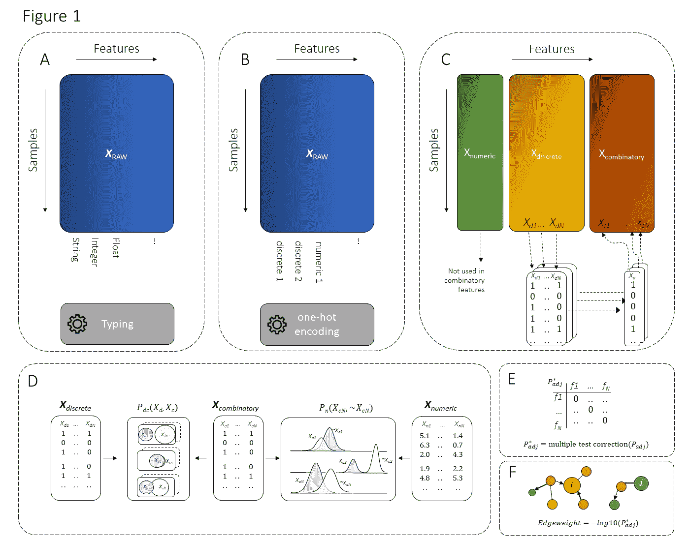
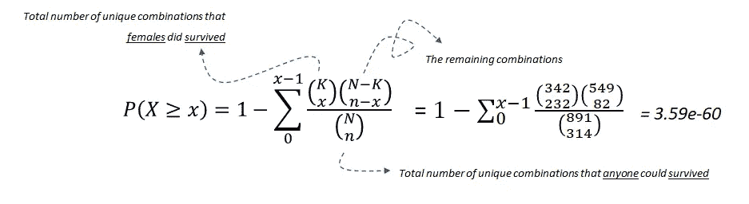
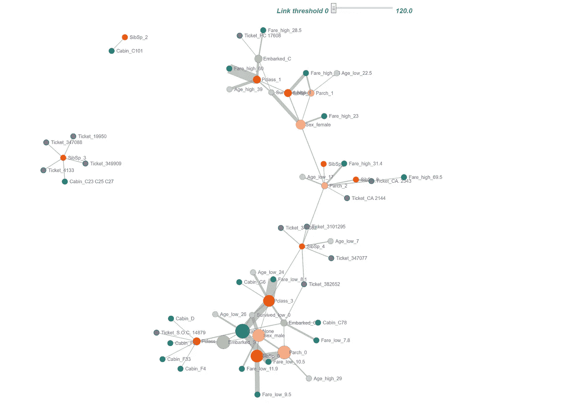
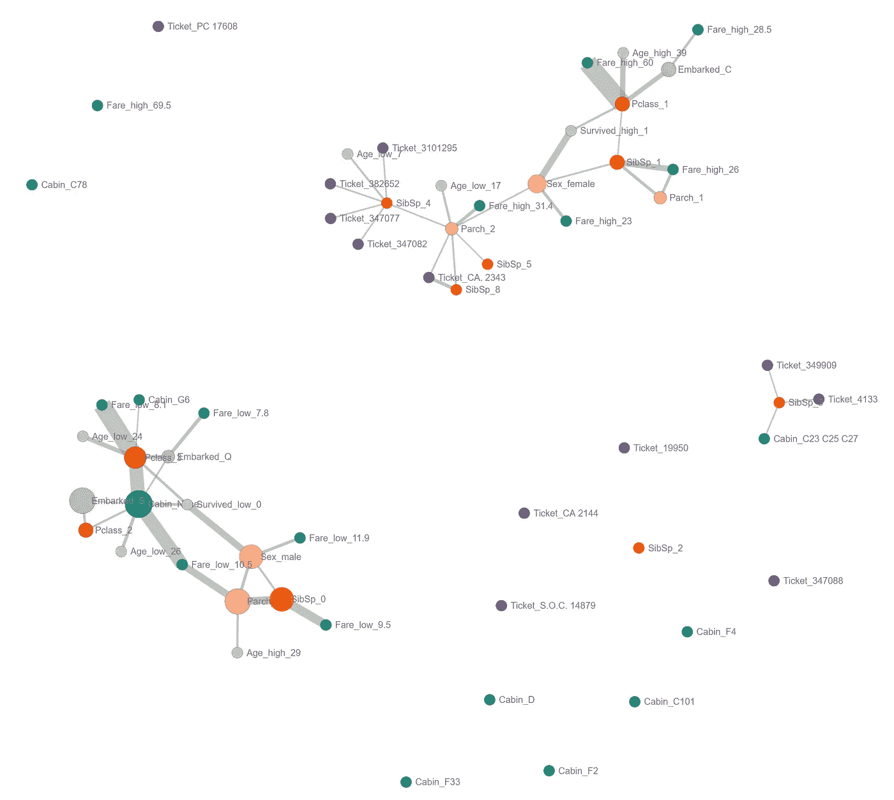
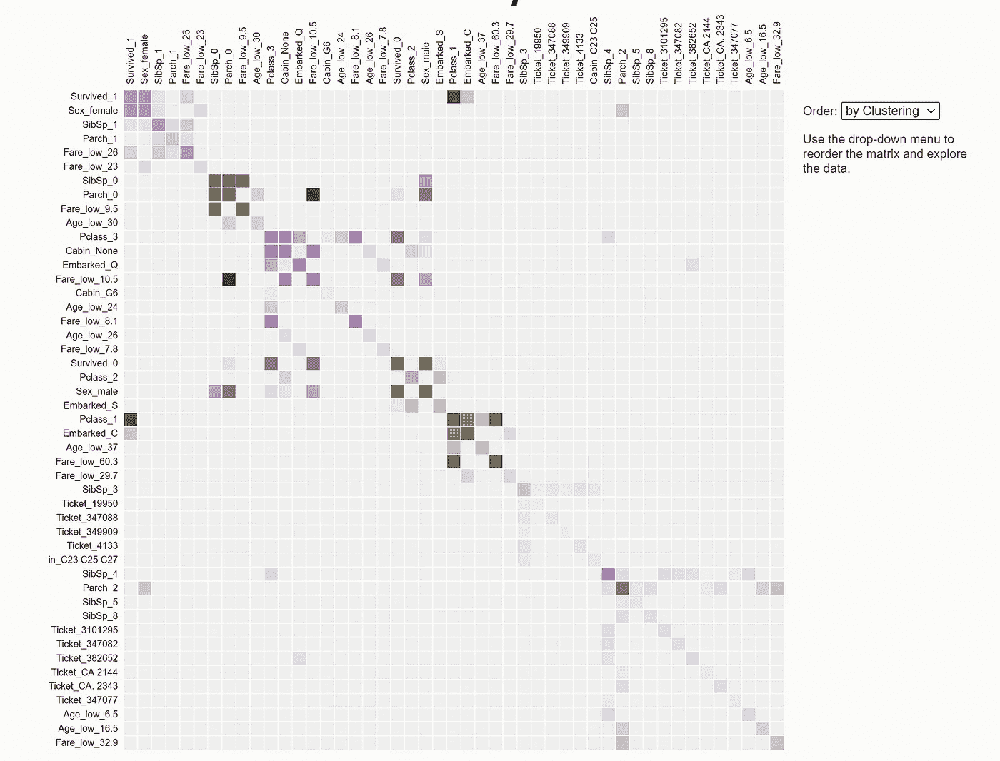
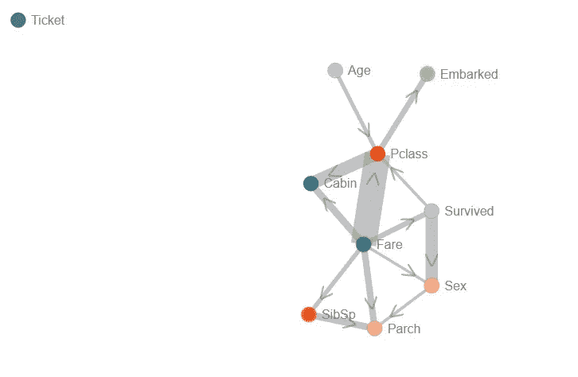
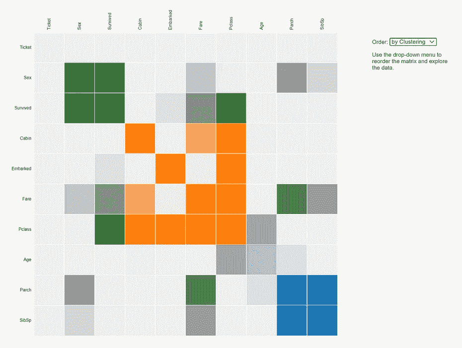
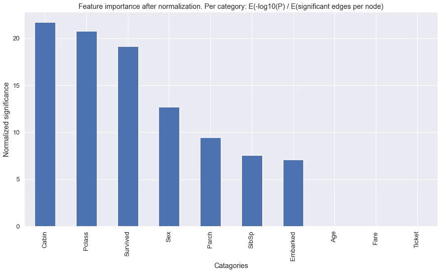

# 通过重要的关联网络探索和理解您的数据。

> 原文：<https://towardsdatascience.com/explore-and-understand-your-data-with-a-network-of-significant-associations-9a03cf79d254?source=collection_archive---------25----------------------->

## 探索以了解您的数据可以决定项目是失败还是成功完成！


*照片由* [*科特托阿加*](https://unsplash.com/@kydroon?utm_source=unsplash&utm_medium=referral&utm_content=creditCopyText) *上* [*下*](https://unsplash.com/s/photos/mountain?utm_source=unsplash&utm_medium=referral&utm_content=creditCopyText)

理解您的数据是数据科学的重要一步。然而，如果你不对数据做任何假设，这可能会成为一个耗时且具有挑战性的步骤。很容易忽略这一步，在水中跳得太快。不过，明智的做法是*先学会游泳*再跳入水中！这是一个不成功的项目或成功完成的区别！

探索数据的一种方式是使用方法[*HNet*](https://erdogant.github.io/hnet)【1，2，3】*。*它代表图形化 **H** 超测 **Net** 作品，让你轻松探索你的数据，检索新的有意义的见解。在本文中，我将讨论数据理解的重要性，并给出一个实际例子。

*如果你觉得这篇文章很有帮助，可以使用我的* [*推荐链接*](https://medium.com/@erdogant/membership) *继续无限制学习，并注册成为中级会员。另外，* [*关注我*](http://erdogant.medium.com) *保持我的最新内容！*

# 数据理解是至关重要的一步。

真实世界的数据通常包含具有连续值和离散值的测量值。我们需要审视每一个变量，并对它们对于特定问题的意义和重要性进行哲学分析。但这不仅仅是一次只看一个变量(单变量)，如果不对数据做任何假设，而是以多变量的方式检查变量，那么耗时的部分就很难完成。搜索空间的变量数量呈超指数增长。*跳过它？不要！学游泳！* 在进行任何分析之前，彻底探究数据是极其重要的。

> 数据探索将为未来的任务提供提示和线索。

根据提示和线索，您可以决定哪些模型是分析的候选对象，以及检索合理结果的可能性有多大。尽管有许多库可用，但数据集需要密集的预处理步骤，并且探索性分析是一项复杂且耗时的任务。

这里有 [*HNet*](https://erdogant.github.io/hnet) 发挥作用，它使用统计测试来确定变量之间的显著关系。最酷的是，您可以简单地在模型中输入原始的非结构化数据。输出是一个网络，可以揭示变量之间的复杂关系。

# 预处理与探索

数据探索通常与预处理步骤密切相关。但是还是有区别的:

**其中预处理是关于**:

*   标准化，规范化，规模化。
*   编码变量。
*   清除，如删除或插补。
*   …

**探索理解是关于:**

*   变量之间的关系如何？
*   数据有意义吗？
*   是否存在偏见？
*   底层数据分布是怎样的？
*   单变量/多变量分析
*   …

探索性分析可能相当具有挑战性，因为没有真正的问题要追求。 ***这是你需要用数据获得感觉的部分。*** 用数据获得‘感觉’*的一种方法是通过理解变量之间的关系。*

# *保持冷静，聪明地工作*

*让我们跳进 [*HNet*](https://erdogant.github.io/hnet) 的方法论。*目的是确定一个具有重要关联的网络，它可以揭示变量之间的复杂关系。*输入的范围可以从通用数据框到带有列表、缺失值和枚举的嵌套数据结构。*

> *HNet 从具有混合数据类型和未知函数的数据集中学习关联。*

*这意味着可以使用包含分类值、布尔值和/或连续值等特征的数据集。此外，您不需要指定目标(或响应)变量，因为它将以无人监管的方式工作。*

## *HNet 的建筑*

*[*HNet*](https://erdogant.github.io/hnet) 的架构是一个多步骤流程(图 1)，其中前两步是通过*打字*和*一键编码*处理原始非结构化数据。*

**

*示意图概述 HNet [1]*

1.  ***键入:**该过程的第一步是将每个特征键入类别、数字或排除。类型可以是用户定义的，也可以是自动确定的。在后一种情况下，如果值是浮点类型或具有超过最小数量的唯一元素(例如，如果唯一元素的数量>占非缺失总数的 20%)，则特征被设置为数字。*
2.  ***一键编码**:第二步是将类别值编码成一个一键密集数组。这是使用 [*df2onehot 库*](https://github.com/erdogant/df2onehot) 完成的。独热密集阵随后用于*统计推断*。*
3.  ***统计推断:**这一步包含两个统计检验。1.使用超几何测试来测试一位热码编码特征与所有其他一位热码编码特征(X *离散)*的显著性。2.为了评估与密集阵列(*x 离散*)相关的数字特征(*x 数字*)之间的显著性，使用 Mann-Whitney-U 检验。每个数字向量在类别特征上进行分割( *Xci 对~Xci)* 并进行显著性测试。*
4.  ***多重测试校正:**在统计推断步骤之后，顶点对之间的所有测试的边概率，无论是类别-类别还是类别-数值，都存储在邻接矩阵中( *Padj* )，并针对多重测试进行校正。默认多重测试方法设置为 Holm(图 1E)。可选的是各种其他错误发现率(FDR)或家族错误率(FWER)方法。*
5.  ***过滤重要边缘:**最后一步(图 1F)是声明边缘的重要性。当 alpha 小于 0.05(默认值)时，边缘被称为显著的。边权重由-log10(Padj)计算。*

*最终输出是包含节点和描述顶点对强度的边权重的邻接矩阵。邻接矩阵在下一步中作为网络表示或热图进行检查。*

# *计算关联。*

*当我们谈到关联时，它意味着一个变量的某些值往往与另一个变量的某些值同时出现。从统计学的角度来看，有许多关联的测量方法(如卡方检验、Fisher 精确检验、超几何检验),通常用于一个或两个变量为序数或名义变量的情况。我将通过例子演示如何使用超几何测试来分析 Titanic 数据集的两个变量是否相关。众所周知，在这个数据集中，性别状态(女性)是一个很好的生存预测因子。更多信息和单变量分析，见[Kaggle](https://www.kaggle.com/c/titanic/)【5】和[博客](/predicting-the-survival-of-titanic-passengers-30870ccc7e8)【6】。让我们来计算一下*幸存和女性*之间的关联。*

```
***pip install hnet***
```

*加载泰坦尼克号数据集*

> *无效假设:幸存者和女性没有关系。*

*超几何检验使用超几何分布来衡量离散概率分布的统计显著性。在这个例子中， *N 是群体大小(891)，K 是群体中成功状态的数量(342)，N 是样本大小/抽取的数量(314)，x 是样本中成功的数量(233)。**

*存活与雌性之间的超几何检验*

*数学如等式 1 所示。超几何测试有三个要素:1.雌性存活下来的独特组合的总数，2。任何人都可以生存的独特组合的总数，以及 3。所有剩余的组合。*

**

*等式 1:超几何检验。*

*我们可以拒绝在α= 0.05 下的无效假设，因此，我们可以谈论存活和雌性之间的统计学显著关联。重要的是，联想本身并不意味着因果关系。我们需要区分边际关联和条件关联[7]。在条件作用中，一些变量在某些类别中是固定的，而联系的强度是为剩余的变量测量的。另一方面，边缘化考虑变量的子集，而不注意其余的变量，不涉及选择，一组变量的关联指的是整个人口。*

# *一个实际的用例:探索和理解泰坦尼克号数据集。*

*让我们继续讨论 *Titanic* 数据集，因为它包含一个在真实用例中常见的结构，即每个样本中存在分类变量、布尔变量和连续变量。在前面的步骤中，我们初始化并加载了 Titanic 数据集。在这一步，我们将预处理 12 个输入特征；打字和一键编码。这都是由 [*HNet*](https://erdogant.github.io/hnet) 提供输入数据帧后完成的。*

*这产生了 **2634 个独热编码特征**。 [*HNet*](https://erdogant.github.io/hnet) 的默认设置是如果看到≤ 10 ( *y_min=10* )则删除一键编码特征。这将特征空间减少到 **18 个独热编码特征**，为其计算关联。*

*输出是一个包含以下键的 ***字典*** :*

*   ***simmatP** : *包含变量关联之间 P 值的邻接矩阵。**
*   ***simmatLogP**:*-simmatP 的 log10(P 值)。**
*   ***labx** : *被分析的标签。**
*   ***数据类型** : *为标签设置的数据类型。**
*   ***计数** : *基于群体中成功数量的标签的相对计数。**

## *排除变量将节省计算时间！*

*一些输入变量可以从分析中排除，例如标识符和名称。当变量被*列入黑名单*时，它们被排除在搜索范围之外，生成的模型将不包含任何这些边。如果变量是*白名单*，搜索仅限于那些边缘。结果模型将只包含*白名单*中的边。*

*包含或排除变量的示例。*

*有四种方法可以节省你的计算时间。*

*   ***黑名单** : *从分析或绘图中排除的节点。**
*   ***白名单** : *仅包括分析或绘图中列出的节点。**
*   ***阈值** : *关联(边)基于-log10(P) >阈值进行过滤。阈值的范围应该在 0 和最大值-log10(P)之间。**
*   ***min_edges** : *节点仅在至少包含最小数量的边时显示。**

## *情节*

*所有关联都存储在 *simmatP* 中，并用于通过各种交互图更深入地探索关系。*

## *D3 图形*

*[*D3 graph*【8】](https://erdogant.github.io/d3graph)将在 d3-javascript 中使用 python 生成一个[交互式单机**网络**。这种可视化将允许您更深入地检查网络，因为它允许使用滑块在其权重上逐渐断开边缘。滑块基于-log10(P ),最小值为(默认)log10(0.05)。向右滑动滑块意味着您将只保留最重要的关系。更多关于](https://erdogant.github.io/docs/d3graph/titanic_example/index.html) [*d3graph*](https://erdogant.github.io/d3graph) 的细节可以在这个[博客](/creating-beautiful-stand-alone-interactive-d3-charts-with-python-804117cb95a7)中找到。网络的其他一些属性:*

*   *每个节点包含一个文本标签*
*   *当双击感兴趣的节点时，可以突出显示相关节点的链接*
*   *每个节点都包含一个工具提示，可以很容易地用来显示任何底层数据*

*制作网络图和热图。*

**

*连通边 P≤0.05 的网络*

*从这个网络中我们可以了解到，[通过打破网络](https://erdogant.github.io/docs/d3graph/titanic_example/index.html)，出现了两个集群。存活的雌性群集=1，而存活的雄性群集=0。现在，您可以轻松地更深入地检查变量之间的其他关联。*

**

## *D3 热图*

*当网络变成一个巨大的毛团时，热图是理想的选择。矩阵图的有效性在很大程度上取决于行和列的顺序:如果相关节点彼此靠近放置，就更容易识别集群和桥。虽然在矩阵视图中进行路径跟踪比在节点链接图中更困难，但矩阵还有其他优点。矩阵单元也可以被编码以显示附加数据；这里，颜色描述了由社区检测算法计算的聚类。该热图是使用[D3 热图库](https://github.com/erdogant/d3heatmap)【9】在 d3js 中创建的。*

**

## *总结结果*

*网络可能变成巨大的毛团，热图无法阅读。您可能希望看到类别之间的一般关联，而不是标签关联。使用`summarize`功能，结果将按类别汇总。在这里我们再次清楚地看到了幸存和性之间的联系。*

****

## *功能重要性。*

*还可以通过计算每个类别的特征重要性来分析网络中的变量。每个类别的独热编码变量的-log10(P 值)除以每个节点的有效边数。高分变量表明许多独立的节点在网络中是重要的。在这里，我们可以看到客舱、Pclass 和幸存是前 3 个变量。*

**

# *结论*

*[*HNet*](https://erdogant.github.io/hnet) 允许深入检查特征之间的关联。它可以处理包含混合数据类型的原始非结构化数据集。然而，如果你的数据集只包含连续值，它应该遵循不同的方法，想想像 *PCA* ，t- *SNE，奇异值分解，UMAP 这样的方法。更多信息和笔记本示例见参考文献[3]。**

**保持安全。保持冷静。**

***干杯，E.***

**如果你觉得这篇文章很有帮助，可以使用我的* [*推荐链接*](https://medium.com/@erdogant/membership) *继续无限制学习，并注册成为中级会员。另外，* [*关注我*](http://erdogant.medium.com) *关注我的最新内容！**

## *软件*

*   *[HNet github/文档](https://erdogant.github.io/hnet)*
*   *[Colab 笔记本示例](https://erdogant.github.io/hnet/pages/html/Documentation.html#colab-notebook)*

## *我们连线吧！*

*   *[我们在 LinkedIn 上连线](https://www.linkedin.com/in/erdogant/)*
*   *[在 Github 上关注我](https://github.com/erdogant)*
*   *[在 Medium 上跟随我](https://erdogant.medium.com/)*

## *参考*

1.  *E.Taskesen， *HNet:图形超几何网络* [，2020，](https://arxiv.org/pdf/2005.04679.pdf) [arXiv:2005.04679](https://arxiv.org/abs/2005.04679)*
2.  *Taskesen，E. (2019)。HNet:图形超几何网络。*
3.  *[HNet 笔记本示例](https://colab.research.google.com/github/erdogant/hnet/blob/master/notebooks/hnet.ipynb)*
4.  *迈克尔.朗斯。如何避免机器学习陷阱:学术研究者指南。ArXiv，2021 年*
5.  *https://www.kaggle.com/c/titanic/*
6.  *[https://towards data science . com/predicting-the-survival-of-titanic-passengers-30870 ccc7e 8](/predicting-the-survival-of-titanic-passengers-30870ccc7e8)*
7.  *Wicher Bergsma 和 Tamas Rudas， [*权变表*](http://stats.lse.ac.uk/bergsma/pdf/margmod_causs.pdf) 中的条件和边际关联，蒂尔堡大学，2002 年 10 月 18 日*
8.  *Taskesen，E. (2019)。交互式强制定向网络创建器( [d3graph](https://erdogant.github.io/d3graph) )(版本 0.1.12)【计算机软件】，[https://erdogant.github.io/d3graph](https://erdogant.github.io/d3graph)*
9.  *Taskesen，E. (2019)。交互式和独立热图(d3heatmap)(版本 0 . 1 . 7)[计算机软件]。[https://github.com/erdogant/d3heatmap](https://github.com/erdogant/d3heatmap)*