# 在 Google BigQuery 中探索数组和结构以获得更好的查询性能

> 原文：<https://towardsdatascience.com/explore-arrays-and-structs-for-better-performance-in-google-bigquery-8978fb00a5bc?source=collection_archive---------3----------------------->

## 使用这两个高级 SQL 概念来提升您的 SQL 查询游戏比您想象的要容易。不要错过！

在 [Unsplash](https://unsplash.com/s/photos/speed?utm_source=unsplash&utm_medium=referral&utm_content=creditCopyText) 上[给](https://unsplash.com/@laurentmedia?utm_source=unsplash&utm_medium=referral&utm_content=creditCopyText)拍照

在分析大数据时，对数组和结构的良好理解非常有用，因为我们可以更快、更有效地查询来自基于对象的模式(如 JSON 或 Avro 文件)的预连接表。在这篇博文中，我们将通过大量的例子探索数组、结构以及如何在 Google BigQuery 中充分发挥它们的潜力。

**你会学到**

1.  为什么我们需要知道数组和结构？
2.  数组以及如何使用它们
3.  结构以及如何将它们与数组结合起来创建嵌套记录

说够了，我们开始吧！

# 为什么我们需要知道数组和结构？

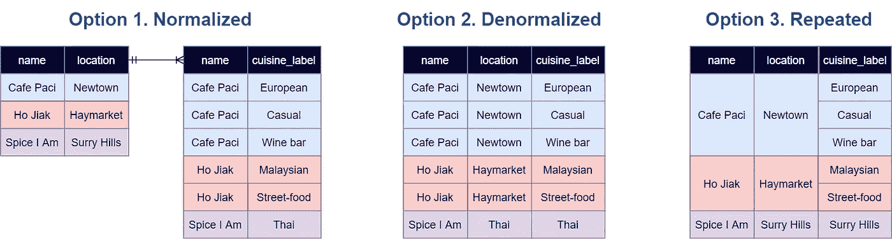

作者照片

看看上面的图片，你能看到什么？

这张图片代表了 3 种不同的模式，以捕捉餐厅的名称，位置和它的美食标签之间的关系。为了简单起见，我们假设一家餐厅只有一个位置，但有多个美食标签。

最左边是选项 1，其中我们有两个独立的表通过一对多关系连接在一起。规范化有助于**避免存储位置冗余**，从而降低存储成本。但是我们也牺牲了查询性能，因为如果我们想知道泰国餐馆在哪里，就需要连接两个表。

选项 2 则完全相反。**查询性能会快得多**，因为不需要连接两个表，然而**存储成本会更高**，因为位置在整个非规范化表中是冗余存储的。

但是如果我们能拥有两个世界的最好的东西呢？当然，我们可以用选项 3 在 Google BigQuery 中实现。每家餐馆的菜肴标签都很好地嵌套在一行中，这带来了两个主要好处。

**更好的查询性能**

*   所有数据都在一个表中，所以您可以跳过昂贵的连接。
*   如果我们在 location 下做类似 SELECT DISTINCT 的事情，我们只需要迭代 3 行而不是 6 行。

**降低存储成本**

*   名称和位置不必被冗余地存储

听起来不错！但是，我们如何根据选项 3 来组织信息，以获得这些令人敬畏的好处呢？嗯，我的朋友，这就是为什么我们需要数组和结构，因为它们表示 BigQuery 中嵌套和重复的字段。在接下来的几节中，我们将详细探讨数组和结构。

# 数组

## 定义

**数组是包含相同数据类型**的值的有序列表。当我们想要在单个行中存储重复值时使用它，例如下面的场景。

*   一名员工拥有一项或多项技能
*   一个学生可以说一种或多种语言
*   Zomato 上列出的餐馆有一个或多个美食标签，如意大利菜、披萨、意大利面、休闲菜
*   客户的销售订单包括一个或多个项目

## 使用 SQL 数组

**用方括号创建一个数组**

让我们从简单的事情开始。我们将尝试创建一个永久的表，用一个数组来捕获悉尼 4 个不同餐馆的美食标签。

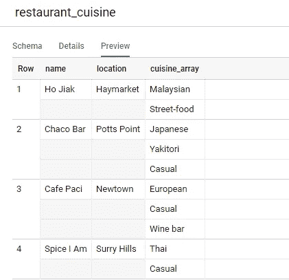

作者照片

查看查询结果，有 3 个要点需要注意。

1.  我们可以用方括号[ ]创建一个数组，每个元素用逗号分隔。**每对方括号内的值组成一个数组**。
2.  由于每个数组代表与一家餐馆相关联的美食标签，BigQuery 将它们存储在与一行相关联的**重复字段中。总共，我们有 4 个不同的行，对应于 4 个餐馆。**
3.  在每一行下面，菜肴标签垂直显示在不同的行中，而不是水平地将它们放在方括号中。我们说 BigQuery 已经**自然地展平了输出**。

**用 UNNEST 打开一个数组**

如果您想将数组解包，以便将其导出到 MS Excel 或 Google Sheets 中的电子表格中，该怎么办？好吧，很公平，UNNEST 操作员将在这种情况下派上用场。

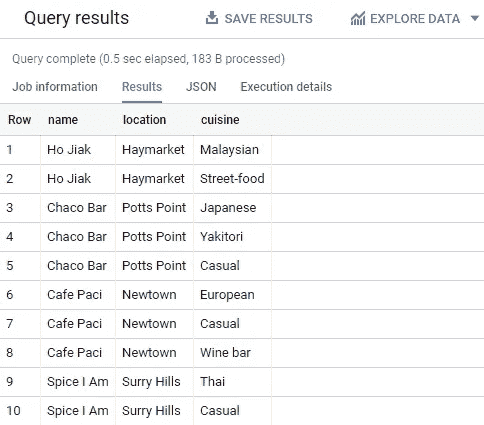

作者照片

如您所见，UNNEST 操作符将数组转换成非规范化的格式，准备好供 MS Excel 或 Google Sheets 使用。从 Haymarket 的 Ho Jiak 餐厅的 1 行嵌套 2 个美食标签，我们现在得到 2 个单独的行。

**用 ARRAY_AGG 将元素聚集成数组**

如果我们事先有一个非规范化的表，并且需要将所有的美食标签聚合成数组格式，这样就可以减少行数，那该怎么办？

让我们将上述查询的结果保存到一个名为“restaurant_cuisine_unnested”的 BigQuery 表中。接下来，我们将使用带有 GROUP BY 的 ARRAY_AGG 操作符，将其恢复为数组格式。

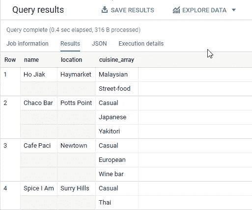

作者照片

瞧啊。给你，东西被很好地重新包装成正常的 4 排 4 个餐厅。你注意到每一排的菜肴顺序有什么不同吗？(提示:请注意 Chaco Bar 的日文上方现在显示的是多么随意)

是的，因为我们选择了使用 ARRAY_AGG 的“ORDER BY cuisine ”,所有的美食标签现在都是按字母顺序排序的。如果我们将它保存为永久表，这个顺序将被保留。

**用 ARRAY_LENGTH 对数组中的元素进行计数**

是时候让事情更上一层楼了，看看我们还能用数组做些什么。我们来数一数每家餐厅都关联了多少个美食标签。

作者照片

**用 UNNEST 和 WHERE IN** 查询数组

如果我们想列出休闲餐厅的所有相关信息怎么办？

为了解决这个问题，我们必须逐个检查数组的每个元素，只过滤包含“Casual”的菜肴。但是数组列的行为与普通列不同。**如果不首先取消嵌套，你就不能遍历和过滤数组中的元素。**记住这一点，我包含了两个略有不同的查询，根据您的需要，它们会以两种不同的格式给出相同的结果。

备选方案 1。如果您想获得一个没有任何数组 的 ***非规范化查询结果(在 Excel 或 Google 工作表中使用)***

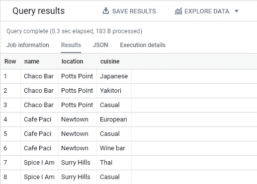

作者照片

选项 2。如果您希望将您的 ***美食列很好地打包到一个数组*** (以节省存储成本和查询时间)

*注意:以下问题由迈克尔·恩廷提供。我决定用原来的查询替换它，因为它更简单、更简洁。再次感谢@mentin 开导我！*

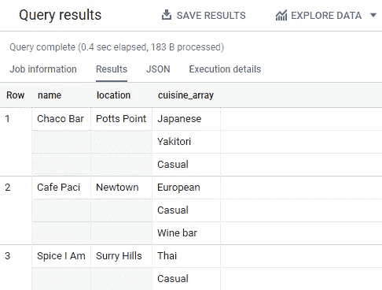

作者照片

# 结构

## 定义

> *结构是有序字段的灵活容器，每个字段都有一个类型(必需)和一个名称(可选)。*
> 
> *-来自* [*谷歌云*](https://cloud.google.com/bigquery/docs/nested-repeated)

与数组相比，你可以在一个结构中存储多种数据类型，甚至数组。在 Google BigQuery 中，Struct 是一个父列，表示一个有多个子列的对象。举个例子，

*   餐馆的位置由不同的字段表示，如地址、城市、州、邮政编码。
*   员工具有与不同字段相关联的资格，如大学、学位、开始日期和结束日期。

请记住，当您在 Google BigQuery 中加载嵌套和重复数据时，[您的模式不能包含超过 15 层的嵌套结构](https://cloud.google.com/bigquery/docs/nested-repeated#limitations)。

## 使用 SQL 结构

**创建一个简单的结构**

理解结构如何工作的最简单的方法是创建一个结构。让我们将现有的 cuisine_array 与其他细节(例如价格范围、交付)结合起来，形成一个结构。下面是如何用 STRUCT 操作符来实现的。

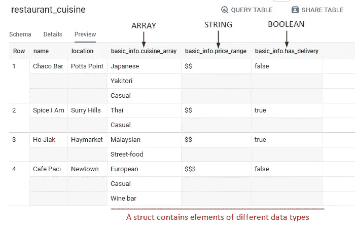

作者照片

在其最简单的形式中，具有相同前缀“basic_info”的 3 列形成一个结构。结构中的不同元素可以有不同的数据类型。例如，上面我们有一个数组、字符串和布尔数据类型，它们都和谐地存在于单个结构中。

既然我们在这里，你可能想看看下面的模式来理解数组和结构之间的区别。**如果模式是重复的，那就是一个数组(又名重复字段)。当类型为 RECORD 时，它表示一个结构(也称为嵌套字段)。**

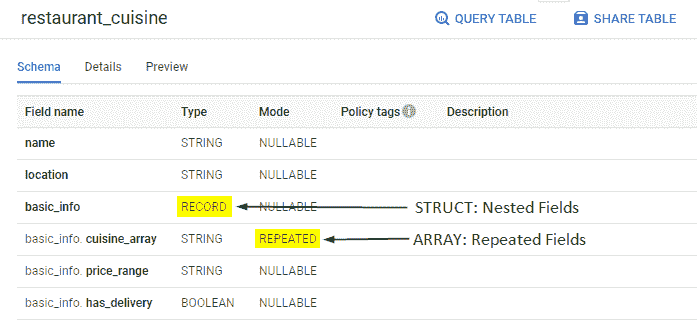

作者照片

**用点符号查询结构**

考虑到 BigQuery 中的上表，是时候让自己更努力一点了。把所有有送餐服务的休闲餐厅都标识出来怎么样？

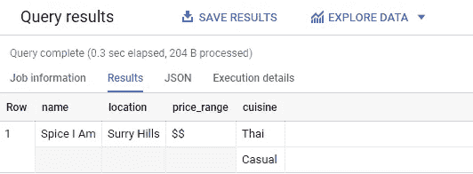

作者照片

下面是查询结构时需要注意的两点。

1.  使用点标记法查询嵌套列(例如，其中 basic_info.has_delivery = true)
2.  不要忘记在查询数组中的元素之前取消数组嵌套，即使该数组嵌套在结构下

**从结构数组中创建嵌套记录**

这是您的 SQL 知识达到顶峰的地方，因为嵌套记录的概念非常先进。所以我们开始吧，各位！

让我们仔细看看从查询中获得的表。你注意到了什么？

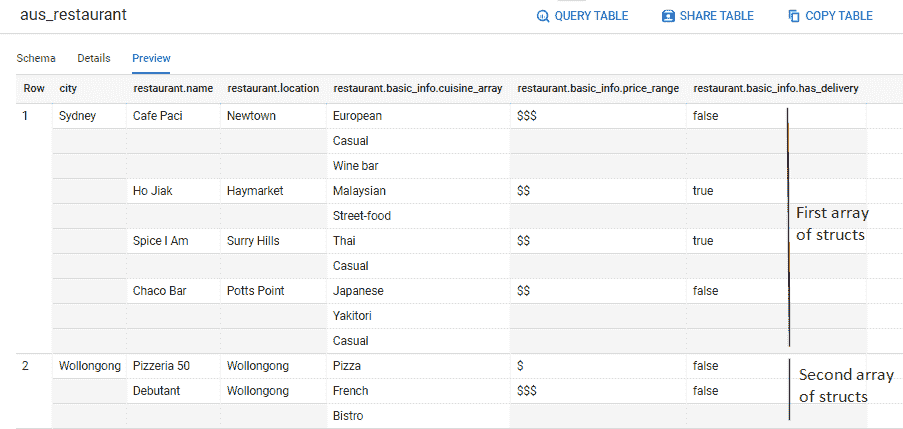

作者照片

在前面，我们看到了一个包含数组的结构。但是现在，我们反过来看，第一个数组“Sydney”包含 4 个结构，而第二个数组“Wollongong”包含 2 个结构。这有什么意义呢？

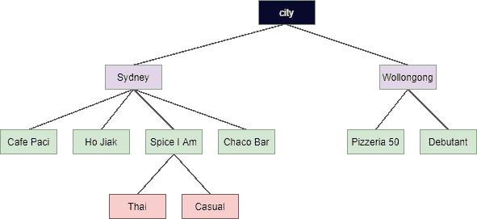

作者照片*(照片中仅显示选定的子值)*

在这里，我们见证了嵌套记录的创建，这些记录在没有连接的情况下反规格化了多个级别的一对多(即父子)关系。所有数据都驻留在一个表中；每个记录都是嵌套的，以优化存储，同时还可扩展(使用 UNNEST)以获得高查询性能。因此，在 BigQuery 中，我们说嵌套记录是结构的数组。**维护嵌套记录消除了在数据分析过程中重复数据、创建额外子表或使用昂贵连接的需要。这就是 Google BigQuery 作为一个数据仓库如此强大的关键所在，尤其是在分析来自 JSON 或 Avro 文件的数据时。**

# 包扎

在这篇文章中，我们探讨了数组和结构的定义，以及为什么嵌套和重复的字段在 BigQuery 中如此重要。以下是这篇文章的三个要点。

1.  **数组是 SQL 中支持的数据类型，即使在 Google BigQuery 之外也是如此。在数组中，每个元素必须具有相同的数据类型，并且值的顺序保持不变。**
2.  **一个结构可以包含不同数据类型的元素，包括数组。**
3.  **在 BigQuery 中，嵌套记录是结构的数组。维护嵌套记录消除了在数据分析期间重复数据、创建附加子表或使用昂贵的连接的需要，从而提高了查询性能并降低了存储成本。**

感谢您的阅读。有问题或者想聊天？请在评论中告诉我，或者在 [Twitter](https://twitter.com/SkyeTranNH) 上找到我。祝你摇滚一天，回头见，鳄鱼！

*原载于 2021 年 1 月 20 日*[*【http://thedigitalskye.com】*](http://thedigitalskye.com/2021/01/21/2-must-know-advanced-sql-concepts-for-better-performance-in-google-bigquery/)*。*