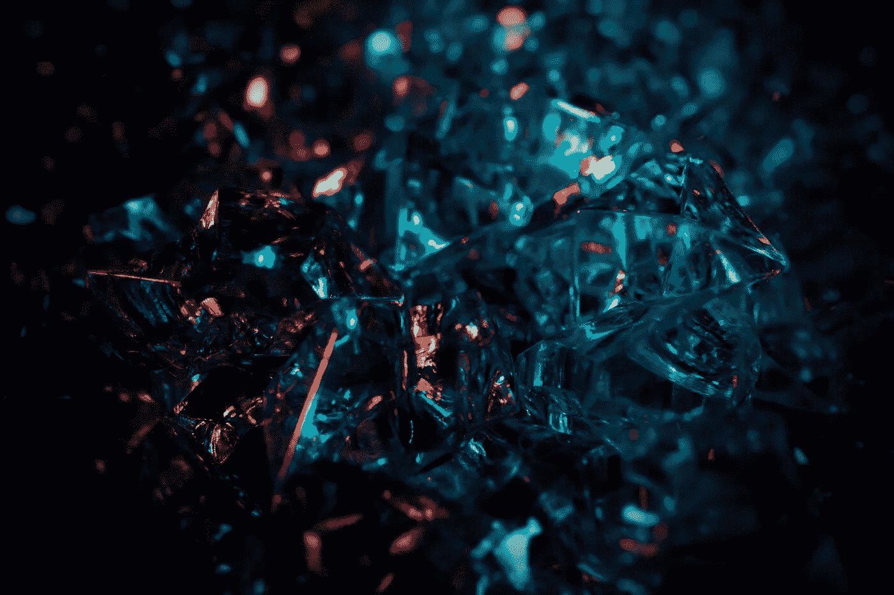

# 使用深度图卷积网络和贝叶斯优化探索更好的材料

> 原文：<https://towardsdatascience.com/explore-better-materials-using-deep-graph-convolutional-networks-and-bayesian-optimization-144a9b6699fc?source=collection_archive---------30----------------------->

## 从理论计算中提取知识来设计材料，以最大限度地减少破坏性实验的次数。



Louis-Etienne Foy 在 [Unsplash](https://unsplash.com) 上拍摄的照片

你想要更好的材料吗？是的，我们有。我们想要容量更大、寿命更长的更好的电池。或者，我们想要更好的太阳能电池板和更高的发电量。或者，我们想要焦耳热损失更少的更好的半导体。所有这些性能限制都源于组成它们的材料。所以，是的，我们确实希望任何产品都有更好的材料。

## 动机

但是我们如何从几乎无限的现有材料中找到它们呢？一种方法是利用模拟数据库，如[材料项目](https://materialsproject.org)。这种类型的数据库已经使用 DFT 计算来编译材料特性，这有利于缩小探索范围。然而，众所周知，有几个性质的可预测性很差，比如带隙，所以我们不能从表面上接受它们的值。虽然，根据[结晶学开放数据库](http://www.crystallography.net/cod/)显示，目前为止，累计晶体数量已经达到**476995**，以至于无法通过实验的方式检查其性能。啊，我希望有一个好的实验数据库和材料发现的搜索引擎！可悲的是，根本不存在。(至少现阶段是这样。)是的，我们应该创造一种方法来利用从理论数据库到实验晶体结构数据库的知识。那么，在机器学习的帮助下，让我们考虑有效探索所需材料的方法。

# 问题设置

让我们考虑探索具有期望的**带隙**的材料。当我们想要一个更好的半导体时，这个特征值是最基本的指导。根据产品的设计，所需的带隙值会有所不同。因此，我们可以将半导体材料发现问题简化如下:

> 当我们设置 E 为带隙的理想值时，如何用最少的探索试验从晶体数据库中尽可能多地找到带隙最接近的晶体？

让我们把这个问题说得更具体一些。我们要澄清的事情如下:

> 1.我们需要多精确地接近目标值？
> 2。哪个指标最合适？
> 3。我们如何构建数据集？
> 4。我们需要探索到什么程度？

首先，我们应该在 0.01 eV 误差内估计目标值。eV，电子伏特，是带隙的单位。根据其制造方法或条件，带隙可以在这个尺度上变化。所以，继续追求可能会徒劳无功。其次，当我们强调绝对值而不是比率时，我们可以采用 MAE(平均绝对值)度量。顾名思义，这可以通过目标值与估计值之差的绝对值的平均值来获得。接下来，我们可以使用 CIF(晶体信息文件)数据集。CIF 是描述晶体结构的国际格式，它包含基本信息，但不是定量的。第三，我们可以使用材料项目数据库作为伪实验数据集。假设我们可以从假设的实验数据集中探索带隙为 E 的材料。在这种情况下，我们可以应用同样的策略来有效地进行实际的实验。考虑到实际情况，我们可以通过调查科技论文来收集目标值的初步信息。假设这个数字是 100 左右。此外，我们可以通过考虑其他不希望的方面如合成成本或反应性来排除许多候选物。这样，我们可以获得 100 个初步信息，并将勘探候选对象缩小到 6000 个左右。
那么，我们可以把实验材料探索问题概念化如下:

> 当我们将 E 设置为带隙的理想值时，如何利用 100 个先验信息，用最少的探索试验从大约 6000 个候选者中尽可能多地找到 MAE 小于 0.01 eV 的晶体？

# **机器学习策略**

## 贝叶斯优化

正如我们可以很容易地在谷歌搜索中发现的，**贝叶斯优化**似乎是一个有效的探索。贝叶斯优化是一种算法，旨在以最少的尝试探索更好的数据点。例如，谷歌大脑团队将这种算法应用于[智能优化巧克力饼干配方](https://www.blog.google/technology/research/makings-smart-cookie/)。不管怎样，这看起来很实用，是的，我们应该把它应用到材料发现上。但是等等，我们需要**描述符**。换句话说，这组变量用来识别唯一的晶体。谷歌团队使用了每个饼干烹饪程序的定量值，例如木薯淀粉的重量比。如何才能量化晶体？

## 水晶图卷积神经网络

一个简单的方法是利用**预先训练好的水晶深度学习模型**。 **CGCNN** ，Crystal Graph 卷积神经网络，是材料科学领域开创性的深度学习架构。在[作者的 GitHub 资源库](https://github.com/txie-93/cgcnn)中，他们开放了预先训练好的模型，每个人都可以使用。当我们查看准备好的模型文件夹时，我们可以找到带隙模型(band-gap.pth.tar)。通过使用该模型作为特征提取器，我们可以在 autopilot 上将 CIF 文件转换为 128 个定量描述符。

## 主成分分析

不幸的是，128 个描述符对于贝叶斯优化来说太多了。虽然有很多针对高维优化的前沿算法，但基本上，低维效果更好，不需要额外的努力。此外，这 128 个描述符仅用于定量识别晶体，因此高维数不是必需的。因此，我们可以使用 PCA，主成分分析来降低维数。通过将 128 维减少到 3 维，我们可以设置更有效的探索空间。

# 代码

Python 库要求:

*   pymatgen
*   pytorch
*   sci kit-学习
*   GPyOpt
*   GPy

# 数据集构建

我们将使用材料项目 API 来构建数据集。首先，您需要在 Materials 项目上创建一个帐户，然后获取 API 密钥。这可以通过遵循官方指令来完成。然后，我们将为先验信息和探索编译两个数据集。您应该将 **MY_API_KEY** 更改为您的密钥。

在这个代码中，我们搜索带隙在 2.3 和 2.8 之间的晶体，得到 6749 种材料。然后，它们被分成两个文件夹；“cif_prior”和“cif_experiment”，分别包含 100 个和 6649 个 cif 文件。此外，带隙值在每个文件夹中存储为“id_prop.csv”。

# 使用预训练的 CGCNN 模型将 CIF 转换为 128 个描述符

您可以按照这里的官方说明来 git 克隆 CGCNN 资源库。你需要将***atom _ init . JSON***复制到“cif_prior”和“cif_experiment”两个文件夹中。然后，您可以通过修改 ***predict.py*** 来创建特征提取代码。我在 predict.py 中的 **validate 函数**的基础上创建了***extract _ feature . py***，代码太长，这里写不下，所以我只展示修改的部分。

首先，主要功能的修改部分是这样的最后一部分。

然后，像这样修改 validate 函数的中间部分。

然后，可以用下面的参数执行这个***extract _ feature . py***。

```
python3 extract_feature.py ./pre-trained/band-gap.pth.tar ./cif_experiment
```

这样你就可以得到 128 个描述符作为***CG CNN _ features . CSV***。我们应该为“cif_prior”和“cif_experiment”创建特征。并将***CG CNN _ features . CSV***重命名为***CG CNN _ features _ prior . CSV***和***CG CNN _ features _ experiment . CSV***。

# 通过主成分分析将维数从 128 减少到 3

我们将把 128 个特征转换成三维数据。同样，对两个数据集执行两次代码，将输出***CG CNN _ PCA . CSV***重命名为***CG CNN _ PCA _ prior . CSV***和***CG CNN _ PCA _ experience . CSV***。

# 贝叶斯优化

最后，我们将使用贝叶斯优化探索更好的材料。实验设置将通过定义以下类实例来完成。

一切准备工作都已就绪。下一个代码将自动探索更好的材料。在该设置中，目标带隙被设置为 E = 2.534 [eV]。我们期望的材料应该具有 0.01 eV 的 MAE 误差，因此，目标范围将在 2.524 和 2.544 eV 之间。贝叶斯优化循环将按照 *n_experiment* 重复探索 30 次。发现的材料和相应的值存储在以下 self 实例中:

*   探索的带隙值；exp.explored _ bandgaps
*   水晶名称；出口晶体
*   累积损失曲线；结果

通过添加基于这些实例和变量的代码，您可以自由地可视化或导出这些结果。

在我的设置中，在 5 次内，贝叶斯优化可以找到想要的材料。也就是说，这种方法在实际的材料勘探方案中似乎是有用的。享受材料发现！