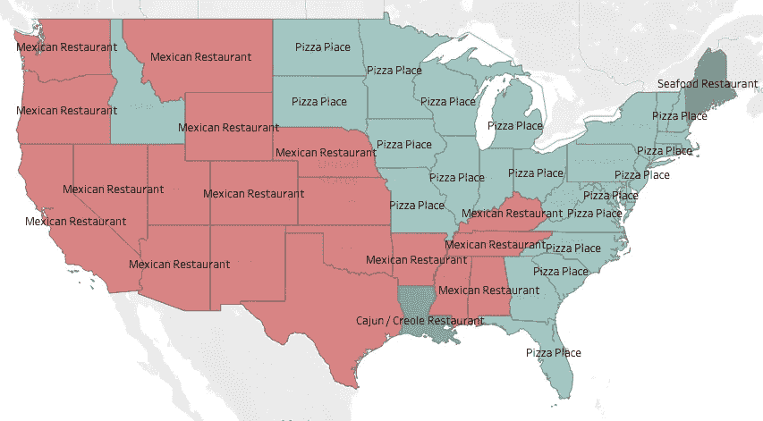
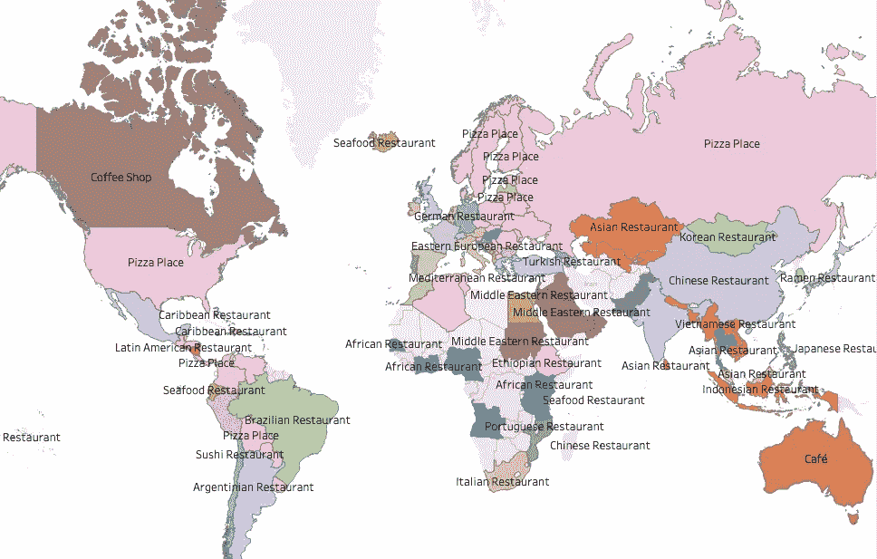
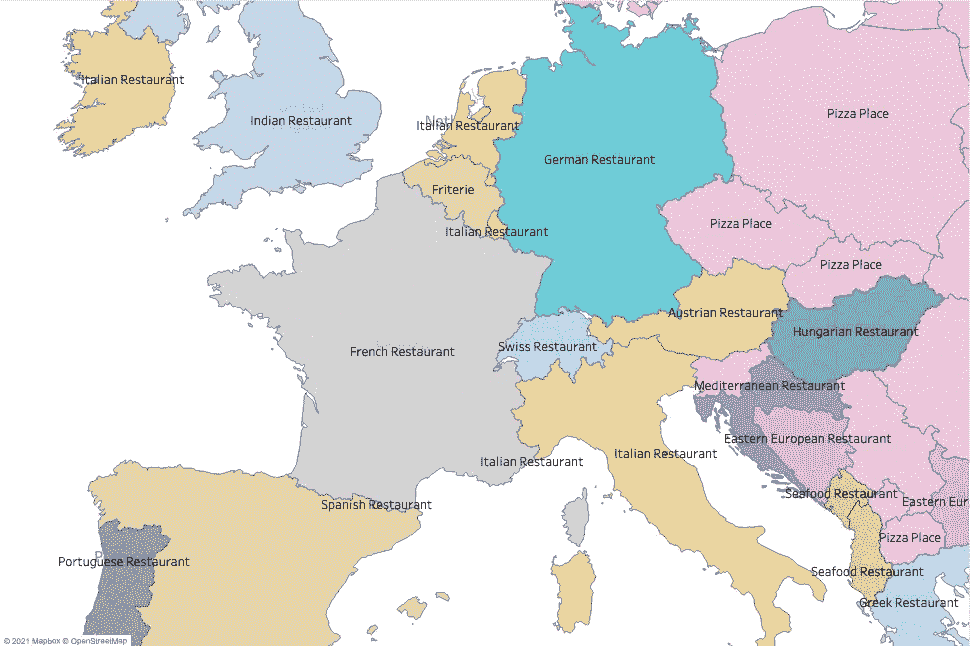
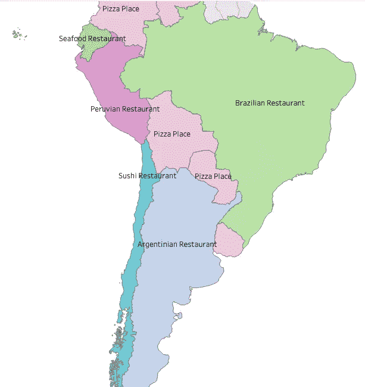
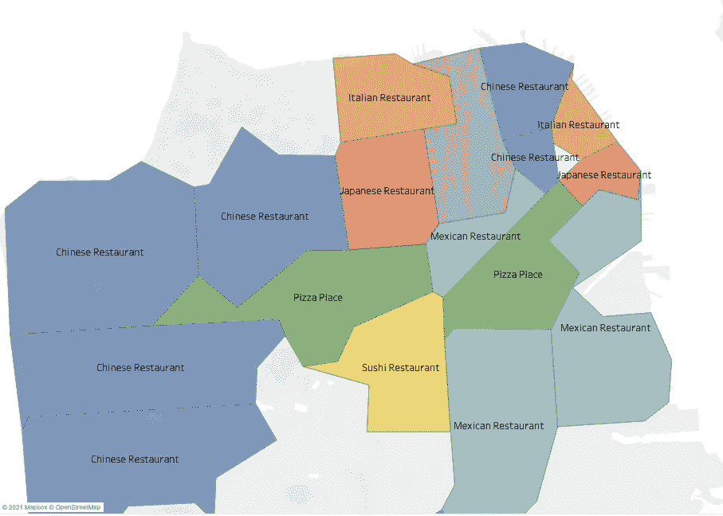
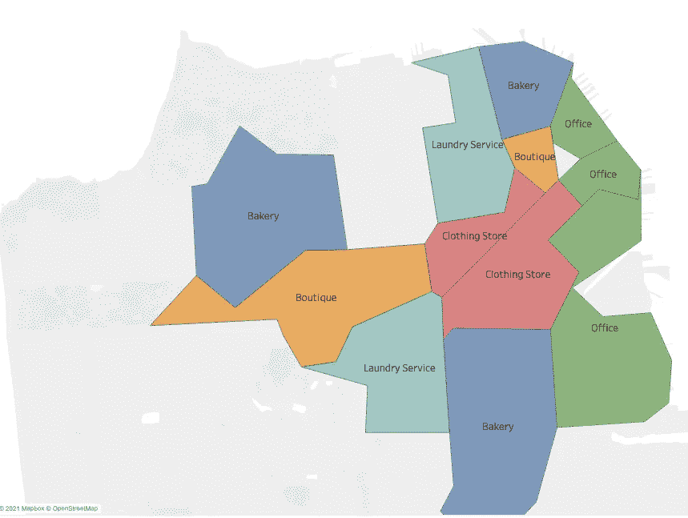
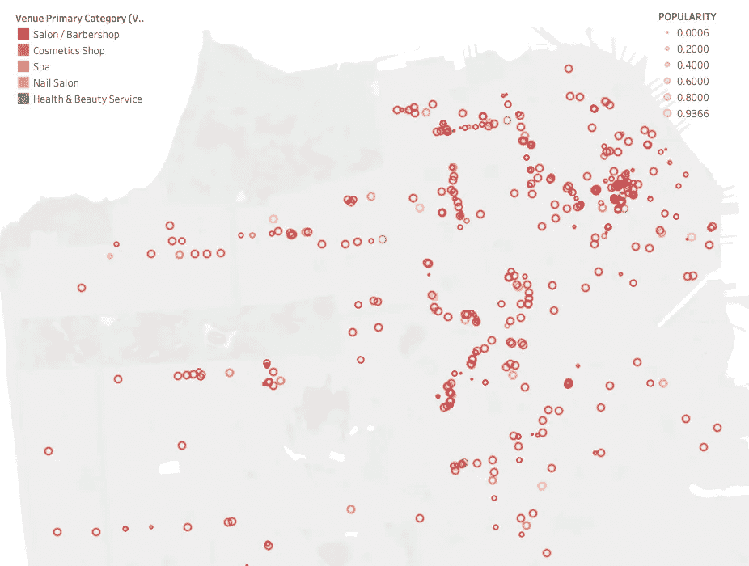

# 探索雪花上的四方世界

> 原文：<https://towardsdatascience.com/explore-the-world-with-foursquare-places-on-snowflake-c1351394e3ff?source=collection_archive---------38----------------------->

## Foursquare Places 数据集覆盖了全球超过 9600 万个地方——包括每个地方的受欢迎程度等有趣的领域。在本帖中，我们将探索数据集，并强调它的一些可能性。

[在 youtube 上观看](https://www.youtube.com/watch?v=e9dqM0c4xi0)

这是一张显示美国各州最受欢迎的餐馆类型的地图，模式很明显-东部各州喜欢披萨，西部各州喜欢墨西哥食物:



美国各州最受欢迎的餐馆类型。作者图片

但是也有一些例外:

*   西部的爱达荷州更喜欢披萨。
*   南部的路易斯安那州到处都是卡津美食。
*   而东北部的缅因州爱吃海鲜。

为了构建这张地图，我通过雪花数据市场使用了 [Foursquare Places](https://www.snowflake.com/datasets/foursquare-foursquare-global-places/) premium 数据集。你可以在下面找到我的问题。

该数据集包括来自世界各地的 9600 多万个地方，因此我们可以将我们的食物地图扩展到全世界。这些是结果:



每个国家最受欢迎的餐馆类型。作者图片

如果我们放大到欧洲，我们会发现像意大利、法国、西班牙和德国这样的国家热爱他们自己的食物——但是英国呢？他们宁愿吃印度食物。



每个欧洲国家最受欢迎的餐厅类型。作者图片

南美也是如此:秘鲁和巴西热爱自己的食物，但智利人呢？我们喜欢寿司。



南美国家最受欢迎的餐厅类型。作者图片

Foursquare 的迷人之处在于，你可以探索整个世界，也可以关注超本地。例如，让我们去旧金山，在那里你可以发现每个邮编都有自己最喜欢的食物类型:中国，墨西哥，泰国，意大利，我们都有。



最受欢迎的餐馆类型。作者图片

现在有了 Foursquare，你还可以超越食物。例如，这是每个邮政编码中最受欢迎的业务类型:



最受欢迎的商业类型。作者图片

办公室、购物、精品店、洗衣服务，当然还有面包店。

我们还可以更深入，例如找到旧金山周围每家美容院的确切位置，以及它们的受欢迎程度。



SF 周边的美容院。作者图片

Foursquare Places 数据集可以帮助您了解您的客户在哪里，如何发展您的业务——所有这些都是通过 SQL 和[数据云](https://www.snowflake.com/data-cloud/)的力量实现的。你会在哪里开新店？

# 问题

## 创建视图以过滤数据和自定义模式

我遵循一些规则来产生这些可视化效果:

*   我只关注 2020 年 1 月以后更新数据的地方。
*   对于餐馆，我只计算 Foursquare 上用户留下至少 1 个小费的餐馆。

```
create or replace view fsq
as (
    select *
    from fsq.public.global_latest_venues
    where date_refreshed > '2020-01-01'
)
;create or replace view restaurants_us_state
as
select region
  , count(*) c
  , any_value(name) sample_name
  , any_value(locality||', '||region) sample_city
from fsq
where country='us'
and total_tips > 1
and category_labels[0][2]='Restaurants'
group by 1
;create or replace view restaurants_us_zip
as
select postcode
  , count(*) c
  , any_value(name) sample_name
  , any_value(locality||', '||region) sample_city
from fsq
where country='us'
and total_tips > 1
and category_labels[0][2]='Restaurants'
group by 1
;create or replace view restaurants_world
as
select country
  , count(*) c
  , any_value(name) sample_name
  , any_value(locality||', '||region) sample_city
from fsq
where total_tips > 1
and category_labels[0][2]='Restaurants'
group by 1
order by c desc
;
```

## 每个州的顶级餐厅类型

比萨和墨西哥餐厅是美国各州最受欢迎的餐厅类型——除非你去掉同样受欢迎的类别“美国餐厅”、“快餐店”和“三明治店”。我这样做是为了得到一张更有趣的地图。

```
create table viz_pizza_mexican_other_state
as
select a.region, venue_primary_category
  , count(*) cc
  , count(*) / any_value(b.c) ratio
  , row_number() over(partition by a.region order by ratio desc) rn
  , any_value(name) sample_name
  , any_value(locality||', '||a.region) sample_locality
from fsq a
join restaurants_us_state b
on a.region=b.region
where country='us'
and total_tips > 1
and category_labels[0][2]='Restaurants'
and venue_primary_category not in ('American Restaurant', 'Fast Food Restaurant', 'Sandwich Place')
group by 1,2
having cc>10
qualify rn=1
;
```

## 世界餐馆

```
create table viz_world_fav_restaurants
as
select a.country, venue_primary_category
  , count(*) cc
  , count(*) / any_value(b.c) ratio
  , row_number() over(partition by a.country order by ratio desc) rn
  , any_value(name) sample_name
  , any_value(locality||', '||a.region) sample_locality
from fsq a
join restaurants_world b
on a.country=b.country
where total_tips > 1
and category_labels[0][2]='Restaurants'
and venue_primary_category not in ('American Restaurant', 'Fast Food Restaurant', 'Sandwich Place', 'Restaurant')
group by 1,2
having cc>10
qualify rn=1;
```

## 旧金山餐馆

```
create table viz_san_fco_restaurants
as
select a.postcode, venue_primary_category
  , count(*) cc
  , count(*) / any_value(b.c) ratio
  , row_number() over(partition by a.postcode order by ratio desc) rn
  , any_value(name) sample_name
  , any_value(locality||', '||a.region) sample_locality
from fsq a
join restaurants_us_zip b
on a.postcode=b.postcode
where total_tips > 1
and category_labels[0][2]='Restaurants'
and venue_primary_category not in ('American Restaurant', 'Fast Food Restaurant', 'Sandwich Place', 'Restaurant')
and locality='San Francisco'
group by 1,2
having cc>10
qualify rn=1;
```

## 旧金山商店

```
select a.postcode, venue_primary_category
  , count(*) cc
  , row_number() over(partition by a.postcode order by cc desc) rn
  , any_value(name) sample_name
  , any_value(locality||', '||a.region) sample_locality
from fsq a
where total_tips > 1
and category_labels[0][2] not in ('Restaurants', 'Cafes, Coffee and Tea Houses', 'Beauty Salons and Barbers', 'Hotels and Motels')
and locality='San Francisco'
group by 1,2
having cc>10
qualify rn=1
```

## 旧金山美容院

```
create or replace table viz_sf_beauty
as
select a.postcode, venue_primary_category
, name, latitude, longitude, popularity
from fsq a
where total_tips > 1
and category_labels[0][2] in ('Beauty Salons and Barbers')
;
```

# 后续步骤

现在轮到你探索世界了——通过[雪花数据市场](https://www.snowflake.com/datasets/foursquare-foursquare-global-places/)联系 Foursquare，获得这个数据集。

通过 Foursquare 查看[我们的网络研讨会](https://www.snowflake.com/about/webinars/),进一步了解:

<https://www.snowflake.com/webinar/thought-leadership/how-to-select-your-next-retail-location-using-third-party-data/>  

# 想要更多吗？

我是 Felipe Hoffa，雪花的数据云倡导者。谢谢你和我一起冒险。你可以在推特上关注我[，并查看](https://twitter.com/felipehoffa)[reddit.com/r/snowflake](https://www.reddit.com/r/snowflake/)上最有趣的雪花新闻。

<https://github.com/Snowflake-Labs/awesome-snowflake> 