# 用 R 和“spotifyr”探索你在 Spotify 上的活动:如何分析和可视化你的流媒体历史和音乐品味

> 原文：<https://towardsdatascience.com/explore-your-activity-on-spotify-with-r-and-spotifyr-how-to-analyze-and-visualize-your-stream-dee41cb63526?source=collection_archive---------6----------------------->

## 使用您的个人数据副本和“spotifyr”包，了解您如何从 Spotify 消费以及消费了多少

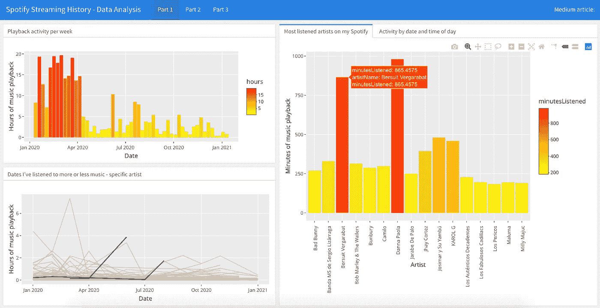

用于在 Spotify 上查看流媒体历史记录的仪表盘。文末的链接。

我可以非常自豪地说，我是那些仍然有幸去最好的音乐 CD 店购买他们最喜欢的艺术家的最新唱片的人之一。我记得当时我只有 15 岁左右(在这个年龄，我们大多数人都会接受一种音乐类型、乐队和我们觉得认同的艺术家)，它对我来说代表了一个完整的仪式，从不知疲倦的寻找到那个神奇的时刻，在那个时刻，第一首曲目的第一个音符在立体声音响或戴着耳机的随身听上以最大音量播放。音乐很可能是来自另一个星系的任何文明(如果有的话)通过将我们自己识别为人类而向我们发出的信号之一。

> “沉默之后，最接近表达不可表达的东西是音乐”
> ——阿尔多斯·赫胥黎。

像生活中的一切事物一样，随着时间的推移，音乐也在变化和转变，进化(或者奇怪地变异？).这也发生在我们听音乐和消费音乐的方式上。17 年后的今天，我的仪式不复存在，也很少有商店出售音乐 CD，随着时间的推移，我完全用订阅世界上最受欢迎的音乐流媒体服务的便利取代了它们: **Spotify** 。根据最近的统计数据，全球 35%的音乐流媒体服务订阅者订阅了 Spotify，几乎是 Apple Music 订阅者的两倍，远高于亚马逊、Deezer 和其他平台。

这就是为什么我觉得能够利用这样一个事实很有趣，即 Spotify 像当今几乎任何应用程序一样，允许你下载它保护的个人账户数据。这包括你的回放活动，搜索历史，以及其他 JSON 格式的东西。

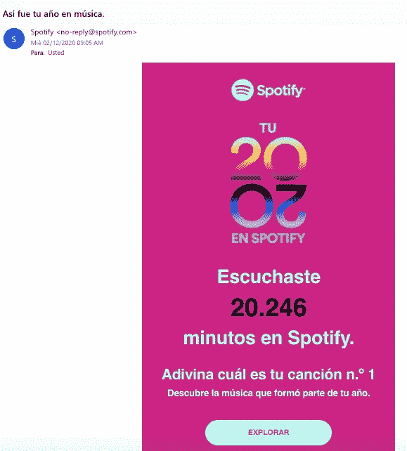

截图:Spotify Mail《2020 年回顾》

是的，我知道 Spotify 年复一年非常友好地向你提供“年度回顾”，提供关于你的习惯和消费的信息。毫无疑问，在 12 月，你收到了一封电子邮件，邀请你探索这一年的活动。

然而，除了仔细检查 Spotify 不会单独提供给你的其他数据之外，看看事情是如何自己完成的总是很有趣，也更有趣。

我还想让你知道一个有趣的包，叫做**“spotifyr”**，它可以让你轻松地用 Spotify API 更深入地了解你的音乐品味。但是，嘿，就像开膛手杰克说的……让我们分开走吧。

# 在哪里以及如何获得我在 Spotify 上的数据副本？

你必须用你的用户名和密码登录，才能进入你的个人 Spotify 账户隐私设置的网址:[https://www.spotify.com/us/account/privacy/](https://www.spotify.com/us/account/privacy/)。在那里，你会发现几乎在页面的末尾有一个部分，其文本为**“下载你的数据”**，它邀请你通过三个简单的步骤下载你的数据。

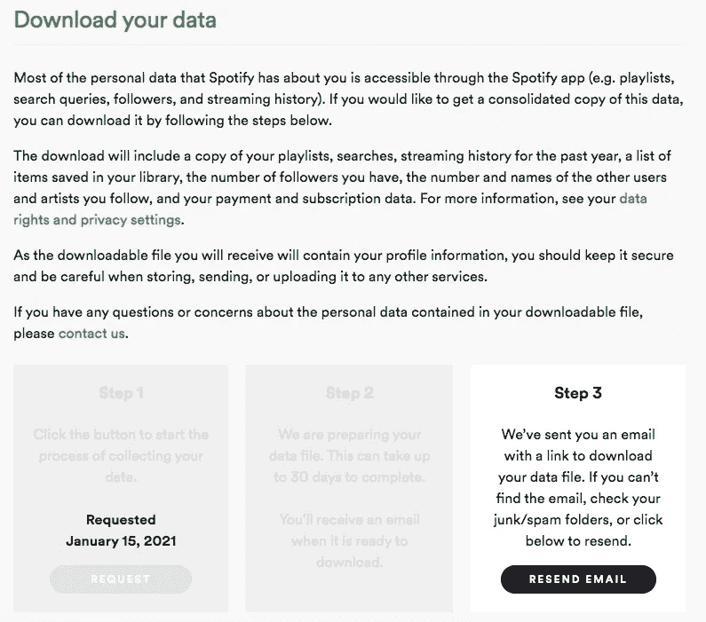

截图:Spotify 个人账户中的隐私设置

一旦您提出请求，出于安全考虑，Spotify 将向您发送一封电子邮件，以确认确实是您请求了该数据副本。有必要确认你收到的邮件。

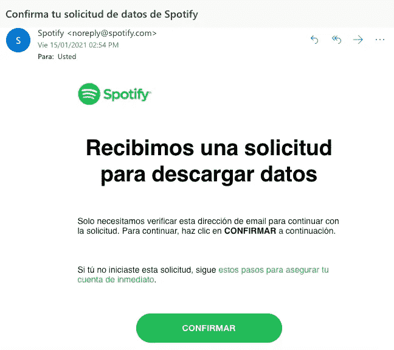

截图:请求在 Spotify 中复制个人数据的确认邮件

确认后，Spotify 几乎会立即向您发送另一封电子邮件，通知您您的请求已成功，但您必须等待 30 天，在此期间，Spotify 会收集您的信息并发送给您。不要绝望，等待进一步的通知。

实际上，我认为这在很大程度上取决于你在这个平台上的活跃程度。对比我活跃的其他账户的测试花了将近 30 天，而对我来说，在提出请求三天后，我收到了邀请我下载数据的最后一封电子邮件。几天后，你会发现自己收到了如下邮件。

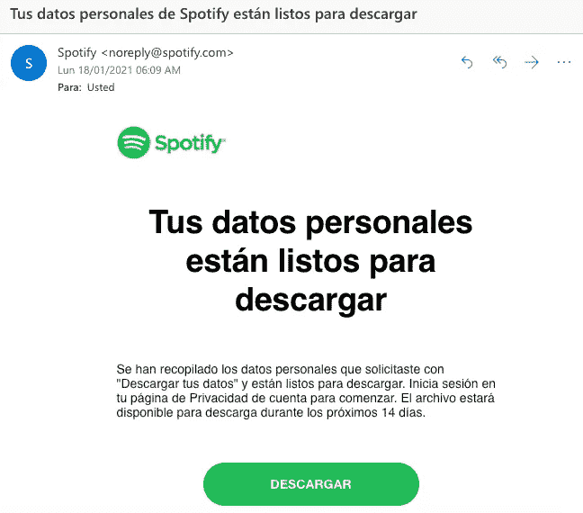

截图:电子邮件邀请您在 Spotify 上下载您的个人数据副本

通过点击**“下载”**按钮，您将再次被重定向到您的 Spotify 帐户的隐私设置页面，出于安全原因，即使您已经登录，它也会要求您再次输入密码。完成后，您将在浏览器中自动看到一个名为**“my _ Spotify _ data . zip”**的文件正在下载中。请记住，正如上一封邮件中提到的，从邮件发送到您手中起，您最多只有 14 天的时间来下载您的文件，否则，您将不得不重新申请。

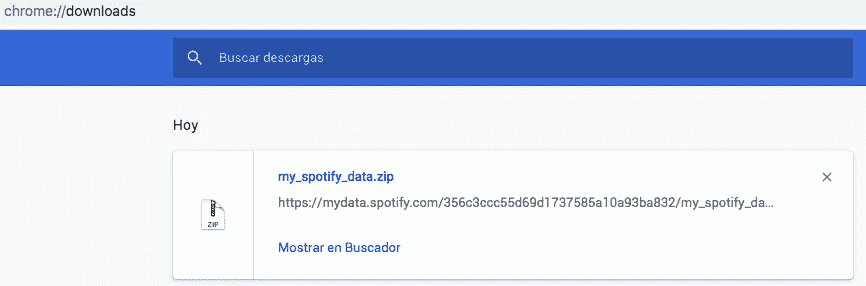

截图:在 chrome 中下载文件“my_spotify_data.zip”

恭喜你，你现在在 Spotify 上有了你的个人资料。我希望你不必等太多天。

# 在 Spotify 上阅读您的播放历史

当你解压你下载的文件时，你会发现一个名为**“我的数据”**的文件夹，它包含了 JSON 格式的不同文件，其中有一个非常特别的文件包含了你感兴趣的信息:你的播放历史，文件名为**“streaminghistory 0 . JSON”**。

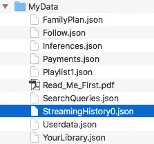

截图:解压后的“my_spotify_data.zip”文件

如果你的账户比我的账户有更多的活动，你很可能会发现自己有不止一个文件，后面是下一个数字。比如:“StreamingHistory **1** 。json》、《流历史 **2** 。json”等。Spotify 会将你的全部历史记录分成不超过 1.5 MB 的文件。一个需要考虑的细节:Spotify 只保留你的数据和历史记录一年。拥有一个完整的历史记录是很棒的，例如，我使用这个平台刚刚超过六年，但是现在，分析去年的数据就足够了。

现在，您可以开始创建新的 R 脚本了。除了读取 JSON 格式的历史文件之外，首先要确定将要使用的库的负载。

```
# REQUIRED LIBRARIESlibrary(jsonlite)
library(lubridate)
library(gghighlight)
library(spotifyr)
library(tidyverse)
library(knitr)
library(ggplot2)
library(plotly)# READING JSON STREAMING HISTORYstreamHistory <- fromJSON("StreamingHistory0.json", flatten = TRUE)
```

你会发现，你的历史基本上包含了四个变量，你将与这些变量一起玩**【结束时间】****【艺人名称】****【曲目名称】****【ms played】**。

你还会注意到你已经加载了**“spotifyr”**库，我现在告诉你的只是一个介绍，它属于用户在 GitHub“Charlie 86”中创建的包，它将允许你轻松地使用 Spotify API 来获得额外的细节。除了本文中的例子，您还可以在库中找到其他有趣的例子:[https://github.com/charlie86/spotifyr](https://github.com/charlie86/spotifyr)。

# 在哪些日期，你在 Spotify 上听了或多或少的音乐？

这是你可以回答的第一个问题。从我们的变量开始，你可以定义小时，分钟和秒，以及基本上任何时间性。你可以先画一张图，观察你在 Spotify 上全年的活动行为，比如每周一次。

```
# ADDING DATE AND TIMINGmySpotify <- streamHistory %>% 
  as_tibble() %>% 
  mutate_at("endTime", ymd_hm) %>% 
  mutate(endTime = endTime - hours(6)) %>% 
  mutate(date = floor_date(endTime, "day") %>% as_date, seconds = msPlayed / 1000, minutes = seconds / 60)# PLAYBACK ACTIVITY PER WEEK AND HOURSstreamingHours <- mySpotify %>% 
  filter(date >= "2020-01-01") %>% 
  group_by(date) %>% 
  group_by(date = floor_date(date, "week")) %>%
  summarize(hours = sum(minutes) / 60) %>% 
  arrange(date) %>% 
  ggplot(aes(x = date, y = hours)) + 
  geom_col(aes(fill = hours)) +
  scale_fill_gradient(low = "yellow", high = "red") + 
  labs(x= "Date", y= "Hours of music playback") + 
  ggtitle("On what dates I've listened to more or less music on Spotify?", "Playback activity per week")
streamingHours
```

结果，你会得到一个类似下面的图，在我的例子中，Spotify 的使用在 4 月份之后的减少是非常明显的。也许在很大程度上，这是因为在 2020 年 4 月，当我们被新冠肺炎强迫在家工作时(至今)，我最喜欢听音乐的时候是在办公室，而今天在家工作的我们轮流在他们的平台上播放他们的音乐。

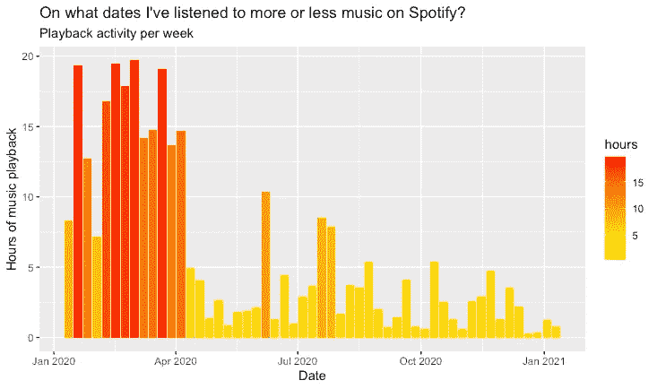

Spotify 上你的历史和音乐品味的数据分析和可视化——每周播放时间图

# 你在哪些日期或多或少听了某个特定艺术家的音乐？

另一个问题，你可以用一个非常简单的方式来回答，并用一个折线图来可视化，你也可以使用 **"gghighlight"** 库，并通过 **artistName** 变量来突出显示你正在寻找的结果。

```
# PLAYBACK ACTIVITY PER SPECIFIC ARTISThoursArtist <- mySpotify %>% 
  group_by(artistName, date = floor_date(date, "month")) %>% 
  summarize(hours = sum(minutes) / 60) %>% 
  ggplot(aes(x = date, y = hours, group = artistName)) + 
  labs(x= "Date", y= "Hours of music playback") + 
  ggtitle("On what dates I've listened to more or less music by a specific artist?", "E.g: Alton Ellis and Jarabe de Palo") +
  geom_line() + 
  gghighlight(artistName == "Alton Ellis" || artistName == "Jarabe De Palo") 
hoursArtist
```

例如，在我的例子中，我选择了两个我经常听的艺术家:“Alton Ellis”，一个 rocksteady 流派图标，和“Jarabe de Palo”，一个西班牙语摇滚图标，结果获得了下面的情节。有一个非常臭名昭著的峰值听后者，因为只有在 2020 年 6 月，他的歌手，Pau Donés，不幸去世，这一天，我播放了他的许多歌曲，以示敬意。

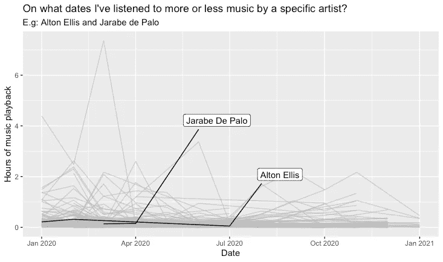

Spotify 上您的历史和音乐品味的数据分析和可视化——按日期和特定艺术家显示播放时间

# 你在 Spotify 上听得最多的艺术家是哪些？

你可以设定一个最小播放时间，并从中找出你听得最多的艺术家。例如，让我们说，你认为听得最多的是那些你花了至少 3 个小时或更多时间播放的艺术家。

```
# MOST LISTENED ARTISTS (MORE THAN 3 HOURS)minutesMostListened <- mySpotify %>% 
  filter(date >= "2020-01-01") %>% 
  group_by(artistName) %>% 
  summarize(minutesListened = sum(minutes)) %>% 
  filter(minutesListened >= 180) %>%
  ggplot(aes(x = artistName, y = minutesListened)) + 
  geom_col(aes(fill = minutesListened)) +
  scale_fill_gradient(low = "yellow", high = "red") + 
  labs(x= "Artist", y= "Minutes of music playback") + 
  ggtitle("What were the most listened artists on my Spotify?", "> 3 hours listened") +
  theme(axis.text.x = element_text(angle = 90))
minutesMostListened
```

你会得到一个类似于下图的情节，在其中你可以查看这些艺术家。就我而言，像你们中的许多人一样，我和我的女朋友分享我的账户，所以我可以主要观察各种各样的拉丁流行艺术家。

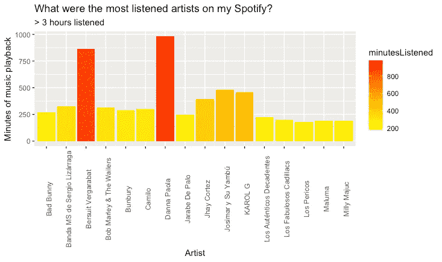

Spotify 上你的历史和音乐品味的数据分析和可视化——最受欢迎艺术家图

# 您在 Spotify 上的播放活动在什么时候最多？

你可以通过热图查看你完整历史的活动日志，观察这个习惯是如何随着时间而改变的。

```
# PLAYBACK ACTIVITY BY DATE AND TIME OF DAYtimeDay <- mySpotify %>% 
  filter(date >= "2020-01-01") %>% 
  group_by(date, hour = hour(endTime)) %>% 
  summarize(minutesListened = sum(minutes)) %>% 
  ggplot(aes(x = hour, y = date, fill = minutesListened)) + 
  geom_tile() + 
  labs(x= "Time of the day", y= "Date") + 
  ggtitle("When has there been more playback activity on my Spotify?", "Activity by date and time of day") +
  scale_fill_gradient(low = "yellow", high = "red")
timeDay
```

因此，你会发现下面的情节，其中一个非常直观的方式，你可以看到，如果有变化，在你平时听音乐的时间。以我为例，2020 年 4 月后，主要在晚上听音乐的习惯改变了。

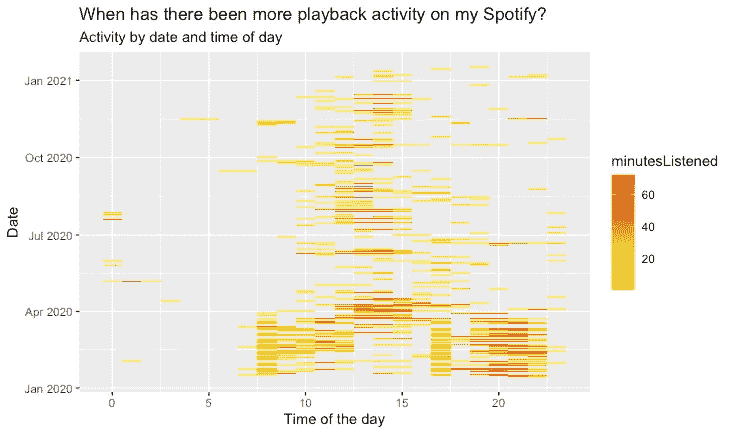

Spotify 上您的历史和音乐品味的数据分析和可视化——按日期和时间划分的活动图

您还可以创建一个条形图，以便更详细地查看一天中您的帐户上最高活动记录的时间。

```
# PLAYBACK ACTIVITY BY TIME OF THE DAYhoursDay <- mySpotify %>% 
  filter(date >= "2019-01-01") %>% 
  group_by(date, hour = hour(endTime), weekday = wday(date, label = TRUE))%>% 
  summarize(minutesListened = sum(minutes))hoursDay %>% 
  ggplot(aes(x = hour, y = minutesListened, group = date)) + 
  geom_col(fill = "#ff6600") +
  labs(x= "Time of the day", y= "Minutes of music playback") + 
  ggtitle("What time of day I've listened to the most music on Spotify?", "Activity from 0 to 24 hours")
```

你将能够观察到复制的累积分钟数更多的具体时间。以我为例，一天中没有一段时间我不使用我的帐户至少几分钟来听一些东西，即使是在失眠的时候。


Spotify 上您的历史和音乐品味的数据分析和可视化——按时间划分活动

# 一周中的哪几天你的 Spotify 播放量最大？

您也可以通过创建另一个热图来回答这个问题，但这一次可视化星期几和一天中的时间之间的关系。

```
# PLAYBACK ACTIVITY BY TIME OF THE DAY AND WEEKDAYhoursDay %>% 
  group_by(weekday, hour) %>% 
  summarize(minutes = sum(minutesListened)) %>% 
  ggplot(aes(x = hour, weekday, fill = minutes)) + 
  geom_tile() + 
  scale_fill_gradient(low = "yellow", high = "red") +
  labs(x= "Time of the day", y= "Weekday") + 
  ggtitle("What weekday and time of day I've listened to the most music on Spotify?", "Weekly activity from 0 to 24 hours")
```

您将能够观察到一周中的哪一天标志着您的帐户中更大的活动趋势。例如，在我的例子中，我可以清楚地看到在星期二、星期四和星期五有更多的活动记录。

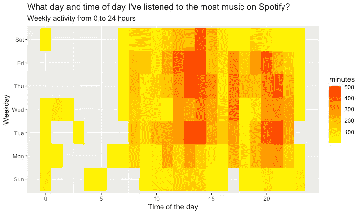

Spotify 上您的历史和音乐品味的数据分析和可视化——按一天中的小时和一周中的天绘制活动图

查看之前获得的详细信息的另一种方法是创建一个折线图。

```
# PLAYBACK ACTIVITY BY TIME OF THE DAY AND WEEKDAY - LINE CHARTweekDay <- hoursDay %>% 
  group_by(weekday, hour) %>% 
  summarize(minutes = sum(minutesListened)) %>% 
  ggplot(aes(x = hour, y = minutes, color = weekday)) + 
  geom_line() +
  labs(x= "Time of the day", y= "Minutes of music playback") + 
  ggtitle("What weekday and time of day I've listened to the most music on Spotify?", "Line chart - Weekly activity from 0 to 24 hours") 
weekDay
```

从我的情况来看，周日绝对是我听音乐最少的日子。结果你会得到一个类似下图的图，你也可以看到哪一天你的播放活动最少。

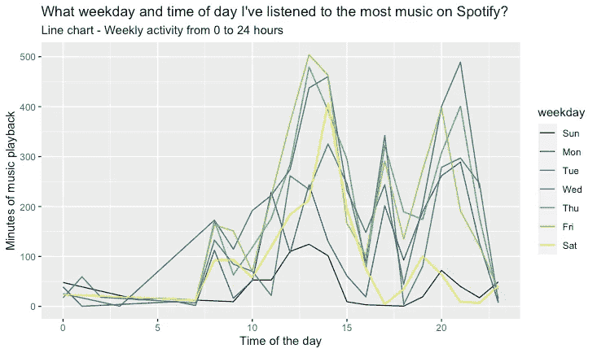

Spotify 上您的历史和音乐品味的数据分析和可视化——按一天中的小时和一周中的天绘制活动图

尽管在获得之前的可视化结果后，这种情况将被排除，但您也可以创建另一个图表，以查看您的帐户中哪一天(工作日或周末)的活动最频繁。

```
# PLAYBACK ACTIVITY BY DAY TYPEdayType <- hoursDay %>% 
  mutate(day_type = if_else(weekday %in% c("Sat", "Sun"), "weekend", "weekday")) %>% 
  group_by(day_type, hour) %>% 
  summarize(minutes = sum(minutesListened)) %>% 
  ggplot(aes(x = hour, y = minutes, color = day_type)) + 
  geom_line() +
  labs(x= "Time of the day", y= "Minutes of music playback") + 
  ggtitle("What day type I've listened to the most music on Spotify?", "Weekday and weekend activity from 0 to 24 hours") 
dayType
```

然后，您将获得一个类似于下图的图，通过一天中的类型和时间来识别您的帐户的活动。

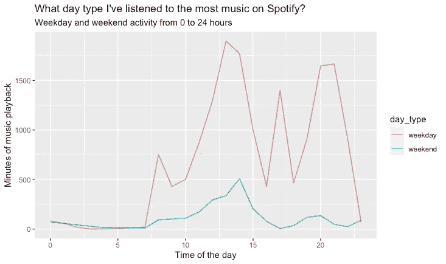

Spotify 上您的历史和音乐品味的数据分析和可视化——按一天中的时间和类型划分的活动图

# 让我们来玩玩“spotifyr”:在 R 中设置一个新的应用程序

是时候看看**“spotifyr”**包是如何工作的了。正如我在开头提到的，基本上这个包可以让我们连接到 [**Spotify API**](https://developer.spotify.com/documentation/web-api/reference/#reference-index) 。Spotify 存储了关于其平台上的歌曲、艺术家和专辑的非常有趣的数据，如流行度、能量、效价、它的“可跳舞”程度等。

为了能够通过“spotifyr”开始消费这些数据，你要做的第一件事是从 r 中的应用程序建立一个连接，为此你主要需要获得两个参数: **SPOTIFY_CLIENT_ID** 和 **SPOTIFY_CLIENT_SECRET** 。这些是从 Spotify 开发者门户网站获得的，在 https://developer.spotify.com/dashboard/applications[创建了一个新的应用程序](https://developer.spotify.com/dashboard/applications)，你将被要求使用与你的 Spotify 帐户相同的凭证登录。

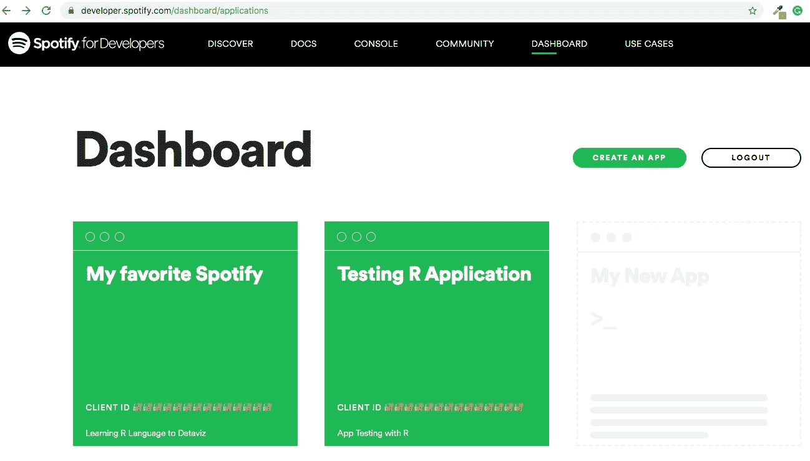

截图:Spotify 网站上的仪表盘开发者

登录后，您会发现一个仪表板，您可以在其中创建和管理您创建的应用程序。你必须点击“创建一个应用程序”按钮来建立一个新的应用程序，并为它分配一个名称和描述。


截图:在 Spotify 上创建一个新应用

然后，您将立即看到我们需要的两个参数，客户端 ID 和客户端密码。显然，我编辑了下面作为例子的图片，但是你的应该是完整的。

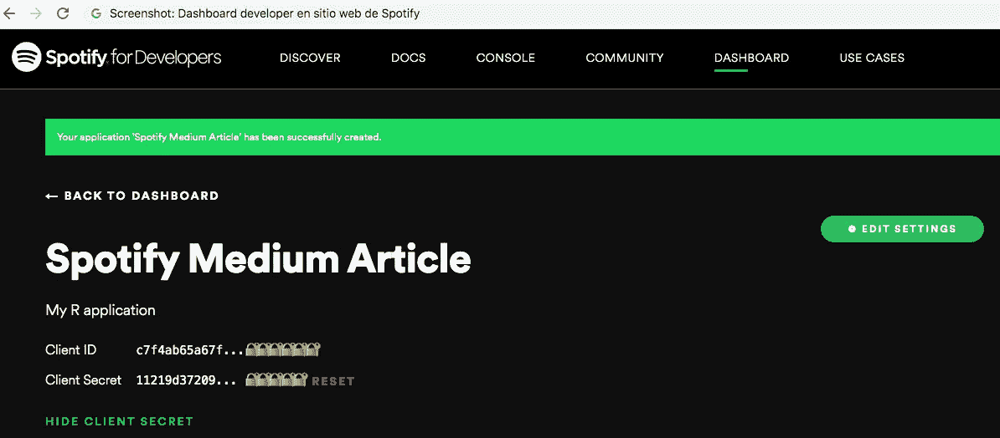

截图:Spotify 上一个新应用中的客户端 ID 和客户端机密

“spotifyr”软件包的作者在他的知识库中让我们知道了以下内容，我引用如下:

> 对于某些功能和应用程序，你需要以 Spotify 用户的身份登录。为此，您的 Spotify 开发人员应用程序需要有一个回调 URL。您可以将它设置为任何适合您的应用程序的值，但是一个好的默认选项是 http://localhost:1410/

换句话说，最后，您必须添加 URL 回调(http:// localhost:1410/)，单击绿色的“编辑设置”按钮，然后保存更改。

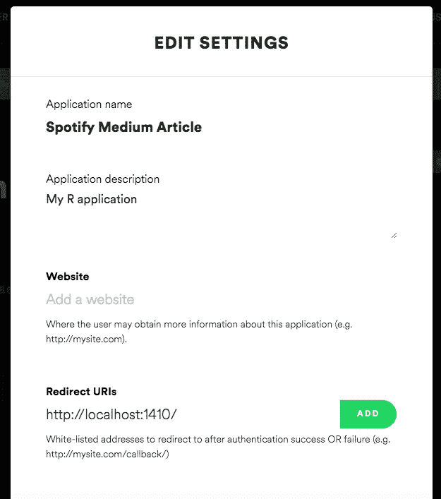

截图:在 Spotify 的新应用中设置回拨 URL

很好，现在您已经准备好开始使用“spotifyr”了。在您的 R 脚本中，您必须首先执行一个函数，以便使用 Spotify 对其进行授权。

```
# ESTABLISH CONNECTION SPOTIFY APISys.setenv(SPOTIFY_CLIENT_ID = 'YOUR_CLIENT_ID_HERE')
Sys.setenv(SPOTIFY_CLIENT_SECRET = 'YOUR_CLIENT_SECRET_HERE')get_spotify_authorization_code()
```

一旦执行了**" get _ Spotify _ authorization _ code()"**函数，您将在浏览器中看到一个新窗口，您的应用程序将在该窗口中请求权限。

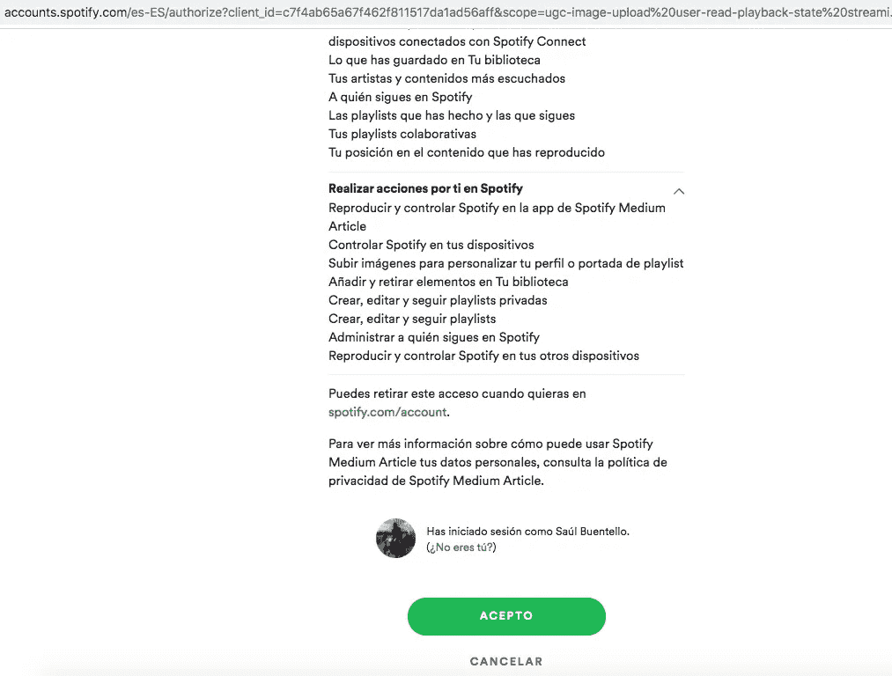

截图:接受 Spotify 上的应用权限

接受时，您将立即看到一个文本，表明身份验证成功，因此您现在可以关闭该窗口，返回到 r。

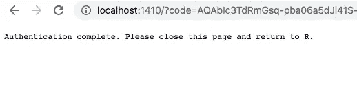

截图:Spotify 上的认证

这里一切都好吗？很好，所以现在，您可以利用“spotifyr”从 r。

# 在特定的播放列表中，你最不喜欢听的歌曲是什么？

在回答这个问题的同时，你可以给出用“spotifyr”可以获得的数据的第一种方法。亲爱的读者，我很确定你和我一样，有一个或多个播放列表，或者是你最喜欢的歌曲，或者是你最喜欢的流派，或者是为了那些特殊的场合。在 Spotify 上登录您的帐户，从您的库中选择任何播放列表，并复制其 URL 的唯一标识符。

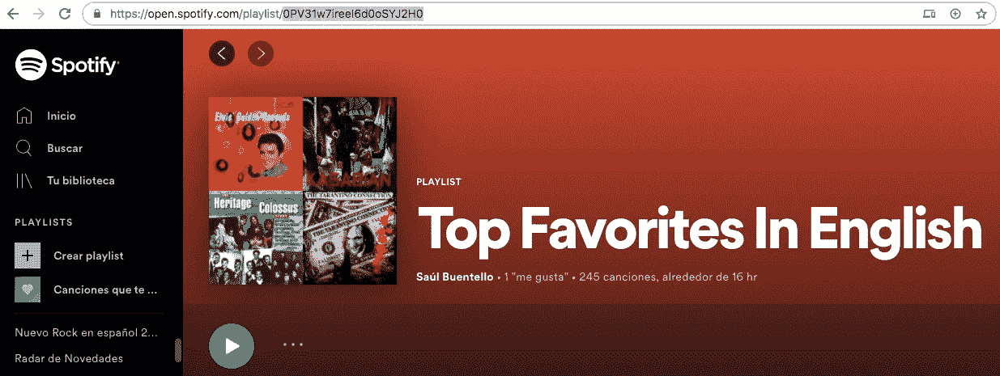

截图:浏览器中 Spotify 上的播放列表

例如，我有一个播放列表，其中有我最喜欢的英文歌曲，我将以该播放列表为例，但你可以对任何人这样做。为此，除了您的用户名之外，您还需要我提到的那个标识符，以将它们作为参数传递，并使用**" get _ playlist _ audio _ features()"**函数，使用该函数，您将从生成新数据帧的播放列表中获得大量信息。

```
# GET SPECIFIC PLAYLIST FEATURESplaylist_username <- 'cosmoduende'
playlist_uris <- c('0PV31w7ireeI6d0oSYJ2H0')
playlistFavsEnglish <- get_playlist_audio_features(playlist_username, playlist_uris)
```

停下来看看这个新数据框包含的每个变量会花费我们很长时间，我建议您稍后仔细看看它在 R 中的内容。你会惊讶于你能处理的有价值的数据。

回到最初的问题，你可以用**“track . popularity”**来回答这个问题，它包含了每首歌的流行度，范围从 0 到 100。考虑到这一点，你可以确定最不受欢迎的曲目是那些从 0 到 35 的曲目，并想象哪些是你在 Spotify 的播放列表中听到的稀有曲目。

```
# PLOT LESS POPULARITY TRACKS ON SPECIFIC PLAYLISTplaylistFavsEnglish %>% 
  group_by(track.popularity) %>% 
  filter(track.popularity <= "35") %>%
  ggplot(aes(x = track.name, y = track.popularity)) + 
  geom_col(aes(fill = track.album.name)) +
  labs(x= "Track name", y= "Popularity") + 
  ggtitle("What are the least popular songs I listen to on Spotify?", "Popularity ranking < 35 in a specific playlist") +
  theme(axis.text.x = element_text(angle = 90))
```

结果，你会得到一个类似于下图的图，你可以看到哪些是你选择的播放列表中那些不太受欢迎的歌曲。显然，根据播放列表的大小，您可能会获得更多或更少的曲目。

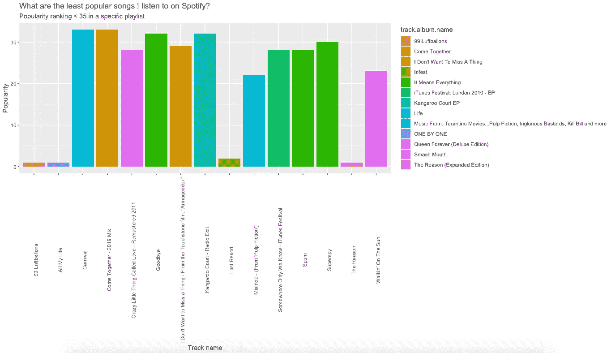

Spotify 上您的历史和音乐品味的数据分析和可视化——特定播放列表中不太受欢迎的歌曲的图表

# 根据你添加为“喜欢”的歌曲，你最喜欢的 10 位艺术家是谁？

你可能已经注意到，在 Spotify 的许多应用中，给你听的歌曲甚至整张专辑“点赞”也就是“♥”并不陌生。无论是从您的桌面应用程序，从应用程序，还是从网络版本，它总是可用的。


截图:伊基·波普赛道上的“赞”

这极大地允许 Spotify 改进其推荐算法，如果你想知道的话，能够根据你的口味对你可以听的其他内容提出新的建议。

你可以在[https://open.spotify.com/collection/tracks](https://open.spotify.com/collection/tracks)查看你添加到 Spotify 账户的所有歌曲

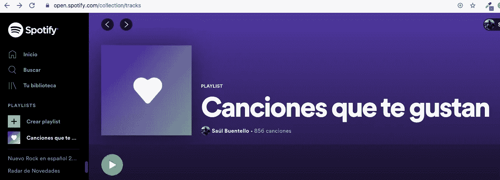

截图:你在 Spotify 上“喜欢”的歌曲集

是时候使用**“get _ my _ saved _ tracks()”**函数来获取关于您在某个时候“喜欢”的歌曲的完整集合的所有信息，从而生成包含许多新信息的新数据帧。Spotify 设置了请求限制，每次请求最多可以获得 50 个项目，但你可以通过**“偏移”**获得更多项目，跳过项目并获得更多项目。

```
# GET FAVORITE TRACKSmyFavTracks <- ceiling(get_my_saved_tracks(include_meta_info = TRUE)[['total']] / 50) %>%
  seq() %>%
  map(function(x) {
    get_my_saved_tracks(limit = 50, offset = (x - 1) * 50)
  }) %>% 
  reduce(rbind) %>%
  write_rds('raw_myFavTracks.rds')
```

如果你记得自从你在 Spotify 上开了账户后，你给了“赞”的第一首歌曲是什么，那会很有趣。您将使用包 **"lubridate"** 来处理日期，将日期从字符类转换成日期类。

```
# GET FIRST ADDED LIKED TRACKmyFavTracks %>%
  mutate(added_at = ymd_hms(added_at)) %>%
  arrange(added_at) %>%
  head(1, wt = added_at) %>%
  select(track.name, track.album.name, added_at)  %>%
  kable()
```

以我为例，我可以看到第一首歌是 2015 年 Vicentico 的，他是我最喜欢的“西班牙摇滚”乐队之一“Los Fabulosos Cadillacs”的主唱。

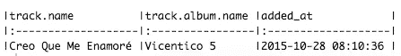

屏幕截图:控制台显示第一首歌曲被添加为“喜欢”

变量 **"track.artists"** 存储为一个列表，记住不是所有的歌曲都是由一个艺术家创作的，所以你需要从列表中提取到列表中。在这种情况下，您将选择**“id”**作为艺术家品牌，以避免名称重复，然后，您将添加**“n”**，作为曲目数量列。最后，您可以创建图来查看获得的结果。为了避免改变频率组的顺序，我建议将类别变量转换为因子变量。

```
# GET TOP ARTISTS BASED ON LIKED TRACKSfavTracksArtist <- myFavTracks %>%
  select(track.artists) %>%
  reduce(rbind) %>%
  reduce(rbind) %>%
  select(id, name)trackNumArtist <- favTracksArtist %>%
  count(id, sort = TRUE) %>%
  left_join(favTracksArtist, by = 'id',.) %>%
  unique() %>%
  select(-id) %>%
  top_n(10, n)# PLOT TOP 10 ARTISTS BASED ON LIKED TRACKSplotMyFavs <- trackNumArtist %>%
  mutate(freq = case_when(n > 100 ~ '> 100 tracks',
      between(n, 50, 99) ~ '50-99 tracks',
      between(n, 20, 49) ~ '20-49 tracks',
      TRUE ~ '< 20 tracks')) %>%
  mutate(freq = factor(freq, levels = c('> 100 tracks', '50-99 tracks', '20-49 tracks', '< 20 tracks'))) %>%
  ggplot(mapping = aes(x = reorder(name, -n), y = n, fill = freq)) +
  geom_col() +
  scale_fill_brewer(palette="Dark2") +
  labs(x= "Artist name", y= "Number of tracks", fill = NULL) +
  ggtitle("What are my Top 10 favorite artists?", "Based on my ♥ tracks") +
  theme(axis.text.x = element_text(angle = 90))
plotMyFavs
```

你将得到一个类似于下图的结果，在其中你可以看到你最喜欢的 10 位艺术家，按照你“喜欢”的每一位艺术家的曲目数量进行分类。是的，举例来说，你可以看出我是本伯里的粉丝。

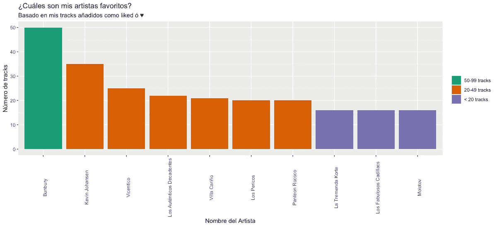

Spotify 上您的历史和音乐品味的数据分析和可视化——基于喜欢的曲目的十大最喜欢的艺术家图

# 告诉我你听谁的…我会告诉你你怎么样

我们特别被某些艺术家或某些音乐流派所吸引，因为我们感觉被认同了，所以我们把它作为我们自己和我们个人文化的一部分。在我看来，尤其是音乐可以揭示你的个性。

继续上面获得的信息，看看你最喜欢的艺术家在他们的音乐创作中表达了什么样的感受也是很有趣的。它们传达和平、喜悦、愤怒、悲伤吗？好吧，你可以用 Spotify 建立的两个衡量标准来找出答案:**价态**和**能量**。由 Spotify 定义，valence 定义如下:

> 从 0.0 到 1.0 的测量值，描述轨道所传达的音乐积极性。高价曲目听起来更积极(例如，快乐、愉快、欣快)，而低价曲目听起来更消极(例如，悲伤、沮丧、愤怒)。

另一方面，能量对它的定义如下:

> 能量是一种从 0.0 到 1.0 的度量，代表强度和活动的感知度量。通常，高能轨道感觉起来很快，很响，很嘈杂。例如，死亡金属具有高能量，而巴赫前奏曲在音阶上得分较低。对该属性有贡献的感知特征包括动态范围、感知响度、音色、开始速率和一般熵。

通过这两个测量，您可以创建一个带有散点图的象限来揭示这些信息。你这次可以利用**“get _ artist _ audio _ features()”**函数，它基本上期望你的艺人名字作为参数，返回给你很多关于她的专辑和曲目的信息，包括价态和能量。举例来说，只取你以前获得的前 10 名中最喜欢的前四名艺术家，稍后在“情感象限”中创建和可视化所获得的结果。

```
# GET FEATURES TOP FOUR FAVORITE ARTISTSfavArtist1 <- get_artist_audio_features(artist= "Bunbury")
favArtist2 <- get_artist_audio_features(artist= "Kevin Johansen")
favArtist3 <- get_artist_audio_features(artist= "Vicentico")
favArtist4 <- get_artist_audio_features(artist= "Los Auténticos Decadentes")# MAKE A SINGLE DATA FRAMEtopFourArtists <- rbind(favArtist1, favArtist2, favArtist3, favArtist4)# PLOT EMOTIONAL QUADRANT TOP FOUR ARTISTSemotionalQuadrant <- ggplot(data = topFourArtists, aes(x = valence, y = energy, color = artist_name)) +
  geom_jitter() +
  geom_vline(xintercept = 0.5) +
  geom_hline(yintercept = 0.5) +
  scale_x_continuous(expand = c(0, 0), limits = c(0, 1)) +
  scale_y_continuous(expand = c(0, 0), limits = c(0, 1)) +
  annotate('text', 0.25 / 2, 0.95, label = "Angry / Turbulent") +
  annotate('text', 1.75 / 2, 0.95, label = "Joyful / Happy") +
  annotate('text', 1.75 / 2, 0.05, label = "Peace / Chill") +
  annotate('text', 0.25 / 2, 0.05, label = "Depressing / Sad") +
  labs(x= "Valence", y= "Energy") +
  ggtitle("Emotional quadrant Top four artists", "Based on energy y valence")  
emotionalQuadrant
```

你可以看到，每个点代表一个特定艺术家的一个轨迹，显示她表达了什么感觉。考虑到你正在查看每个艺术家的整个唱片目录，或者至少是 Spotify 记录的所有专辑。你觉得呢，这也揭示了你的个性吗？

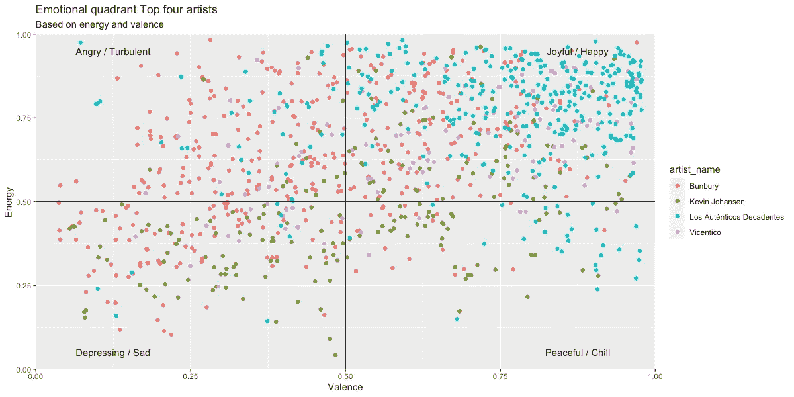

Spotify 上您的历史和音乐品味的数据分析和可视化——“情感象限”图，根据喜欢的曲目列出 10 位最喜欢的艺术家中的前四位艺术家

非常感谢您的善意阅读。和我的大多数文章一样，我在一个 **flexdashboard** 中分享了用**plotely**生成的情节，我把它放在一起更美观一点:[https://rpubs.com/cosmoduende/spotify-history-analysis](https://rpubs.com/cosmoduende/spotify-history-analysis)

在这里你可以找到完整的代码:[https://github.com/cosmoduende/r-spotify-history-analysis](https://github.com/cosmoduende/r-spotify-history-analysis)

感谢你坚持到最后，祝你分析非常愉快，可以把一切都付诸实践，对结果感到惊讶，和我一样开心！