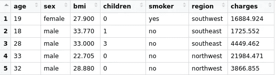
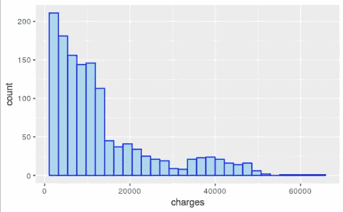
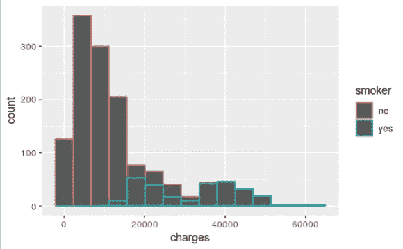
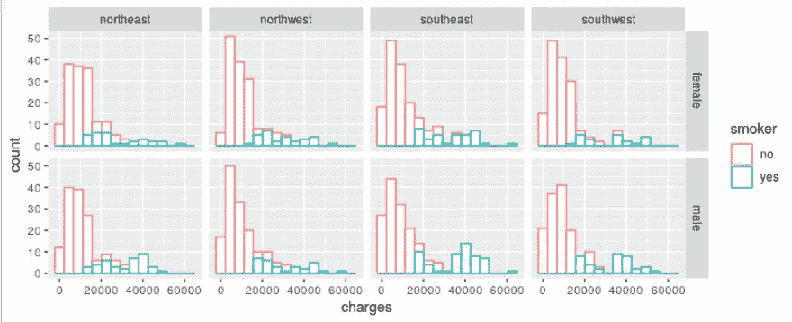
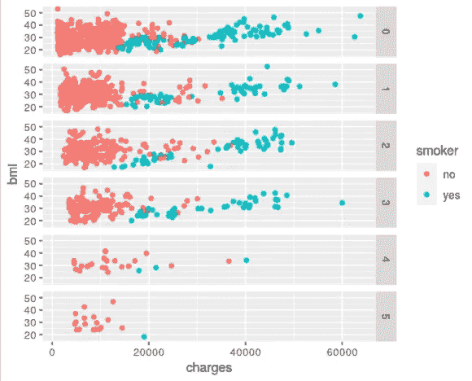
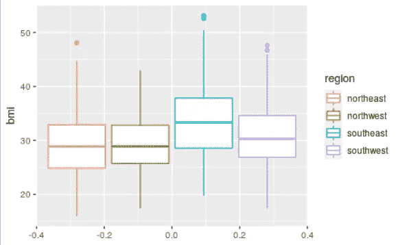
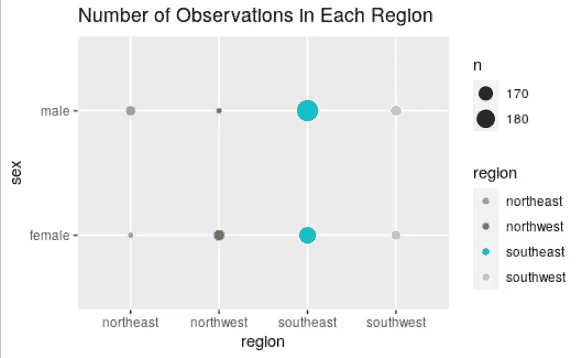

# 使用 ggplot2 可视化浏览数据集

> 原文：<https://towardsdatascience.com/exploring-a-dataset-visually-with-ggplot2-501d1399bc52?source=collection_archive---------19----------------------->

## ggplot2 数据可视化库实用指南


约书亚·厄尔在 [Unsplash](https://unsplash.com/s/photos/explore?utm_source=unsplash&utm_medium=referral&utm_content=creditCopyText) 上的照片

数据可视化是探索性数据分析的有力工具。我们可以用它来揭示数据中的潜在结构或变量之间的关系。基本描述性统计的概述也可以从数据可视化中获得。

数据可视化是数据科学领域的重要内容。因此，这个领域中有许多库和包。尽管它们创建可视化的语法和方法不同，但最终目标是相同的:探索和理解数据。

在本文中，我们将使用 R 编程语言的 ggplot2 库来探索一个医疗成本[数据集](https://www.kaggle.com/mirichoi0218/insurance)。数据集非常适合实践，因为它包含了不同数据类型的变量。

我们在本文中介绍的内容也可以被视为 ggplot2 库的实用指南。我将尝试清楚地解释生成图背后的逻辑，以便您可以将其应用于其他任务和数据集。

我使用 R-studio，这是一个非常流行的 R 编程语言 IDE。第一步是导入库并读取包含数据集的 csv 文件。

```
> library(ggplot2)
> library(readr)
> insurance <- read_csv("Downloads/datasets/insurance.csv")
```



保险表(图片由作者提供)

该数据集包含保险公司客户的个人信息以及他们的保险费用。

在 ggplot2 中，我们首先使用 ggplot 函数创建一个坐标系作为基础层。然后，我们通过指定绘图类型和要绘制的变量来添加层。我们还可以添加进一步的说明，以使可视化更加丰富。

我们的数据集中的目标变量是 charges 列，所以最好从研究这个列开始。我们可以用直方图来显示分布情况。

> 直方图将连续变量的值域划分为离散的区间，并计算每个区间中的观察值数量。

```
> ggplot(insurance) + geom_histogram(mapping = aes(x=charges), color='blue', fill='lightblue')
```

*   我们将数据传递给 ggplot 函数，该函数创建一个坐标系作为基础层。
*   geom_histogram 函数通过根据给定参数绘制直方图，在此坐标系上添加一个图层。我们使用映射参数来指定要绘制的列。颜色和填充参数与绘图的视觉属性相关。



电荷直方图(图片由作者提供)

收费大多低于 2 万。随着该值变高，观察次数减少。让我们把吸烟者和不吸烟者分开，让这个情节更有知识性。

```
> ggplot(insurance) + geom_histogram(mapping = aes(x=charges, color=smoker), bins = 15)
```

我们将用作分隔符的列传递给 aes 函数中的颜色参数。请注意，它不同于我们之前使用的颜色参数，它不在 aes 函数中。

柱参数用于指定直方图中柱的数量。



电荷直方图(图片由作者提供)

我们清楚地看到，吸烟者比不吸烟者被收取更多的保险费。

> ggplot 这个名字来源于 [grammar of graphics](http://vita.had.co.nz/papers/layered-grammar.pdf) 。

我们可以通过添加其他分类变量(如性别和地区)来进一步分隔 charges 列。

ggplot 库提供了 facet_grid 函数来生成子图网格。

```
> t <- ggplot(insurance) + geom_histogram(mapping = aes(x=charges, color=smoker), bins=15, fill='white')> t + facet_grid(rows = vars(sex), cols = vars(region))
```

第一行像前面的例子一样，通过区分吸烟者和非吸烟者创建了一个直方图。在第二行中，我们根据行和列添加了两个额外的维度。用作分隔符的变量在 facet_grid 函数中指定。



直方图网格(图片由作者提供)

我们没有观察到地区之间的显著差异，但我们看到男性比女性更有可能吸烟。

有不同类型的图来研究变量之间的关系。其中之一是散点图，这通常是在比较两个数值变量的情况下首选。

让我们创建一个绘制电荷和 bmi(身体质量指数)之间关系的网格图。我们将使用吸烟者和儿童列作为分隔符。

```
> t <- ggplot(insurance) + geom_point(mapping = aes(x=charges, y=bmi, color=smoker))> t + facet_grid(rows = vars(children))
```



散点图(图片由作者提供)

geom_point 函数生成散点图。我们看不出收费和 bmi 栏之间有明显的关联。然而，吸烟者和不吸烟者是明显分开的。

另一种常用的可视化类型是箱线图。它通过显示值如何以四分位数和异常值的形式分布来概述变量的分布。

下面的代码生成 bmi 列的箱线图。我们将根据 region 列中的类别来区分观察值。

```
> ggplot(insurance) + geom_boxplot(mapping = aes(y=bmi, color=region))
```



bmi 的箱线图(图片由作者提供)

方框中间的线表示中间值。盒子的高度与数值的分布成正比。

东南地区人民的平均体重指数明显高于其他地区的平均水平。东北和西北挺像的。

可视化也可以用来检查不同类别在观察数量方面的大小。只考虑平均值会误导我们，所以最好知道每一类中的观察数量。

ggplot 的 geom_count 函数可用于可视化两个离散变量。例如，显示 region 和 sex 列中类别大小的绘图生成如下。

```
> ggplot(insurance) + geom_count(mapping = aes(x=region, y=sex, color=region)) + labs(title = "Number of Observations in Each Region")
```

我们还使用实验室功能添加了一个标题。它还允许为 x 轴和 y 轴添加标签。



计数图(图片由作者提供)

东南部明显超过其他地区。另一个有趣的发现是，西北地区女性多于男性，而东北地区男性多于女性。

## 结论

我们已经看到了如何使用数据可视化来探索数据集。当然，我们可以生成更多的图来进一步研究变量之间的关系。

随着数据集的复杂性和维数的增加，我们在探索性数据分析中使用更复杂的可视化。然而，基本类型的情节和技术可能是相同的。

感谢您的阅读。如果您有任何反馈，请告诉我。