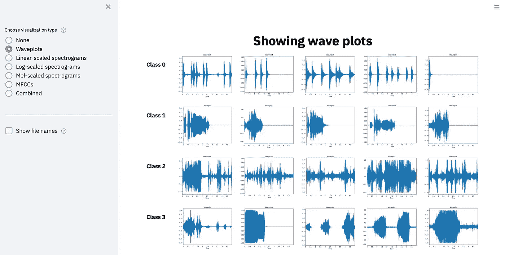

# 使用 Python 探索音频数据集

> 原文：<https://towardsdatascience.com/exploring-audio-datasets-with-python-498c295f73d9?source=collection_archive---------16----------------------->

## 创建一个简单的 GUI 来浏览大型数据集

影像数据集可以轻松浏览。即使我们有数百张图片，我们也可以滚动浏览目录，浏览数据。这样，我们可以很快注意到有趣的属性:颜色、位置、一天中的时间。然而，如果我们对音频数据集使用同样的策略，我们不会走得太远。相反，我们必须一次听一个文件或者跳过一个文件。对于大量的样本，这种方法是禁止的。

一种解决方案是将音频文件可视化。我们不是按顺序听样本，而是画出不同的特征。最基本的图是波形图，如下例所示:

几个音频样本的波形可视化。图片由作者提供。

我们可以看到第一行中的样本都显示出相似的模式。还有，对于第二排来说，声音似乎集中在开头。然后，切换到频谱图表示，我们可以进一步检查样本:

几个音频样本的声谱图的可视化。图片由作者提供。

在 y 轴上，我们看到频率，在 x 轴上，我们看到时间。最后，颜色保存了最后的信息:越亮，这个区域拥有的能量越多。对于我们的第二排，能量似乎集中在前 2、3 秒。

然后，在下一步中，我们取一个样本并同时可视化几个转换，如下所示:

不同可视化技术的综合视图。图片由作者提供。

一遍又一遍地手动完成所有这些是乏味的。但是，多亏了 python 和 streamlit，我们可以开发一个简单的 GUI，在浏览器中呈现。这里可以现场试一下[。](https://share.streamlit.io/phrasenmaeher/audio_exploration/dataset_overview.py)

探索音频数据集的图形用户界面。图片由作者提供。你可以在这里现场试用[，在这里](https://share.streamlit.io/phrasenmaeher/audio_exploration/dataset_overview.py)在 GitHub [上找代码。](https://github.com/phrasenmaeher/audio_exploration)

这个脚本让我们在侧边栏上选择一个可视化类型，然后在主屏幕上可视化每个类的一些示例。对于上面显示的音频样本，我使用了流行的 [ESC-50 数据集](https://github.com/karolpiczak/ESC-50)的子集。该脚本的主要逻辑由 [Akhil Vasvani](https://medium.com/@akhil.vasvani) 大大改进，如下所示:

我们导入所有必需的包和负责创建不同类型可视化的 python 脚本。从第 11 行开始，我们构建了你在上面看到的工具条。在这个侧边栏中，我们创建了一个带有七个不同可视化选项的单选按钮，并添加了一个复选框来显示可选绘图的文件名。如果我们发现了一个特别感兴趣的样本，并希望对其进行进一步的检查，那么这个选项是很有帮助的。从第 24 行开始，我们迭代我们的单选按钮并创建选中的可视化。

如果你想为你的音频数据集使用脚本，你必须采用文件 *audio_loading_utils* 中的 *get_dir_overview()* 方法。它创建了一个 label- > samples 映射，用于选择稍后要可视化的文件。

总而言之，脚本保持相对简单，有许多重复的功能。如果你想添加自己的可视化效果，你可以在[GitHub 库](https://github.com/phrasenmaeher/audio_exploration)中找到完整的代码。

现在我们有了一个脚本和简洁的 GUI 来探索音频数据集，我们可以用它来做什么呢？

如果我们将我们的音频分成片段，我们可以确定片段的长度:它必须足够长以捕捉相关的特征。

如果我们使用光谱图，我们可以评估缩放比例(线性、对数、Mel)或箱数(对于 Mel)。

此外，如果我们使用 MFCCs，我们可以检查系数数量的影响。

最后但同样重要的是，我们可以通过以下方式扩展脚本:

*   添加更多的可视化效果(看看可能的功能选择[这里](https://librosa.org/doc/latest/feature.html#feature-extraction)
*   使参数可选(FFT 大小等。)
*   可视化增强(如果您感兴趣，请从这里的[和这里的](https://share.streamlit.io/phrasenmaeher/audio-transformation-visualization/main/visualize_transformation.py)[开始)](/visualizing-audio-pipelines-with-streamlit-96525781b5d9)