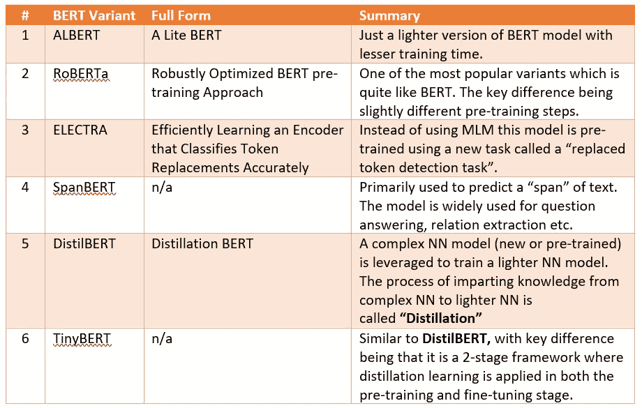

# 探索 BERT 变体(第 1 部分):ALBERT，RoBERTa，ELECTRA

> 原文：<https://towardsdatascience.com/exploring-bert-variants-albert-roberta-electra-642dfe51bc23?source=collection_archive---------4----------------------->

## **对伯特家族的一次温柔的深度探索……**

由[纳迪·博罗迪纳](https://unsplash.com/@borodinanadi?utm_source=medium&utm_medium=referral)在 [Unsplash](https://unsplash.com?utm_source=medium&utm_medium=referral) 上拍摄

我的一个朋友最近开了一家生产食用油的公司。很快，他意识到这个行业竞争太激烈了，为了在残酷的市场中生存，他需要开拓第二种商业模式。这时候，肥皂制造的想法出现了。他意识到肥皂可以作为食用油加工的副产品来生产，而且利润丰厚。最后，他的生意开始蒸蒸日上。

我称之为进化！！

谁会想到，亚马逊这个曾经卖书的公司会钻研利润惊人的云业务。

有时，进化会带来比最初想法更多的东西。

机器学习在过去十年里突飞猛进。尽管具有 ML 前景的每个子领域都有大幅增长，但 NLP 尤其增长最快，NLP 中最大的战略突破是“变形金刚”和“伯特”。毫无疑问，他们已经成为一个杠杆，将 NLP 领域推向更大、更强大的领域。

只是为了刷新关于 BERT 的记忆，这里有一个关于 NLP 作为一个域从 BoW，TFIDF，Word2Vec，RNN，LSTM 到最后 BERT 的增长的故事情节——珍惜旅程。

 [## 注意，变形金刚和伯特:模拟 NLP 之旅

### 几年前，出于一个纯粹的巧合，我们被要求与一群律师一起主持一个关于机器如何…

medium.com](https://medium.com/analytics-vidhya/attention-transformer-and-bert-a-simulating-nlp-journey-2a4abbfb6e74) 

这种发展导致了行业中常用的 BERT 模型的多种变体。在深入研究各种变体之前，有必要修改几个 BERT 概念。

1. **BERT 基本模型**有 12 层，110M 参数，768 个隐层和等嵌入层。这种大尺寸使得训练的计算量非常大。

2. **MLM 和下一句预测(NSP)** :伯特通过对几项任务进行预训练来利用双向性——掩蔽语言模型(MLM)和下一句预测(NSP)

a. **MLM** :在 MLM，模型屏蔽了输入中的一些值，并试图根据上下文预测被屏蔽(缺失)的单词。这里的想法是不要以特定的顺序使用单词，而是以深度双向的方式进行预训练。

b. **NSP** :在训练过程中，模型得到输入的句子对，它还学习预测第二个句子是否是原文中的下一个句子。

现在基础已经建立，让我们从一行程序开始讨论变体。

作者图片

> 鉴于文章的篇幅，我选择将本文分为两部分。。在这一部分，我们将深入探讨前三个变体，即 ALBERT、RoBERTa 和 ELECTRA。第二部分将涵盖其余三个。下面是第二部分的链接:

 [## 探索 BERT 变体(第 2 部分):SpanBERT、DistilBERT、TinyBERT

### 对伯特家族的一次温和的深入探究…

durgiachandan.medium.com](https://durgiachandan.medium.com/exploring-bert-variants-part-2-spanbert-distilbert-tinybert-8e9bbef4eef1) 

所以，让我们开始吧:

1.**阿尔伯特**:如前所述，BERT base 包含 1.1 亿个参数，这使得它的计算量很大，因此需要一个精简的版本。艾伯特模型有 1200 万个参数，768 个隐藏层和 128 个嵌入层。正如所料，较轻的模型减少了训练时间和推理时间。为了获得较少的参数集，使用了以下两种技术:

a.**跨层参数共享**:在此方法中，仅学习第一个编码器的参数，所有编码器使用相同的参数。这些参数可以共享给:

I .仅前馈层

二。前馈和多头关注层

三。只有多头关注层。

b.**因式分解嵌入层参数化**:嵌入层不是保持 768，而是因式分解减少到 128 层。人们可以认为这种分解类似于推荐系统中常用的矩阵分解。如果你想恢复记忆，这里有一篇很好的文章。

 [## 推荐系统—矩阵分解

### 矩阵分解的漫游推荐系统

towardsdatascience.com](/recommendation-system-matrix-factorization-d61978660b4b) 

除了阿尔伯特很轻，不像伯特研究 NSP，阿尔伯特研究一个叫做 SOP(句子顺序预测)的概念。NSP 和 SOP 之间的关键区别在于，对于 NSP，在训练期间，该模型获得输入的句子对，并学习预测第二句话是否是原文中的下一句话。SOP 是一个“分类模型”,其目标是“分类”两个给定的句子是否互换，即它们的顺序是否正确。

2. **RoBERTa** 代表“稳健优化的 BERT 预训练方法”。在许多方面，这是伯特模型的一个更好的版本。区别的要点如下:

a.**动态屏蔽** : BERT 使用静态屏蔽，即句子的相同部分在每个时期被屏蔽。相反，RoBERTa 使用动态屏蔽，其中对于不同的时期，句子的不同部分被屏蔽。这使得模型更加健壮。

b.**移除 NSP 任务**:据观察，NSP 任务对于伯特模型的预训练不是很有用。因此，罗伯塔只带着 MLM 的任务。

c.**更多数据点** : BERT 在“多伦多图书语料库”和“英语维基百科数据集”上进行了预训练，即总共 16 GB 的数据。相比之下，除了这两个数据集，RoBERTa 还在其他数据集上接受了训练，如 CC-News(公共抓取新闻)、Open WebText 等。这些数据集的总大小约为 160 GB。

d.**大批量**:为了提高模型的速度和性能，RoBERTa 使用了 8000 的批量和 300000 个步骤。相比之下，BERT 使用的批量大小为 256，步长为 100 万。

3. **ELECTRA** 代表“有效地学习一个编码器，该编码器准确地对令牌替换进行分类”。该模型使用生成器-鉴别器结构。除了是 BERT 的较轻版本之外，ELECTRA 还具有以下显著特征:

a.**替换令牌检测:**ELECTRA 不使用 MLM 进行预训练，而是使用一个名为“替换令牌检测”(RTD)的任务。在 RTD 中，不是屏蔽记号，而是用错误的记号替换记号，并且期望模型进行分类，不管记号是否被错误的记号替换。

b.**不执行 NSP 预训练**。

c.**更好的训练:**ELECTRA 模型不是仅在掩码数据上进行训练，而是在完整数据上进行训练。

哼！！目前差不多就是这样。

正如他们所说“我们应该不断进化。进化并没有随着我们长出相对的拇指而结束。”令人惊讶的是，一个模型可以通过考虑组件来适应许多版本。

也许这就是保持进化的原因。

*免责声明:本文中表达的观点是作者以个人身份发表的意见，而非其雇主的意见*