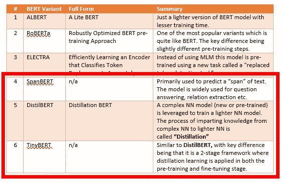
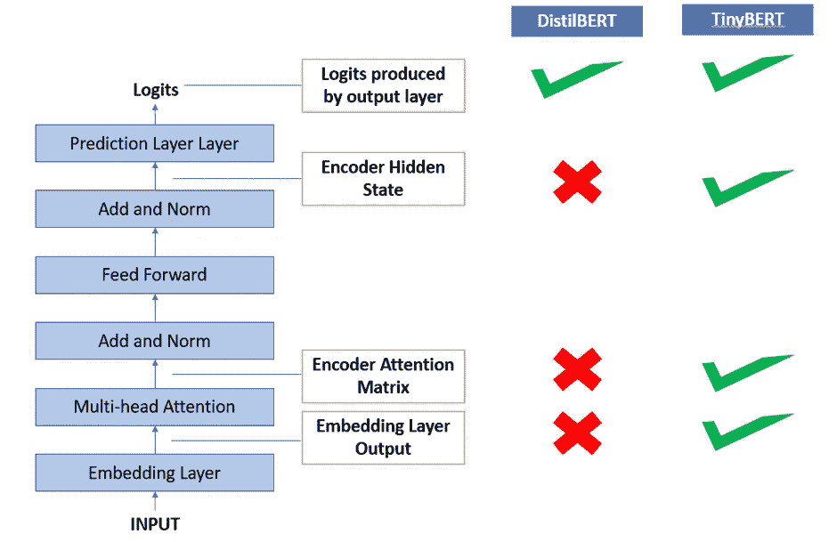

# 探索 BERT 变体(第 2 部分):SpanBERT、DistilBERT、TinyBERT

> 原文：<https://towardsdatascience.com/exploring-bert-variants-part-2-spanbert-distilbert-tinybert-8e9bbef4eef1?source=collection_archive---------22----------------------->

## 对伯特家庭的一次温和的深入探究

纳吉布·卡利尔在 [Unsplash](https://unsplash.com?utm_source=medium&utm_medium=referral) 上的照片

请注意，这是本系列的第 2 部分。本文将深入探讨伯特模型的三个变体的细节，即**斯潘伯特、迪夫伯特、蒂尼伯特。**第 1 部分涵盖了其他三个变体— **ALBERT、RoBERTa 和 ELECTRA。如果你还没有读过第一篇文章，我强烈建议你也读一读。本文利用了第一篇文章中的一些基础知识，并扩展了这些概念。**

以下是快速参考的链接:

</exploring-bert-variants-albert-roberta-electra-642dfe51bc23>  

让我们从三种变体中的一种开始考虑:

作者图片

所以，让我们开始吧:

1.SpanBERT : SpanBERT 是 BERT 的一个特殊变体，其目标是使用模型进行问题回答、关系提取等。为了避免任何混淆，应该注意的是，该模型不是“创建答案”,而是“找到”段落(文本块)中要回答的单词组(跨度)。直观上，这意味着 BERT 模型需要进行以下修改:

**a.** **【字长】掩蔽比【随机掩蔽】:**

让我们考虑一个句子的例子。

**Tokens =** 【数据，科学**，**结合了，领域，专长，编程，技能，和，知识，数学，和，统计】

**在 MLM 的情况下，执行随机屏蔽:**

**令牌=** 【数据，科学，[面具]，领域，[面具]，编程，技能，[面具]，知识，of，数学，[面具]，统计】

然而，对于跨度，掩蔽是随机进行的，但是是在连续单词的跨度上进行的:

**Tokens =** 【数据、科学、组合、【面具】、【面具】、【面具】、【面具】、【面具】、知识、of、数学、统计】

**b .更新损失函数，以便给予“单词跨度”中的记号必要的考虑**

除了屏蔽逻辑的改变之外，成本函数也需要被更新以考虑以下两种情况:

1. **MLM 目标**:预测屏蔽词，即词汇表中所有单词成为屏蔽词的概率。

**2。** **跨度边界目标(SBO):** 对于 SBO，不采用屏蔽记号的表示，而是考虑相邻记号的**表示**。

在我们的例子中:

**Tokens =** 【数据，科学，**结合了**，【面具】，【面具】，【面具】，【面具】，**知识，**的，数学，和，统计

单词**“组合”和“知识”**的表示将用于导出屏蔽令牌。这进一步意味着位置嵌入将用于理解记号的相对位置。

**斯潘伯特总体损失函数= MLM 目标损失+ SBO 目标损失**

该模型被训练以最小化该损失函数。这个预先训练的模型可以用于任何问答任务或关系提取。

**2 和 3。在你在笛卡尔曲线中扬起眉毛之前，我有一个理由来折叠这两个变体。与调整 BERT 模型的某些方面以创建新版本的其他变体不同，DistilBERT 和 TinyBERT 都以不同的方式工作。**

这些变体不调整模型，而是试图通过创建一个较小的模型来减小模型的大小，该模型以某种方式复制了较大模型的输出。

这一过程被称为知识提取，即这些较小的模型提取大模型的知识，并试图以较小的规模获得相似的模型结果。较大和较小模型的通用术语是“学生”和“教师”。如果你想了解更多关于师生框架如何运作以及知识是如何提炼的，请浏览下面的文章。本文还介绍了 DistilBERT 的细节，所以我不打算在这里详细介绍。

[https://towards data science . com/why-you-neural-network-models-d 43681d 9916 f](/why-you-need-to-stop-using-bulky-neural-network-models-d43681d9916f)

总的来说，在 DistilBERT 中，预先训练的网络(教师)被用来训练学生网络，以通过蒸馏从教师网络获得知识。

如果您对 DistilBERT 的工作方式有所了解，TinyBERT 是它的进一步扩展，除了从输出层提取知识之外，TinyBERT 还从中间层提取信息。

即

**TinyBERT =蒸馏+从中间层提取的知识**

下面是解释差异的图示。

图片来自作者

正如所料，TinyBERT 的损失函数不仅包括来自输出层的损失，还包括来自隐藏注意力和嵌入层的损失。

差不多就是这样。希望你喜欢这篇文章，现在所有的 BERT 变体都更加直观了。

如果您有任何问题或意见，请随时留言。

免责声明:本文中表达的观点是作者以个人身份发表的意见，而非其雇主的意见。