# 探索纽约市自行车共享数据

> 原文：<https://towardsdatascience.com/exploring-bike-share-data-3e3b2f28760c?source=collection_archive---------15----------------------->

## 如何从 Citi Bike 访问行程数据，并使用 Python 和 Pandas 准备数据以供分析

许多自行车共享系统为那些想了解他们的系统如何使用的人提供了他们的出行数据。纽约市的自行车共享系统花旗自行车(Citi Bike)就是其中之一，但除了数据之外，他们并没有提供太多信息。我在获取和准备用于可视化的数据方面有一些经验，因此在本文中，我将向您展示如何开始使用这个丰富的数据源。


作者照片

以前，我从新泽西的郊区通勤到我在纽约市的一个办公室做产品经理，现在已经关门了，在宾州车站上面。午餐或下班后，我经常依靠纽约的自行车共享系统花旗自行车(Citi Bike)。我发现我可以比步行更快地到达市中心的目的地，甚至更远的地方，比坐公交车或地铁更便宜。当我发现 Citi Bike 将出行数据公开时，我想这可能会为我管理的数据准备产品提供一个有趣的用例。

使用真实的数据比我们一直使用的样本文件有趣得多，因为需要清除实际的异常，以使数据对分析有用，并且从数据中可以讲述有趣的故事。

旅行数据文件包含每次乘坐的记录，根据季节的不同，每月大约有 200 万条记录。这是一个传统的自行车共享系统，有固定的站点，用户在一个码头用钥匙链或密码取车，然后在另一个码头还车。每次游乐设备开始和停止时的站点和时间被记录下来。

一些关于骑手的有限信息也被记录下来:他们的性别和出生年份。Citi Bike 还区分了他们所谓的购买年卡的用户(目前的费用是 179 美元，不限时骑行 45 分钟)和购买一日卡(15 美元，不限时骑行 30 分钟)或单程卡(3 美元)的客户。

对于每一种用户类型，较长时间的乘坐都有超额费用。对顾客来说，每 15 分钟 4 美元；对于订户，每分钟 0.15 美元。这些费用似乎是为了阻止长途旅行，而不是为了增加收入。

[花旗自行车系统数据](https://www.citibikenyc.com/system-data)页面描述了所提供的信息。每次乘坐的具体信息如下:

*   行程持续时间(秒)
*   开始时间和日期
*   停止时间和日期
*   起点站名称
*   终点站名称
*   车站 ID
*   车站纬度/经度
*   自行车 ID
*   用户类型(客户= 24 小时通票或单骑用户；订户=年度会员)
*   性别(零=未知；1 =男性；2 =女性)
*   出生年

我们想要回答的问题包括这样的问题:最常见的乘车时长是多少？一天中的哪些时间系统使用率最高？一个月内的客流量变化有多大？最常用的站有哪些？骑手都多大了？

虽然可以在行程数据文件中找到这些问题的答案，但是需要扩充数据以提供简单的答案。例如，以秒为单位的行程持续时间太细；几分钟会更有用。

多年来，我使用这些数据向客户和用户组会议做了大量的演示。我创建的净化数据被产品经理用作他们自己演示的可视化工具。

当我碰巧在另一个项目中使用 Jupyter Notebook、Python 和 Pandas 时，我决定使用这些工具来准备花旗自行车旅行数据。

**Jupyter Notebook** 是一个开源的基于网络的应用程序，允许你创建和共享包含代码、可视化和叙述性文本的文档。它通常用于数据准备和可视化，但也有许多其他用途。 **Python** 是默认使用的编程语言 **Pandas** 是广泛用于数据操作和分析的软件库。我还使用了 Seaborn 作为可视化数据的简单方法。

包含所有代码和输出的 Jupyter 笔记本可以在 [github](https://github.com/ckran/bikeshare/blob/main/prepare.ipynb) 上找到。

# 下载花旗自行车旅行数据

这些数据可以从上面提到的[Citi bike trip data 的可下载文件](https://s3.amazonaws.com/tripdata/index.html)页面上的链接下载。每个月都有一个文件，一个包含一个 csv 文件的 zip 文件。这些文件从 2013 年开始按时间顺序排列，所以要找到最近的，你必须向下滚动。但是不要一直向下滚动到底部；名字里有 JC 的文件是泽西城的，不是纽约的。

在本教程中，我使用的是 2020 年 3 月的文件，这个文件比大多数文件都要小，原因很明显。查找名称以 202003 开头的文件。

在 Windows 系统上下载文件，将其解压缩到用户目录下的新目录中。

在 Linux 上，您需要使用`wget`命令来下载文件，并使用`unzip`来扩展它。如果您没有安装它们，您可以使用 Linux 发行版的命令来安装它们，如下所示:

```
sudo apt-get install wget unzip # Ubuntu 
sudo yum install wget unzip # RHEL and CentOS 7 and earlier
sudo dnf install wget unzip # RHEL and CentOS 8 
```

要在 Linux 系统上获取文件，您只需要从网页上获取 URL。右键单击以 202003 开始的文件名，然后选择复制链接地址。在 Linux 命令提示符下，为这些文件创建一个目录，并切换到该目录。键入`wget`并右击从剪贴板复制地址。然后解压存档并删除它。

```
mkdir bikeshare
cd bikeshare
wget [https://s3.amazonaws.com/tripdata/202003-citibike-tripdata.csv.zip](https://s3.amazonaws.com/tripdata/202003-citibike-tripdata.csv.zip)
unzip 202003-citibike-tripdata.csv.zip
rm 202003-citibike-tripdata.csv.zip
```

# 安装 Jupyter 笔记本电脑

安装 **Jupyter** 有多种方法，但首先你需要安装 Anaconda，一个数据科学平台，这里也有多种选择。我用的是 **Miniconda，**“conda 的免费最小安装程序”，可以从 [miniconda](https://docs.conda.io/en/latest/miniconda.html) 下载。确保获得基于 Python 3 的 miniconda3。

在 Linux 上，您可以使用`wget`下载一个 shell 脚本，然后使它可执行并运行它。

```
wget [https://repo.anaconda.com/miniconda/Miniconda3-latest-Linux-x86_64.sh](https://repo.anaconda.com/miniconda/Miniconda3-latest-Linux-x86_64.sh)
chmod +x [Miniconda3-latest-Linux-x86_64.sh](https://repo.anaconda.com/miniconda/Miniconda3-latest-Linux-x86_64.sh)
./[Miniconda3-latest-Linux-x86_64.sh](https://repo.anaconda.com/miniconda/Miniconda3-latest-Linux-x86_64.sh) 
```

然后将 minconda3 的安装位置添加到您的路径中，可以是在当前会话中，也可以是在您的配置文件中。例如:

```
export PATH=~/miniconda3/bin:$PATH
```

一旦完成，你就可以安装 Jupyter 和这里使用的其他库了。我选择用经典的 **Jupyter 笔记本**。更多信息参见[安装 Jupyter 软件](https://jupyter.org/install)。

```
conda install -c conda-forge notebook pyarrow 
conda install pandas seaborn
```

然后启动笔记本，您可以从 web 浏览器连接到它。

```
jupyter notebook 
```

# 导入行程数据

在 Jupyter 主页上，单击之前创建的 **bikeshare** 目录以选择它。您应该在那里看到花旗自行车旅行数据文件。

单击“新建”创建新笔记本。然后在第一个单元格中输入下面的命令来导入所需的库。单击 Ctrl-Enter 执行命令。这些命令没有输出，括号中的数字在命令运行时变成星号，在命令完成时又变回原来的数字。

```
import pandas as pd
import seaborn as sns
import matplotlib.pyplot as plt
import numpy as np
```

将行程数据文件读入 DataFrame，data frame 是内存中的对象，类似于包含行和列的表。如果该文件与您的笔记本在同一个目录中，您可以只使用所示的文件名。如果在其他地方，请使用文件名的完整路径。

```
df = pd.read_csv('202003-citibike-tripdata.csv')
```

您可以使用`head()`方法查看数据框中的前五行。

```
df.head()
```

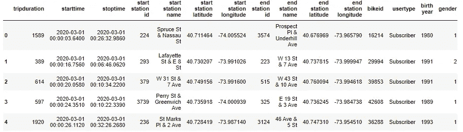

从头部输出

您可以使用`info()`方法获得关于列的更多信息。

```
df.info()
```

输出显示了行数(刚刚超过一百万)和列数。

Count 的值都是相同的，告诉我们没有任何列缺少值。

Dtype 列显示了每一列的数据类型。int64 和 float64 类型表示 64 位整数和浮点类型值，object 表示字符串。

```
<class 'pandas.core.frame.DataFrame'>
RangeIndex: 1068457 entries, 0 to 1068456
Data columns (total 15 columns):
 #   Column                   Non-Null Count    Dtype  
---  ------                   --------------    -----  
 0   tripduration             1068457 non-null  int64  
 1   starttime                1068457 non-null  object 
 2   stoptime                 1068457 non-null  object 
 3   start station id         1068457 non-null  int64  
 4   start station name       1068457 non-null  object 
 5   start station latitude   1068457 non-null  float64
 6   start station longitude  1068457 non-null  float64
 7   end station id           1068457 non-null  int64  
 8   end station name         1068457 non-null  object 
 9   end station latitude     1068457 non-null  float64
 10  end station longitude    1068457 non-null  float64
 11  bikeid                   1068457 non-null  int64  
 12  usertype                 1068457 non-null  object 
 13  birth year               1068457 non-null  int64  
 14  gender                   1068457 non-null  int64  
dtypes: float64(4), int64(6), object(5)
memory usage: 122.3+ MB
None
```

对于数值字段，您还可以使用`describe()`方法查看数据是如何分布的。它显示了最小值和最大值、平均值和中值(第 50 百分位)以及四分位数。

默认情况下，这些值以难以阅读的科学记数法显示，但是可以使用`round`方法将它们四舍五入到两位小数。

```
df.describe().round(2)
```

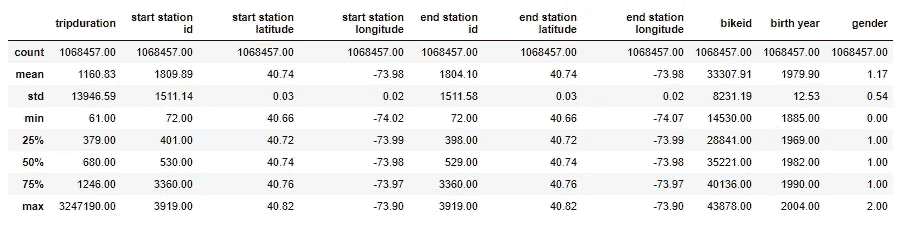

描述的输出

从这个总结中我们可以看到，我们需要清理数据，使其对分析有用。例如:

**行程持续时间**。这里我们可以看到最短的行程是 61 秒(花旗自行车忽略了 60 秒或更短的行程)。最长的是 3247190 秒(或 902 小时)，听起来好像有人没有对接他们的自行车。这么大的数字会偏离均值，所以我们要解决这个问题。

**出生年份**。最早的年份是 1885 年。我觉得那时候出生的人都还活着，更别说骑自行车了！

**开始时间/停止时间**。这些列用数据类型 object 加载。为了使用组件(日期或时间),我们需要将它们转换成时间戳。

# 熊猫数据框

我们在上面看到了列名和数据类型，我们可以通过这样的表达式获得数据框中数据的附加信息，该表达式显示每列的名称、唯一值的数量、数据类型以及该列使用的内存量。

```
pd.DataFrame.from_records([(col, df[col].nunique(), df[col].dtype, df[col].memory_usage(deep=True) )  for col in df.columns],
  columns=['Column Name', 'Unique', 'Data Type','Memory Usage']) 
```

这里我们可以看到，使用数据类型 **object** 存储的列占用的内存空间大约是整数或浮点数据类型的十倍。只要我们只看一个月的数据，这就不是什么大问题，但对于一年的数据来说，问题就大了。

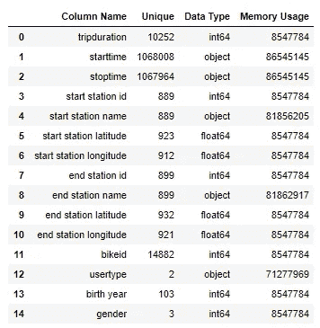

我们可以轻松地将开始和结束时间列从对象转换为时间戳:

```
df['starttime'] = pd.to_datetime(df['starttime'])
df['stoptime'] = pd.to_datetime(df['stoptime'])
```

我们还可以通过使用**类别**数据类型来减少用于其他一些列的内存量。当与行数相比，列的唯一值数量有限时，类别很有用。实际值只存储一次，而不是在每行存储一个长字符串，只存储一个指向实际值的整数。

该文件包含超过一百万行，但是从起点和终点桩号名称的唯一计数中，我们看到本月有 899 个桩号，因此它们是作为分类数据存储的良好候选。

只有两个唯一值的**用户类型**列应该得到类似的处理，有三个值的**性别**也应该得到类似的处理。 **Bikeid** 也可以进行类似的处理。

```
cols = ['start station name', 'end station name', 'bikeid', 'usertype', 'gender']
for col in cols:
    df[col] = df[col].astype('category')
```

现在，如果我们运行与之前相同的报告，我们可以看到数据类型已经更改，并且这些列使用的内存已经大大减少。这也将加快使用这些列的处理速度。

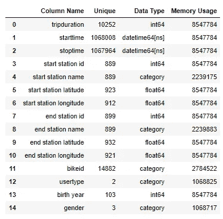

# 探索数据

## 行程持续时间

我们想知道最常见的旅行持续时间是多少。但是 **tripduration** 列是以秒为单位存储的，这对于这个目的来说太精确了，所以我们将创建一个额外的列 **tripminutes** ，它具有以分钟为单位的旅行持续时间。

然后，我们可以使用 Seaborn displot 来显示每次旅行持续时间内的乘车次数。

使用的参数有:

`data` —数据框的名称。
`**x**` —图表列的名称。
`bins` —值列表。由于超过 30 分钟或 45 分钟的游乐设施的超龄费，较长时间的游乐设施数量很少，所以我们将只计算一个小时以内的游乐设施。
`aspect` —高宽比。值 10/5 给出了比默认值更宽的图表

行尾的分号防止图表上方出现虚假的文本行。

```
df['tripminutes'] = df['tripduration'] // 60
sns.displot(data=df,x="tripminutes", bins=range(1,61), aspect=10/5);
```

这张图表显示，最常见的行程是 5 分钟(最高的柱线)，然后是 4 分钟和 6 分钟(之前和之后的柱线)。在那之后，图表显示了一个经典的“长尾”现象，即乘坐时间越长，旅行次数越少。

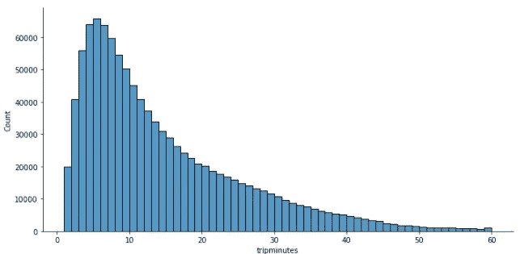

## 按小时和天数乘车

接下来，我们想看看一天和一个月中的乘车时间分布。因为我们将 **starttime** 列转换成了 datetime 值，所以我们可以使用它的方法来提取小时、日和星期几。只有 24、31 或 7 个可能的值，这些是存储为类别的好列。

```
df['start hour']=df['starttime'].dt.hour.astype('category')
df['start day']=df['starttime'].dt.day.astype('category') 
df['weekday']=df['starttime'].dt.weekday.astype('category')
```

然后我们可以使用 seaborn `countplot`绘制每小时的乘坐次数。这里的`figsize` 设置允许比默认设置更宽的图表。

```
plt.figure(figsize=(12,5))
sns.countplot(data=df, x="start hour" ) ;
```

这里我们可以看到早高峰和晚高峰。

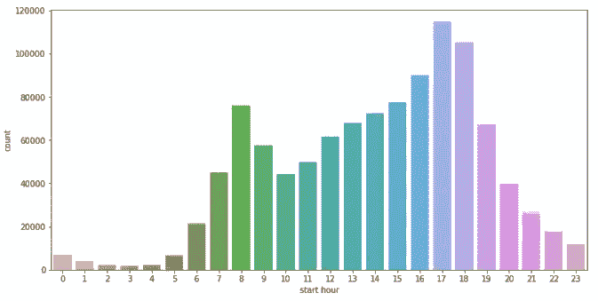

接下来让我们看看每天的乘车次数。突出显示周末有助于理解数据，因此我将创建一个额外的列`weekend`来指示某一天是否是周末。

用于`countplot`的附加参数有

`hue` —控制
条颜色的列的名称`dodge` —显示多个色调值的单个列

```
df['weekend'] = [if d >= 5 for d in df['weekday']] # 0=monday
plt.figure(figsize=(12,6))
sns.set_palette("Set2")
sns.countplot(data=df,x="start day", hue='weekend', dodge=False) ;
```

在这里，我们可以清楚地看到疫情对 3 月份花旗自行车使用量的影响。每日乘车次数在 3 月 9 日达到高峰。在宣布百老汇剧院将于 3 月 12 日关闭后，每天的乘坐人数进一步下降，并在本月剩余时间内保持不变。

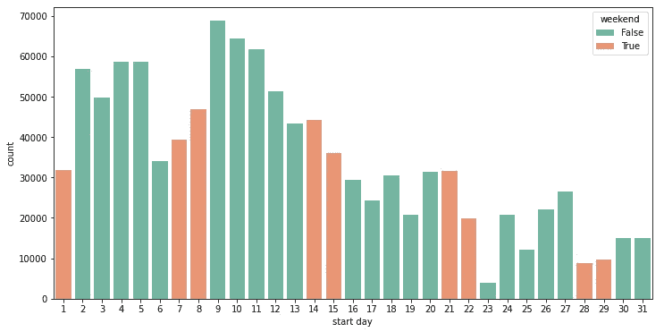

乘坐次数按月计算

## 车站使用

接下来我们想知道:哪些站使用最多？我们可以使用数据帧方法`value_counts()`,它为一列返回一系列索引(这里是站名)和值(计数)。计数方便地按频率降序排列，因此如果我们选择前 20 个值，我们将得到 20 个最常用的电台。为了可读性，我将使用一个更大的 figsize 值使这个图表更高。

```
startstation = df['start station name'].value_counts()[:20]
plt.figure(figsize=(12,10))
sns.barplot( x=startstation.values , y=list(startstation.index), 
 orient="h"  ) ; 
```

这表明最常用的车站是潘兴广场北。这是系统中最大的车站之一，它就在中央车站的南面，中央车站是一个主要的铁路和地铁枢纽，所以它应该是第一个。

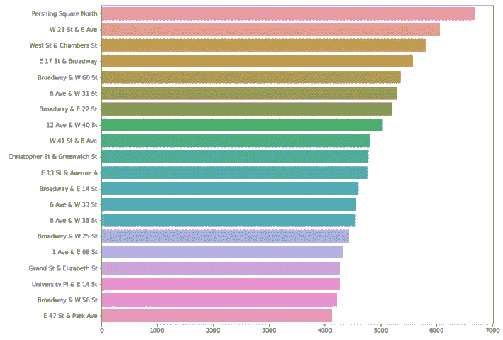

## 骑手的年龄

Citi Bike 提供了关于骑自行车者的有限数据:他们的出生年份、性别，以及他们是(年度)订户还是(每日)顾客。不过，知道这些骑手的年龄还是很有趣的。正如我们看到的**出生年份**列中的年份值是不可能的，或者说是不太可能的，所以限制我们的分析是有意义的。我将以 1946 年为分界点，这一年通常被认为是婴儿潮一代的第一年。

```
sns.displot(data=df, x="birth year" , bins=range(1946,2004),  aspect=10/5) ;
```

关于这张图表，我们注意到的第一件事是 1969 年像谚语中的拇指疼痛一样突出:

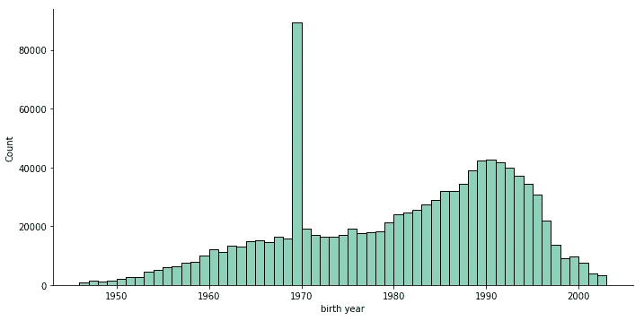

按出生年份的乘坐次数

我怀疑这可能与用户类型有关。Citi Bike 拥有在线注册用户的个人资料，但客户在自助服务亭购买一日通票，可能不会倾向于输入他们的实际出生年份。

事实上，如果我按用户类型给条着色，那么我会看到大多数出生于 1969 年的骑手都是顾客。

```
sns.displot(data=df,x="birth year", bins=range(1946,2004), hue='usertype', multiple='stack' , hue_order=["Subscriber","Customer"], aspect=10/5); 
```

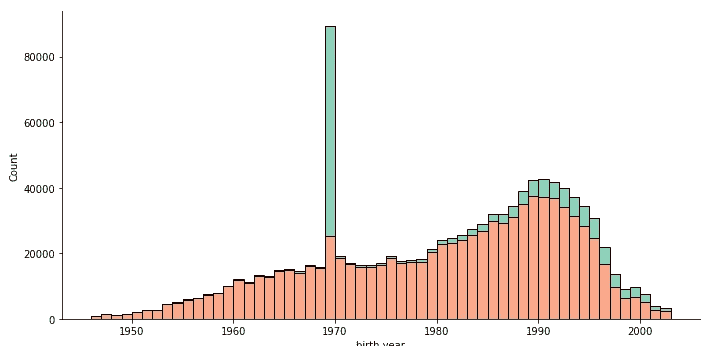

按出生年份显示用户类型的乘车次数

但是，即使我们除去顾客，1969 年的价值看起来还是太高了。**性别**的值呢？零值表示缺少值。这里的条形按性别以 0(未声明)、1(男性)、2(女性)的顺序着色。

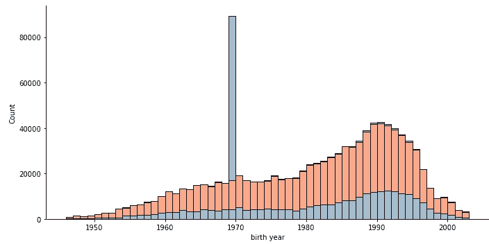

按出生年份显示性别的乘坐次数

因此，当计算骑手的年龄时，我想忽略骑手出生于 1946 年之前或性别为零的骑手。当这些条件满足时，我创建一个为真的遮罩。然后我在数据流中创建了一个新的**年龄**列，它被设置为 2020 减去**出生年份**，除非掩码为真，然后它被设置为 None，这表示缺少一个值。

```
skip = (df['birth year'] < 1946) | (df['gender'] == 0) 
df['age'] = (2020 - df['birth year']).mask(skip,None)
```

最后，我可以根据骑手的年龄绘制一个情节，仍然显示骑手的性别。

```
sns.displot(data=df, x='age', hue='gender', multiple='stack',  aspect=10/5) ;
```

从这里我们可以看到最常见的年龄(众数)是 30 岁，事实上最常见的年龄集中在 30 岁左右。我们现在还看到，使用花旗自行车的男性远远多于女性。

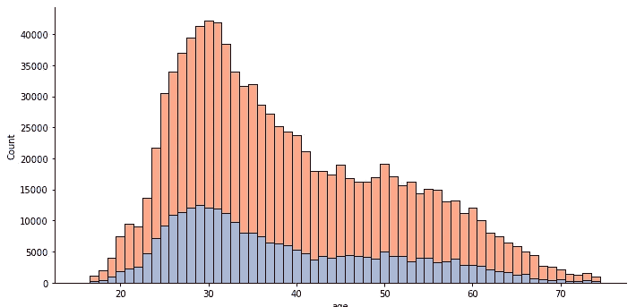

按年龄显示性别的乘坐次数

## 行程距离

与一些自行车上带有 GPS 系统的“无码头”自行车共享系统不同，Citi Bike 没有任何方法来记录骑车人所走的路线。

然而，有了每次旅行的起点和终点纬度和经度，至少可以使用计算地球上任意两点之间“大圆”距离的[哈弗辛公式](https://en.wikipedia.org/wiki/Haversine_formula)来计算距离。当两个站在同一条街道或大道上时，距离将相当准确，否则就不那么准确。尽管如此，它还是提供了两站之间的最小*距离*。

下面是一个表示公式的 Python 程序。

```
import numpy as np
def haversine(lat1, lon1, lat2, lon2):
    lon1, lat1, lon2, lat2 = \
    map(np.radians ,[lon1, lat1, lon2, lat2]) h = np.sin((lat2-lat1)/2.0)**2 + np.cos(lat1) * np.cos(lat2) * np.sin((lon2-lon1)/2.0)**2 miles = 3959 * (2 * np.arcsin(np.sqrt(h))) 
    return miles
```

我们可以用它来创建一个变量添加到数据框，并用于图表。

```
distance = haversine(df['start station latitude'],df['start station longitude'],df['end station latitude'],df['end station longitude'])
df['distance'] = distance
sns.displot(data=df, x="distance",  aspect=10/5  ) ;
```

但是图表告诉我们有很多距离为零的旅行！原来，尽管花旗自行车是为*的交通*而设计的，但它也被用于*娱乐*，在那里行程的起点和终点都在同一个车站。

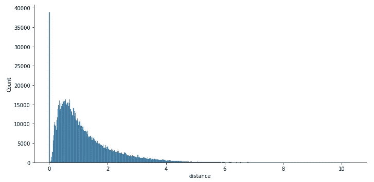

按英里计算距离的行程计数

我们可以从距离变量中去掉这些行程，以得到一个可读性更强的图表。

```
distance = list(filter(lambda distance: distance !=0 , distance)) 
sns.displot(x=distance ,  aspect=10/5  ) ;
```

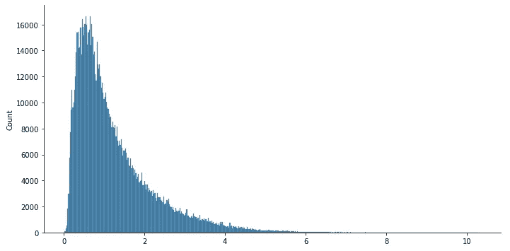

按英里计算距离的行程计数

时间和距离信息的组合为进一步分析提供了许多机会，例如，您可以计算每次出行的(大概)速度，并按年龄、性别或站点进行分析。

# 节省到拼花地板

在我们更改了一些列的数据类型并派生出新的列之后，我们需要将数据帧保存到一个文件中，以便进行额外的分析。我们不想把它作为 csv 文件写回来，因为它需要很长时间来加载并丢失分类列。

有许多选项，如 Pickle 和 Feather，但在我看来，最佳选择通常是 Parquet，这是一种与 Pandas 很好地集成的柱状文件格式。作为列存储，当不需要每一列时，它可以提供更快的检索速度。

```
df.to_parquet('202003-citibike-tripdata.parquet')
```

即使使用默认的 SNAPPY 压缩，Parquet 也比其他格式占用更少的磁盘空间。我们可以比较这两个文件的大小，发现即使添加了额外的列，Parquet 文件占用的空间也只有原始 csv 文件的 17%。

```
202003-citibike-tripdata.csv      202,642,779     
202003-citibike-tripdata.parquet   35,086,348
```

稍后，要将拼花文件读入数据框以供进一步分析，请使用:

```
df = pd.read_parquet('202003-citibike-tripdata.parquet')
```

当通过 SQL 查询引擎(如 Apache Drill 或 PrestoDB)访问时，大多数可视化工具也可以使用 Parquet 文件。

# 进一步分析

这是关于这个主题的系列文章的第一篇。Citi Bike tripdata 可以与其他来源的数据相结合，以提供关于如何使用自行车共享系统的更多见解。更多信息请参见:

[对纽约自行车共享数据使用反向地理编码](/reverse-geocoding-with-nyc-bike-share-data-cdef427987f8)

# 结论

花旗自行车旅行数据虽然对所提供的分析有用，但可以通过一些数据准备来增加更多或更少细节的额外列。Pandas 提供了数据结构和操作来促进数据准备，Seaborn 使制作分布图来理解数据变得非常容易。Jupyter Notebook 提供了一种记录准备步骤的便捷方式。