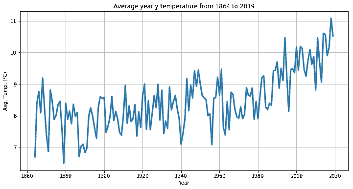

# 使用 Pandas 和 Matplotlib 探索苏黎世的气候变化

> 原文：<https://towardsdatascience.com/exploring-climate-change-in-z%C3%BCrich-using-pandas-and-matplotlib-cc98748be043?source=collection_archive---------54----------------------->


瑞安农·埃利奥特在 [Unsplash](https://unsplash.com?utm_source=medium&utm_medium=referral) 上拍摄的照片

## 使用 Python 进行探索性数据分析

**本文涵盖的主题**

*   使用 Pandas 包读取和操作数据
*   使用 Matplotlib 可视化数据
*   探索苏黎世平均气温的长期趋势

# 介绍

也许没有一天我们不在某种程度上面临全球气候变化的问题。但是如果你和我一样，你可能会觉得这些东西显得有些遥远，比较理论化。

这就是为什么我想看看能否在我的家乡瑞士苏黎世找到气候变化的证据。不是在加勒比海，不是在菲律宾，而是在这里。

幸运的是，如今找到气候数据相当容易，有大量的数据集可供公众免费下载。所以我开始了我的数据探索，结果发现一个合适的数据集只需要一次谷歌搜索。瑞士气象局的网站可以让你下载瑞士各地气象站的历史气候数据。

[](https://www.meteoswiss.admin.ch/home/climate/swiss-climate-in-detail/homogeneous-data-series-since-1864.html?station=SMA) [## 自 1864 年以来的同类数据系列

### 该内容目前只有德语、法语和意大利语版本。月平均时间序列

www.meteoswiss.admin.ch](https://www.meteoswiss.admin.ch/home/climate/swiss-climate-in-detail/homogeneous-data-series-since-1864.html?station=SMA) 

在本文中，我们将利用 Python、Pandas 和 Matplotlib 包来探索和可视化来自瑞士苏黎世气象站的气候数据。

要跟进，您将需要以下依赖项:

*   数据集(参见上面的链接)
*   Python 安装(本文使用版本 3.x)
*   熊猫套餐([https://pandas.pydata.org/](https://pandas.pydata.org/))
*   Matplotlib 包([https://matplotlib.org/](https://matplotlib.org/))

*注意:我在整篇文章中都包含了代码片段。如果您对实现细节不感兴趣，可以忽略这些。*

是否安装了所有依赖项？所有系统都准备好了吗？太好了，那我们开始吧！

# 熟悉数据集

从仔细查看手头的数据开始通常是一个好主意，以便更好地了解我们正在处理的是什么。如果您打开数据文件，您应该会看到类似这样的内容:

```
Federal Office of Meteorology and Climatology MeteoSwiss
MeteoSchweiz / MeteoSuisse / MeteoSvizzera / MeteoSwissMonthly homogenized valuesStation:                  Z¸rich / Fluntern
Altitude [m asl]:         556 m
Coordinates:              47∞ 22.7' N / 8∞ 33.9' EReference date of homogenization:
         Temperature:     01.12.2009
         Precipitation:   01.12.2007Last inhomogeneity provisionally corrected:
         Temperature:     yes
         Precipitation:   noUnits:
         Temperature:     ∞C
         Precipitation:   mmMissing values:           NAData source:              MeteoSwiss
Creation date:            01.02.2021Year  Month        Temperature      Precipitation  
1864      1               -6.6               25.7  
1864      2               -1.5               32.9  
1864      3                4.5               51.0  
1864      4                6.8               46.9  
1864      5               12.3               78.4  
1864      6               14.7              146.4  
1864      7               16.9               77.5  
1864      8               15.3               31.3  
1864      9               12.9               61.9
1864     10                6.7               15.4  
1864     11                2.5               78.5  
1864     12               -4.2                4.0  
1865      1                0.0               63.7
```

我们可以看到，该文件以一个包含数据集信息的头开始，包括其来源和气象站的位置。我们感兴趣的部分开始于标题之后，即四列数据:

*   **年份:**测量的年份，从 1864 年到 2020 年
*   **月:**测量的月份，从 1(一月)到 12(十二月)
*   **气温:**当月平均气温
*   **降水量:**当月平均降水量

# 准备数据集

首先，让我们把数据转换成一种格式，使数据争论对我们来说更容易。这就是熊猫套餐发挥作用的地方。对于那些不熟悉的人:Pandas 是一个 Python 包，在数据科学家中很流行，因为它具有强大的数据处理和数据操作功能。

额外收获:参见本文底部的参考资料部分，获得有用的熊猫备忘单！

在下面的代码片段中，我们正在导入模块，并将数据读入 Pandas DataFrame 对象。确保指定 *header* 关键字来告诉函数标题行数和实际数据开始的位置。最后一个参数告诉函数数据由空格分隔。

# 探索数据

现在我们有了数据框架中的数据，我们可以开始对天气数据进行探索性的数据分析。我们将从绘制 1950 年每个月的平均温度开始。

神奇的事情发生在上面代码片段的第 4 行，在这里我们获取数据的“温度”列，同时我们将数据集缩减到 1950 年。数据的散点图如下所示。

*提示:操作【df。Year==1950]应用布尔过滤器。您还可以使用以下语法按多个条件进行筛选:df[(条件 1) &(条件 2) & …]。*


我们从数据中看到了什么？嗯，夏天似乎比较暖和，冬天比较冷。咄！更有趣的是，我们将看到数据集中记录的 156 年间平均气温是如何变化的。

第 2 行是我们做实际工作的地方。这里，我们按年份对数据进行分组，并使用聚合函数计算该年所有月份的平均值。这给了我们从 1864 年到 2020 年每年的平均温度。



我们注意到数据参差不齐，年间平均气温波动很大。然而，引起你注意的可能不是年度间的波动，而是始于 20 世纪 80 年代左右的明显趋势。这个趋势是向上的！在 1994 年之前平均气温从未超过 10 摄氏度的地方，在过去的 26 年中有 12 年都是如此。

# 与更具乡村特色的地区相比

虽然气温趋势非常明显，但我问自己，这是否会受到城市本身在一段时间内大幅增长的影响，产生更多热量，从而影响城市气候。
为了找到答案，让我们走近阿尔卑斯山，将我们的数据与该国更具乡村特色的地区梅林根进行比较。

梅林根的数据并没有一直追溯到 1864 年，但我们仍然有大量的数据可以利用。让我们看看它与苏黎世相比如何。


总体而言，梅林根的气温低于苏黎世。但最重要的是，我们可以观察到在苏黎世已经观察到的平均气温上升的趋势。同样，这似乎是在 20 世纪 80 年代左右，事情真正开始起飞。

# 对极端情况的观察

平均气温上升是一回事。但是更极端温度的频率呢？如果你来自中欧，你可能会觉得近年来非常炎热的夏天越来越多。让我们来看看我们的苏黎世数据集是怎么说的…

```
 Year  Month  Temperature  Precipitation
126   1874      7         20.3          176.9
210   1881      7         20.3           64.2
570   1911      7         20.3           40.6
571   1911      8         20.4           57.6
774   1928      7         20.6           26.0
967   1944      8         20.3           98.2
1003  1947      8         20.1           39.6
1062  1952      7         20.4           49.0
1434  1983      7         22.0           36.7
1543  1992      8         20.7           91.8
1566  1994      7         21.4           43.3
1578  1995      7         20.5           73.2
1673  2003      6         22.3           57.8
1675  2003      8         22.7           81.8
1710  2006      7         22.5           46.9
1794  2013      7         20.7           81.6
1818  2015      7         22.2           40.3
1819  2015      8         20.4           60.7
1854  2018      7         21.2           63.2
1855  2018      8         20.8          113.3
1866  2019      7         20.7           96.5
```

这里，我们再次使用布尔过滤将数据集减少到当月平均温度超过 20°C 的条目(注意，平均值包括夜间温度！).

总共有 21 个月的平均温度超过 20 摄氏度。最热的月份通常出现在 7 月或 8 月。在某些年份(如 2018 年)，平均气温连续两个月高于我们的阈值。

如果我们看看这些炎热夏季发生的频率，我们会注意到在这 21 个异常炎热的夏季月份中，有 12 个发生在过去的 30 年里。换句话说:超过 50%的极热月份发生在数据集中最近 20%的年份。

最热的月份呢？

```
 Year  Month  Temperature  Precipitation
1675  2003      8         22.7           81.8
```

二零零三年八月的平均气温为 22.7 度

# 从这里去哪里？

我们可以利用这些数据挖掘更多的东西。我们可以观察降雨量，分析冬季月份，甚至开始建立一些统计模型来预测苏黎世未来十年的气候变化。但那是以后的事了…

# 判决

气候变化在苏黎世数据中可见吗？好吧，我让你来判断。或者更好的是:通过寻找合适的数据集并使用 Pandas 和 Matplotlib 讨论数据，为您自己的家乡找到它！

## 资源

熊猫小抄:[https://pandas.pydata.org/Pandas_Cheat_Sheet.pdf](https://pandas.pydata.org/Pandas_Cheat_Sheet.pdf)

## 最终免责声明

显然，这篇文章中的轶事分析不符合科学标准。它仅用于娱乐和教育目的。