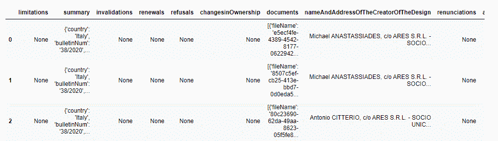
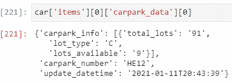
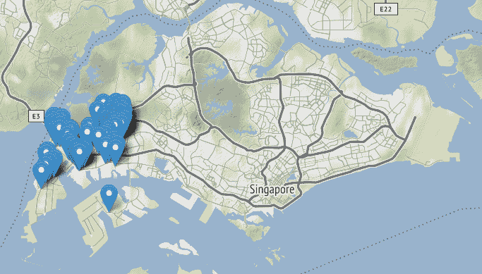
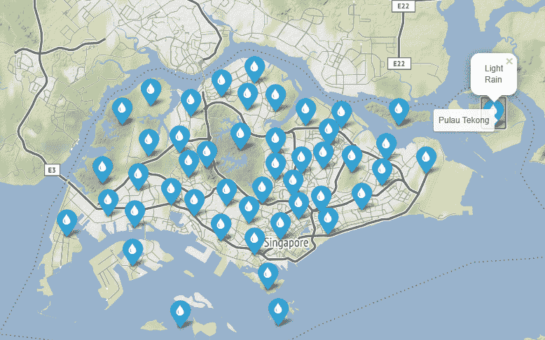
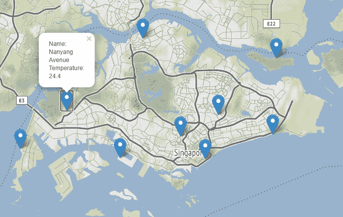
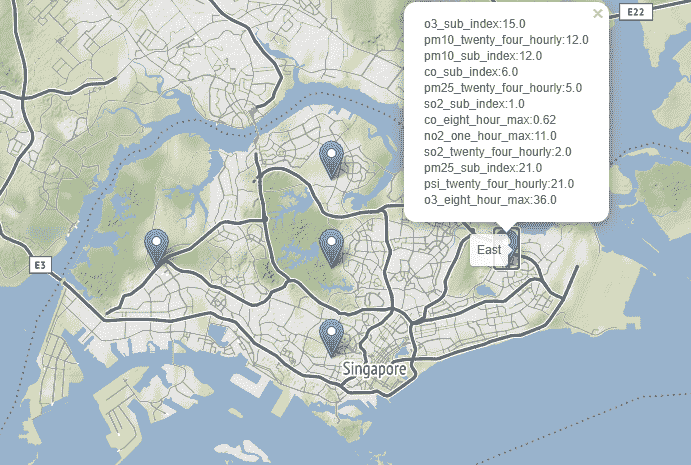
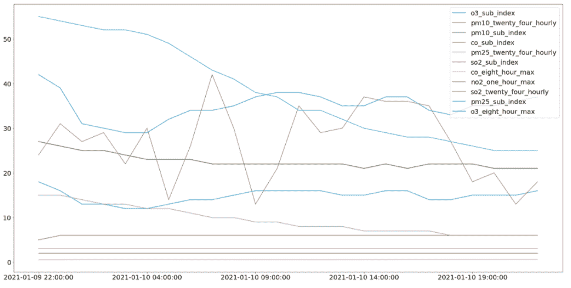
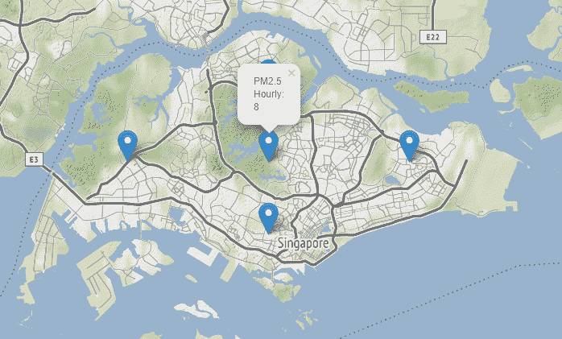
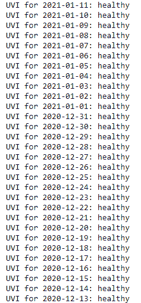

# 探索数据治理 SG API

> 原文：<https://towardsdatascience.com/exploring-data-gov-sg-api-725e344048dc?source=collection_archive---------32----------------------->

## Data Gov SG 提供的实时 API 入门笔记本


照片由[萨法尔·萨法罗夫](https://unsplash.com/@codestorm?utm_source=medium&utm_medium=referral)在 [Unsplash](https://unsplash.com?utm_source=medium&utm_medium=referral) 拍摄

笔记本:[https://nb viewer . jupyter . org/github/tonyngmk/DataGovSG/blob/main/DataGovSG . ipynb](https://nbviewer.jupyter.org/github/tonyngmk/DataGovSG/blob/main/DataGovSG.ipynb)

# 1.介绍

[Data.gov.sg](http://data.gov.sg)提供来自新加坡 70 多个公共机构的公共数据集。迄今为止，已经有超过 100 个应用程序是利用政府的公开数据开发出来的。

在其开发者部分，有实时数据集，如天气和交通状况。本文是对通过这些实时 API 获得的底层数据的用法和基本分析的基本探索的开始。

# 2.要求

可以用一个简单的`GET` HTTP 请求调用 API。这可以通过使用基本 python 库中的`requests`包来实现。

```
import requests # HTTP requests (GET / POST)
```

在我们进入应用程序之前，知道这相当于我们在互联网上执行搜索时的[查询字符串](https://en.wikipedia.org/wiki/Query_string)可能会有所帮助。例如，假冒网站:

*   [https://example.com/path/to/page?**name =雪貂&color =紫色**](https://example.com/path/to/page**?name=ferret&color=purple**)

`[?name=ferret&color=purple](https://example.com/path/to/page?name=ferret&color=purple)`的加粗部分概述了对‘name = ferret’和‘color = purple’的查询，它们由一个“与”符号“&”连接。因此，我们可以用它来设计我们的 API 调用。

然而，这将是相当多的字符串公式工作，因为我们必须通过各种字符串方法来创建每个 URL。谢天谢地，有一个更直观的方法。我们可以将所需的参数存储在**字典**中，然后将它们传递给 get 请求函数。

例如，这些 API 接收的一个公共参数是字符串格式为 **YYYY-MM-DD** 的**日期**。我们可以用`strftime()`方法轻松获得这种日期格式与其各自的格式。

```
today = datetime.datetime.today()
params = {"date": today.strftime("%Y-%m-%d")} # YYYY-MM-DD
```

之后，我们可以在 GET 请求函数中将字典作为参数传递。有各种各样的属性要获得，比如 HTTP 响应代码，但是我们可以用`.json()`获得字典格式的输出。

```
requests.get('https://api.data.gov.sg/v1/environment/psi', params=params).json()
```

# 3.蜜蜂

在讨论了获取数据的技术细节之后，让我们试着检查和理解可用的数据。在 8 个可用的实时 API 中，有 5 个天气 API 和 3 个杂项 API。首先，我们将浏览一下各种 API。

# 3.1 IPOS 应用程序 API

新加坡知识产权(IPOS) API 允许用户查询新加坡的知识产权(IP)申请。对于大多数企业来说，知识产权是保护发明、商标、设计或品牌等人类智慧创造的基础。

在我看来，这大概是酷炫度排名最高但可用性排名最低的。我们可以获得大约数百张专利照片的事实很有趣，但可能无法解决任何现实世界的问题(在我看来可能是数据检索或 ML wise)。

尽管如此，我们还是要试一试。首先，尽管今天(2021 年 1 月 11 日)有 HTTP 200 成功响应，API 还是返回空数据。这可能是因为没有在日期中应用 IPs，因此我们需要一种方法来搜索非空数据。我们可以使用一种简单的方法来迭代循环过去 365 年的日历，一旦找到项目，循环将在 2020 年 9 月 9 日中断，然后尝试检查其数据。

```
today = datetime.datetime.today()
dateRange = [today - datetime.timedelta(days=i) for i in range(365)]print("Searching:")
for date in dateRange:
    params = {"lodgement_date": date.strftime("%Y-%m-%d")} # YYYY-MM-DD 
    ipos = requests.get('<https://api.data.gov.sg/v1/technology/ipos/designs>', params=params)
    print("No items found for: ", date)
    if ipos.json()["items"]: # Not empty
        print("Found first item at: ", date)
        break
```

共有 3 项专利可能是由同一个创作者或企业申请的，我们可以通过深入到文档字段来进一步检查。



图片由作者提供| IPs 应用于 2020 年 9 月 9 日

在每个文档实例中，都有一个 URL 字段。我们可以使用`requests.get('url').content`直接访问每张图片的内容，并通过其各自的 URL 获取其像素值，然后使用`IPython.display.Image`将其显示在笔记本上

```
# Obtain 5 images from patent
from IPython.display import display, Imagefor i in range(1, 6):
    display(Image(requests.get(ipos.json()['items'][0]['documents'][i]['url']).content))
```

由于版权问题，我不会把图片贴在这里，但是你可以在 [nbviewer](https://nbviewer.jupyter.org/github/tonyngmk/DataGovSG/blob/main/DataGovSG.ipynb) 中查看，这也可以通过 API 公开检索。

# 3.2 停车场可用性 API

停车场可用性 API 显示每分钟刷新的大约 2072 个停车场的可用地段。不幸的是，没有地理坐标作为元数据，因此无法在地图上绘制。尽管如此，2000 多个停车场可能太多了，以至于无法在地图上解释任何东西。



作者图片|停车场可用性 API 检索的数据

有用的数据将是**停车场数量**、**可用地段**和**总地段**。不幸的是，我不知道如何为这个 API 创建一个有用的情节(如果你知道任何可行的方法，可以留下评论😀).

# 3.3 出租车可用性 API

该 API 为出租车可用性提供 GeoJSON 数据。这对我来说很有趣，因为 API 每 30 秒刷新一次，因此可用的出租车总数也会随着每次呼叫而波动。我们可以使用 Python 中的`folium`库来绘制这些排序作为*标记。*由于获得的出租车数量约为 3000+，我仅选择绘制前 100 辆出租车，以减少绘图滞后。



图片由作者提供| API 首批 100 辆出租车

老实说，我不确定这个 API 可以扩展成什么。没有提供可用出租车的其他信息，因此该 API 主要用于告知:

1.  新加坡的出租车数量
2.  可用出租车的位置

我敢肯定，公共出租车集团 ComfortDelgro 可能已经将这些信息集成到他们的应用程序(app)中。

# 3.4 天气空气污染指数

有 5 个不同的 API 可用，其中一些可以真正地进一步聚合在一起。尽管如此，我还是会浏览一下，希望对您有用。

**天气预报**

这个 API 提供 2 小时、24 小时和 4 天的天气预报。在我的例子中，我只使用了 2 小时的预报，但是对于其余的 API 也是一样的。例如，如果请求的**日期时间**是 **11 Jan 11 pm** ，最后一个实例将返回 **12 Jan 1 am** 的预测。

天气预报 API 提供新加坡超过 47 个不同地区的特定预报。我试图在大约 1 月 11 日晚上 11 点打电话给这个 API，所有地区都返回了“小雨”2 小时预报。



图片由作者提供| 2 小时天气预报

**实时天气读数**

提供的名称是“实时天气读数”，但基本上它只返回几个气象站记录的**温度**。然而，当我依稀记得路过 NTU 行政大楼后面的一个地铁站时，我很高兴但并不惊讶地看到一个地点标绘在我的学校(南洋大道)。



作者图片|实时天气读数(温度)

**PSI**

污染物标准指数(PSI)衡量空气质量。PSI 是新加坡近期的一个重要指标，因为我们的国家容易受到来自印度尼西亚多个热点地区的雾霾影响。总共有 5 个 PSI 报告区域:“北”、“南”、“东”、“西”、“中”，“国家”读数将是所有区域的最大值。



图片由作者提供|新加坡 PSI 读数

还提供多种污染物分类指数，如一氧化碳、二氧化氮等的水平。我们可以尝试绘制由[门户](https://data.gov.sg/dataset/psi?view_id=942289fe-4b23-40b8-8c9a-7ac58cf2b237&resource_id=82776919-0de1-4faf-bd9e-9c997f9a729d)创建的所有污染物子指数的 24 小时图。首先，我们必须对今天和昨天的日期进行两次 API 调用。此后，我们可以连接两个按日期排序的数据集，并为下面的绘图获得最后 24 个实例。



图片由作者提供|过去 24 小时的污染物分项指数图

**PM 2.5**

颗粒物 2.5 (PM 2.5)是空气中降低能见度的颗粒水平。PSI API 中已经提供了这些数据，因此我将不提供多余的解释。



图片由作者|多余的 PM2.5 图

**UVI**

紫外线指数(UVI)描述了地球表面的太阳紫外线辐射水平。这个 API 是所有 API 中最乏味的，因为它提供的数据量最少。在将日期参数传递给 API 的 GET 请求后，只返回一个文本“Healthy”。这方面也没有进一步的地理细分。



作者图片| UVI API

# 4.结论

总而言之，我已经尝试偷看我们的政府提供的各种 API，所以你不必。老实说，我认为这些 API 对创建任何应用程序或解决任何现实世界的问题没有任何帮助。对于更有趣的数据集，可能确实需要保护数据隐私，但这可能会以抑制潜在的解决方案或创新为代价。

我想知道来自购物中心可用性的 [SpaceOut](https://www.spaceout.gov.sg/) 等应用程序的数据是否类似于停车场可用性，其中可以披露购物中心的顾客数量(也许可以披露各个购物中心的“总顾客数”，因为有一个“最大”值)。这可能有助于分析消费者情绪，并成为各种利益相关者(如购物中心股票的预期和现有股东)的经济增长的代理变量和指标。