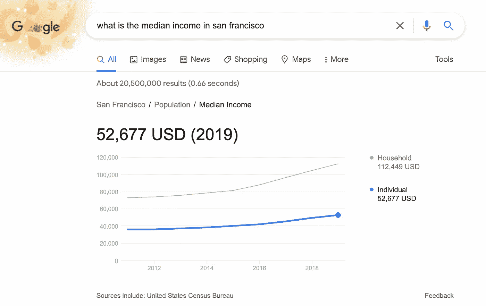

# 通过谷歌的统计 Datacommons 访问公共数据集

> 原文：<https://towardsdatascience.com/exploring-datacommons-the-api-powering-google-search-afc366ec242b?source=collection_archive---------37----------------------->

## 一种查询公共数据集的新范式

有没有想过谷歌是如何对诸如“旧金山的平均收入是多少？”这样的问题给出如此准确的回答的？

作者图片

谷歌搜索上的统计查询由 [DataCommons](https://datacommons.org/) 提供支持，这是一个公开可用数据集的开源存储库。

DataCommons 提供了一个中央 API 来处理来自世界银行、美国劳工统计局、疾病控制中心等不同的公共数据集。这种工具意味着您不必花费大部分时间来查找、清理和连接这些数据(我们不喜欢谈论的 70%的数据分析工作)。这是一个开发人员友好的开放标准，意味着任何人都可以从他们喜欢的工具中访问它，并且在以下领域非常有用:

*   科学研究
*   新闻工作
*   卡格尔比赛
*   市场调查
*   学问

让我们看看当它与我们最喜欢的 Python 可视化库结合时能做什么！

# 热身的例子

想象一下，我们是一名记者，正在撰写一篇专题文章，比较美国不同州变老的情况。首先，我们想知道年龄与收入、健康、空气污染、人口密度等其他变量之间的关系。我们可以通过查看美国 500 个最大城市的数据立即开始:

关于 DataCommons，要记住的最重要的事情是**所有东西都是图**中的一个节点。在这种情况下，我们从查询特殊的组节点`CDC500_City`开始，并询问它的`members`，即链接到它的其他节点。这为我们提供了 CDC500 数据集中城市的 data commons id(`dcid`s)。Google 已经做了一些非常复杂的实体解析，所以这些位置在不同的数据源中是标准化的。接下来，我们将这些 id 加上一个统计变量列表[传递到一个`dc.build_multivariate_dataframe`查询中，并获得一个熊猫数据框架，其中包含来自 CDC、劳工统计局和人口普查局的数据，所有这些数据都被神奇地清理并按城市分组。](https://datacommons.org/tools/stat-var)

我无法强调这有多酷！想象一下，如果你要从头开始做这件事，要花多长时间:用不兼容格式的数据在不同的网站上爬行，清理和标准化数据，为实体建立一个通用名称列表，并将其全部合并在一起。

运行该代码，加上下面的可视化结果，我们得到了以下结果:

这是一个很好的开始，看起来中值年龄和收入之间存在微弱的正相关，但是我们不知道这些城市的实际名称。为此，我们需要丰富数据。

# 丰富数据

我们希望获得数据集中每个位置的城市和州名。通常，这需要几个小时，因为我们必须找到另一个数据源，标准化名称，进行合并，然后花很长时间调试略有不同的输出。在 DataCommons 中，我们需要做的就是使用他们的 [API](https://docs.datacommons.org/api/) 从图中获取更多的属性:

使用`dc.get_property_values`很容易获得关于每个节点及其关系的附加信息。我们传递参数`containedInPlace`来查找父节点，传递参数`name`来查找正确的名称。

数据如下所示:

太好了，一些更清晰的趋势出现了！我们可以看到大多数最富有的城市在加利福尼亚，大多数最古老的城市在佛罗里达。根据人口统计数据也更容易看出纽约和洛杉矶等大城市的发展趋势。

# 在地图上显示

最后，假设我们希望帮助读者在地图上可视化这些数据。DataCommons 有一个方便的内置[地图浏览器](https://datacommons.org/tools/map)工具，我们可以在其中选择统计变量和地理级别。如果我们想要可视化一些更复杂的东西，例如，65 岁以上的家庭年收入达到或超过 20 万美元的比例是多少，我们可以轻松地重新提取数据，并将其插入 geoviz 工具，如 Folium:

在这段代码中，我们按州重新提取数据，下载一个 GeoJson 对象，然后使用`key_on=feature.properties.name`连接州名。添加一点语法糖来显示悬停标签，我们就完成了。有了干净的数据，你就会平静！

我过了一会儿才意识到，最富裕的退休者实际上是在夏威夷，65 岁以上的家庭中有近 10%年收入在 20 万美元或以上😱。

## 摘要

在大约 100 行代码中，我从几个不同的来源提取了数据，进行了分析，并在不同的绘图库中构建了几个可视化程序。有了 DataCommons，你的大部分精力可以用于实际分析和可视化数据，而不是清理、清理和管理数据。

从这里开始，您可以探索收集在 DataCommons 中的数千个统计变量[中的一些，或者尝试他们的](https://datacommons.org/tools/stat-var)[图形浏览器](https://datacommons.org/browser/)。你能回答的问题没有限制！

参见 [Github](https://github.com/johnmicahreid/datascienceexamples/blob/main/DataCommons_Tutorial.ipynb) 上本教程的代码，以及下面的最终数据集: