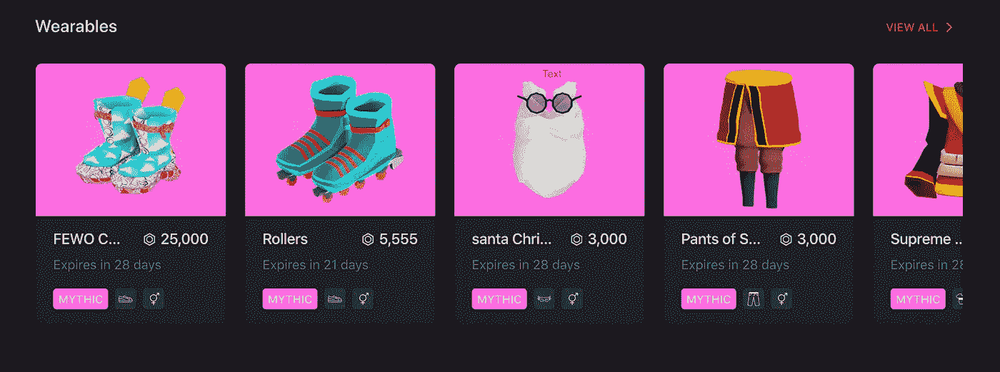
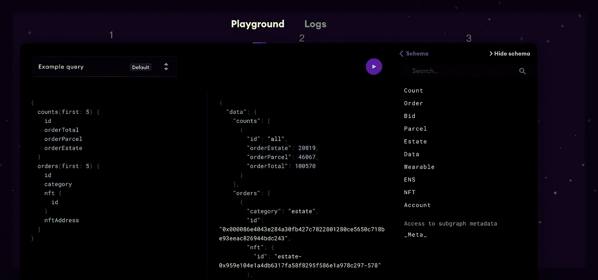
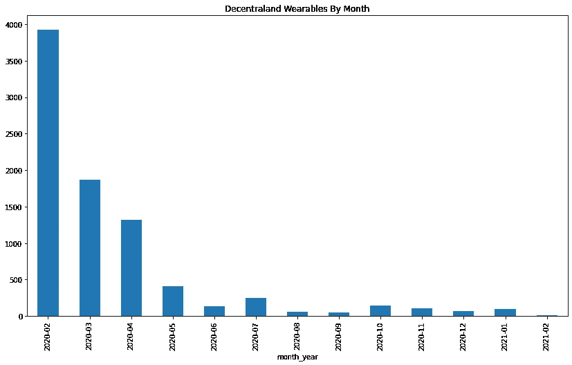
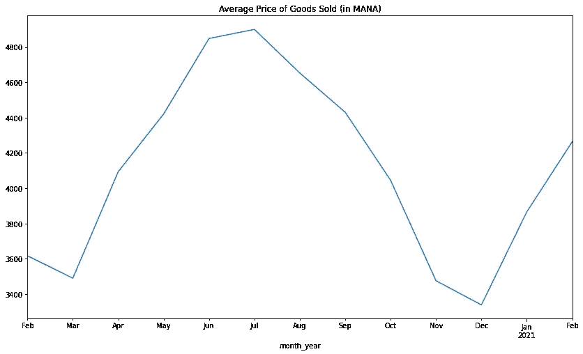
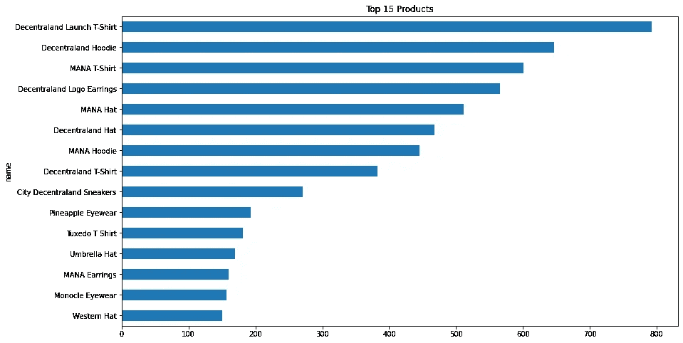

# 使用 Graph 和 GraphQL 探索分散的土地市场销售

> 原文：<https://towardsdatascience.com/exploring-decentraland-marketplace-sales-with-thegraph-and-graphql-2f5e8e7199b5?source=collection_archive---------31----------------------->


迈克尔·泽兹奇在 [Unsplash](https://unsplash.com?utm_source=medium&utm_medium=referral) 上的照片

[最近 NFTs](https://en.wikipedia.org/wiki/Non-fungible_token) 风靡一时。或者他们是？

我想通过探索游戏《分散的土地》中可穿戴物品的销售来找到答案。

分散的土地是一个位于区块链的虚拟世界，在这个世界中，玩家可以购买土地，创建场景，举办虚拟活动，并在点对点市场中买卖可穿戴商品。

尤其令我好奇的是，市场上出售可穿戴物品有多受欢迎。

可穿戴物品是简单的物品，你可以在市场上给你的游戏角色穿上这样的衣服。



*作者图片*

幸运的是，通过他们在 TheGraph.com 的 GraphQL API 提供了一种访问市场数据的便捷方式。

使用这个 API，您可以访问关于商品是什么、谁购买了它、价格是多少以及何时购买的信息。

访问数据的第一步是使用 TheGraph.com 上的 playground 环境来确定要返回的数据的格式。

## API 游乐场

操场看起来像这样，有三个窗户，我在下面做了标记:



*作者图片*

第一个窗口(标记为 1)是您的查询编辑器，您可以在其中根据希望数据返回的方式来构建查询。

第二个窗口(标记为 2)是您的输出窗格，您可以在其中查看查询结果。

第三个窗口(标记为 3)是您可以请求的字段及其数据类型的参考指南。

默认情况下，该查询返回 100 个项目，如果您想要收集一个全面的数据集，这将带来一点限制。

为了解决这个问题，我需要找到一种迭代查询的方法，通过输入一些最后的值作为检索下一个结果的起点。为此，我根据更新日期对查询进行排序，并通过 updatedAt_gt 参数动态填充更新日期的起点。

我的 GraphQL 查询最终看起来像这样:

```
{orders (first: 1000 orderBy: updatedAt, orderDirection: asc where: { status:sold category:wearable updatedAt_gt:1}) {

 category
 nftAddress
 price

 status
 id
 updatedAt
 blockNumber
 nft {
 owner {
 id
 }
 name
 tokenURI

 owner {
 id
 }
 }

 }

}
```

我不打算讨论 GraphQL 中过滤或窗口的细节，而是提供下面的几个链接，作为格式化查询的良好参考。

您可以在本页查看查询 Graph 的具体语法示例，并在此学习 GraphQL 查询语言[。](https://graphql.org/learn/)

## 输入 Python

一旦我格式化了我的查询，就该利用 python 来遍历结果，并将它们组合在一个 pandas 数据帧中以供进一步分析。

为此，按照 GraphQL.org 网站上的[官方文档](https://graphql.org/code/#python)安装石墨烯库是有帮助的。

下面是我必须导入的库和使用 python 查询分散式 API 端点所需的设置步骤。

对于像我这样的新手，有一点需要注意，GraphQL 查询格式中花括号({})太多，这在传递动态变量时会产生一些问题。为了避免\n 错误，我不得不将所有的花括号折叠起来，并在字符串中对我的日期变量使用语法“{0}”。

我的查询字符串最终看起来像这样:

下一步是设置一个循环来查询前 1000 笔销售，然后将我的前 1000 笔销售的最后销售日期作为获取下一笔 1000 笔销售的起点。完整的查询循环如下所示:

## 探索数据

随着数据完全加载到数据帧中，我们现在可以浏览数据。

按月来看，我们可以看到，游戏在 2020 年 2 月推出时销量最高，但此后销量逐渐下降。现在每月大约有 100 台。



*作者图片*

平均售价怎么样？我找不到 API 中 price 字段引用的描述，所以我做了一点假设，价格是以 MANA——本地令牌货币——给出的。

我绘制了每月售出商品的平均价格。在撰写本文时，1 MANA 大约值 30 美分，因此 2021 年 2 月售出的可穿戴设备的平均价格在 600-1200 美元之间！



*作者图片*

哇，也许飙升的货币和天价的商品是销售额下降的原因。

从 2020 年 2 月到 2021 年 2 月，我的数据中共有 8435 笔销售。售出的独特产品总数为 281 件，其中 231 件的销售量超过 1 件。

销售额最高的 15 种产品如下:



*作者图片*

## 结论

“分散的土地”无疑仍处于发展的先锋阶段，为了推动可穿戴设备销售的增长，它还有很多工作要做。也许较低的商品价格会有助于推动月销售额的增长。

如果你是一个区块链和数据爱好者，并且对非中心化土地或非功能性土地有其他的结论，我很乐意在评论中听到你的意见。