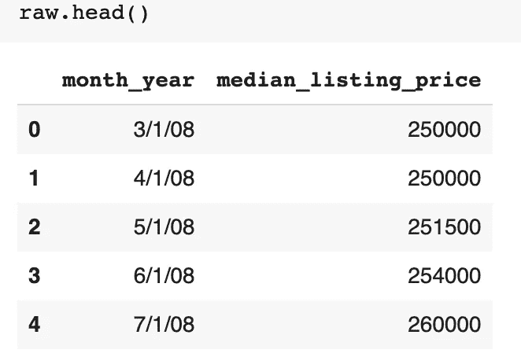
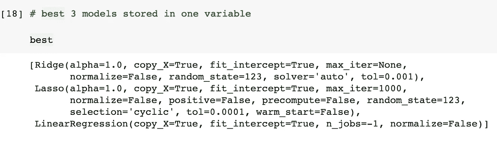
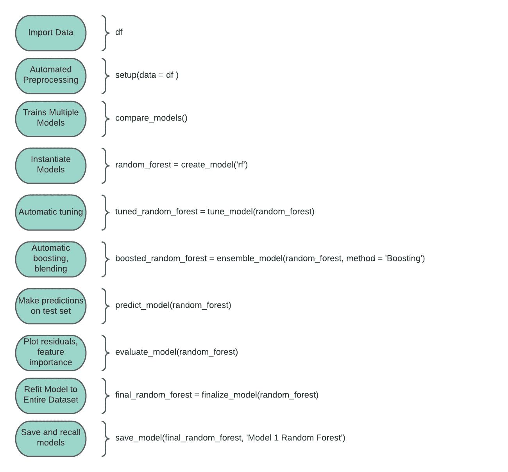

# 使用 PyCaret 的快速建模管道探索 Covid 期间房地产的中断

> 原文：<https://towardsdatascience.com/exploring-disruptions-in-real-estate-during-covid-using-pycarets-rapid-modeling-pipeline-7e8583bd266b?source=collection_archive---------31----------------------->

房地产市场经历了疯狂的一年，正如我用一系列不同市场的 Case-Shiller 房价指数绘制的图表所示。看看 2020 年中期开始的峰值！

作者图片

PyCaret 是一个优秀的库，用于使用机器学习来探索房地产等商业市场的中断。它的低代码实现允许您快速预处理数据，一次单击即可训练多个模型，比较模型结果，并在易于初始化和管理的集成管道中进行微调。

[创作者 Moez Ali 的教程也很优秀](https://moez-62905.medium.com/)，我都强烈推荐。事实上，他的教程“使用 PyCaret 回归模块进行时间序列预测”直接启发了我在这里探索新冠肺炎疫情期间房地产市场变化的方法。

关于这篇 TLDR 文章的简短说明:**大多数 PyCaret 教程正确地强调了它的简单代码和快速建模。在这里，我想花额外的时间介绍一些有用的可选特性和该库的一些重要细微差别，希望对 PyCaret 的新用户有所帮助。**

本次演示使用的数据集和笔记本是[这里。](https://github.com/JamieWinger/Zillow/blob/main/ZillowChicagoMonthly.ipynb)

## 建模应该是 EDA 的一部分

PyCaret 的一个仍被低估的优点是它适合通过建模来执行增强的 EDA。传统上，在数据科学学院，我们被告知，一旦我们保护了数据集，正确的做法是花费大量时间进行探索性数据分析。在(也只有在)我们花了大量时间绘制我们的特征并查看直方图之后，我们是否可以继续进行特征工程、训练和测试模型、验证等等…

然而，*建模*也能有助于(并加速)EDA。观察不同的模型如何在数据集上成功或失败，可以获得关于数据中关系的重要见解。这些见解可以告知我们如何设置问题，并实际上*驱动我们项目流程中的*过程，如特征工程和模型开发，从而加快我们的最终项目交付。

因为 PyCaret 的简单、低代码管道针对多个模型的快速迭代进行了优化，所以它非常适合通过建模来执行 EDA。为了证明这一点，我将通过一个示例来说明我们如何使用 PyCaret 的回归模块来开发多个验证集上的时间序列预测，这有助于我们更好地理解新冠肺炎疫情期间芝加哥房地产市场的中断。

## 获取芝加哥的 Zillow 房地产数据

在这个演示中，我将使用芝加哥的中值标价时间序列，这是我从 Zillow 上的[“标价和销售价格”数据集](https://www.zillow.com/research/data/)在 excel 中创建的。这是一个很棒的数据集，它跟踪了美国几个主要城市的月度房地产市场指标。包含所有月度指标和市场的完整 Zillow 数据集在[这里](https://www.zillow.com/research/data/)。或者你可以下载我创建的的[芝加哥子集。](https://github.com/JamieWinger/Zillow)

## 正在安装 PyCaret

安装 PyCaret 很简单。然而，强烈建议在使用 PyCaret 时设置一个新的虚拟环境，以避免与其他库的潜在冲突，因为 PyCaret 是建立在与其他库的依赖关系上的。我所在的项目团队中，有人试图将 PyCaret 直接安装到他们的全球环境中，并遇到了问题，但虚拟环境运行得非常好。

另一个很好的选择是使用 Google Colab，我正在使用它。Colab 的优势是不需要建立虚拟环境，我没有看到任何依赖问题，而且你可以从谷歌免费快速的云处理中受益，其功能与 Jupyter 笔记本非常相似。

首次安装:

然后，在 Colab 中，启用 PyCaret，然后导入回归模块，如下所示:

## 准备数据集

安装完成后，让我们在导入原始数据后看看它:

作者图片

接下来，我们需要做一些简单的数据准备，确保我们的日期列是一个正确的 datetime 对象。

作者图片

看起来不错！现在，让我们用 12 个月的滚动平均值来绘制时间序列，这将有助于我们可视化季节性模式和趋势。

作者图片

从这个图中，我们可以预见我们的回归模型将很难模拟这个时间序列的 V 形。让我们从 2013 年(房地产市场走出大衰退的开始)开始，选择这个时间序列中更具线性的子集。一旦数据是子集，我们将运行相同的绘图。

作者图片

好多了！我们可以用这个！

## 回归与预测？

通常，不建议使用回归来生成时间序列预测。更传统的方法是使用统计模型，如 ARIMA 或萨里玛。

然而，通过将我们的时间序列转换为回归就绪数据集，并利用 PyCaret 易于实现的预处理函数中一些强大的可选参数，我们可以轻松快速地使用回归开始生成预测。

总的来说，下面的方法是将我们的日期列解析成可以回归的特性。年变成了一个数字变量来帮助我们的模型分析趋势，而月变成了一个分类变量来帮助我们的模型分析季节性。

作者图片

既然我们已经将时间序列转换为 PyCaret 可以轻松进行回归预处理的数据框架(稍后，我将演示 PyCaret 如何将 month 列一次性编码为模型可以回归的 12 个不同的特性)，那么让我们创建一个测试序列分割和一些不同的验证集。

如您所见，我在数据中创建了几个拆分，我将使用它们来实现不同的目的:

**训练数据:**模型将只根据 2013 年到 2017 年的数据进行训练。

**测试数据:**我们将只根据 2018 年的数据测试我们的模型。

然后，我们将在综合测试和训练装置上改装/最终确定我们选择的模型(2013 年至 2018 年)。

这就是使用建模来执行 EDA 的地方。然后，我们将在三个不同的数据集上验证最终模型:

**验证数据集 1:** 2019

**验证数据集 2:** 2020

**验证数据集 3:**2021 年 1 月至 5 月(即“当前日期”)

在多个验证集上尝试我们的最终模型将让我们了解随着时间的推移我们的预测做得有多好(或不好)。分析结果可以为我们制定 2021 年剩余时间和 2022 年全年的预测方法提供信息，我们也将这样做。

## 预处理

接下来，我们将使用 PyCaret 的 setup()函数来预处理我们的训练和测试数据集，这是在 PyCaret 中训练任何模型之前所必需的。

要运行 setup()，只需传入一个数据框并指定目标列的名称。通常，当您传递数据时，setup()会使用随机方式自动创建训练/测试分割。

**然而，这对时间序列数据**不起作用，因为我们不希望我们的模型在更近的日期进行训练(即“泄漏”)。此外，我们还需要将默认折叠策略从随机 k-fold 交叉验证调整为时间序列 k-fold 验证，以在每个折叠中保持正确的日期序列。

setup()函数非常简单。但是，值得探究许多可选参数，这些参数会根据您的数据显著影响模型性能。我在要点中添加了一些额外的注释，只是为了说明一些我发现特别有用或重要的参数设置。

当我们初始化 setup()时，我们得到一个输出，它为我们提供了大量关于我们处理的数据的有用信息。以下是一瞥:

作者图片

如果我们调用上面实例化的 setup“s”变量，我们可以看到 setup()函数是如何预处理数据并自动将 month 列(它识别为分类列)一次性编码为 12 个不同的特征，模型可以根据这些特征进行回归。非常酷 **:**

作者图片

这将有助于回归模型捕捉数据中的季节性模式。

## 模特狂欢。

这是事情变得更加有趣的地方。compare_models()函数一次单击即可训练多个回归模型。我们预处理过的训练和测试数据已经加载到 PyCaret 的虚拟管道中，因此不需要向该函数传递任何数据。n_select 参数指定了我们希望存储在“最佳”变量中的前 K 个模型，我们以后可以使用这些模型。

一旦 compare_models()被初始化，它就开始训练 PyCaret 在其回归库中的所有模型。在训练模型时，输出将它们从最佳性能到最差性能进行排序(您可以指定模型排序所依据的度量，默认为 R 平方)。

下面是输出结果:

作者图片

此外，我们将性能最好的 3 个模型存储在一个方便的“最佳”变量中，如果我们想尝试混合或堆叠最好的模型等技术，可以将该变量传递给其他函数。

compare_models()函数为我们提供了大量的模型和一个很好的基线。从这里，我们可以调用我们想要进一步检查的单个模型，调整它们，集成它们，或者将它们与其他模型结合以提高预测性能。

## 选择和调整模型

create_model()函数只是调用在 compare_models()中训练的单个模型。我选择使用“山脊”模型，它在所有训练过的模型中排名最高。**这不一定总是最好的方法，因为在训练数据上表现很好的模型可能会过拟合，无法很好地推广到新数据。**

尝试一种排名稍微靠后但仍有不错得分的模式是很值得的。那个健壮的模型可能就在眼前，所以我推荐尝试几个。记住:建模=探索！

另外，请注意，create_model()中没有发生任何重新训练。我所说的“岭”模型与上面 compare_models()输出中的岭模型具有完全相同的平均分数。此外，我们还可以在输出中看到每个 k 倍的分数。

作者图片

从这里开始，我们可以尝试几种技术来提高我们的模型性能。一种标准的技术是在单个模型上使用 tune_model()函数。默认情况下，tune_model()会经历 10 次随机网格搜索迭代，从预定义的超参数网格中随机选择一个值。使用 n_iter 参数增加迭代次数通常会提高模型性能，但也会增加计算时间。此外，它还有产生过度拟合模型的风险。

在这种情况下，我将 n_iter 增加到 50，我们确实看到了训练数据的性能提高。

作者图片

PyCaret 还有一个 ensemble_model()函数，您可以使用 boosting 或 bagging 来尝试提高模型性能。您可以传入您的原始模型或调整后的模型并比较结果。在这种情况下，我正在我的调优岭模型上尝试装袋和增压。

关于装袋和增压还有很多要说的，但是，一般来说，如果你认为你的模型过拟合，你可以尝试装袋，如果你认为你的模型欠拟合，你可以尝试增压。

当对观测值相对较少的月度时间序列进行这种类型的回归时，我通常发现 bagging 比 boosting 更有助于模型泛化，但当然这高度依赖于您的数据。以下是装袋和增压输出:

作者图片

作者图片

看起来我们的优化模型的增强版本和打包版本在训练数据上表现相似，并且比我们的优化模型稍差。

还有一个混合模型函数，您可以在其中传递一个列表或(在我们的例子中)一个包含多个模型的变量(还记得我们在初始化 compare_models()函数时定义了一个“最佳”变量来存储前 3 个模型)。

混合器将对各个模型预测进行平均，以形成最终预测。对于时间序列的这种类型的回归，我使用混合的结果导致了混合到更差的性能，但对于某些数据集来说，这可能是一个很好的选择，并且非常容易实现。

作者图片

PyCaret 还有一个 stack_models()函数，与 blending 略有不同。在堆叠中，训练多个模型来预测结果，并且创建元模型，该元模型使用来自这些模型的预测作为输入以及原始特征。在我尝试的几次中，堆叠器似乎产生了更多的噪音并削弱了性能，但它肯定会对不同的问题有所帮助。

## 绘制模型结果

PyCaret 还有一个简单的绘图功能，您可以在其中检查特征重要性、残差和预测误差。以下是几个例子:

作者图片

作者图片

您可能已经注意到，上述残差图(. 902)中的训练 R 平方与我们的袋装调谐岭模型的 create_models()输出(. 7588)中的 R 平方不匹配。我对此做了一些调查，但我仍然不完全确定为什么会这样。[文档](https://pycaret.org/regression1/)称“[调用绘图函数]的过程在某些情况下可能需要重新训练模型”，这可以解释为什么训练的 R 平方不同。如果有人有答案，我很乐意对此有任何见解！

我还喜欢看预测误差图，它给出了测试数据的 R 平方，并将其与 create_models()输出的训练数据的 R 平方进行比较。我认为从 0.7588 下降到 0.672(下降 11.4 %)对年和月输入的回归来说是可以的。

作者图片

## 根据测试数据进行预测

在检查了我们所有版本的岭模型的预测误差图之后——调整的、增强的、袋装的、混合的——我坚持使用具有最佳性能的调整的袋装岭模型。我们可以使用 predict_model()调用测试集上的预测。只需将选择的模型和数据集传递到函数中，它将使用数据集上的模型输出预测。

如果我们没有传入数据集，该函数只是对我们传入 setup()函数的原始测试集执行预测，该测试集仍在建模管道中。请注意，我们的输出与我们在测试数据中定义的日期范围(2018 年)相同:

作者图片

输出为我们提供了我们已经在图中看到的测试 R-squared、其他评分指标的列表、包含所有功能的测试数据集以及实际和预测列。我们可以在我们训练的任何其他模型上使用 predict_model()函数，看看它们是否能更好地概括我们 2018 年的测试数据。

## 模型是一种探索工具

现在我们有了一个模型，我们可以用它来对我们的芝加哥房地产中值标价数据执行一些有趣的 EDA。

在我们继续改装/最终确定模型并在我们的验证集上尝试之前，我们可以将我们的*整个*数据集(2013 年 1 月-2021 年 5 月)传递到 predict_model()函数中，并可视化预测值如何符合我们的实际值。

请注意，在这里，我们是**而不是**重新训练或改装我们整个数据集的模型。我只是将整个数据集和静态估计值传递给 predict_model()函数，这样我们就可以直观地看到整个时间序列的预测值和实际值。这将允许我们对我们的模型行为和芝加哥不同年份的房地产行为进行一些分析。

我们开始吧:

作者图片

通过检查我们的图，我们可以看到，我们训练的模型非常适合 2018 年和 2019 年，但拟合在 2020 年中期开始严重偏离实际情况，甚至在 2021 年也不在同一范围内。这有助于澄清相对于历史模式而言，疫情期间发生的房地产动荡的性质。

由此，我们可以假设我们的模型在 2019 年的验证数据上表现良好，在 2020 年的验证数据上表现较差，在 2021 年的验证数据上表现差得多。

## 最终确定模型

当我们使用 finalize_model()函数时，我们的模型引用我们在管道开始时传递给 setup()函数的训练和测试数据。这确保了我们不会将测试数据中包含的任何预测能力留在桌面上。

提醒一下，我们的综合训练和测试数据日期范围是 2013 年到 2018 年。

最终确定很简单:

和以前一样，模型存储在一个变量中，这样我们可以很容易地将它传递给其他函数:

作者图片

## 在验证集上部署模型

现在，我将在我创建的不同验证集上部署我们的模型。请记住，我创建了 3 个验证集，一个针对 2019 年、2020 年和 2021 年上半年。

让我们来看看我们的模型在每个模型上的表现吧！

我将只展示生成 2019 年预测和分数的代码，因为其他年份的工作方式完全相同。

下面是我们如何通过将最终模型和 2019 年验证数据传递到 predict_model()函数来创建 2019 年预测:

这是我们的输出:

作者图片

接下来，我们可以使用 PyCaret 的 check_metric()函数来检查我们的预测分数。此函数的参数是目标列(我们的 2019 年实际价格)和预测值(我们的 2019 年标签列)。

那些分数相当不错！在这种情况下，我们根据 2013 年至 2018 年的数据改装的最终模型在 2019 年的验证数据上产生了强劲的结果。

基于回归的预测似乎在未来 12 个月表现良好。但这种良好的表现会持续下去吗？我们猜测它不会。因此，让我们检查来自我们的其他验证集的分数。

2020:

2021 年 1 月至 5 月:

正如预期的那样，我们的模型在 2020 年验证数据上的性能下降得相当快。在 2021 年，我们在负 R 平方的情况下做得*非常*差一点，这基本上意味着我们的模型做得比仅仅使用每月目标值的平均值进行预测更差。

但是，还记得我们之前是如何使用我们的模型执行 EDA 的吗？我们预测这种破坏会发生，这种结果可能不是由于我们的模型中的任何基本缺陷。从历史角度来看，2020 年第一季度(covid 在美国开始)之后的一切都很不寻常。

## 那么这个模型告诉我们什么呢？

我认为我们可以假设，排除柯维德疫情一生一次的商业周期中断，我们基于回归的预测实际上做得很好，基本上捕捉到了 2013 年至 2018 年的趋势和季节模式，足以对 2019 年做出准确的预测。即使该模型未能在这些模式经历巨大破坏的市场中推广，如果我们预计破坏会过去，事情会回到疫情之前的轨迹，这并不令人惊讶，也可能不是一个问题。

追踪我们的模型在 2019 年、2020 年和 2021 年的表现给了我们这些见解。因此，PyCaret 的快速建模管道在探索房地产市场的这些模式中断方面非常有用。

## 预测未来

使用我们在 2013 年至 2018 年数据上训练的最终模型，我们现在将预测 2021 年下半年和 2022 年全年。

首先，我们将生成模型预测所基于的未来值:

作者图片

接下来，我们将把最终模型和包含未来值的数据框传递给 predict 函数。

作者图片

最后，我们将把这个未来预测的数据框连接到我们的原始数据集，这样我们就可以绘制原始数据和我们的预测。

作者图片

从这个图中，我们可以看到我们的模型正在将季节性模式强加到 2021 年 6 月的预测上，尽管 2021 年 5 月的峰值要高得多。但是，如果我们使用*高度科学的*方法，把我们的拇指放在大约从 2020 年 5 月到 2021 年 5 月的部分，我们会看到一个相当一致的季节模式和趋势。这种(高度简化的)方法可能不是预测疫情之后房地产市场的最糟糕方式。

## 后续步骤

如果我们想假设 2020 年和 2021 年是异常值，下一步可能是再次改装模型*添加 2019 年的数据，并使用改装后的模型预测 2022 年甚至 2023 年。以这种方式做预测可以让我们对未来的房地产市场有一个概念*假设*事情在 2022 年的某个时候恢复正常模式。*

*PyCaret 最后几个有用的特性:*

*您可以轻松地保存您的模型以备后用(保存在 pickle 文件中),并将其加载回笔记本中:*

*从我们加载的模型的输出来看，我们可以看到我们的整个管道仍然存在:*

**

*作者图片*

*最后，PyCaret 记录我们的整个建模会话，生成各种丰富的元数据。我们可以简单地使用 get_logs()函数在一个数据帧中输出整个会话日志。*

**

*作者图片*

*我们还可以通过 MLflow 中用户友好的 GUI 访问这个日志和其他特性，ml flow 与 PyCaret 配合得很好，但这超出了我们今天的范围。*

## *结论*

*PyCaret 在一个极其易于激活和管理的管道中提供了丰富的功能。由于它的速度和可定制性，用户能够训练、测试和快速迭代模型。这导致了一个复杂的工作流程来探索业务问题。使用 PyCaret 建模来进行探索可以将洞察引入数据集，并帮助*推动*项目战略，加速最终模型的开发和交付。*

*最后，我给你们留下一个有趣的图片，这是我在 PyCaret 狂热的痛苦中在清晰图表中制作的。快乐造型！*

**

*作者图片*

*本次演示使用的数据集是这里的。*

*笔记本的完整代码是[这里](https://github.com/JamieWinger/Zillow/blob/main/ZillowChicagoMonthly.ipynb)。*