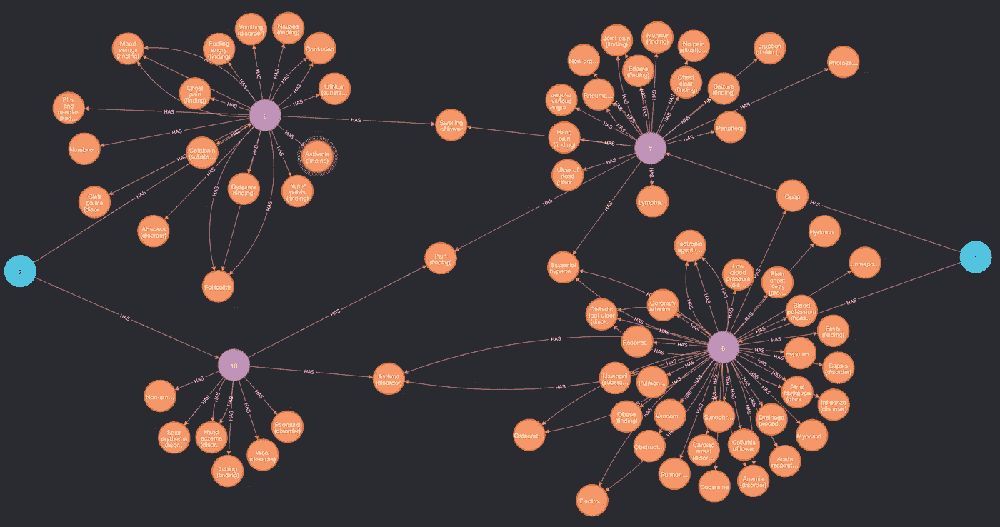
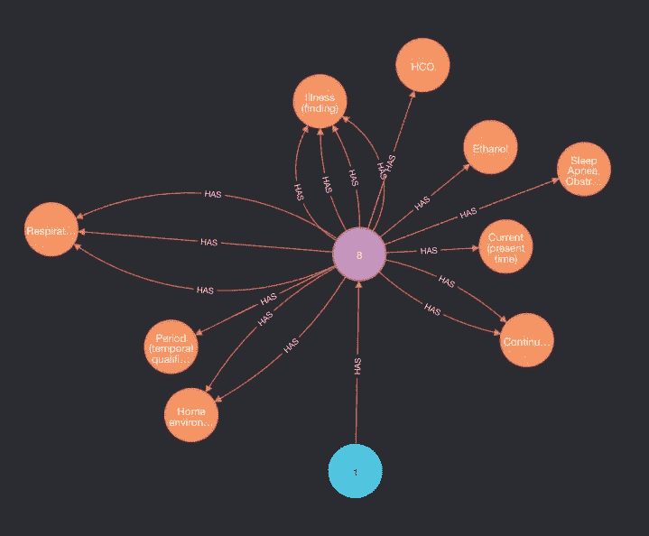
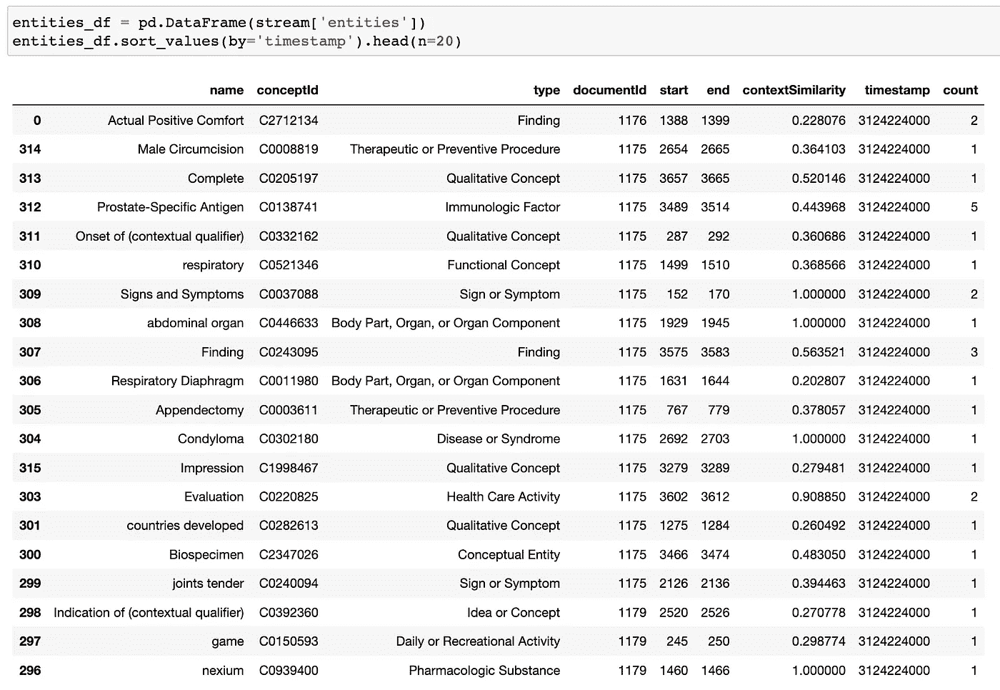

# 使用 MedCAT 和 Neo4j 探索电子健康记录

> 原文：<https://towardsdatascience.com/exploring-electronic-health-records-with-medcat-and-neo4j-f376c03d8eef?source=collection_archive---------13----------------------->



图 1:通过文档(粉色)显示与两名患者(蓝色)相关的疾病、症状、药物和程序。作者图片

## 关于使从自由文本中提取的生物医学概念易于被临床医生和研究人员使用的实践指南

生物医学 NER+L 致力于从电子健康记录(EHRs)中的自由文本中提取概念，并将它们链接到大型生物医学数据库，如 SNOMED-CT 和 UMLS。

在本帖中，我们将关注从自由文本中提取概念后该做什么，换句话说，如何让它们对临床医生和其他研究人员有用。

**先决条件**:无，除非你想复制结果，那么你需要能够使用 MedCAT 和 Neo4j。

# 介绍

假设我们访问了一家医院，并在 SNOMED 概念的电子健康记录中注释了所有自由文本。如果我们使用了 MedCAT，那么输出被存储到一个`.json`文件中。我们的目标是将提取的概念移入一个数据库，该数据库将允许任何人编写简单的查询并利用注释，例如:

*   返回所有患有*糖尿病*和*腿痛*的患者
*   返回*病人 X* **的所有疾病或** 返回特定单据中的所有疾病
*   返回所有出现呕吐症状*且正在服用药物 *valpam* 的患者*
*   返回所有没有阿尔茨海默氏症但有两次或更多次癫痫发作的男性患者。
*   返回所有患有痴呆或任何其他疾病的患者，这些疾病是 SNOMED 本体论中痴呆概念的直接子代。

虽然关系数据库可以完成这项工作(有些曲折)，但是图形数据库更适合。为什么？第一个原因是，我们希望导入 SNOMED/UMLS 本体(基本上是一个有向图),这样我们就可以轻松完成上面例子中的最后一个查询。第二，我们的注释可以很容易地表示为一个图形:*病人-[HAS]- >文档-[HAS]- >概念*。换句话说:一个病人可以有一个或多个文档，一个文档可以有一个或多个概念的提及(例如疾病)。

在某种程度上，这篇文章的其余部分将是一个教程(伴随着一个 [Jupyter 笔记本](https://github.com/CogStack/MedCAT/blob/master/notebooks/TWDS%20-%20MedCAT%20%26%20Neo4j%20Tutorial.ipynb))。它假设您在 localhost:7474 上安装了一个 Neo4j 数据库。由于我们无法使用真实数据，我从 [mtsamples](https://www.mtsamples.com/) 中创建了两个虚拟文件:

*   `patients.csv`包含所有患者的基本信息
*   `documents.csv`包含文档文本+一个文档 ID

# 注释文档

在我们做任何事情之前，我们需要为`documents.csv`中可用的自由文本生成注释。如果您已经用 MedCAT 或任何其他 NER+L 工具处理了文档，那么您可以跳过这一步。

```
from medcat.cat import CATdf_docs = pd.read_csv('./documents.csv')
# This would be a generator if we have a lot of docs
data = [(k,v) for k,v in df_docs[['documentId', 'text']].values]# You can find the model in the medcat repository
cat = CAT.load_model_pack('./medmen_wstatus_2021_oct.zip')
docs = cat.multiprocessing(data, nproc=10)
json.dump(docs, open("./annotations.csv", 'w'))
```

# 填充 Neo4j

创建索引以加速数据接收和搜索(因为数据集可能非常大)

```
from medcat.neo.data_preparation import *
from medcat.neo.neo_connector import NeoConnector
import pandas as pd# Helper for sending requests to neo
neo = NeoConnector('bolt://localhost:7687/', user='neo4j')# Indexes are pre-defined in the data_preparation helper
for ind in get_index_queries():
    try:
        neo.execute(ind)
    except Exception as e:
        print(e)
```

接下来，开始导入。

```
# Import Patients
df_pts = pd.read_csv('./patients.csv')
# If you cannot write to this output_dir save somewhere else and copy
q = create_patients_csv(df_pts, output_dir='/var/lib/neo4j/import/')
# Run the query for import
neo.execute(q)
```

在 neo4j 浏览器(localhost:7474)中，现在将有 182 个带有标签*患者*的新节点。对于*概念*、*文档*以及最后的*注释*，将重复同样的操作。详细信息在随附的 Jupyter 笔记本中，这里我们跳过并假设所有内容都是导入的。

下面的查询现在应该可以工作并返回数据样本:

```
MATCH (p:Patient)-->(d:Document)-->(c:Concept) RETURN p, d, c LIMIT 10
```

输出图(差异是可能的，重要的是取回所有三种节点类型):



作者图片

# 查询 Neo4j

我们现在可以很容易地将上面展示的每个自然语言查询翻译成 Cypher(neo4j 查询语言)。但是，如果我们不知道 Cypher，MedCAT 有一个小类可以用来查询 Neo4j:

```
# Get all patients that have the concepts (Fever and Sleep Apnea). #We will set the ignore_meta flag as the medmentions model does not 
#have all required meta annotations.patients, q = neo.get_all_patients(concepts=['C0520679', 'C0015967'], limit=10, ignore_meta=True)
```

或者将所有疾病分配给患者或文档:

```
# Get all concepts from one patient
stream, q = neo.get_all_concepts_from(patient_id='32', bucket_size_seconds=10**10)
```

结果可以显示为数据帧:



# 结束

就这样，medcat.neo 库将随着时间的推移，使用新的查询和导入/导出功能进行更新。

感谢您的阅读。