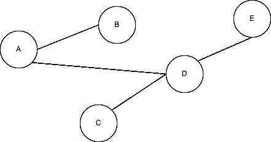
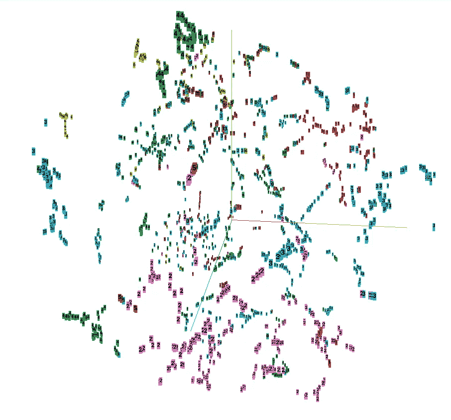

# 探索图嵌入:DeepWalk 和 Node2Vec

> 原文：<https://towardsdatascience.com/exploring-graph-embeddings-deepwalk-and-node2vec-ee12c4c0d26d?source=collection_archive---------2----------------------->

## 探索 DeepWalk 和 Node2Vec 从图中提取嵌入

几个月前，我的 Twitter 时间轴开始向我显示一些关于研究人员谈论“新”深度学习革命的推文。这场新的革命是深度学习在图形上的应用。这个新领域对我来说似乎很新，这就是为什么我借此机会了解更多的原因。

在这一系列的文章中，我将分享我对这个新领域的了解。从头开始:获得节点的密集表示，类似于我们在文本字段中对单词嵌入所做的。但是首先，让我们后退一步，让我解释一下什么是图。

# 什么是图？

一个图可以定义为 G = (V，E)其中 V 是一组节点，E 是一列边。边是两个节点之间的连接，例如，节点 A 和 D 有一条边。此外，重要的是要注意一个图可以是有向的，也可以是无向的。例如，下图是无向图，因为 A 与 D 相连，D 与 A 相连。还有一点，图可以获得不同的节点属性，也可以获得边属性，但对于我们的目的来说，今天并不重要。

无向图的例子

现在我们或多或少知道了什么是图，我们可以尝试从图中提取节点嵌入。正如我之前说过的，这两种方法有点类似于托马斯·米科洛夫用 [Word2Vec](https://proceedings.neurips.cc/paper/2013/file/9aa42b31882ec039965f3c4923ce901b-Paper.pdf) 提出的方法，但是首先…

# 为什么我们需要节点嵌入？🧐

让我们假设您需要解决如下场景:

*   我们有社交网络中用户的交互，我们需要预测两个用户何时连接。节点代表用户，边代表两个用户是“朋友”的时候。(链接预测任务)
*   我们有一个研究出版物的引用网络，我们需要预测每个出版物的主题。节点代表出版物，边是从一个出版物到另一个出版物的引用。(节点预测任务)
*   我们有一套蛋白质，分为酶类或非酶类。节点代表氨基酸，如果两个节点之间的距离小于 6 埃，则这两个节点由一条边连接。(图形分类任务)

对于所有提到的任务，我们需要有一个节点的表示。因此，如果我们需要运行我们的机器学习算法，我们需要将我们的图形结构转换到向量空间。这里我们可以找到两个主要的方法 DeepWalk 和 Node2Vec。

# 深度行走

深走是由石溪大学的研究人员在论文“[深走:社交表征的在线学习](https://arxiv.org/pdf/1403.6652.pdf)”(2014)中提出的。

它第一次为嵌入生成引入了随机游走的概念。基本上，随机行走是一种将图转换为节点序列的方法，然后用于训练 Word2Vec 模型。基本上，对于图中的每个节点，该模型生成一个随机的节点连接路径。一旦我们有了这些节点的随机路径，它就训练一个 Word2Vec (skip-gram)模型来获得节点嵌入。

出于学习目的，请在下面找到该算法的实现，请注意，该代码还不适合大规模应用，可以进行一些并行化和内存改进。

# Node2Vec

Node2Vec 是由斯坦福大学的研究人员在论文中提出的:“ [node2vec:网络的可扩展特征学习](https://arxiv.org/pdf/1607.00653.pdf)”(2016)。

该算法使用了 Deepwalk 提出的一些想法，但更进了一步。它使用算法 [DFS](https://en.wikipedia.org/wiki/Depth-first_search) 和 [BFS](https://en.wikipedia.org/wiki/Breadth-first_search) 的组合来提取随机漫步。这种算法组合由两个参数 P(返回参数)和 Q(输入输出参数)控制。

基本上，如果 P 很大，随机漫步也会很大，所以它进行探索，如果 P 很小，我们停留在局部。类似但相反的行为发生在 Q 上，如果 Q 小，它将进行探索，如果 Q 大，它将停留在本地。更多细节可以在原论文中找到。

我们可以使用 [PyTorch geometric](https://pytorch-geometric.readthedocs.io/en/latest/) 来测试 Node2Vec。这个库实现了一系列图形神经网络架构和方法来加速 GNN 的工作。为了测试它，我将使用 Pytorch geometric 上提出的[教程](https://colab.research.google.com/github/AntonioLonga/PytorchGeometricTutorial/blob/main/Tutorial11/Tutorial11.ipynb)的一小部分。为此，他们使用了 Cora 数据集。Cora 数据集包括 2708 份科学出版物，分为七类。引文网络由 5429 个链接组成。数据集中的每个出版物由 0/1 值的词向量来描述，该词向量指示字典中相应词的存在与否。这部词典由 1433 个独特的单词组成。

一旦模型被训练，我们将对图中的每个节点进行嵌入，并且每个嵌入将是 128 维的。训练之后，我们可以保存嵌入，并在嵌入投影仪中查看表示与标签相比有多“好”。为此，我使用 T-SNE 算法将 128 维数据缩减为 3 维数据，这样我们就可以绘制它了。

投影到三维空间的节点嵌入

正如我们所看到的，具有相似主题的节点一起出现在表示中。请注意，我们正在进行大规模降维，以便在视觉空间中绘图，因此可能有些样本并不完美。

现在我们有了节点嵌入，我们可以训练机器学习算法来预测主题。所以，我们不需要图表。)

# 并非所有闪光的都是金子🏅

正如我们所看到的，我们可以为我们的图构建节点嵌入，但是，这些节点嵌入有几个问题，其中一些是:

*   嵌入依赖于图，所以如果一个新的节点出现，我们需要重新计算嵌入。这没什么大不了的，我们可以做些改进来解决这个问题，但这肯定是需要考虑的事情，尤其是如果图表会不时发生变化的话。
*   我们只获取节点之间的连接信息，但不使用节点或边的特征。那么，考虑到节点和边的信息或特征，我们能生成更好的嵌入吗？是的，使用图形神经网络和消息传递框架，这是另一个帖子…

# 结论📚

在这篇文章中，我解释了如何为我们的图训练节点嵌入。一旦我们有了这些嵌入，我们就可以像往常一样运行机器学习模型。此外，我专注于实际问题，但这项技术背后有一些有趣的数学。我发现这个[视频](https://www.youtube.com/watch?v=QZQBnl1QbCQ)真的很有趣，可以了解更多模型背后的数学知识。我希望你觉得有趣。

# 关于作者

Marcos Esteve 是 Ravenpack 的机器学习工程师。马科斯在工作中为各种各样的自然语言处理任务开发了机器和深度学习模型。他对多模态任务和构建数据科学应用非常感兴趣。在 [Linkedin](https://www.linkedin.com/in/marescas/) 或 [Twitter](https://twitter.com/mecprojects) 上联系他