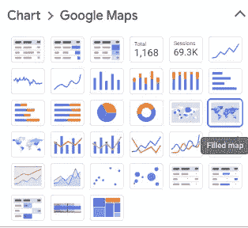
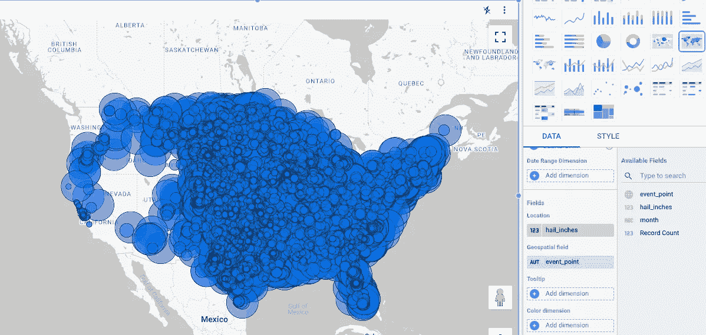
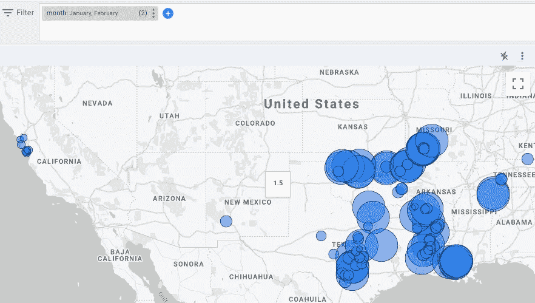
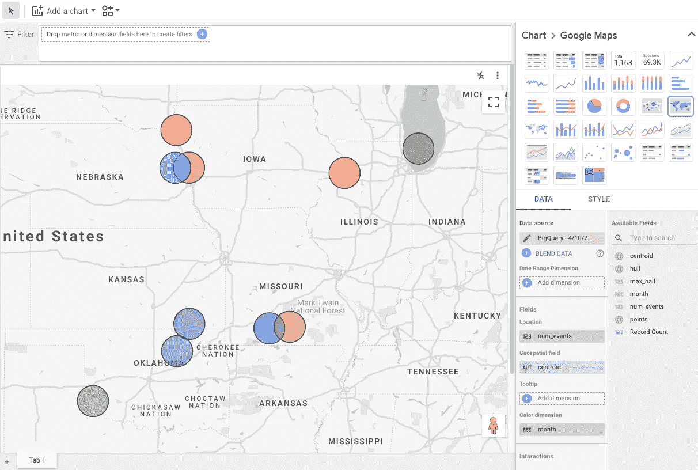
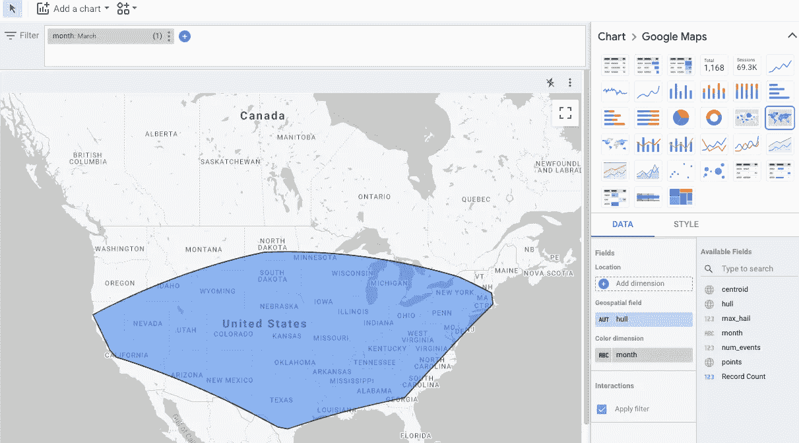
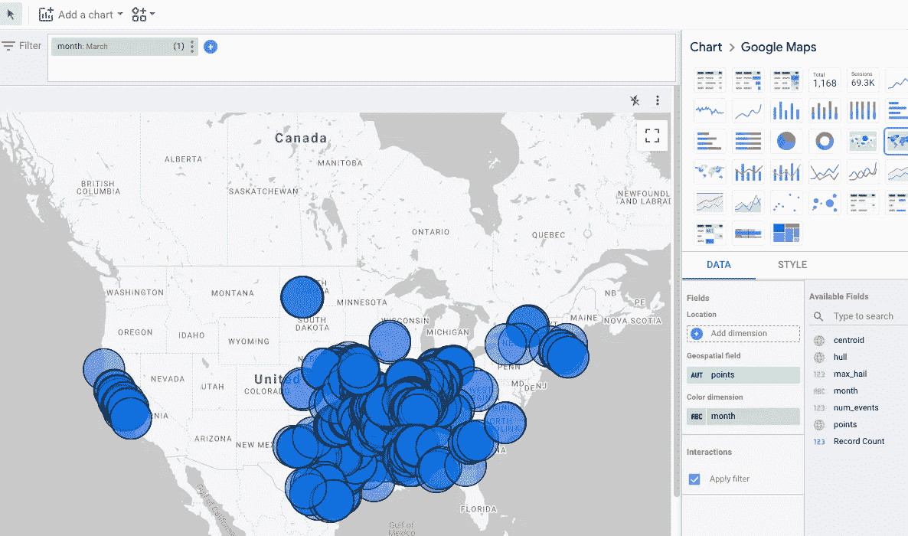
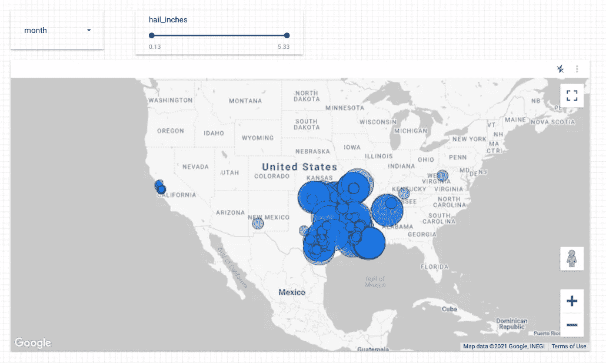
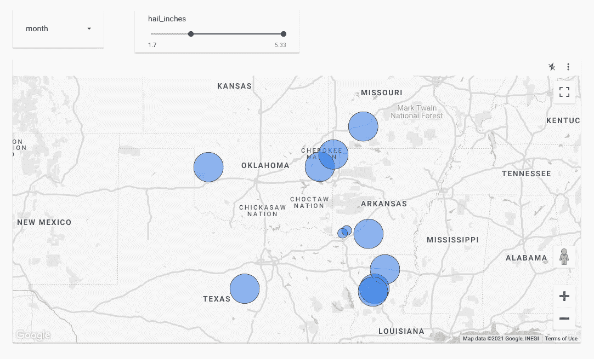

# 使用 BigQuery 和 Data Studio 探索冰雹报告

> 原文：<https://towardsdatascience.com/exploring-hail-reports-with-bigquery-and-data-studio-dd6f903b624b?source=collection_archive---------26----------------------->

## 在 Data Studio 中使用新的地理空间功能

让我们通过探索 NOAA 风暴预测中心冰雹风暴报告的公共数据集，来体验一下 Data Studio 中新的地理空间功能。请跟随我——有一个免费的 BigQuery 沙箱可供您使用。Data Studio 是一款免费产品。

## 在 BigQuery 中查询

转到位于[https://console.cloud.google.com/bigquery](https://console.cloud.google.com/bigquery)的 BigQuery web 控制台，键入以下查询:

```
SELECT 
  FORMAT_DATE('%B', event_begin_time) AS month,
  magnitude AS hail_inches, 
  **event_point**
FROM `bigquery-public-data.noaa_historic_severe_storms.storms_2020`
WHERE event_type = 'hail'
```

在上面的查询中需要注意的重要一点是 event_point 是一个地理类型。如果您的表有纬度和经度列，那么使用以下命令从这些列创建一个地理类型:

```
ST_GeogPoint(longitude, latitude) as event_point
```

关于加载地理数据的更多信息，请查阅 [BigQuery docs](https://cloud.google.com/bigquery/docs/gis-data) 。

## Data Studio 中的地理空间数据

然后使用 BigQuery web 控制台中的下拉菜单“Explore Data ”,选择 Data Studio。

在 Data Studio 中，将图表更改为地图:



然后拖动可用字段来设置图表，如下所示:

*   拖动 hail_inches 字段作为位置维度。根据冰雹的大小，圆圈会变大或变小。
*   将 event_point 字段拖动到地理空间字段。它将设置圆圈的位置。
*   移除颜色度量。

这将是它的样子:



这是大量的数据。让我们允许用户过滤东西。

## 过滤

将“月份”字段拖到顶部显示“过滤器”的位置。这将允许用户按月过滤图表。

如果观众只选择一月和二月，他们会得到:



## BigQuery 中的聚合

我们当然可以使用 BigQuery 来聚集数据，然后在 Data Studio 中可视化聚集的数据。例如，让我们按月找到质心并显示它们，而不是显示每个月的所有冰雹报告。

现在的问题是:

```
SELECT 
  FORMAT_DATE('%B', event_begin_time) AS month,
  COUNT(*) AS num_events,
  ST_CENTROID_AGG(event_point) AS centroid
FROM `bigquery-public-data.noaa_historic_severe_storms.storms_2020`
WHERE event_type = 'hail'
GROUP BY month
```

按如下方式设置 Data Studio:

*   将质心设置为地理空间字段
*   将月份设置为颜色维度(这样不同的月份会有不同的颜色)

您将获得以下关于形心逐月变化的视图:



## 结合两种方法

我们还可以通过以下方式将这两种方法(总量+点数)结合起来:

```
WITH hail AS (
SELECT 
  FORMAT_DATE('%B', event_begin_time) AS month,
  MAX(magnitude) AS max_hail, 
  COUNT(*) AS num_events,
  **ST_UNION_AGG**(event_point) AS **points**,
  ST_CENTROID_AGG(event_point) AS **centroid**
FROM `bigquery-public-data.noaa_historic_severe_storms.storms_2020`
WHERE event_type = 'hail'
GROUP BY month
)SELECT 
  *,
  **ST_CONVEXHULL**(points) AS **hull**
FROM hail
```

现在我们既有单个的点，也有像质心和外壳这样的集合。

这是一月份的船体:



相对于单个点:



## 共享报告

要共享报告，请单击共享按钮。选择创建新报告。

然后，选择“添加控件”，选择下拉列表，并将控件字段设置为“月”。类似地，添加另一个控件，选择 Slider 并将控件字段设置为 hail_inches。该报告现在将如下所示:



将报告的名称更改为 2020 年冰雹月报告。然后单击“查看”,查看与您共享报告的人会看到什么。注意他们如何使用月份和滑块来探索。例如，这是所有 1.7 英寸以上冰雹的视图。地图会自动缩放至感兴趣的区域。



要将报告嵌入为 iframe，您可以通过选择“Share”下的下拉菜单来获得嵌入的 html 代码。

## 稍后自定义报告

你可以通过导航到[https://datastudio.google.com/](https://datastudio.google.com/)找到你正在处理的报告。数据的来源将在“数据源”中，以防您想要定制查询。

尽情享受吧！