# 探索 K-最近邻分类

> 原文：<https://towardsdatascience.com/exploring-k-nearest-neighbour-classification-514d09175248?source=collection_archive---------37----------------------->

## *利用从 Taarifa 和坦桑尼亚水利部数据汇编的坦桑尼亚水泵数据集，勘探 KNN 并预测坦桑尼亚水井的功能。*

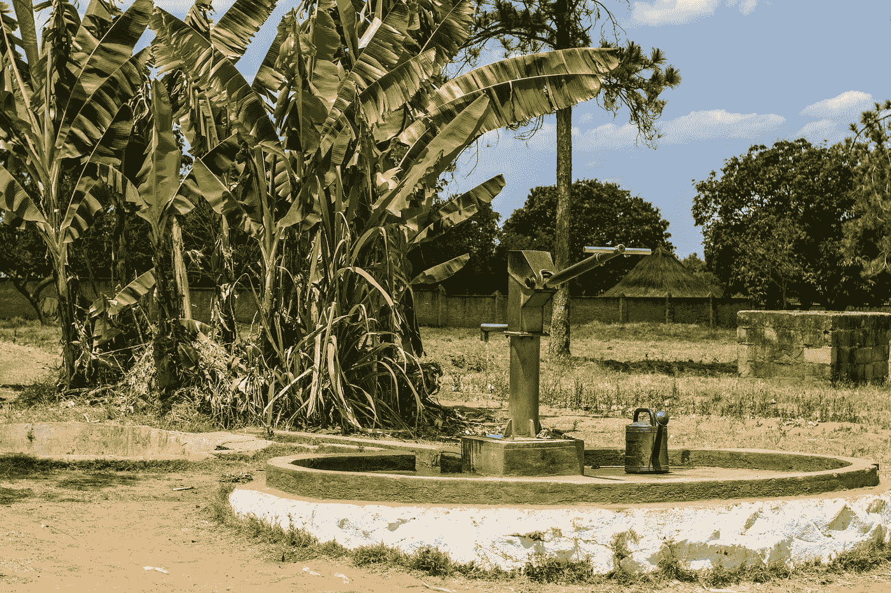

Shutterstock 图像(标准许可)

数据科学有许多精彩的应用，其中之一是它对社会公益的用途——分析和寻找复杂问题的创新、数据驱动的解决方案。

这一分析展示了一个这样的例子。通过数据预处理、清理、探索性数据分析和建模阶段，我将探索在坦桑尼亚水泵功能的三级分类分析中使用 K 近邻。具体来说，预测它们是有功能的、无功能的还是有功能但需要修复的。

## 这个案子的背景

坦桑尼亚是一个东非国家，今天是世界上经历严重水危机的几个国家之一，尽管该国拥有丰富的自然水资源，但仍有数百万人因无法获得安全、清洁的水和卫生设施而遭受苦难。

在总人口为 5800 万的情况下，这场危机目前影响了约 2460 万人，占总人口的 40%以上，令人震惊，并导致了广泛的严重后果，特别是霍乱、伤寒和其他水传播感染和疾病。联合国儿童基金会估计，坦桑尼亚大约 70%的卫生预算用于可预防的疾病，这些疾病与普遍缺乏清洁水和改善的卫生设施直接相关。

因此，本分析的目的是深入探讨这一问题，重点分析水泵的功能，因为水泵仍然是农村地区大部分人口获取水的主要来源，并使用 K-最近邻法建立分类模型，以确定可以探索的改善数百万坦桑尼亚人状况的可能途径。

k 近邻(KNN)是一种有效且简单的监督学习算法，可用于分类和回归问题。它通过计算呈现的每个数据点之间的距离来发挥作用，并通过取 K 个最近点的公共类来生成预测。

下面是所用数据集的摘录。

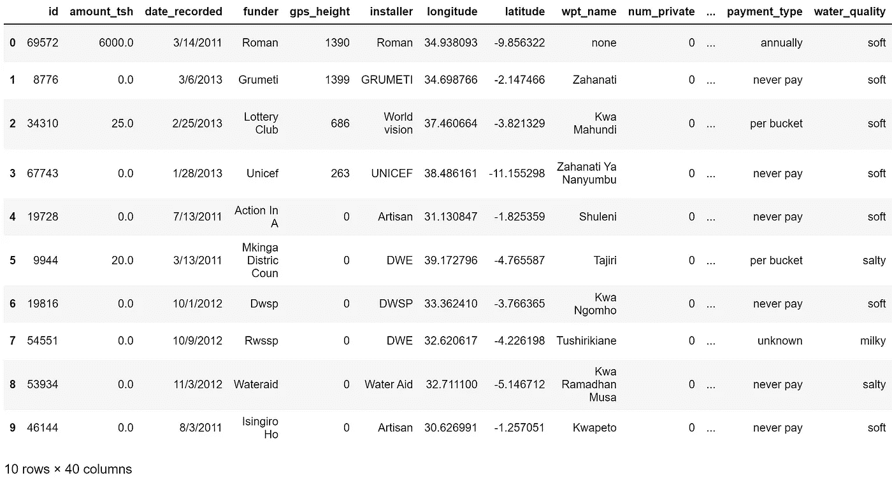

观察数据框的形状，有 59，400 个数据条目(行)和 40 个独立变量(列)。快速运行以总结重复的条目可以确认每个条目都是唯一的。

## 预处理数据

清理数据时，我通常采取的第一步是检查空值，因为，假设我对保留大多数或所有列感兴趣，考虑如何处理丢失的值可以让我更好地理解数据集，并知道哪些列可能会被删除。

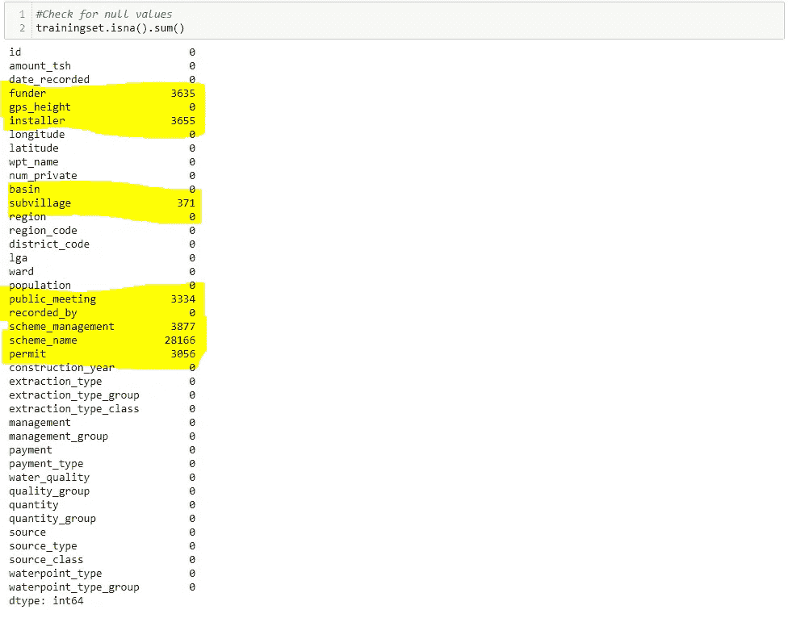

数据清理通常会占用数据科学家大量的工作时间。它通常可以被描述为最乏味的步骤，因为我们大多数人都迫不及待地开始修补模型并创建可视化，以查看我们是否可以为我们试图解决的问题提取任何有用的见解。

然而，我一直认为数据清理是一种艺术形式，尤其是在处理缺失数据时，因为所采取的决策将直接影响建模阶段。为了最大限度地保存数据集，您可以做出哪些最佳决策？

在这种情况下，我决定用以下方式处理它(查看 [Github](https://github.com/anaulianova/Data-Mining-Water-Pumps-in-Tanzania) 的完整代码):

*   **子村** —该列有许多独特的类别，因此用新的“未知”类别替换 371 个缺失值
*   **公开会议** —这个专栏似乎可以有某种程度的解释，但绝大多数条目都是“真实的”(51011 v. 5055)。假设解释为水泵所在的区域是公共集会的场所，则在大多数情况下，空值也可能被假定为“真”。
*   **许可** —在 3065 个缺失值中，有 2424 个来自未知的安装者和/或资助者，所以对于这些，我假设他们没有许可。但剩下的 370 家——它们的经营者或管理者要么是半国营企业，要么是水务局，在这种情况下，鉴于与当局的联系，许可证被认为是“真实的”。
*   **出资方&安装方** —按照以下方式比较两列:

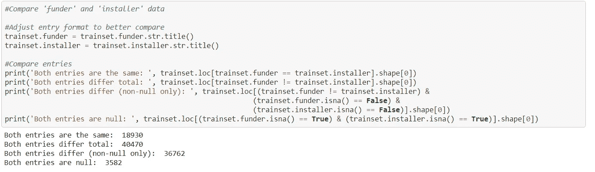

由于在更多情况下，资金提供者和安装者的条目不同(当条目都不为空时为 36，762 行)，因此用新的“未知”类别填充两列的缺失值更安全。

*   **管理&方案管理** —这两列的条目总体上看起来相似，对比如下:

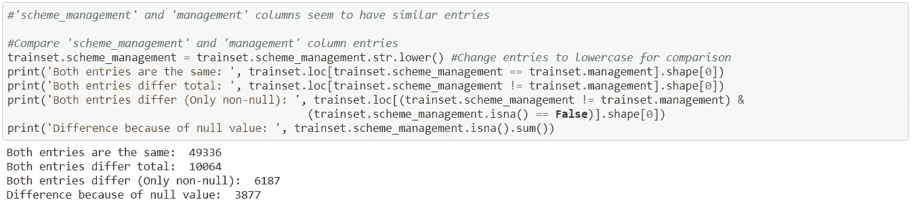

管理列没有空条目，因此，用管理列中的相应值替换 scheme_management 中缺少的 3，877 个值并不太牵强。

*   **方案名称** —许多缺失和完整的唯一值，因此最好删除此列，因为它不太可能在分析中提供任何值。

在下一步中，我选择了一些要删除的附加列，因为它们显示了相同的信息(例如，“付款类型”和“付款”)。

最后，数据预处理结束。

## 建模准备

1.  **定义因变量和自变量**

准备数据的第一步是定义自变量和目标变量 X 和 y。由于模型旨在预测泵的功能，目标变量 y 为“status_group”。

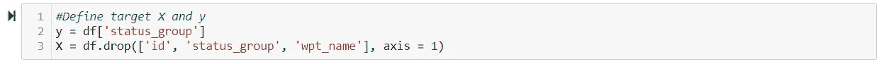

2.**地址分类变量**

坦桑尼亚水数据集有许多分类变量，需要在建模前进行处理和虚拟化。然而，这些变量中的一些有太多的唯一值，包括“资助者”(1，897)、“安装者”(1，935)、“子村”(19，288)和“受监护人”(2，092)。

保留这些变量并创建它们的虚拟对象会导致一个非常复杂的数据集，有数千个维度。因此，出于分析的目的，我决定删除这些列。

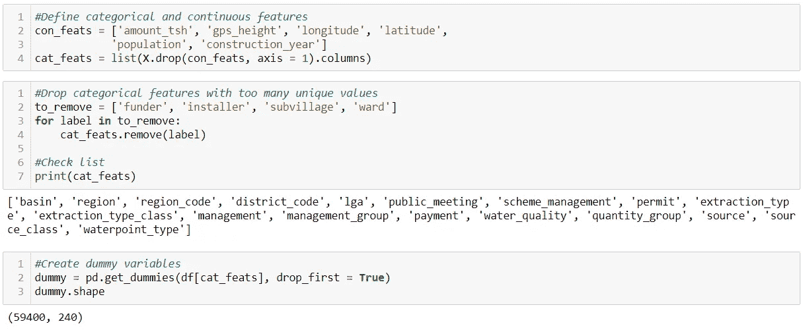

3.**最终确定数据框架**

在为所有变量及其各自的唯一值创建虚拟变量之后，最后一步是通过将分类特征(现在是具有 240 列的数据框架)和连续特征(以前是 6 个确定的列)放回到单个数据框架 X 中来最终确定用于建模的 X。

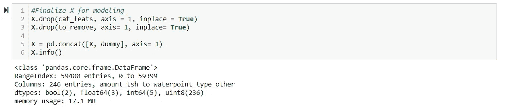

它的最终形状是 59，400 行和 246 列。数据已准备好用于建模。

## 使用 KNN 的数据建模

现在，数据预处理清理和准备工作已经完成，建模数据就像实例化模型一样简单，将它安装在*列车*集合上，然后进行预测。

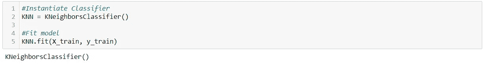

在这种情况下，我使用默认参数进行实例化，其中 k (n_neighbors) = 5。有关可用参数的全部细节，请查看 [scikit-learn KNN 文档](https://scikit-learn.org/stable/modules/generated/sklearn.neighbors.KNeighborsClassifier.html)。

此外，通过定义一个函数来比较模型在训练集和测试集上的准确性分数，可以更好地了解该模型与数据的拟合程度。

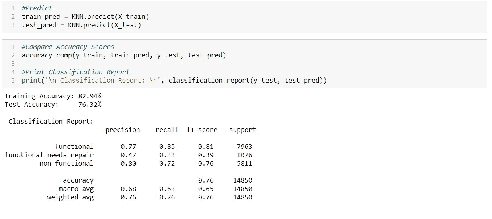

在这种情况下，与测试集上的 76.32%相比，训练集上的准确率为 82.94%，这表明了某种程度的过拟合。减少过度拟合的一个可能途径是增加 k 值。

否则，看来具有最低精确度、召回率和 f1 分数的类别是“功能性需要修复”。当考虑每个类别之间的分布时，该类在数据集中的事例数是最少的，如下图所示，因此它是有意义的。

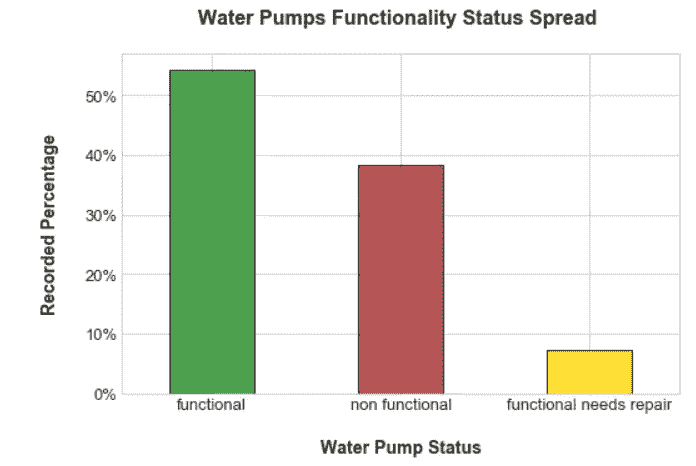

## 结论

KNN 是一种可用于分类问题的通用模型，但是数据集越大，所需的计算量就越大，这使得计算复杂性成为选择该模型时要考虑的一个重要因素。

总的来说，这个模型表现得还不错，特别是在预测水井的非功能性时。因此，这可以为坦桑尼亚当局提供关键信息，说明水和卫生发展项目应优先考虑哪些领域，以便为用水有限的社区提供便利。

在这种情况下，考虑到功能正常但需要维修的水泵的精度和召回率，这种模式可能会受益于功能性和非功能性之间的二元划分，以便对该国最需要改善供水的地区进行分类。