# 使用 Python 的 Matplotlib 探索折线图

> 原文：<https://towardsdatascience.com/exploring-line-charts-with-pythons-matplotlib-4b911cf6b4bc?source=collection_archive---------15----------------------->

## 次轴、插值、连接散点图等

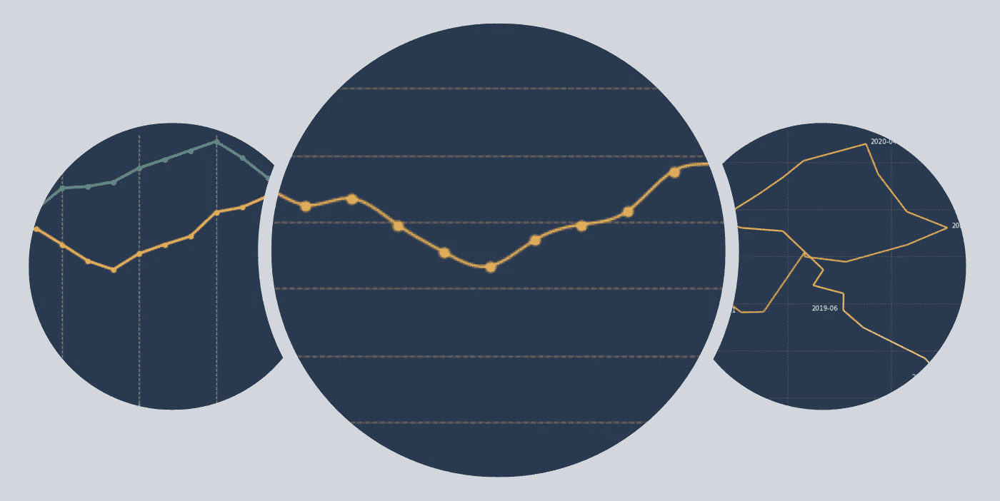

折线图—图片由作者提供

折线图绝对是数据可视化领域的明星，大多数受众都很熟悉，其直接的格式使见解、趋势和模式易于识别。

尽管它们很容易画出来，但还是有一些灰色区域很难导航，有时，我们可能会为了方便或一致性而试图避开它们。

本文将探讨折线图以及可视化数据时实验的重要性。

在下面的例子中，我们将使用一些虚拟数据。

```
import matplotlib.pyplot as plt
from matplotlib.collections import LineCollection
import numpy as np
import pandas as pd
from scipy import interpolateurl = '[https://gist.githubusercontent.com/Thiagobc23/4ccb4ea1c612d9d68921bf990ce28855/raw/6225824a6b7d5d273019c09c25cbbaa5b82009bc/dummy_data.csv'](https://gist.githubusercontent.com/Thiagobc23/4ccb4ea1c612d9d68921bf990ce28855/raw/6225824a6b7d5d273019c09c25cbbaa5b82009bc/dummy_data.csv')df = pd.read_csv(url, index_col='ID')
df.head()
```

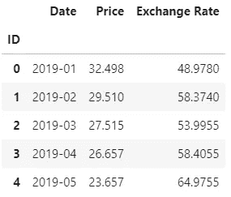

虚拟数据—作者提供的图片

让我们从一个简单的折线图开始，使用一些自定义颜色并添加网格线。

```
# figure
fig, ax = plt.subplots(1, figsize=(12,4), facecolor='#293952')
ax.set_facecolor('#293952')# data
price = df['Price']# plot
plt.plot(df.Date, price, marker='o', markersize=4, color='#FDAC53', linewidth=2.5)# ticks n title
ax.tick_params(axis='both', colors='w')
plt.xticks(df.Date[::3])
plt.title('Price\n', loc='left', color='w', fontsize=16)# spines
ax.spines['right'].set_visible(False)
ax.spines['top'].set_visible(False)
ax.spines['left'].set_color('w')
ax.spines['bottom'].set_color('w')# grid
ax.set_axisbelow(True)
ax.yaxis.grid(color='#FDAC53', linestyle='dashed', alpha=0.5)plt.show()
```

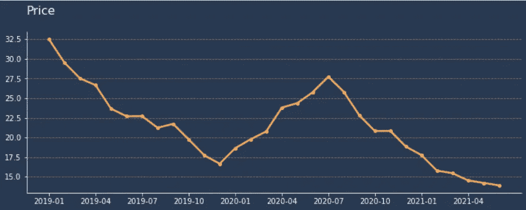

简单折线图—图片由作者提供

## 基数零

绘制折线图的常见做法是从零开始绘制 y 轴，这通常被描述为数据可视化的规则，而不是建议。

没有锁定在零点的图表有夸大变化和误导观众的名声，在我看来，这并不总是正确的。

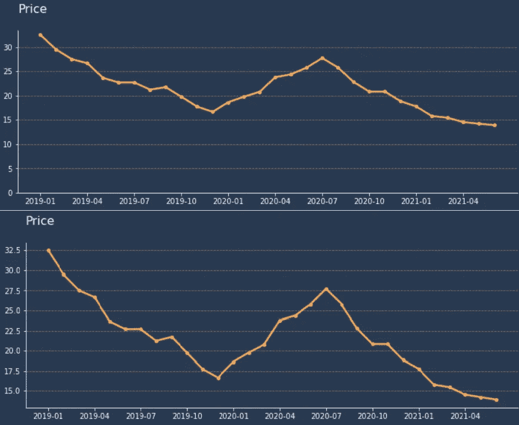

无论是否从零开始，这都是你的图表——作者提供的图片

如果 y 轴以精确的刻度正确显示，并且用户假设它从零开始而没有读取它，那么这是一个数据读写问题，而不是设计问题。

不是从零开始的图表更好地显示变化和趋势，而从零开始的图表更好地描绘这些变化和趋势的影响。

```
# figure
fig, ax = plt.subplots(1, figsize=(12,4), facecolor='#293952')
ax.set_facecolor('#293952')# data
price = df['Price']# plot
plt.plot(df.Date, price, marker='o', markersize=4, color='#FDAC53', linewidth=2.5)# ticks n title
ax.tick_params(axis='both', colors='w')
plt.xticks(df.Date[::3])
plt.title('Price\n', loc='left', color='w', fontsize=16)# spines
ax.spines['right'].set_visible(False)
ax.spines['top'].set_visible(False)
ax.spines['left'].set_color('w')
ax.spines['bottom'].set_color('w')# grid
ax.set_axisbelow(True)
ax.yaxis.grid(color='#FDAC53', linestyle='dashed', alpha=0.5)# limits
plt.ylim(0,) # or -> ax.set_ylim(0,)plt.show()
```

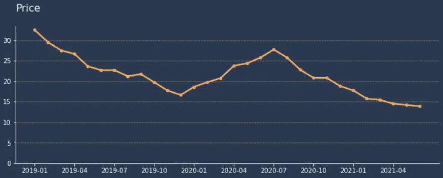

折线图—作者提供的图片

## **插值**

线条流畅的看起来更好，但也仅此而已。除了美观之外，平滑图表的线条没有任何其他好处，这种微小的改进有可能会歪曲数据。

然而，我们可以用它做实验，自己决定什么时候合适。

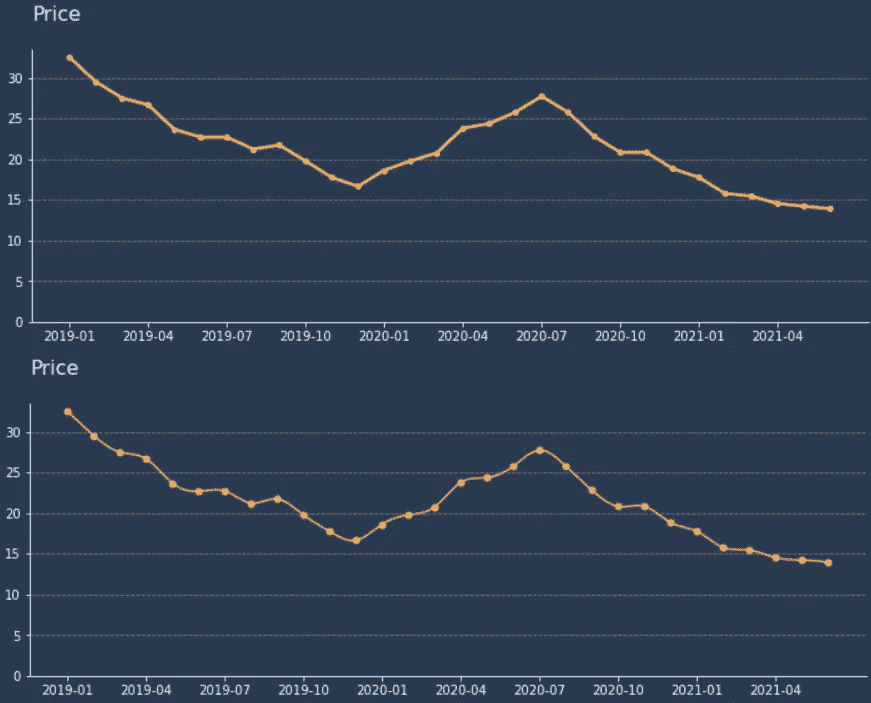

平滑或笔直，这是你的图表——作者的图像

在上面的例子中，差异可以忽略不计，我怀疑有人会因为插值而对变化和趋势做出不同的解释。尽管如此，这是有风险的，应该谨慎使用。

```
# figure
fig, ax = plt.subplots(1, figsize=(12,4), facecolor='#293952')
ax.set_facecolor('#293952')# data
price = df['Price']# interpolate
x = np.arange(0, len(price))
y = priceinter = interpolate.interp1d(x, y, kind = 'cubic')
new_x = np.arange(0, len(y)-1, 0.01)
new_y = inter(new_x)# interpolated lines
plt.plot(new_x, new_y, color='#FDAC53', linewidth=1.5)
# data points
plt.scatter(x, price, color='#FDAC53', s=25, zorder=3)# ticks and title
ax.tick_params(axis='both', colors='w')
plt.xticks(x[::3], df.Date[::3])
plt.title('Price\n', loc='left', color='w', fontsize=16)# spines
ax.spines['right'].set_visible(False)
ax.spines['top'].set_visible(False)
ax.spines['left'].set_color('w')
ax.spines['bottom'].set_color('w')# grid
ax.set_axisbelow(True)
ax.yaxis.grid(color='#FDAC53', linestyle='dashed', alpha=0.5)# limit
plt.ylim(0,)plt.show()
```

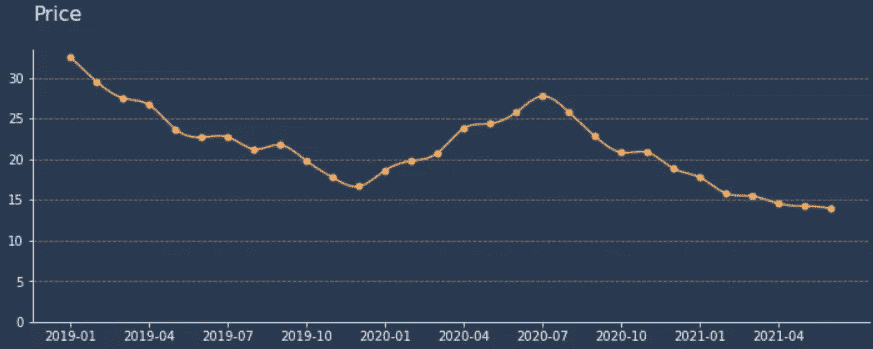

折线图—图片作者| [代码](https://gist.github.com/Thiagobc23/62ae396e96764135e47abf2dd755cfb3)

## 双轴

让我们从绘制汇率和价格开始。

```
# figure
fig, ax = plt.subplots(1, figsize=(12,4), facecolor='#293952')
ax.set_facecolor('#293952')# data
price = df['Price']
rate = df['Exchange Rate']# plots
plt.plot(df.Date, price, marker='o', markersize=4, color='#FDAC53', linewidth=2.5)
plt.plot(df.Date, rate, marker='o', markersize=4, color='#55A380', linewidth=2.5)# ticks n title
plt.title('Price and Exchange Rate\n', loc='left', color='w', fontsize=16)
ax.tick_params(axis='both', colors='w')
plt.xticks(df.Date[::3])# spines
ax.spines['right'].set_visible(False)
ax.spines['top'].set_visible(False)
ax.spines['left'].set_color('w')
ax.spines['bottom'].set_color('w')# grid
ax.set_axisbelow(True)
ax.yaxis.grid(color='#FDAC53', linestyle='dashed', alpha=0.5)# legend
legend = plt.legend(['Price', 'Rate'], frameon=False, ncol=2)
plt.setp(legend.get_texts(), color='w')plt.show()
```

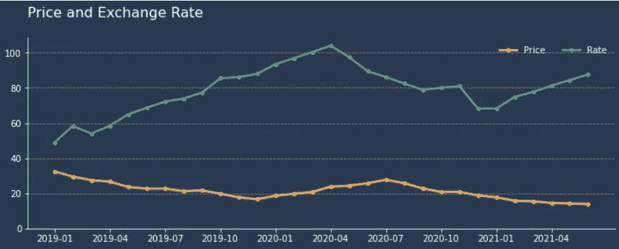

多线图表—作者提供的图片

我们之前看到的价格变化在这里没有得到充分体现。

假设我们有第三个变量，即成本，它是价格和费率的乘积。当我们使用上面的图表来理解这一成本的构成时，我们会假设利率的上升会比价格的下降更加显著。但在现实中，这不是真的。

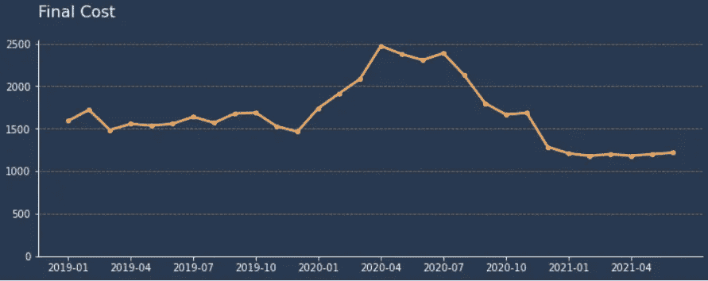

价格*价格—作者图片

用一个副轴来理解这个变量的组成就更简单了。

```
# figure
fig, ax = plt.subplots(1, figsize=(12,4), facecolor='#293952')
ax.set_facecolor('#293952')# data
dt = df.Date
price = df['Price']
rate = df['Exchange Rate']# plot
plt.plot(dt, price, marker='o', markersize=4, color='#FDAC53', linewidth=2.5)
ax2 = ax.twinx()
ax2.plot(dt, rate, marker='o', markersize=4, color='#55A380', linewidth=2.5)# ticks
ax.tick_params(axis='both', colors='w')
ax2.tick_params(axis='both', colors='w')
plt.xticks(dt[::3])# spines
for i in ['top', 'bottom']:
    ax.spines[i].set_visible(False)
    ax2.spines[i].set_visible(False)

ax2.spines['left'].set_color('#FDAC53')
ax2.spines['left'].set_linewidth(2)
ax2.spines['right'].set_color('#55A380')
ax2.spines['right'].set_linewidth(2)# grid
ax.set_axisbelow(True)
ax.xaxis.grid(color='w', linestyle='dashed', alpha=0.5)# labels n title
ax.set_ylabel('Price', color='w', fontsize=12)
ax2.set_ylabel('Exchange Rate', color='w', fontsize=12)
plt.title('Price and Exchange Rate\n', loc='left', color='w', fontsize=16)# limits
ax.set_ylim(0,)
ax2.set_ylim(0,)plt.show()
```

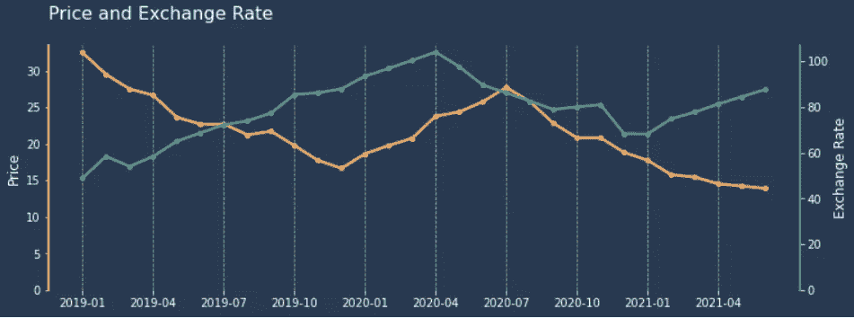

价格和费率双轴—图片作者| [代码](https://gist.github.com/Thiagobc23/4ca2066f4f21fdd1c37ebaf9d264a920)


价格*价格—作者图片

## 连通散点图

x 轴不一定需要代表时间，连接数据点的线已经完成了这项工作。这意味着我们可以使用第二个变量的 x 轴，将可视化集中在这两个变量随时间的相关性上。

箭头，标签，甚至颜色都可以用这种类型显示时间流动的方向。线条使用渐变颜色也有助于区分重叠部分。

```
# data
x = df['Price']
y = df['Exchange Rate']# points n segments
points = np.array([x, y]).T.reshape(-1, 1, 2)
segments = np.concatenate([points[:-1], points[1:]], axis=1)# figure
fig, ax = plt.subplots(1, figsize=(12,7), facecolor='#293952')
ax.set_facecolor('#293952')# create a collection of lines
lc = LineCollection(segments, cmap='Wistia' , alpha=0.9)# set the data that'll define the colors
lc.set_array(df.index) # try changing df.index for x or y
lc.set_linewidth(2.5)# plot line collection
ax.add_collection(lc)# date labels left
labels_df_l = df[df['Date'].isin(['2019-01', '2020-04', '2020-07'])].copy()
for key, record in labels_df_l.iterrows():
    ax.text(record['Price'] + 0.2, record['Exchange Rate'], record['Date'], color='w')

# date labels right
labels_df_r = df[df['Date'].isin(['2019-03', '2019-06', '2019-12', '2021-01', '2021-06'])].copy()
for key, record in labels_df_r.iterrows():
    ax.text(record['Price'] - 0.25, record['Exchange Rate'], record['Date'], color='w', ha='right')

# labels n title
ax.set_xlabel('Price', color='w')
ax.set_ylabel('Exchange Rate', color='w')
ax.set_title('Price and Exchange Rate - Product XYZ\n', loc='left', color='w', fontsize=18)# spines
ax.spines['right'].set_visible(False)
ax.spines['top'].set_visible(False)
ax.spines['left'].set_color('w')
ax.spines['bottom'].set_color('w')# tick colors
ax.tick_params(axis='both', colors='w')# grids
ax.set_axisbelow(True)
ax.yaxis.grid(color='#FDAC53', linestyle='dashed', alpha=0.3)
ax.xaxis.grid(color='#FDAC53', linestyle='dashed', alpha=0.3)# limits
ax.set_xlim(x.min() - 3, x.max() + 3)
ax.set_ylim(y.min() - 3, y.max() + 3)plt.show()
```

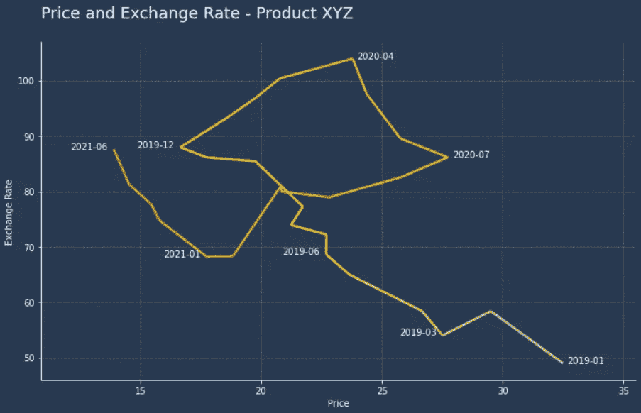

连通散点图—图片作者| [代码](https://gist.github.com/Thiagobc23/9a2f50cdd787eb27e99a2776cd1cf97d)

关联散点图是一种图表，当它符合数据时，它是非常惊人的。不幸的是，对于大多数数据集来说，它往往会变得杂乱或像意大利面条图一样散开。

## 结尾部分

我们不应该拒绝需要观众付出努力的解决方案。

过分简化一个主题以适应小块的信息会使洞察力和模式更难识别，甚至更糟，使用户对呈现的主题失去兴趣。

指南和规则是产生高质量可视化的一个很好的方法，并且可以减少误解。但是实验可以产生真正伟大的图表，避免误导可视化的最好方法是保持观众的数据素养。

感谢阅读！[在这里](https://linktr.ee/thiagobc23)你可以找到更多这样的文章。