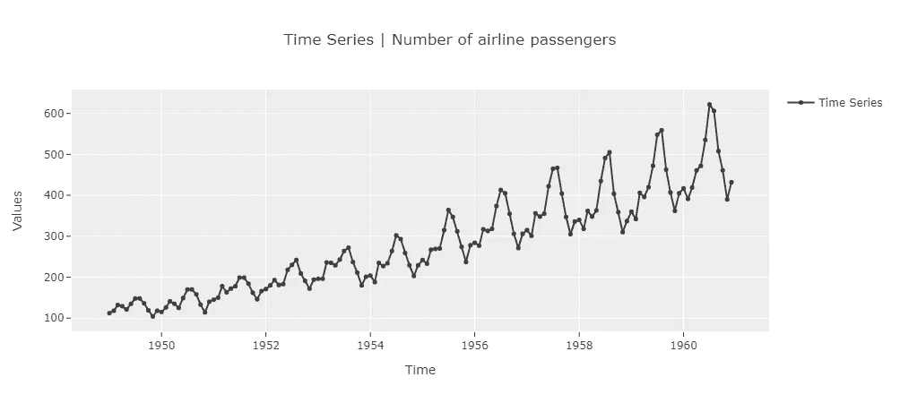
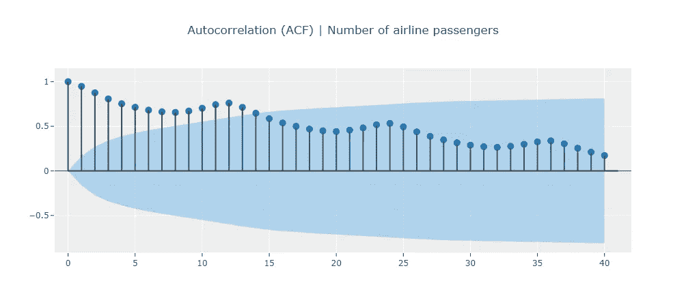
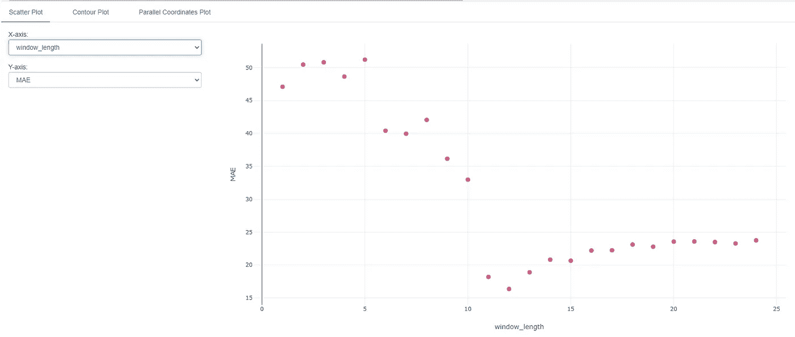
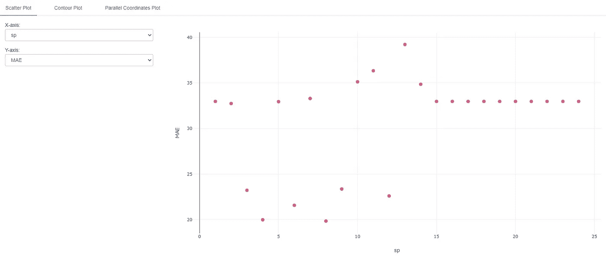
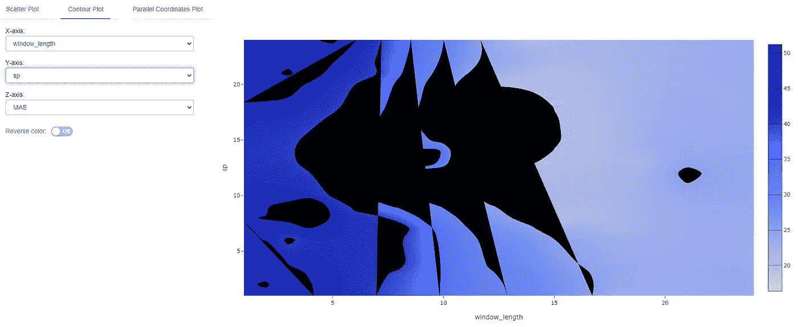

# 用 PyCaret & MLflow 探索模型超参数搜索空间

> 原文：<https://towardsdatascience.com/exploring-model-hyperparameter-search-space-with-pycaret-mlflow-b6c630d71723?source=collection_archive---------20----------------------->

## 时间序列预测的简化回归模型


照片由 [Serg Antonov](https://unsplash.com/@antonov?utm_source=medium&utm_medium=referral) 在 [Unsplash](https://unsplash.com?utm_source=medium&utm_medium=referral) 拍摄

## 📚介绍

您是否曾经查看过模型的超参数，并想知道它们对模型的性能有什么影响？你并不孤单。虽然有些影响可以直观地得出，但在其他情况下，结果却与直观相反。这些超参数不单独工作(单变量)而是相互结合(多变量)的事实加剧了这种情况。在决定网格搜索的搜索空间时，理解超参数对模型性能的影响变得更加重要。选择错误的搜索空间会导致浪费挂钟时间，而不会提高模型性能。

在本文中，我们将看到如何将 Pycaret 与 MLFlow 结合使用，以更好地理解模型超参数。这将有助于我们在执行网格搜索时选择一个好的搜索空间。

## 📖建议的先前阅读

在本文中，我们将以 PyCaret 的时间序列模块为例来探讨这个概念。具体来说，我们将研究用于预测的简化回归模型。如果你不熟悉这些模型，我推荐这篇短文。

👉[用于时间序列预测的简化回归模型](https://github.com/pycaret/pycaret/discussions/1760)

另外，如果您不熟悉 PyCaret 和 MLFlow 是如何协同工作的，这是一篇很有帮助的短文。

👉【MLFlow 时序实验测井

## 1️⃣简化回归模型超参数

简化的回归模型有几个超参数，但是有几个重要的是`sp`和`window_length`。在上面的“上一次阅读”中，建议在将数据传递到回归器进行建模之前对其进行去季节性处理。`sp`表示用于消除数据季节性差异的季节周期。此外，建模者需要决定在训练过程中将多少先前的滞后馈入回归模型。这由`window_length`超参数控制。

```
***sp :*** *int, optional
Seasonality period used to deseasonalize, by default 1****window_length*** *: int, optional
Window Length used for the Reduced Forecaster, by default 10*
```

## 2️⃣超参数直觉

许多数据集表现出季节性模式。这意味着任何给定时间点的值将紧密跟随一个或多个季节的数据(由季节周期或`sp`确定)。因此，保持`sp`固定在季节周期可能是直观的(例如，可以从 ACF 图中获得)。类似地，人们可能希望将至少一个季度的数据传递给回归器，以便对自回归属性进行建模。因此，我们的直觉可能会告诉我们让`window_length`也等于季节周期。

## PyCaret 的 3️⃣实验

现在，我们来看一个数据集，看看这些超参数有什么影响。在这个练习中，我们将使用经典的“航空公司”数据集。注意:本文末尾提供了一个 Jupyter 笔记本供参考。



航空数据集(图片由作者提供)

该数据集展示了 12 个月的季节性模式，这由 ACF 在 12 的倍数(12、24、36 等)处的峰值来指示。)



ACF:航空公司数据集(图片由作者提供)

## 尝试窗口长度

让我们创建一个`pycaret`实验，在这里我们改变`window_length`，并检查它对模型性能的影响。我们将在设置中启用 MLflow 日志记录。

```
exp.setup(
    *data*=y, *fh*=12, *session_id*=42,
    *log_experiment*=True,
    *experiment_name*="my_exp_hyper_window",
    *log_plots*=True
)*#### Create models with varying window lengths ----* for window_length in np.arange(1, 25):
    exp.create_model("lr_cds_dt", *window_length*=window_length)
```

现在可以在 MLflow 中可视化该实验的结果。MLflow 提供了一个非常方便的功能来比较一个实验的多次运行。我们可以利用这个特性来看看`window_length`的影响。



MLflow 中可视化窗口长度的影响(图片由作者提供)

结果与我们的直觉相符，即在窗口中包含至少 12 个点提供了最佳性能。任何低于 11 分的数据都会降低性能，因为我们没有包括上一个赛季的数据。任何超过 12 个数据点的结果都相当稳定，接近最佳度量值。

## 对季节周期进行实验

接下来，我们对`sp`重复同样的操作。

```
*#### Setup experiment with MLFlow logging ----* exp.setup(
    *data*=y, *fh*=12, *session_id*=42,
    *log_experiment*=True,
    *experiment_name*="my_exp_hyper_sp",
    *log_plots*=True
)*#### Create a model with varying seasonal periods ----* for sp in np.arange(1, 25):
    model = exp.create_model("lr_cds_dt", *sp*=sp)
```



MLflow 中显示的季节周期的影响(图片由作者提供)

这个实验的结果有点出乎意料。虽然我们在季节周期=12 时得到了好的结果，但在季节周期=3、4、6、8 和 9 时也得到好的结果。这可能是因为对于月度数据(如航空数据集)，周期 3、6、9 分别代表 1、2 和 3 个季度。这些也可以是数据重复自身的有效周期。4 和 8 的季节周期有点难以直观地解释，但可能表示数据分别一年重复 3 次或两年重复 3 次(也不是完全没有问题，尽管可能性比其他周期小)。

无论如何，这带来了超参数直觉和调优的挑战。通常很难提前确定“最佳”超参数，但至少我们可以直观地将它们设置为一个合理的值。此外，如上所述，超参数不倾向于孤立工作(单变量)。它们相互作用，还会以其他非直观的方式影响模型性能。接下来让我们检查一个多变量的情况。

## 尝试窗口长度和季节周期(多元)

在这个实验中，我们同时考虑`window_length`和`sp`来探索搜索空间。

```
*#### Create a model with varying window_length & sp ----*runs = 50
window_lengths = np.random.randint(1, 25, runs)
sps = np.random.randint(1, 25, runs)for window_length, sp in zip(window_lengths, sps):
    model = exp.create_model(
        "lr_cds_dt", w*indow_length*=window_length, *sp*=sp
    )
```

MLflow 还提供了使用等高线图可视化双变量数据的能力。在这种情况下，我们在 x 轴上绘制了`window_length`，在 y 轴上绘制了`sp`。颜色代表选择的度量标准(本例中为 MAE)。蓝色阴影越浅，误差越小，因此这种情况下超参数选择越好。



在 MLflow 中可视化的窗口长度和季节周期的影响(图片由作者提供)

我们可以从这些结果中看到，即使在多变量设置中，任何小于 12 个数据点的`window_length`都不会给出最佳结果(蓝色阴影)。任何高于 12 的值似乎都相当不错。对于季节周期，只要`window_length`大于 12，精确值似乎对双变量设置没有很大影响。(注意:如果您想知道，黑色区域是没有足够的样本点来构建轮廓的区域)。

## 🚀结论和下一步措施

我们现在可以使用这种直觉来指导我们未来遇到类似数据集时的超参数搜索空间。或者，查看下面的参考资料，了解`pycaret`如何以最佳和自动化的方式执行超参数调优。

👉[py caret 中时间序列模型的基本超参数调整](https://github.com/pycaret/pycaret/discussions/1791)

`pycaret`还为用户提供了在超参数调整期间控制搜索空间的选项。用户可能希望像我们在本文中所做的那样，基于手动评估来这样做。查看下面的文章了解更多细节。

👉[py caret 中时序模型的高级超参数调整](https://github.com/pycaret/pycaret/discussions/1795)

暂时就这样了。如果你想和我联系(我经常发布关于时间序列分析的文章)，你可以通过下面的渠道找到我。下次见，预测快乐！

🔗[领英](https://www.linkedin.com/in/guptanick/)

🐦[推特](https://twitter.com/guptanick13)

📘 [GitHub](https://github.com/ngupta23)

*喜欢这篇文章吗？成为* [***中等会员***](https://ngupta13.medium.com/membership) *继续* ***无限制学习*** *。如果你使用下面的链接，* ***，我会收到你的一部分会员费，而不会对你产生额外的费用*** *。*

<https://ngupta13.medium.com/membership>  

# 📗资源

1.  [**Jupyter 笔记本**](https://nbviewer.ipython.org/github/ngupta23/medium_articles/blob/main/time_series/pycaret/pycaret_mlflow_hyperparams.ipynb) 包含本文代码