# 使用卫星图像探索北加州正在衰退的巨藻森林

> 原文：<https://towardsdatascience.com/exploring-northern-californias-declining-bull-kelp-forests-using-satellite-imagery-1cf4109b3e78?source=collection_archive---------39----------------------->

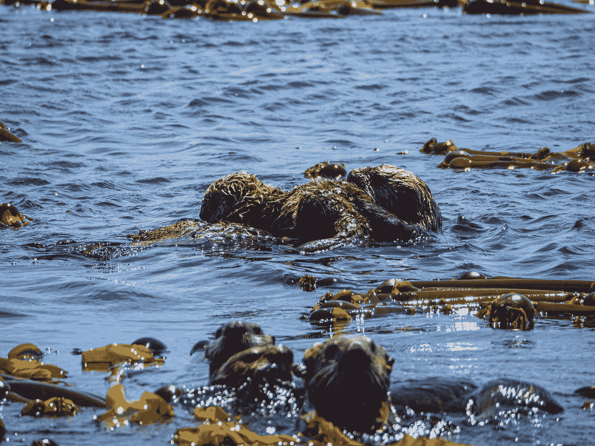

在加拿大不列颠哥伦比亚省巨藻丛中漫步的海獭。[基兰·伍德](https://unsplash.com/@kieran_wood?utm_source=medium&utm_medium=referral)在 [Unsplash](https://unsplash.com?utm_source=medium&utm_medium=referral) 上拍摄的照片

# 背景

加州沿海的海带森林一直在减少，巨藻[[*Nereocystis luetkeana*](https://en.wikipedia.org/wiki/Nereocystis)]对气候变化和 2013 年海星消耗病导致的海胆过多特别敏感[1]。气候变化被认为是这些海藻森林退化的部分原因，但具体到什么程度还不得而知。研究人员观察到，从 2014 年到 2019 年，北加利福尼亚的海带持续减少，各种西海岸机构正在研究加强海带监测工作的方法[3]。本文的目的是利用公开的工具和数据调查被认为受到影响的海岸线子集。

作为一名前航空航天工程师、自然爱好者和总体数据极客，我越来越感兴趣的是，我们可以简化专业人士和爱好者对环境科学数据的访问，同时传播一个我认为非常重要的信息；我们的世界在变化，我们的工具也在进步，但我们如何使用这些工具将极大地决定我们在这个星球上的未来。

该项目使用 ArcMap 10.7 软件，探索如何使用公开的卫星图像来监测这些海藻森林的变化，这些海藻森林是各种海洋物种的重要栖息地和繁殖地。除了海星消耗病之外，由于失去了这种顶级捕食者，失去以海胆为食的食肉海獭可能会进一步影响生态系统的平衡。此外，在这些年里，观察到了大型海洋热浪事件，增加了巨藻林面临的压力清单。

更多关于 Landsat 8 卫星计划的背景资料，见 [**这里**](https://www.usgs.gov/core-science-systems/nli/landsat/landsat-8?qt-science_support_page_related_con=0#qt-science_support_page_related_con) 。地理空间分析和遥感的一些知识对阅读本文很有帮助，在线资源也很丰富。

此项目的最终简化网络地图可在 [**此处**](https://arcg.is/vyfuy) 找到:

好的。让我们开始吧…

# 术语

下面列出了一些背景术语，但是对地理空间信息系统(GIS)的大致了解有助于理解本文的工作。可以在这里 和网络上的其他地方找到一个快速概览 [**。**](https://youtu.be/LHDCRjAxpI0)

**缓冲区**-在地理信息系统和空间分析中，缓冲区分析是指确定地理要素周围的区域，该区域包含位于该要素指定距离内的位置，即缓冲区

美国地质调查局和美国国家航空航天局的联合科学卫星，通过使用遥感技术研究和拍摄地球表面。有关 Landsat 8 卫星计划的背景和资源，请参见美国地质调查局的 [**本概述**](https://www.usgs.gov/core-science-systems/nli/landsat/landsat-8?qt-science_support_page_related_con=0#qt-science_support_page_related_con) 。

**RGB** — RGB(红、绿、蓝)指的是一种在计算机显示器上显示颜色的系统。红色、绿色和蓝色可以以各种比例组合，以获得可见光谱中的任何颜色

**GIS** —地理信息系统是一个概念化的框架，能够捕获和分析空间和地理数据

**NDVI**——归一化差异植被指数(NDVI)是一个简单的图形指标，可用于分析遥感测量结果，通常来自空间平台，通过使用可见光和近红外波段的反射光来评估被观察的目标是否包含活的绿色植被。

**栅格** —最简单的形式是，栅格由组织成行和列(或网格)的像元(或像素)矩阵组成，其中每个像元包含一个代表信息的值，如温度。光栅图像是数字航空照片、卫星图像、数字图片，甚至是扫描地图。

**掩膜**-掩膜是一种通过隐藏或屏蔽一个图层的要素和另一个图层的重叠要素来阐明密集或详细地图内容的技术。

# 设置

为了进行这一分析，从美国地质调查局<https://earthexplorer.usgs.gov/>**检索了 2015-2019 年 9 月至 11 月海藻高峰期的 Landsat 8 图像(关于检索 Landsat 图像，请参见本指南[；关于 Landsat 8 的栅格波段定义，请参见本指南](https://www.earthdatascience.org/courses/earth-analytics/multispectral-remote-sensing-modis/get-data-earth-explorer/)<https://www.usgs.gov/faqs/what-are-band-designations-landsat-satellites?qt-news_science_products=0>**)。在此期间，继 2014 年北加州发生严重的海带损失事件后，人们广泛观察到了持续的海带损失，希望能够详细探索该地区的一个子集。每个日期都使用了来自[路径 45/行 33](https://www.usna.edu/Users/oceano/pguth/md_help/html/landsat_path_row.html#:~:text=Landsat%20satellites%20image%20the%20entire,of%20a%20frame%20of%20imagery.) 的场景，如下图红色所示。****

****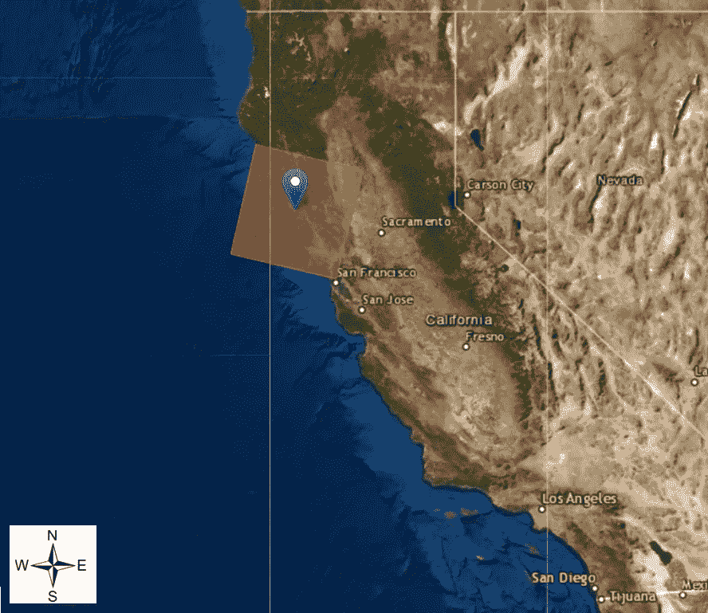****

****图 1:通过美国地质勘探局地球探测器探测大型海藻的感兴趣位置****

****我选择这个地区是因为它局限于单一陆地卫星项目中的一个陆地卫星“场景”，主要包含巨藻[2]。保持在一个计划内，Landsat 8，消除了跨计划比较图像的需要，这本身就提出了挑战。Landsat 8 于 2013 年发射，但截至本文撰写之时，计划于 2021 年 9 月下旬发射 Landsat 9，这将在未来几年提供连续的地球成像。****

****历史上，巨藻因其季节性生长特性，对海胆贫瘠和气候变化更为敏感。海带生长高峰期(9 月至 11 月)的数据被平均化，以表征特定年份的海带数量。每个日期四个文件，每年三个日期导致总共 60 个文件。它们是根据低云量选择的，并遵循下面表 1 中列出的格式。****

****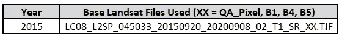****

****表 1:用于分析的 Landsat 8 文件格式示例。四个。TIF 为每个日期归档。****

****这些图像被缓冲并屏蔽了海岸线，只包括离岸 200 到 2000 米的水域，以帮助最大限度地减少海滩碎片、沙子、岩石和其他不是海藻或水的地形的海岸分类错误。****

****此外，使用波段 1 和 QA 栅格波段遮蔽了云和烟雾，以进一步减少分类时的数据误差。****

# ****方法****

****为简单起见，使用 [**归一化差异植被指数**](https://en.wikipedia.org/wiki/Normalized_difference_vegetation_index) (NDVI)来检测巨藻位置。我探索了其他海带分类方法，并在最后列出了一些相关的研究论文，供进一步阅读。****

****Landsat 8 影像的 NDVI 通常用于农田和陆地植被，并通过以下公式从可见红色波段(波段 4)和近红外波段(NIR 波段 5)获得:****

****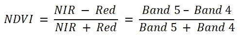****

****这导致指数范围从-1.0 到+1.0，较高的值表示存在植被。像素质量(QA)和气溶胶(B1)栅格数据用于在可能的情况下从评估中移除云和烟雾像素。****

****使用 ArcGIS 栅格计算器，为每个感兴趣的栅格数据集计算 NDVI，水中的低正值假定为海带。****

****遮蔽云和烟雾后，结果在 ArcGIS 中与缓冲研究区域“相交”。作为示例，下图 2 显示了感兴趣区域内的初步 NDVI 地图，其中植被区域显示为白色。使用模型构建器将其进一步开发成 ArcGIS 模型，如图 4 所示。****

****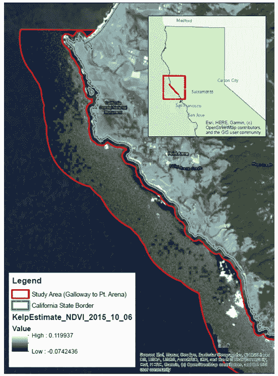****

****图 ArcGIS Desktop 10.7 中研究区域内的 NDVI 示例****

# ****结果****

****尽管本分析中 2015–2019 年的总体趋势与生长高峰期秋季巨藻的减少一致，但这些结果是初步的，应与“地面实况”数据进行比较，即通过航空影像或潜水员调查验证的巨藻林位置。数据是跨秋季月份的平均值，但有几个因素没有考虑，这需要在未来进行研究。其中一些因素列在最后。****

****作为参考，一个美式足球场约为 1.3 英亩或 0.005 平方公里。****

****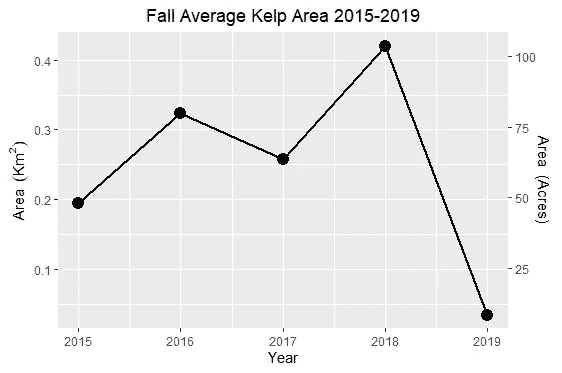****

****图 3:研究区域按年份划分的海带覆盖面积****

****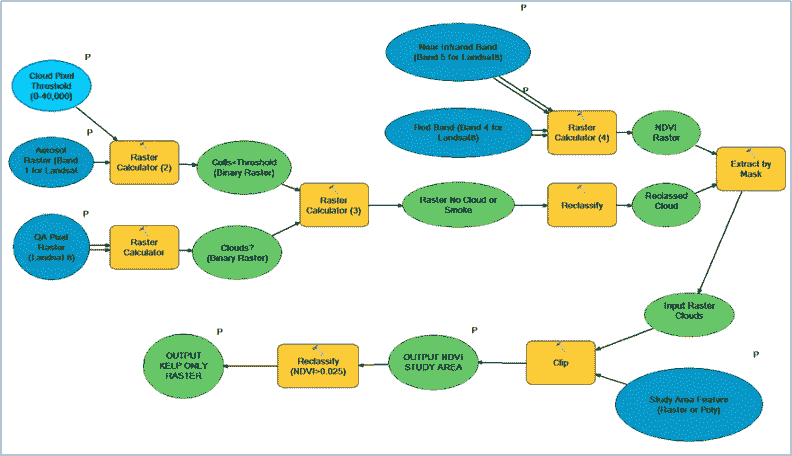****

****图 4:我在 ArcGIS 模型构建器中构建的海带评估工具****

# ****讨论****

****这一分析的结果喜忧参半，需要进行更彻底的分析才能得出更明确的结论。未来的研究应该考虑下面列出的假设和注释，包括探索其他指数和云遮蔽技术。总的来说，2019 年检测到的海带总量明显下降，但尽管数据可能支持可检测的海带在调查的几年中下降的结论，但这很大程度上取决于人们查看的数据部分。****

****尽管如此，这些结果可能是为分析而选择的年份或月份的人为产物。调查日期的广泛间隔，虽然旨在捕捉长期的可变性，但可能反而是捕捉局部气候和海洋条件变化的快照-2014 年至 2016 年是厄尔尼诺年，除 2019 年之外的所有调查年份都被认为是加州干旱年。分析更多的日期有助于理清这些区别。****

****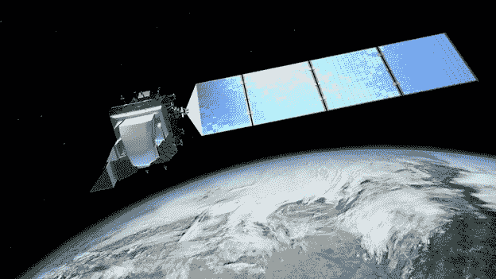****

****图 5:地球上方的陆地卫星 8 号插图。美国地质勘探局插图****

****另一个限制是空间(图像像素区域)和时间(时间)分辨率。Landsat 8 图像数据每 16 天采集一次，分辨率为 30 米，这意味着每个像素代表地面上 30 米 x 30m 米的区域。正如所料，巨藻植被很难在这个分辨率下捕捉到，它可能不适合这个任务。****

****另一方面，2A 哨兵拥有更高分辨率的图像(高达 10 米)。Sentinel 数据于 2015 年推出，随着时间的推移和更多数据的捕获，可能会提供更好的图像来估计这些类型的变化。这两颗卫星的图像波段之间的一些差异在 [**这里总结为**](https://www.usgs.gov/centers/eros/science/usgs-eros-archive-sentinel-2-comparison-sentinel-2-and-landsat?qt-science_center_objects=0#qt-science_center_objects) ，然而，对于研究的区域和日期，这一数据很难获得，需要进一步探索。更高分辨率的图像可从私人机构获得，如行星实验室的 PlanetScope 卫星(高达 3m)，并正在作为替代方案进行研究。****

****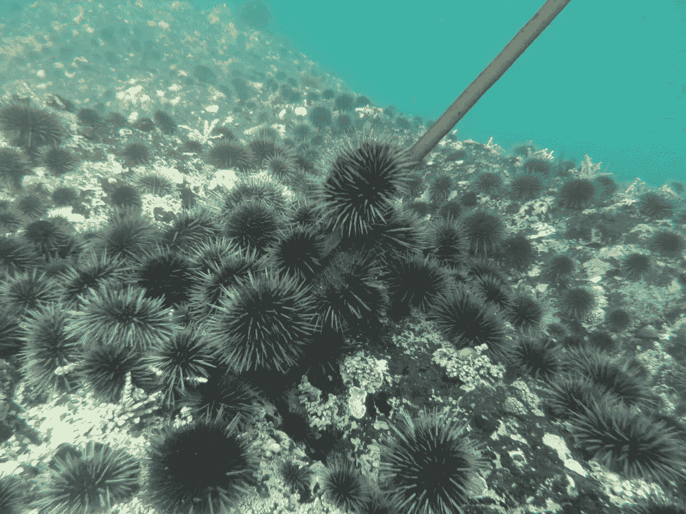****

****图 6:北加州的一只紫海胆。照片由加利福尼亚州布拉格堡的[诺约中心](https://noyocenter.org/help-the-kelp/)提供****

****如前所述，除了 NDVI 之外，还有许多方法正在西海岸机构进行研究，并在[3]中进行了很好的总结和列表。这些包括但不限于漂浮藻类指数(FAI)、比例藻类指数(SAI)、多端元光谱混合分析(MESMA)和归一化差异藻类指数(NDAI)，不在本次初步探索的范围之内。****

****一般来说，这些分类方法是一致的，但是依赖于基本的假设和训练数据。使用这些替代方法对海藻栖息地进行数字化可能会产生更可靠的结果。加州大学洛杉矶分校 KelpWatch 项目[4]已经开发了一个网络地图，开发一个专门针对巨藻降解的类似地图将是这个项目的未来目标。****

****最终地图如下图 5 所示，突出显示了从加利福尼亚州加洛韦到 Point Arena Lighthouse 的感兴趣区域的子区域，该子区域在视觉检查后，很好地跟踪了来自 KelpWatch 的 2015–2019 年第三季度数据[4]。****

****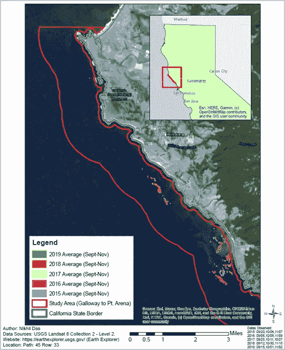****

****图 ArcGIS Desktop 10.7 中 2015–2019 年北加州高峰月期间的海藻估算****

****这种探索性的分析只是触及了表面(双关语😜)和下面列出的注释和假设列表，应该在未来的研究中探索。****

# ****注释和假设****

****下面列出了遇到的一些挑战。****

****1.稀疏或沉水的海带，可能难以察觉[3]。根据[5],当在自然水环境中观察到马尾藻(褐藻)时，与离开水相比，马尾藻的可检测性降低了约 75%。在本研究中，对海带检测进行了类似的假设。****

****2.其他因素也可能影响可检测的海带数量，如水柱中的海带长度、潮汐高度、浊度/水流、测深和一般水条件。****

****3.每年的天气异常(厄尔尼诺、大旱年、海洋热浪)也会影响结果。NOAA 的高分辨率海面温度(SST)数据集可在 [**此处**](https://www.esrl.noaa.gov/psd/data/gridded/data.noaa.oisst.v2.highres.html) 获得。****

****4.拍摄传感器图像的时间的可变性会影响所捕捉的反射光。****

****5.研究区域中浮游植物的存在可能会被混淆为海带。对于二月和九月之间的数据来说尤其如此。****

****6.需要地面真实数据来验证这项研究。历史上，这是通过空中图像或潜水员在水中的调查来完成的。****

****7.单个像素(30 米 x 30m 米)在这里不是“未混合的”,如果海藻在 30 米像素的 15%以下，则很难检测到。MESMA 就是这样一种技术[2]。****

# ****现在怎么办？****

****在这个项目中，我学到了很多东西，除了已经讨论过的科学和技术挑战，我希望在未来能看到许多事情发生，以传播海带森林处于危险之中的信息，同时增加研究人员和爱好者对海带数据的访问。****

****从研究的角度来看，定期修订越来越多的海带评估方法和标准，如[3]，可以帮助巩固和简化各研究机构监控海带的方法。GIS 软件许可可能是一个资源挑战，但幸运的是，现在存在开源软件，如 QGIS，而 R 和 Python 中的 GIS 包和库可以处理地理空间数据。我通过参加地理空间分析课程获得了 ArcGIS 许可。****

****探索数据的另一个挑战是大地卫星图像 TIF 文件数据的庞大。分析大量高分辨率图像会使本地机器负担过重，从而限制了没有良好计算能力和存储的个人。****

****从面向公众的角度来看，对于那些不住在海岸附近或不在海洋中度过时间的人来说，吸引公众关注海带始终是一个挑战。海滩清理、海藻森林集体浮潜游或海岸徒步旅行只是帮助公众参与和提高社区意识的几种方式。****

****继续发展和培养研究机构、非营利组织和社区之间的伙伴关系对于监测我们的海藻森林至关重要。一个已经在进行的例子是大法拉隆斯海藻恢复项目 ，这是大法拉隆斯协会、大自然保护协会和其他组织之间的联合项目，旨在保护和恢复北加州海岸线的海藻森林。****

****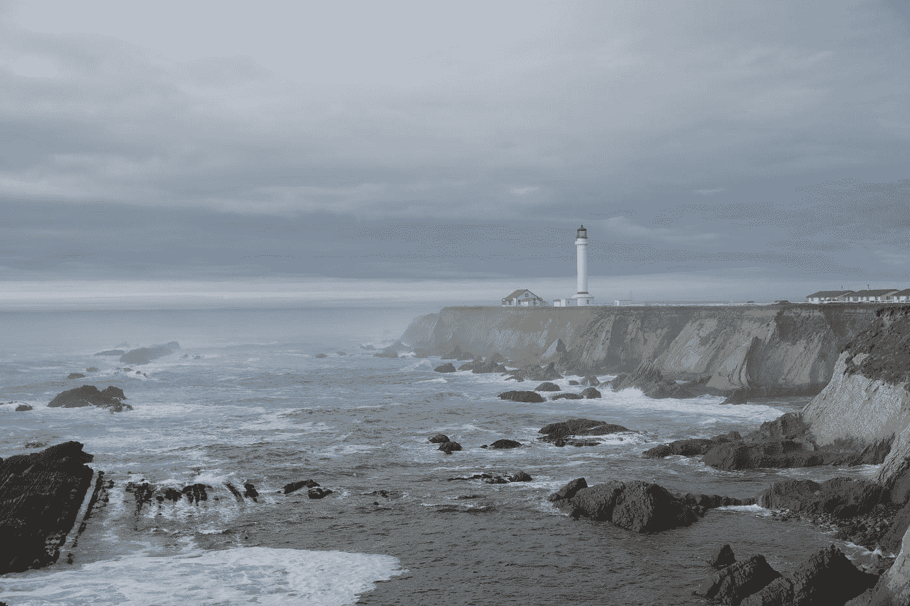****

****图 Point Arena 灯塔标志着研究区域的北端。照片由[布鲁诺·沃尔夫](https://unsplash.com/@mrbrunowolff?utm_source=medium&utm_medium=referral)在 [Unsplash](https://unsplash.com?utm_source=medium&utm_medium=referral) 上拍摄****

****如前所述， [**KelpWatch**](https://kelp.codefornature.org/) 项目[4]有一张地图，提供了过去几十年中海带数量下降的概览，是公众了解 1984 年以来海带数量下降的有用工具。这张地图可以作为向公众展示有关气候变化影响的科学数据的一个例子，并且可以应用于任何生态系统或物种。****

****最后，通过强调传统的“流行”主题，让学生或爱好者通过免费的在线研讨会或培训来玩空间分析工具，有助于吸引更多的公众。这可能包括鲸鱼和鲨鱼的迁徙、入侵的狮子鱼追踪、全球珊瑚产卵事件等等。对于地理空间分析，可能性是无限的！****

****我希望，随着技术的进步和我们今天拥有的开源工具和数据的民主化，我们将能够为我们的未来做出更好的决定！****

# ****进一步研究的参考****

****[1]海洋侦探。"海星消耗综合症现在记录在温哥华岛东北部."[http://themarine detective . com/2013/12/21/sea-star-washing-syndrome-now-documented-on-ne-Vancouver-island/](http://themarinedetective.com/2013/12/21/sea-star-wasting-syndrome-now-documented-on-ne-vancouver-island/)。****

****[2]丹尼斯 J.I .芬格，梅雷迪思 l .麦克弗森，亨利 f .豪斯基普，拉斐尔 m .库德拉，2021。“利用 Landsat 绘制北加利福尼亚巨藻冠层图，以便进行长期监测”。[https://doi.org/10.1016/j.rse.2020.112243](https://doi.org/10.1016/j.rse.2020.112243)。****

****[3]莎拉·b·施罗德 a，科琳·杜邦，莉安娜·博耶，弗朗西斯·胡安内斯，2019。“巨藻(*Nereocystis**luetkeana*)被动遥感制图技术”:技术回顾与区域案例研究。[https://doi.org/10.1016/j. gecco . 2019 . e 00683](https://doi.org/10.1016/j.%20gecco.2019.e00683)。****

****[4] Kelpwatch 2021。[https://kelp.codefornature.org/](https://kelp.codefornature.org/)。****

****[5]迪尔森，H.M .，施卢斯，a .，拉塞尔，b .，2015。“利用航空遥感对大佛罗里达湾沿海水域海草和大型海藻马尾藻浮垫的高光谱识别”。遥感环境。167，247e258。[https://doi.org/10.1016/j.rse.2015.01.027](https://doi.org/10.1016/j.rse.2015.01.027)。****

****[6]汉密尔顿、S. L .、贝尔、T. W .、沃森、J. R .、格罗鲁德‐科尔维特、K. A .、门格、B. A. (2020 年)。“遥感:为评估气候变化的影响生成长期海藻床数据集”。生态学，e03031。[https://esa journals . online library . Wiley . com/doi/ABS/10.1002/ecy . 3031](https://esajournals.onlinelibrary.wiley.com/doi/abs/10.1002/ecy.3031)。****

# ****关于作者****

********

****Nikhil Das 是一名自由职业工程师、数据分析师和作家，热爱大自然。作为一名前航空工程师，他发现在太空中仰望天空和星星时很容易感到自己很渺小。然而，最近他通过向下凝视地球，对自己的存在有了更深的欣赏，无论是在山区徒步旅行，在广阔的海洋潜水，还是现在探索鸟瞰我们星球的数字图像。他总是在寻找有趣的项目、机会或者只是交流自然故事，可以通过电子邮件联系到 nikd29@gmail.com。****