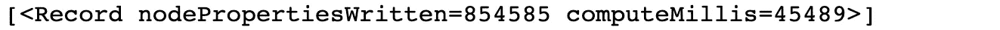

# 探索 Neo4j 中实用的推荐系统

> 原文：<https://towardsdatascience.com/exploring-practical-recommendation-engines-in-neo4j-ff09fe767782?source=collection_archive---------7----------------------->

## 利用图形数据科学和机器学习


作者图片

在本帖中，我们将探讨如何在 graph 中开始使用实用且可扩展的推荐。我们将在一个包含 1750 万点击事件和大约 75 万用户的数据集上演示一个带有新闻推荐的基本示例。我们将利用 [Neo4j](https://neo4j.com/) 和[图形数据科学(GDS)库](https://neo4j.com/docs/graph-data-science/current/)根据用户偏好快速预测类似新闻，并实现亚秒级、排序、个性化的推荐查询。

***所有重现这一分析的代码以及从源数据设置图表的资源都可以在*** [***这个 GitHub 资源库***](https://github.com/zach-blumenfeld/demo-news-recommendation/tree/main/mind-large-collab-filtering) 中找到。

推荐系统是一个丰富的研究领域，我们在这里仅仅触及皮毛。如果你对任何领域感兴趣——无论是其他推荐技术、评估性能、优化，包括更多输入、如何进一步扩大规模，还是任何其他基于图表的推荐者，请在评论中留下注释。

这篇文章的结构如下:首先，我们将简要地定义推荐系统。接下来，我们将查看将要使用的源数据集和图表，以及如何查询基本的分析统计信息，以帮助我们理解图表并更好地为分析做准备。接下来，我们将讨论一种叫做协同过滤(CF)的技术，这将是我们在这篇文章中的推荐机制。之后，我们将使用 Cypher 查询语言和图形数据科学(GDS)库，利用节点嵌入和称为 K-最近邻(KNN)的 ML 技术，深入应用 CF。最后，我们将讨论后续步骤和跟进资源。

# 什么是推荐系统？

简而言之，推荐系统是一种信息过滤系统，它寻求为用户可能感兴趣的*项目*生成有意义的推荐。

在推荐系统的上下文中，“项目”是一个通用术语，可以指面向用户销售或定向的任何东西，包括在线零售店中的产品、诸如书面文章、视频和/或音乐之类的内容，或者社交媒体平台上潜在的联系或关注的人。

不言而喻，在竞争日益激烈的在线环境中，推荐系统对于提高用户满意度和加速业务增长至关重要。

# 今天的数据集:微软思维

在本帖中，我们将使用[**MI**crosoft**N**EWS**D**ataset(MIND)大型数据集](https://msnews.github.io/)探索新闻推荐，该数据集是从微软新闻网站[1]收集的 100 万匿名用户及其点击行为的样本。它包括大约 1500 万个印象日志和大约 16 万篇英语新闻文章。

我格式化了数据集，并使用下面的模式将其加载到一个图表中:

```
//visualize schema in Neo4j Browser
neo4j$ CALL db.schema.visualization();
```


作者图片

我们看到，新闻文章被建模为节点，可以被用户`CLICKED`或`HISTORICALLY CLICKED`建模为节点。在这种情况下，`CLICKED`指的是从我们样本的时间间隔(大约 2019 年 11 月 9 日至 2019 年 11 月 15 日)内发生的印象记录中解析的点击动作。`HISTORICALLY CLICKED`指用户历史中的点击动作，发生在过去某个未知时间。

此外，新闻还有由微软注释的子类别和分类，以及微软使用 NLP 方法从新闻标题和摘要中提取的维基数据实体。我也用图中的节点和关系对它们进行了建模。我将在最后简要地谈到这些，它们对于扩展分析是有用的，但是我们不会在这篇文章中使用它们。我们在这里的主要兴趣是从用户和他们的点击事件开始，以获得推荐。

# 技术分析

展望未来，我们将通过数据集揭示新闻推荐的见解，并沿途显示代码片段。下面所有代码来自笔记本[这里](https://github.com/zach-blumenfeld/demo-news-recommendation/blob/main/mind-large-collab-filtering/practical-graph-recommendation-cf-example.ipynb)。虽然我认为代码片段有助于将这些点连接起来，但为了简洁起见，我在这里不重复笔记本中的一些配置和功能定义。如果您有兴趣完全复制 Python 中的分析，请使用笔记本作为源代码。

# 图形数据分析

在开始分析之前，检查图表的一些高级统计数据对更好地理解大小和连通性是有帮助的。

## 总计数

让我们从高节点和关系计数开始。这些函数假设 [APOC](https://neo4j.com/developer/neo4j-apoc/) 安装在您的 Neo4j DB 上。

```
gds **=** GraphDataScience(HOST, auth**=**(USERNAME, PASSWORD), aura_ds**=True**)*# total node counts*
gds**.**run_cypher( '''
    CALL apoc.meta.stats()
    YIELD labels AS nodeCounts
    UNWIND keys(nodeCounts) AS label
    WITH label, nodeCounts[label] AS nodeCount
    WHERE label IN ['User','News']
    RETURN label, nodeCount
''')
```


作者图片

```
*# total relationship counts*
gds**.**run_cypher( '''
    CALL apoc.meta.stats()
    YIELD relTypesCount as relationshipCounts
    UNWIND keys(relationshipCounts) AS type
    WITH type, relationshipCounts[type] AS relationshipCount
    WHERE type IN ['CLICKED','HISTORICALLY_CLICKED']
    RETURN type, relationshipCount
''')
```


作者图片

就推荐系统而言，这是一个相对较小的图表，只有大约 75 万用户、10 万篇新闻文章和大约 1750 万次总点击事件。这些数字小于 MIND Large 报告的总数，因为一些原始数据集被微软留作竞争评估的测试集，因此没有完整的印象信息。那部分数据被排除在这张图表之外。

## 单击事件分布

接下来，我们可以看看每个用户的点击量分布。检查这种分布有助于确保:

1.  该图是相当好连接的，因为我们即将推出的推荐技术的质量将取决于一个相当好连接的图。
2.  我们没有任何大的[超节点](https://medium.com/neo4j/graph-modeling-all-about-super-nodes-d6ad7e11015b)，即具有非常高数量关系的节点。超节点的定义因用例而异。对于这一点，我会关注点击量成千上万的用户。

```
all_clicks_df = degree_counts('User', 'CLICKED|HISTORICALLY_CLICKED', 'OUT')recent_clicks_df **=** degree_counts('User', 'CLICKED', 'OUT')f, axs = plt.subplots(1,2,figsize=(16,5))axs[0].bar(all_clicks_df.degree[:80], all_clicks_df.degreeCount[:80], width=1)
axs[0].set_title('User Clicks Distribution')
axs[0].set_ylabel('User Count')
axs[0].set_xlabel('Number of Total Clicks')
plt.figtext(0.4, 0.5, get_percentiles(all_clicks_df).to_string())axs[1].bar(recent_clicks_df.degree[:80], recent_clicks_df.degreeCount[:80], width=1)
axs[1].set_title('User Recent Clicks Distribution')
axs[1].set_ylabel('User Count')
axs[1].set_xlabel('Number of Recent Clicks')
plt.figtext(0.83, 0.5, get_percentiles(recent_clicks_df).to_string())plt.show()
```


作者图片

上图显示了用户的总点击量(`CLICKED`和`HISTORICALLY_CLICKED`)以及最近点击量(仅`CLICKED`)的分布。我们看到这些分布有很大的左尾，表明用户之间的活动分布并不均匀——相反，有相对小部分的用户占了大量的点击。这多少有些意料之中。重要的是，每个用户至少有一次最近的点击事件，我们没有看到用户有上万次点击事件。

我们可以对下面的新闻做类似的细分。

```
all_clicks_df **=** degree_counts('News', 'CLICKED|HISTORICALLY_CLICKED', 'IN')recent_clicks_df **=** degree_counts('News', 'CLICKED', 'IN')f, axs = plt.subplots(1,2,figsize=(16,5))axs[0].bar(all_clicks_df.degree[:80], all_clicks_df.degreeCount[:80], width=1)
axs[0].set_title('News Total Clicks Distribution')
axs[0].set_ylabel('News Count')
axs[0].set_xlabel('Number of Total Clicks')
plt.figtext(0.4, 0.5, get_percentiles(all_clicks_df).to_string())axs[1].bar(recent_clicks_df.degree[:80], recent_clicks_df.degreeCount[:80], width=1)
axs[1].set_title('News Recent Clicks Distribution')
axs[1].set_ylabel('News Count')
axs[1].set_xlabel('Number of Recent Clicks')
plt.figtext(0.83, 0.5, get_percentiles(recent_clicks_df).to_string())plt.show()
```


作者图片

虽然新闻的总点击数看起来还可以，但只有一小部分新闻(< 25%)是最近被点击的，也就是说，在我们样本的时间窗口内，实际上是被用户点击的。在该时间窗口内未被点击的新闻在这种情况下可能不是推荐的好候选。我们将在下面处理这个问题。

# 标记最近的新闻

为了确保 CF 的推荐是相关的，我们需要筛选出一部分新闻文章来考虑。

1.  新闻在最近的时候往往最相关，但随着时间的推移，可能会很快失去相关性。一般来说，好消息推荐者应该避免陈旧和/或过时的消息。在这种情况下，我们可以使用 Microsoft impressions 作为代理，并且**只考虑包含在我们的样本时间窗口内的印象中的新闻文章。为了做到这一点，我们可以使用一个名为`approxTime`的节点属性来反映新闻文章的最小印象时间。我在[将源数据加载到 Neo4j](https://github.com/zach-blumenfeld/demo-news-recommendation/blob/main/mind-large-collab-filtering/prepare-and-load-data.ipynb) 时计算了这个属性。长话短说，`approxTime`只对我们样本中至少有一个印象的新闻文章为非空。**
2.  CF 的一个局限是只能推荐有用户反馈的内容。因此，**没有用户点击的新闻文章不能用于 CF。**在应用中，这有时被称为[冷启动](https://en.wikipedia.org/wiki/Cold_start_(recommender_systems))问题。它可以通过基于内容的推荐和其他混合方法来解决。我们可能会在单独的帖子中涉及这一点，但对于这个示例，我们**只考虑至少有一个用户点击的新闻文章，即至少有一个** `**CLICKED**` **或** `**HISTORICALLY_CLICKED**` **关系**。

我们可以分配第二个节点标签`RecentNews`，以便在 Cypher 查询和 GDS 预测中轻松过滤出符合上述标准的新闻。记住 Neo4j 允许一个节点有多个标签，所以原来的`News`标签还是会被保留。

```
gds**.**run_cypher('''
    MATCH(n:News)<-[:CLICKED|HISTORICALLY_CLICKED]-()
    WHERE n.approxTime IS NOT NULL
    SET n:RecentNews
    RETURN count(DISTINCT n)
''')
```


我们确实看到新闻文章的数量显著减少，从 104K 减少到大约 22K。但是由于这些新闻更近，联系也更紧密，因此我们应该能够通过将焦点缩小到这些新闻文章来改进我们的推荐器。我们还可以在点击分布中看到这些改进。

```
all_clicks_df **=** degree_counts('RecentNews', 'CLICKED|HISTORICALLY_CLICKED', 'IN')recent_clicks_df **=** degree_counts('RecentNews', 'CLICKED', 'IN')

f, axs **=** plt**.**subplots(1,2,figsize**=**(16,5))

axs[0]**.**bar(all_clicks_df**.**degree[:80], all_clicks_df**.**degreeCount[:80], width**=**1)
axs[0]**.**set_title('Total Clicks Distribution')
axs[0]**.**set_ylabel('News Count')
axs[0]**.**set_xlabel('Number of Total Clicks')
plt**.**figtext(0.4, 0.5, get_percentiles(all_clicks_df)**.**to_string())

axs[1]**.**bar(recent_clicks_df**.**degree[:80], recent_clicks_df**.**degreeCount[:80], width**=**1)
axs[1]**.**set_title('Recent Clicks Distribution')
axs[1]**.**set_ylabel('News Count')
axs[1]**.**set_xlabel('Number of Recent Clicks')
plt**.**figtext(0.83, 0.5, get_percentiles(recent_clicks_df)**.**to_string())

plt**.**show()
```


作者图片

我们现在可以看到，每篇新闻文章都至少被点击过一次，至少 75%的新闻文章是最近被点击过的。

# 协同过滤(CF)

有许多不同类型的推荐系统。在本帖中，我们将应用一种叫做协同过滤(CF)的技术，这是一种基于相似用户的行为自动预测用户偏好的实践。


来自:[https://en.wikipedia.org/wiki/Collaborative_filtering](https://en.wikipedia.org/wiki/Collaborative_filtering):“这张图片展示了一个使用[协同](https://en.wikipedia.org/wiki/Collaborative_software)过滤来预测用户评分的例子。起初，人们会对不同的项目进行评分(比如视频、图片、游戏)。在那之后，系统对用户还没有评价的项目进行[预测](https://en.wikipedia.org/wiki/Prediction)。这些预测基于其他用户的现有评级，这些用户与活动用户具有相似的评级。例如，在我们的案例中，系统已经做出了预测，即活跃用户不会喜欢该视频。”:图片由莫沙宁，CC BY-SA 3.0<[https://creativecommons.org/licenses/by-sa/3.0](https://creativecommons.org/licenses/by-sa/3.0)>，转自维基共享

## 基于用户和项目的 CF

粗略地说，协作过滤主要有两类:

1.  **基于用户，**侧重于根据用户与项目的交互直接计算用户之间的相似性
2.  **基于项目的**，其基于相关的用户活动来测量项目对之间的相似性，例如相同的用户喜欢、查看、评级或以其他方式类似地与项目交互

我们今天的方法将集中于后来的基于项目的 CF。对于许多问题域，基于项目的 CF 将比基于用户的 CF 更易于管理和扩展。这有几个原因。

首先，因为在大多数应用情况下，项目比用户少得多，所以要比较的实体较少。第二，也许更重要的是，用户偏好也是动态的，会随着时间的推移而改变。例如，在电影的例子中，用户可能对科幻电影最感兴趣，但经历了西部片的短暂停留，并且向历史上观看过相同内容的其他科幻迷推荐西部片可能不是最好的事情。通常，用户当前兴趣的最佳指标是他们最近的活动，基于项目的过滤使您能够更灵活地根据最近的项目点击、查看、评级等来找到相似性。

## 隐式协同过滤

您通常会在明确的用户反馈环境中听说协作过滤，例如在线商店中对电影或产品的评论。在本帖中，我们将只对新闻点击活动应用协同过滤，即 1 表示点击，意味着用户“喜欢”某个内容，否则为 0。这是“隐式协同过滤”的一种基本形式，其中用户的偏好是基于他们的活动而非显式反馈来暗示的。隐式 CF 的需求经常出现，因为许多现实世界的场景没有显式评级，或者即使有，也非常稀少。在生产设置中，您可能还想合并其他用户活动数据点，以帮助权衡图形关系，如读取/查看时间、滚动深度等。在 MIND 数据集中是不公开的。您拥有的信息越多，您就越能准确地模拟用户偏好。

# CF 的基本密码查询

从这里开始，我们可以尝试使用 Cypher 来完成基本的协同过滤。例如，以下面的用户和他们点击的新闻为例。你可以看到人们对汽车、金融、美国新闻和其他几个类别的兴趣混杂在一起。

```
USER_ID = 'U218584'gds**.**run_cypher('''
    MATCH (u1:User {userId: $userId})
           -[r1:CLICKED|HISTORICALLY_CLICKED]->(n1:RecentNews)
    RETURN n1.newsId AS newsId,
           n1.title AS title,
           n1.abstract AS abstract,
           n1.category AS category,
           n1.subcategory As subcategory,
           r1.impressionTime AS impressionTime,
           type(r1) AS clickType
    ORDER BY clickType, impressionTime DESC
    ''', params**=**{'userId': USER_ID})
```


作者图片

假设我们可以通过经常点击的新闻文章来测量用户兴趣的相似性，我们可以进行三跳查询，以基于点击与`U218584`相同的新闻的用户的活动来为用户`U218584`找到潜在的推荐。

通过下面的查询，我们可以获得需要遍历以获得建议的节点总数。为了简单起见，我们先不担心`HISTORICALLY CLICKED`关系。

```
gds**.**run_cypher('''
    MATCH (u1:User {userId: $userId})
           -[r1:CLICKED]->(n1:RecentNews)
           <-[r2:CLICKED]-(u2:User)
           -[r3:CLICKED]->(n2:RecentNews)
    RETURN u1.userId AS userId,
           count(DISTINCT n1) AS clickedNews,
           count(DISTINCT u2) AS likeUsers,
           count(DISTINCT n2) AS potentialRecommendations
    ''', params**=**{'userId': USER_ID})
```


作者图片

虽然上述内容在某些情况下可以很好地工作，而且它肯定是连接 SQL 表或遍历文档存储库的一个巨大改进，但是请注意，我们得到了许多潜在的建议(几乎 11K)，并且必须遍历许多用户节点(超过 63K)。这只是整个微软数据集的一个样本，我们根本没有利用`HISTORICALLY CLICKED`信息。

对于需要频繁查询推荐的生产用例，随着用户数量、内容量和/或观察到的参与度的增长，这种方法将难以扩展。我们需要一些其他的策略来帮助缩小结果范围。有几种不同的方法可以实现这一点，但一种健壮且可扩展的方法是使用 Neo4j [图形数据科学(GDS)库](https://neo4j.com/docs/graph-data-science/current/)。

# 通过 FastRP 节点嵌入和 KNN 扩展 CF

通过 GDS，我们可以使用 [FastRP 节点嵌入](https://neo4j.com/docs/graph-data-science/current/algorithms/fastrp/)来降低问题的维度，然后使用一种名为[K-最近邻(KNN)](https://neo4j.com/docs/graph-data-science/current/algorithms/knn/) 的无监督机器学习技术来识别具有相似/接近嵌入的新闻并从中得出建议。因为 FastRP 嵌入是基于图结构的，所以具有相似嵌入的新闻也应该通过被相同和相似的用户点击而在图中相对连接。

## 图形投影

我们将从利用`User`和`News`节点的图形投影开始。在嵌入步骤的投影中包含所有的`News`并在 KNN 步骤中过滤掉`RecentNews`可能会有所帮助。`User`陈旧新闻上的点击活动仍然构成图结构的重要部分，并且同样可以帮助在 KNN 步骤中为更近的新闻提供相似性推断。

我们还将包括历史和最近的印象点击，但我们将给予历史点击较少的权重，以支持更近期的用户活动。最后，我们将使用一个`UNDIRECTED`方向，这样 FastRP 可以双向遍历图形。

```
*# Putting an index on a 'weight' attribute allows us to assign default values in the projection below*
gds**.**run_cypher('''
   CREATE INDEX weight_index IF NOT EXISTS FOR ()-[r:CLICKED]-() 
   ON (r.weight)
''')# Projecting the graph
g0, res = gds.graph.project('embedding-projection', ['User', 'News'], {
    'CLICKED':{
        'orientation':'UNDIRECTED',
        'properties': {
            'weight': {
                'property': 'confidence', 
                'defaultValue': 1.0
            }
        }
    },
    'HISTORICALLY_CLICKED':{
        'orientation':'UNDIRECTED',
        'properties': {
            'weight': {
                'property': 'confidence', 
                'defaultValue': 0.1
            }
        }
    }
})
res
```


## FastRP

当运行 FastRP 时，我们将确保包含关系权重属性。

```
gds.fastRP.mutate(g0, mutateProperty='embedding', 
                  embeddingDimension=256, randomSeed=7474, 
                  relationshipWeightProperty='weight');
```



虽然我们应该能够在一个投影中完成所有这些工作，但取决于您使用的 GDS 版本，我发现最简单的方法是将嵌入内容写回数据库，并为 KNN 创建一个单独的投影。

```
gds.graph.writeNodeProperties(g0, ["embedding"], ["News"])
```


如果你对这些嵌入看起来像什么感到好奇，它们只是浮点数的向量。在这种情况下，它们的长度为 256 个数字，如上面的`embeddingDimension`参数所示。

```
gds.run_cypher('''
    MATCH(n:RecentNews) 
    RETURN n.newsId, n.embedding LIMIT 3
''')
```


## k 近邻(KNN)

我们现在可以运行 KNN 来估计最近的新闻文章之间的相似性关系，并将它们写回到图表中。

```
#graph projection for knn
g1, res = gds.graph.project('cf-projection', 
        {'RecentNews':{'properties':['embedding']}},'*')
res
```


```
#run knn
knn_stats_df = gds.knn.write(g1, nodeProperties=['embedding'],
    writeRelationshipType='USERS_ALSO_LIKED',
    writeProperty='score',
    sampleRate=1.0,
    maxIterations=1000);
```

下面我们可以看到与算法收敛、计算和写入时间、比较的节点数量、考虑的节点对以及写入的关系相关的统计数据。KNN 实际上在 GDS 得到了很好的优化，并使用复杂的采样和并行化技术来提高计算效率和高度可伸缩性。如有兴趣，请参见[文档](https://neo4j.com/docs/graph-data-science/current/algorithms/knn/)了解更多详情。

```
knn_stats_df[['didConverge',
              'ranIterations',
              'computeMillis',
              'writeMillis',
              'nodesCompared',
              'nodePairsConsidered',
              'relationshipsWritten']]
```


仅当在节点对之间发现正相似性时，才写入 KNN 关系，在这种情况下，正相似性基于每个节点的`nodeWeightProperty`值之间的[余弦相似性](https://neo4j.com/docs/graph-data-science/current/alpha-algorithms/cosine/)。在这里，我们使用在`CLICKED`和`HISTORICALLY CLICKED`关系上计算的 FastRP 嵌入作为`nodeWeightProperty`。我们可以在下面看到这些相似性分数的分布。

```
knn_stats_df.similarityDistribution
```


这是一个有助于检查的分布。在这种情况下，它看起来相当健康。如果你看到很多 0 进入更高的百分位数，这是一个信号，KNN 无法找到许多相似之处。百分位数之间的分数缺乏差异也表明节点权重属性缺乏差异。

## CF 与 KNN 的关系

现在我们可以为用户`U218584`构建一个协同过滤查询，但是使用:

1.  更精确的结果，
2.  使用较少的遍历步骤，以及
3.  根据 KNN 的评分，我们可以根据总体相似度对结果进行排序。

```
gds.run_cypher( '''
    MATCH(u:User {userId: $userId})-[:CLICKED]->(n:RecentNews)
    WITH collect(id(n)) AS clickedNewsIds//get similar News according to KNN and exclude previously clicked news
    MATCH (clickedNews)-[s:USERS_ALSO_LIKED]->(similarNews:News)
    WHERE id(clickedNews) IN clickedNewsIds AND NOT id(similarNews) IN clickedNewsIds//aggregate and return ranked results
    RETURN DISTINCT similarNews.newsId as newsId, 
        similarNews.title AS title, 
        similarNews.category AS category,
        similarNews.subcategory As subcategory,
        sum(s.score) AS totalScore ORDER BY totalScore DESC
    ''', params={'userId': USER_ID})
```


作者图片

我们从之前的近 11K 的纯 Cypher 中削减到 59 个结果。

## 基于最新观看内容的推荐

使用这种基于条目的 CF 和 graph 的一个好处是，很容易改变推荐的新闻文章的范围。

例如，如果用户兴趣随时间动态变化，使用整个用户历史来生成推荐可能并不理想。在内容推荐的某些情况下，当前或最近观看的内容可能是下一步推荐什么的最佳信号。如果我们想以这种方式集中我们的推荐，我们可以很容易地调整我们的 Cypher 查询来做到这一点。

我们可以为用户抓取最新点击的新闻文章，如下所示:

```
gds.run_cypher('''
    MATCH (u:User {userId:$userId})-[r:CLICKED]->(:RecentNews) 
    WITH u, max(r.impressionTime) AS maxImpressionTime
    MATCH (u)-[r:CLICKED]->(n:RecentNews) 
    WHERE r.impressionTime = maxImpressionTime
    RETURN n.newsId as newsId, 
        n.title AS title, 
        n.category AS category,
        n.subcategory As subcategory,
        r.impressionTime AS impressionTime
    ''', params={'userId': USER_ID})
```


作者图片

并将逻辑添加到我们的单个 CF 查询中，以获得基于最后点击的文章的推荐。

```
gds.run_cypher('''
    MATCH (u:User {userId:$userId})-[r:CLICKED]->(:RecentNews) 
    WITH u, max(r.impressionTime) AS maxImpressionTime
    MATCH (u)-[r:CLICKED]->(n:RecentNews) 
    WHERE r.impressionTime = maxImpressionTime
    WITH n
    MATCH(n)-[s:USERS_ALSO_LIKED]->(similarNews:News)
    RETURN DISTINCT similarNews.newsId as newsId,
        similarNews.title AS title,
        similarNews.abstract AS abstract,
        similarNews.category AS category,
        similarNews.subcategory As subcategory,
        sum(s.score) AS totalScore
        ORDER BY totalScore DESC
    ''', params = {'userId': USER_ID})
```


作者图片

请注意，这些更狭隘地集中于汽车，尤其是福特 GT500。

CF 推荐并不总是与文章中的类别、子类别和实体保持一致，因为我们没有直接利用这些属性——至少现在还没有。相反，这种 CF 是基于相关的用户兴趣，如果你进一步研究这个数据集，你会发现一些类别/子类别比其他类别/子类别在用户兴趣上更相关。

# 下一步是什么？

在这篇文章中，我们探讨了如何使用 Neo4j 和 GDS，通过强大的图表分析来快速开发和扩展推荐。

这里有一个 GitHub 存储库,应该有重现我们刚刚走过的例子所需的一切，包括一个用于此分析的笔记本和另一个用于检索、格式化和加载源数据到 Neo4j 的笔记本。

如果你是 Neo4j 的新手，我推荐在这个例子中使用 [Neo4j 桌面和 GDS](https://neo4j.com/docs/graph-data-science/current/installation/neo4j-desktop/) 。为了兼容，请使用 2.0 版或更高版本。

正如在引言中提到的，在这篇文章中，我们仅仅触及了基于图的推荐系统的表面。仅在 CF 中，我们就有许多不同的方法来扩展我们的分析，以及我们可以优化它以提高预测性能的不同方法，例如这里的[所示的](/making-fastrp-graph-embeddings-work-for-you-f7344a535dc3)fast RP 优化。我们甚至没有提到[基于内容的过滤](https://en.wikipedia.org/wiki/Recommender_system#Content-based_filtering)，以及其他[混合推荐系统](https://en.wikipedia.org/wiki/Recommender_system#Hybrid_recommender_systems)，它们对于提高新内容或用户反馈稀少的内容的性能和推荐特别有帮助。除了其他新闻文章属性之外，还可以使用 category、subcategory 和 wikiData 节点在当前图表中探索这一点。如何正确评价推荐系统也是一个值得在图的背景下研究的重要课题。如果你有兴趣更详细地探索这些或其他图表推荐相关的主题，请在评论中告诉我。

在此之前，我希望这个推荐系统的图表演示是有帮助的！

感谢 [**CJ Sullivan**](https://medium.com/@cj2001) 和[**Angela Zimmerman**](https://medium.com/@angela.zimmerman)**帮助审阅这篇博文的内容。**

**[1]:吴、应巧、陈俊红、吴楚汉、、连建勋、刘丹阳、谢兴、高剑锋、吴婉妮和。MIND:用于新闻推荐的大规模数据集。ACL 2020。**