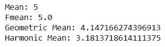
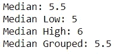
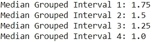
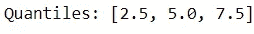
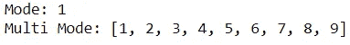
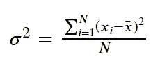
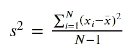
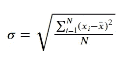
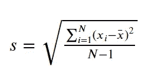
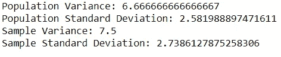

# 从统计包中探索 Python 数学统计函数

> 原文：<https://towardsdatascience.com/exploring-python-mathematical-statistical-functions-from-the-statistics-package-6dafeabf24fb?source=collection_archive---------17----------------------->

## 你知道 Python 数学统计函数吗？


由 [Pakata Goh](https://unsplash.com/@pakata?utm_source=medium&utm_medium=referral) 在 [Unsplash](https://unsplash.com?utm_source=medium&utm_medium=referral) 上拍摄的照片

> 如果您喜欢我的内容，并希望获得更多关于数据或数据科学家日常生活的深入知识，请考虑在此订阅我的[简讯。](https://cornellius.substack.com/welcome)

Python 是目前许多数据专业人员普遍使用的编程语言。许多人不得不通过 Python 开始他们的编程语言教育来建立职业生涯，这成为在线课程的一个普遍趋势。这就是为什么数据专业人员的未来显然会与 Python 语言联系在一起，而且学习 Python 提供的一切也没有坏处。

当你安装 Python 语言时，一开始可用的内置包之一就是[统计包](https://docs.python.org/3/library/statistics.html#module-statistics)——一个数理统计数值计算的包。该软件包用于简单计算，无需安装额外的软件包。

那么，这个包能做什么呢？让我们开始吧。

# 1.集中趋势测量

在统计学中，集中趋势的度量是用来度量数据集的中心点的概念。大多数人已经通过他们常用的方法知道了这个概念；**均值、中值、**和**模式**。

在统计软件包中，它们提供了一些功能来测量典型的集中趋势测量值。我会使用类别逐一探索它们，使探索更容易。

## **的意思是**

有四个函数可用于测量平均集中趋势；`mean`、`fmean`、`geometric_mean`和`harmonic_mean`。在我解释这些函数的作用之前，让我们先尝试使用这些函数。

```
from statistics import mean, fmean, geometric_mean, harmonic_meannumbers = [1,2,3,4,5,6,7,8,9]print('Mean:', mean(numbers))
print('Fmean:',fmean(numbers))
print('Geometric Mean:', geometric_mean(numbers))
print('Harmonic Mean:',harmonic_mean(numbers))
```



作者图片

首先，趋势的常见度量`**mean**`是一个函数，通过将数据中的所有数字相加，然后除以数据点的数量来获取数据集的平均值。`**fmean**`与`mean`类似，但速度更快，数据类型被转换为浮点型。

函数`**geometric_mean**`是获取几何平均值的函数，与`mean`不同。几何平均值的计算方法是将数据集中的数字相乘并取 n 次方根。如果我们以上面的例子为例，它将是:

> (1 ×2 × 3 × 4 × 5 × 6 × 7 × 8 × 9)的 9 次方根

另一个均值函数是`**harmonic_mean**`，用于获取数据集的调和均值。调和平均值通过倒数平均值的倒数计算，即数据点数除以倒数。使用上面的例子，它将是:

> 9/(1/1 + 1/2 + 1/3 +… +1/9)

## 中位数

中位数是数据集中的中间等级，不同于平均值，后者不需要位置信息；Median 需要在产生结果之前对数据进行排序。关于中位数，统计包中有四个函数，分别是`median`、`median_low`、`median_high`和`median_grouped`。让我们用样本数据来试试这些函数。

```
from statistics import median, median_low, median_high, median_groupednumbers = [1,2,3,4,5,6,7,8,9,10]print('Median:', median(numbers))
print('Median Low:',median_low(numbers))
print('Median High:', median_high(numbers))
print('Median Grouped:',median_grouped(numbers))
```



作者图片

以上函数是中值函数，结果不同。首先，让我们讨论一下`**median**` —一个函数，用于获取数据集 50%位置的中位数或数据。从上面的结果，你可以看到结果是 5.5。这是因为我们的样本数据中有两个中间值— 5 和 6(甚至数据点也包含两个中间值)。然后，该函数将从这两个数据点中取平均值，得到 5.5。

函数`**median_low**`和`**median_high**` 分别返回中值的最小值和中值的最大值。在上面的示例中，`median_low`返回值 5，`median_high`返回值 6。

至于`**median_grouped**` 它会取根据区间分组的数据集中的值的中值。我可以给你看一个相关的例子。

```
numbers = [1,1,2,2,3]print('Median Grouped Interval 1:',median_grouped(numbers,1))
print('Median Grouped Interval 2:',median_grouped(numbers,2))
print('Median Grouped Interval 3:',median_grouped(numbers,3))
print('Median Grouped Interval 4:',median_grouped(numbers,4))
```



作者图片

从上面的结果可以看出，不同的间隔会产生不同的结果。如果我们正在使用`median`函数，它将产生结果 2；但是，使用`**median_grouped**`功能，会导致不同的结果。分组的中值将取决于间隔内分组的数据点之间的间隔，并且中值结果将通过中值间隔内的插值来计算。

说到中位数，我们还可以提到统计学中的`quantiles`函数，因为它是相关的(两种方法都涉及数据点排名)。`quantile`函数将根据数据分割概率返回数据切割点。让我们使用示例数据。

```
from statistics import quantilesnumbers = [1,2,3,4,5,6,7,8,9]
print('Quantiles:', quantiles(numbers, n=4))
```



作者图片

从上面的结果中，我们可以看到有 3 个数据分界点:2.5、5.0 和 7.5。当我们把数据集分成 4 部分(n = 4)时，这个数据点就是数据集被分割的点。如果我们改变 n 参数，数据切割点也将改变(结果数据切割点将是 n-1)。

## **模式**

模式是对数据集中最频繁出现的数据的度量。在统计软件包中，这些测量值下有两个函数— `mode`和`multimode`。这些功能有什么区别？让我们用一个样本数据集来尝试一下。

```
from statistics import mode, multimodenumbers = [1,2,3,4,5,6,7,8,9]
print('Mode:', mode(numbers))
print('Multi Mode:', multimode(numbers))
```



作者图片

正如我们在上面的结果中看到的，`**mode**`将返回第一个**出现最频繁的数据，而`**multimode**`将返回所有最频繁数据的列表。**

# **2。扩散措施**

如果集中趋势的测量值计算数据集的中心点，则扩散概念的测量值将测量与中心点的偏差。偏差将取决于如何传播数据和数据的规模。

只有两个函数用于测量分布计算-统计包中的方差和标准差。然而，函数也按数据集划分，无论是总体数据还是样本数据。这意味着我们有四种函数:总体标准差和方差(`**pstdev**`和`**pvariance**`)和样本标准差和方差(`**stdev**`和`**variance**)`)。

让我们退一步理解什么是方差和标准差。**方差**是数据集的可变性度量，用于了解我们的数据分布有多大。人口方差方程如下图所示。



人口差异(图片来自作者)

样本方差如下图所示。



方差的计算基于每个数据点( **Xi** )减去平均值( **x̄** )并除以数据点数(对于总体)或数据点数减 1(对于样本)。为什么样本减一？因为这是一个样本数据点，我们有一个比总体更大的传播不确定性。

如果我们有一个小的方差，这表明我们的数据接近平均值，反之亦然。

标准差怎么样？好吧，让我们先来看看人口和样本的等式。



人口标准差(图片由作者提供)



样本标准差(图片由作者提供)

从上图可以看出，标准差方程就是方差的平方根。在统计学中，统计学家喜欢用方程的平方根，因为可解释性更容易。差异很难解释，因为结果不是直观的；然而，标准差会给我们一个数字来衡量价差。通俗地说，标准差就是平均值的正负( **x̄ 𝑠** )。

让我们试试这个函数，让我们更好地理解这些概念。

```
from statistics import pvariance, pstdev, variance, stdevnumbers = [1,2,3,4,5,6,7,8,9]
print('Population Variance:', pvariance(numbers))
print('Population Standard Deviation:', pstdev(numbers))
print('Sample Variance:', variance(numbers))
print('Sample Standard Deviation:', stdev(numbers))
```



作者图片

我们上面的实验表明，总体和样本函数有不同的结果(由于不确定性，样本更大)。你的结果可以解释为我上面解释过的。

# 结论

作为现代数据专家，我们会在日常工作中使用编程语言，而当前的趋势是使用 Python 语言。我觉得每个人都需要了解的一个软件包是统计软件包，因为它是基础知识，易于用于复杂的程序。

在统计包中，包内有几个函数:

## **1。集中趋势的度量:**

*   均值(`mean`、`fmean`、`geometric_mean`、`harmonic_mean`)
*   中位数(`median`、`median_low`、`median_high`、`median_grouped`)
*   模式(`mode`、`multimode`)
*   分位数(`quantiles`)

## 2.**扩散度:**

*   方差(`pvariance`和`variance`)
*   标准偏差(`psttdev`和`stdev`)

希望有帮助！

在我的 [**LinkedIn**](https://www.linkedin.com/in/cornellius-yudha-wijaya/) 或 [**Twitter**](https://twitter.com/CornelliusYW) **上访问我。**

> 如果您没有订阅为中等会员，请考虑通过[我的推荐](https://cornelliusyudhawijaya.medium.com/membership)订阅。