# 探索 Reddit WallStreetBets 帖子数据

> 原文：<https://towardsdatascience.com/exploring-reddit-wallstreetbets-posts-data-bed613386029?source=collection_archive---------35----------------------->

## EDA 与 Reddit 数据的情感分析


照片由[energepic.com](https://www.pexels.com/@energepic-com-27411)在[像素](https://www.pexels.com/photo/blue-and-yellow-graph-on-stock-market-monitor-159888/)上拍摄

*Reddit wall street Bets Posts*是 Kaggle 网站上的一个数据集，包含华尔街 bet 的信息。WallStreetBets 是一个用于讨论股票和期权交易的子网站。WallStreetBets 因其在 GameStop 卖空交易中的角色而闻名，该交易导致美国公司空头头寸损失 700 亿美元。在这篇文章中，我们将探索 python *中的 *Reddit WallStreetBets 帖子*。*按照 Reddit 关于 API 使用的规则，使用 python Reddit API 包装器(PRAW)收集数据。数据可以在[这里](https://www.kaggle.com/gpreda/reddit-wallstreetsbets-posts)找到。

我们开始吧！

首先，让我们将数据读入熊猫数据框:

```
import pandas as pd
df = pd.read_csv('reddit_wsb.csv')
```

接下来，我们将打印该数据中可用的列:

```
print(list(df.columns))
```

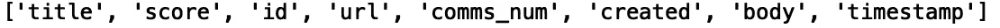

现在，让我们放宽行数和列数的显示限制:

```
pd.set_option('display.max_columns', None)
pd.set_option('display.max_rows', None)
```

接下来，让我们使用' head()'方法打印前五行数据:

```
print(df.head())
```

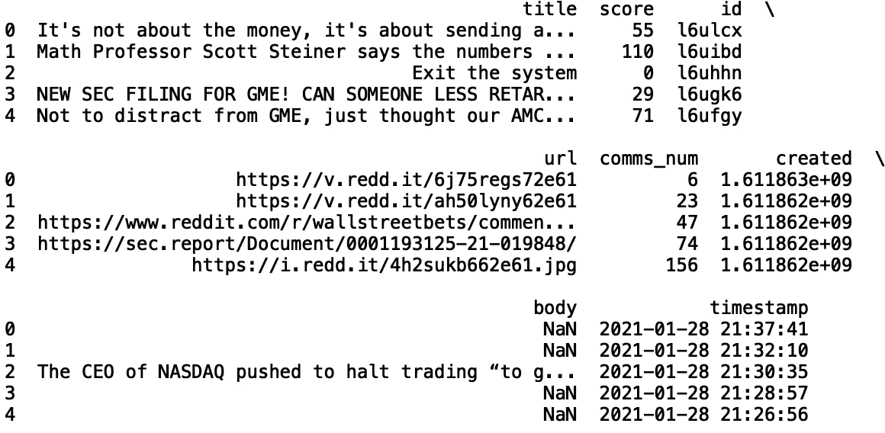

我们可以根据标题是否包含 GameStop ticker (GME)来标记我们的数据:

```
import numpy as np 
df['GME_title'] = np.where(df['title'].str.contains('GME'), 1, 0)
print(df[['title','GME_title']].head())
```

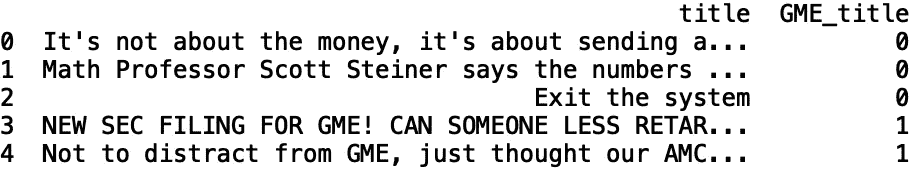

我们还可以基于文本正文创建一个列:

```
df['GME_body'] = np.where(df['body'].str.contains('GME'), 1, 0)
print(df[['title','GME_body']].head())
```

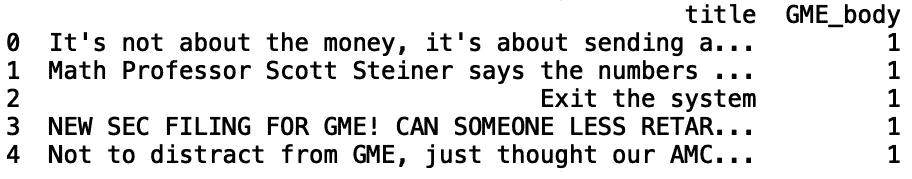

接下来，让我们继续处理文本标题。让我们定义一个将数据框、列名和限制作为输入的函数。当被调用时，它打印分类值的字典以及它们出现的频率。让我们看看‘GME _ 标题’中的分布:

```
def return_counter(data_frame, column_name):
   from collections import Counter        print(dict(Counter(data_frame[column_name].values)))print(return_counter(df, 'GME_title')
```

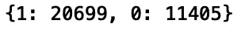

让我们定义一个名为“ticker”的列，其值为“GME ”,其中“GME 标题”为 1，而“其他”,其中“GME 标题”为 0:

```
df['ticker'] = np.where(df['GME_title'] ==1, 'GME', 'Other')
```

我们还可以过滤我们的数据，只包括在文本标题中包含 GME 的帖子:

```
df_GME = df[df['GME_title']==1]
print(df_GME.head())
```

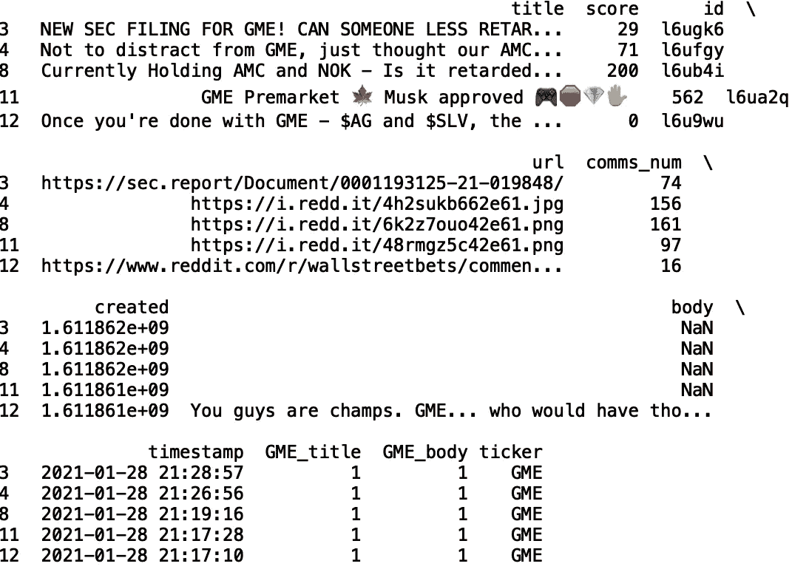

接下来，我们将使用箱线图来显示基于最小值、最大值、中值、第一个四分位数和第三个四分位数的数值分布。如果您对它们不熟悉，可以看看文章[了解 Boxplots](/understanding-boxplots-5e2df7bcbd51) 。

与汇总统计函数类似，此函数采用数据框、分类列和数值列，并根据限制显示最常见类别的箱线图:

```
def get_boxplot_of_categories(data_frame, categorical_column, numerical_column):
    import seaborn as sns
    from collections import Counter
    keys = []
    for i in dict(Counter(df[categorical_column].values)):
        keys.append(i)
    print(keys)
    df_new = df[df[categorical_column].isin(keys)]
    sns.set()
    sns.boxplot(x = df_new[categorical_column], y =      df_new[numerical_column])
```

让我们为“ticker”类别中的“score”生成箱线图:

```
get_boxplot_of_categories(df, 'ticker', 'score')
```

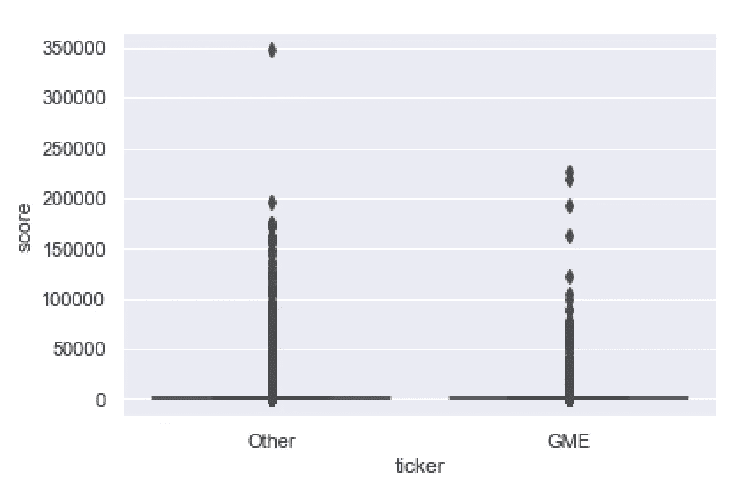

最后，让我们定义一个函数，它将数据框和数字列作为输入，并显示一个直方图:

```
def get_histogram(data_frame, numerical_column):
    df_new = data_frame
    df_new[numerical_column].hist(bins=100)
```

让我们用数据框调用函数，并从“分数”生成一个直方图:

```
get_histogram(df, 'score')
```

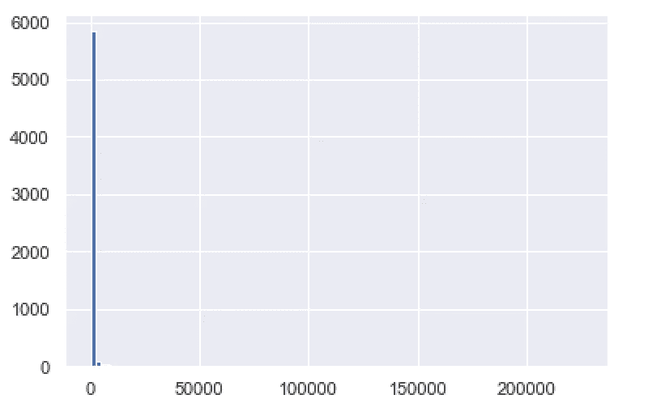

我们也可以得到每个帖子的情感得分。为此，我们需要导入一个名为 textblob 的 python 包。textblob 的文档可以在这里找到。要安装 textblob，请打开命令行并键入:

```
pip install textblob
```

下一步导入 textblob:

```
from textblob import TextBlob
```

我们将使用极性分数作为衡量积极或消极情绪的标准。极性分数是一个浮点数，其值从-1 到+1。

让我们定义一个函数，它将从文本标题中生成一列情感:

```
def get_sentiment():
    df['sentiment'] = df['title'].apply(lambda title: TextBlob(title).sentiment.polarity)
    df_pos = df[df['sentiment'] > 0.0]
    df_neg = df[df['sentiment'] < 0.0]
    print("Number of Positive Posts", len(df_pos))
    print("Number of Negative Posts", len(df_neg))
```

如果我们调用这个函数，我们会得到:

```
get_sentiment()
```

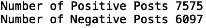

我们可以将其应用于 GME 滤波器数据帧。让我们修改我们的函数，使其以一个数据帧作为输入。让我们返回新的数据帧:

```
def get_sentiment(df):
    df['sentiment'] = df['title'].apply(lambda title: TextBlob(title).sentiment.polarity)
    df_pos = df[df['sentiment'] > 0.0]
    df_neg = df[df['sentiment'] < 0.0]
    print("Number of Positive Posts", len(df_pos))
    print("Number of Negative Posts", len(df_neg))
    return df df = get_sentiment(df_GME)print(df.head())
```

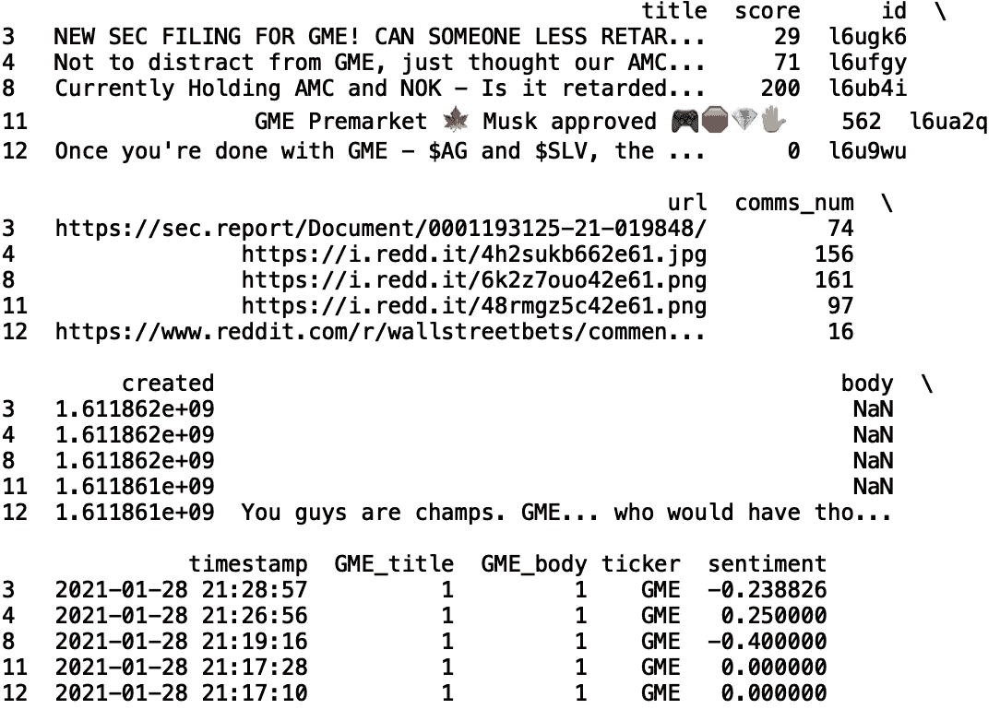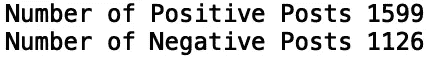

最后，让我们修改我们的函数，这样我们就可以用 seaborn 和 matplotlib 可视化情感得分:

```
import matplotlib.pyplot as plt
import seaborn as sns
def get_sentiment(df):
    df['sentiment'] = df['title'].apply(lambda title: TextBlob(title).sentiment.polarity)
    df_pos = df[df['sentiment'] > 0.0]
    df_neg = df[df['sentiment'] < 0.0]
    print("Number of Positive Posts", len(df_pos))
    print("Number of Negative Posts", len(df_neg))

    sns.set()
    labels = ['Postive', 'Negative']
    heights = [len(df_pos), len(df_neg)]
    plt.bar(labels, heights, color = 'navy')
    plt.title('GME Posts Sentiment')
    return df
df = get_sentiment(df_GME) 
```

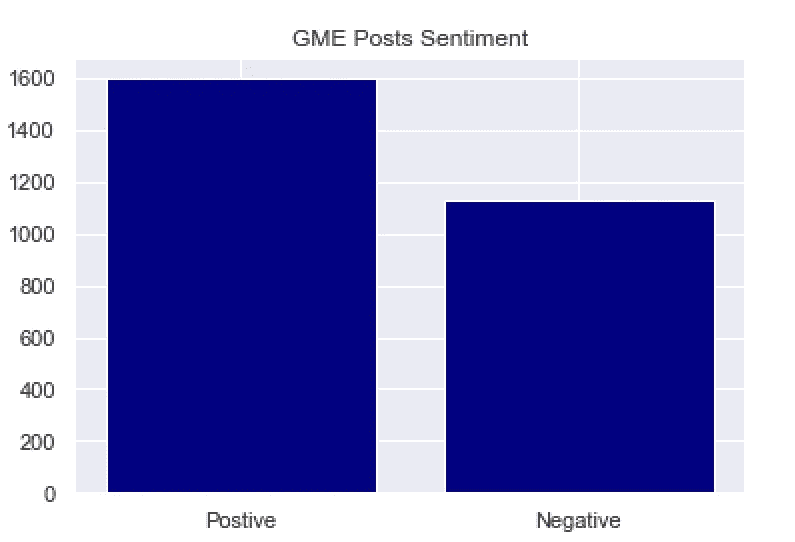

我就讲到这里，但请随意摆弄数据和代码。

# 结论

概括地说，我们讨论了几种分析*Reddit wallstreet bets post*数据集*的方法。*这包括定义用于生成分类值计数的函数、用于使用箱线图和直方图可视化数据的函数以及用于从帖子文本标题生成情感得分的函数。了解分类值中的分布，就像我们生成的自动收报机标签一样，可以洞察数据集在类别/标签方面的平衡程度。这对于开发用于分类的机器学习模型非常有用。此外，箱线图和分布图揭示了数值列的值的分布，并提供了对异常值存在的洞察。最后，情感评分有助于理解文本中是否表达了积极或消极的情感。这类数据可用于预测股票价格变化的方向等任务。我希望你觉得这篇文章很有趣。该帖子的代码可在 [GitHub](https://github.com/spierre91/medium_code/blob/master/exploratory_data_analysis/eda_wallstreetbets.py) 上找到。谢谢你的阅读！