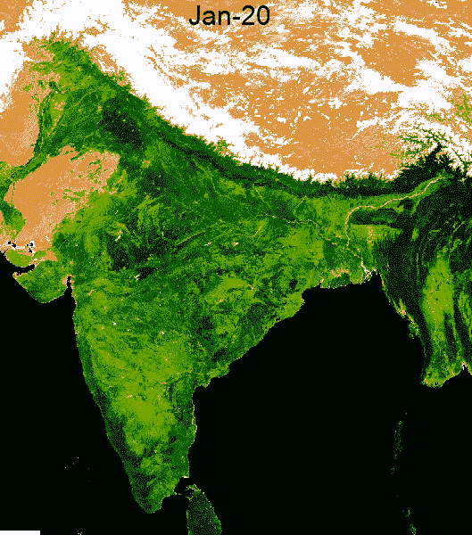

# 探索印度次大陆周围植被覆盖的季节变化

> 原文：<https://towardsdatascience.com/exploring-seasonal-variations-in-vegetation-cover-around-indian-subcontinent-dd9885edbf4?source=collection_archive---------41----------------------->

## 如何使用 Python 中的免费和开源工具创建植被季节变化的动画 GIF



植被覆盖的季节变化:作者图片

# 1.介绍

植被在维持水、氧、碳、氮等各种生物地球化学循环的平衡中起着至关重要的作用。它强烈影响土壤特性，如土壤体积、化学性质和质地，并防止风和水对土壤的侵蚀。它是不可或缺的野生动物栖息地，也是地球上众多动物物种的能量来源。在这篇博文中，我将展示我们如何使用 Python 中的免费开源工具，只用几行代码就能直观地感受到印度次大陆周围植被覆盖的季节变化。

# 2.工作流程

*   导入库并初始化 Google 地球引擎(GEE)
*   定义感兴趣的区域
*   定义包含将用于动画帧的感兴趣区域的区域边界
*   访问 MODIS Terra 植被 16 天指数。通过取中间值来减少同一个月的图像。
*   将缩小的每月图像绘制成动画 GIF 的帧。

我们将从 python 设置和 GEE 初始化开始。

```
import geemap
import eetry:
 ee.Initialize()
except:
 ee.Authenticate()
 ee.Initialize()
```

# 3.数据处理

正如工作流中所讨论的，我们现在定义分析和可视化的区域。我们将使用联合国粮食及农业组织(FAO)的`FeatureCollection`，其中包含各国国际边界的 GIS 信息。

```
# We use the country boundaries from Global Administrative Unit Layers (2015) provided by FAO(UN)
india = ee.FeatureCollection("FAO/GAUL/2015/level0") \
            .filter(ee.Filter.inList('ADM0_NAME', ['India', 'Jammu and Kashmir','Arunachal Pradesh',
                                                   'China/India','Aksai Chin']));# Define the regional bounds for animation frames.
region = india.geometry().bounds();
```

在我们继续下一步之前，让我们进一步了解一下 MODIS 产品。MODIS 代表中分辨率成像光谱仪。它由两个任务下的卫星组成——Aqua 和 Terra，并通过许多光谱带提供有关海洋、陆地和大气的丰富信息。这些卫星在 1-2 天内绕地球一周。MODIS 图像的粗略分辨率在 250 米到 1000 米之间。它们可用于通过植被指数(如归一化差异植被指数(NDVI)、增强植被指数(EVI))和水分指数(如归一化差异水分指数(NDWI)、蒸散量(ET))了解植被的健康状况。MODIS 通过测量海洋表面温度、海洋颜色和透明度来监测海洋。它还可用于监测森林火灾、土地利用变化、地表温度等。在本文中，我们将使用 16 天一次的 MODIS 植被指数。这些指数是从日常反射率数据中检索的，这些数据经过合成处理以去除低质量像素，因为大部分日常 MODIS 图像经常充满云，从而妨碍了其可用性。

有了这个背景，让我们从停止的地方继续。我们过滤了 2020 日历年的 MODIS 图像集合。我们将通过取中间值对同一个月的图像进行分组。这将确保我们每个月有一个图像，全年有 12 个图像。

```
# We use MODIS Terra Vegetation Indices 16-Day Global 1km distributed by NASA's Land Processes Distributed Active Archive Center (LP DAAC)col = ee.ImageCollection('MODIS/006/MOD13A2').select('NDVI')\
        .filterDate('2020-01-01','2020-12-31');months = ee.List.sequence(1, 12);def groupbyMonth(m):
    img = col.filter(ee.Filter.calendarRange(m,m, 'month')).median()
    return img;colByMonth = ee.ImageCollection.fromImages(months.map(groupbyMonth))
```

使用`col.size().getInfo()`和`colByMonth.size().getInfo()`可以检查到，原始采集和每月采集中分别有 23 和 12 幅图像。

# 4.测绘

下一步是可视化这 12 张图片，它们是`colByMonth`图片集的一部分。我们使用 GEE 目录中提供的相同调色板来设置可视化 NDVI 栅格的参数。作为参数提供的调色板在最小和最大 NDVI 值之间线性插值颜色。

```
# We use the NDVI visualisation parameters from GEE catalogue
gifParams = {
    'region': region,
    'dimensions': 600,
    'crs': 'EPSG:3857',
    'framesPerSecond': 1,
    'min': 0.0,
    'max': 9000.0,
    'palette': ['FFFFFF', 'CE7E45', 'DF923D', 'F1B555', 'FCD163', '99B718', '74A901',
                '66A000', '529400', '3E8601', '207401', '056201', '004C00', '023B01',
                '012E01', '011D01', '011301'],
};gif_fname = 'C:\\Users\\ADMIN\\Desktop\\satellite\\geemap\\ndvi.gif'geemap.download_ee_video(colByMonth, gifParams, gif_fname)
```

一旦动画 GIF 准备就绪，我们将在 GIF 的每一帧上添加月份信息。这可以使用`geemap`包的`add_text_to_gif`功能轻松完成。

```
# Add the months information on each frame of GIF 
text = ['Jan-20','Feb-20','Mar-20','Apr-20','May-20','Jun-20','Jul-20','Aug-20','Sep-20','Oct-20','Nov-20','Dec-20']out_gif = 'C:\\Users\\ADMIN\\Desktop\\satellite\\geemap\\ndvi_out.gif'geemap.add_text_to_gif(gif_fname, out_gif, xy = ('40%', '0%'), text_sequence = text, font_size=30, font_color = '#000000',duration = 1000)
```

您可以使用`geemap`包的`show_image`功能在 Jupyter Notebook 中可视化带注释的 GIF。

```
geemap.show_image(out_gif)
```

我希望您喜欢阅读这篇文章，并在您的地理空间项目中使用它。请在下面的评论部分分享您对 MODIS 产品其他有趣使用案例的想法。

*免责声明:博客中表达的观点是个人观点。*