# 利用 R 探索美国警察枪击事件的重要因素

> 原文：<https://towardsdatascience.com/exploring-significant-factors-in-u-s-police-shootings-utilizing-r-50f048d5df61?source=collection_archive---------41----------------------->

## 以下报告是我在杜克大学量化管理硕士项目中的数据科学课程的个人项目。

*附带的 R 代码可在* [*查看 https://github . com/malikamohan 01/significant-police-factors-R/blob/main/code appendix*](https://github.com/malikamohan01/significant-police-factors-r/blob/main/codeappendix)*。*

**在过去的几个月里，自 2020 年 5 月一名警察杀害乔治·弗洛伊德******以来，我们已经看到一场重大的种族正义清算正在全国各地发生。这一事件引发了人们对在警察手中失去的类似生命的关注，导致人们呼吁重新评估警察的作用和权力。活动家团体、名人、政治家和普通公民都签署了请愿书，联系了当地的政策制定者，并开始了趋势运动(#defundthepolice、#acab 等)。)在网上呼吁改善对警察的培训和潜在的减资。****

**为了让利益相关方(如行动主义团体和当地政策制定者)以最快、最有效的方式做出最大的改变，以响应这些呼吁，以下数据分析和报告力求回答几个问题。**

**首先，这些事件在哪里发生得最多？这将有助于像黑人的命也是命和变革之色这样的激进组织集中他们的努力，而不是在美国范围内模糊/广泛地呼吁解除资助。其次，事件高发区的重要因素是什么？最后，我们能否预测哪些因素可能导致事故发生的可能性更高？后两个问题将有助于武装政策制定者通过理解最能解释和预测警察枪击事件的因素来最好地响应活动家的变革呼吁，并为更强有力的政策和培训提供信息。**

# **数据理解**

**为了回答提出的问题，使用了两个数据集。首先，一个数据集是从 Kaggle 获得的，它记录了过去五年中美国发生的枪击事件。共有 4851 项记录，包括以下变量:日期、死亡方式(受害者死亡方式)、年龄(受害者年龄)、性别(男/女)、种族、城市、州、精神疾病迹象(如果受害者出现精神疾病迹象，则为真/假)、威胁级别(攻击/其他)、逃离(如果受害者是否逃离现场)和人体照相机(如果警官在事件发生时佩戴人体照相机，则为真/假)。该数据集的一个限制可能是，如果没有收集到一组完整的数据，或者如果创建该数据集的研究人员在从司法局网站收集数据时遗漏了一些东西。**

**第二个数据集是通过将每个州的事件计数与州级政府数据相结合而获得的，这些数据包括州、事件计数、Pop 大小、每个 Pop 的事件百分比、白人百分比(非西班牙裔白人占州人口的百分比)、贫困率、HH 收入中位数、2020 年政党倾向(民主党/共和党)、人均警察支出和年龄中位数。这两个数据集被合并成一个综合数据集，描述具体的警察枪击事件和关于这些事件发生所在州的解释性数据。**

# **数据准备和探索**

***数据清理:*数据清理的过程包括标准化日期格式，重命名包含奇怪字符的列(例如，state 最初是..状态)，修复数据中的拼写错误和不一致(例如，年龄列中的所有“37”在数字后都有额外的小数，而其他年龄没有)，并检查列中是否没有空值。下一步是数据集之间的数据合并，使用 merge 函数将它们在州代码上连接起来。**

***数据探索:*数据探索过程从对变量的一维分析开始，以便在开始创建直方图之前更好地理解它们的分布。关于这些事件的一些关键见解包括:大多数警察枪击事件涉及没有随身相机的警官，通常没有精神疾病的迹象，这令人惊讶，因为这是一些警察培训建议通常围绕的问题，受害者的性别绝大多数是男性，年龄分布偏左，平均值为 36.5(图 1)。**

***图一:***

****

**接下来，除了其余变量的直方图，对于二维分析，基于状态的计数图有助于更好地理解这些变量和应该关注的状态。我们最初看到加利福尼亚和得克萨斯等州的事件数较高，而中西部各州的事件数较低(图 2a)，但是，在我们看到人口规模图(图 2b)中的类似模式后，这表明我们应该评估每个人口的事件百分比，以便将其标准化。这样做之后，我们看到枪击案发生频率最高的州是:阿拉斯加州、新墨西哥州、俄克拉荷马州、亚利桑那州、科罗拉多州、内华达州、蒙大拿州、西弗吉尼亚州、阿肯色州和怀俄明州(图 2c)。从地图中可以获得更多的信息，包括州内白人的百分比，白人人口最多的州包括路易斯安那州、犹他州、西弗吉尼亚州、内华达州和北卡罗来纳州，州贫困率(贫困率最高的州包括密西西比州、新墨西哥州、路易斯安那州、西弗吉尼亚州，最低的州包括新罕布什尔州、马里兰州和犹他州)，以及人均警察支出(图 2d)。**

***2a:***

**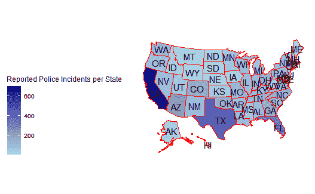**

***2b:***

**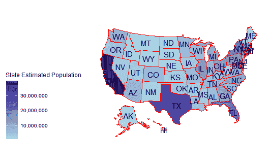**

***2c:***

****

***2d:***

**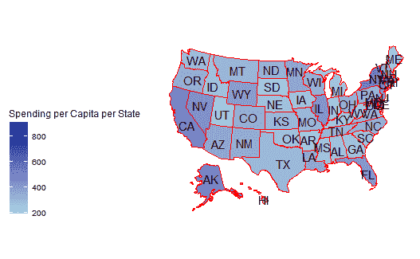**

**人均警察支出很重要，我们可以看到，人均警察支出最高的州包括 DC、纽约州、阿拉斯加州、马里兰州、罗德岛州和内华达州，最低的州包括缅因州、印第安纳州和肯塔基州。平均而言，各州用于警察预算的人均支出为 311 美元(图 3)。在进入建模步骤之前，需要注意并牢记的一件重要事情是，人均警察支出和事件数不是正态分布的(图 4)，因此需要对其进行转换。**

***图 3 &图 4:***

********

**接下来，通过相关矩阵、箱线图、散点图、独立性卡方检验和相互作用图，探究这两种类型数据(状态和事故相关数据)之间的相互作用和相互关系。数字变量中的相关矩阵(图 5)显示，事件最强的相关性是与人口规模(0.89)、贫困率(0.21)和人均警察支出(0.08)的正相关性，以及与 HH 收入中位数(-0.08)、年龄中位数(-0.17)和白人百分比(-0.26)的负相关性。**

***图 5:***

****

**由于相关性本身并不是一个足够强的相关性指标，为了评估人群中变量之间是否存在相关性，进行了下一步的卡方检验。结果向我们显示了统计上显著的关系(p 值< 0.05) included the relationship between incidents and race, age, signs of mental illness, flee, body camera, state pct white, state poverty rate, state party leaning and police spending per capita, positioning them as potential variables for our model. The boxplots below help us understand these relationships, like for example we can see there’s the highest count of Black and Hispanic victims and a higher count in Republican states (Figure 6a). We also visualized the relationship between pct white/count as negative, poverty rate/count as positive, and police spending/count as positive when seeing the scatter plot.**

***图 6a & 6b:***

******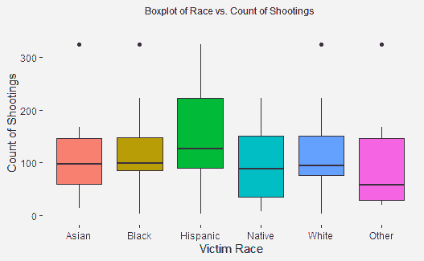**

**基于相关矩阵和卡方检验，还考虑了交互效应(当一个回归变量依赖于另一个回归变量时),并使用 R 的 interact_plot 函数绘制了交互效应图，我们可以看到，在一个州的贫困率/中等家庭收入、中等家庭收入/警察支出和每个人口/贫困率的百分比之间存在轻微的交互效应(图 7)。**

***图七:***

**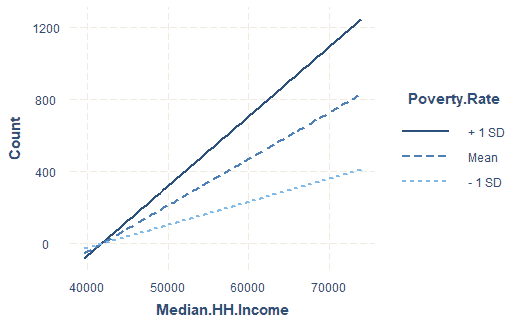****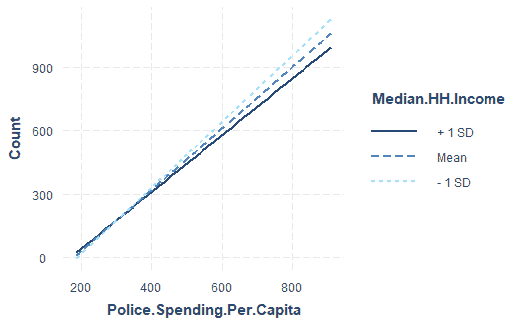******

***数据转换:*正如我们之前看到的，警察枪击事件的目标变量不是正态分布的，因此在进入分析的建模步骤之前，有必要评估何种转换可以使其正常化。这是通过 boxcox 完成的，它计算最佳功率转换。这给了我们 optimal_lambda 值 **0.58** ，这表明平方根将是使用的最佳转换(图 8)。**

**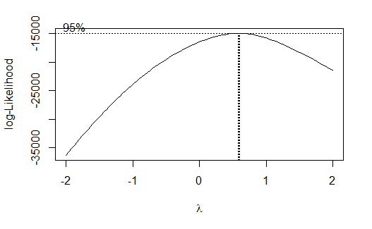**

# **数据建模**

## **模型 1:第一个模型是使用相关性最高的变量创建的，这些变量在卡方检验中也具有统计学意义。这些是贫困率、人均警察支出、hh 收入中位数、pct 白人、种族、年龄、人体照相机和党派倾向，它们被用作线性回归 lm 模型中 sqrt(事件)目标变量的回归变量。为了测试模型，还使用 R 中的 traincontrol 和“cv”函数对模型进行了交叉验证。我们看到几乎所有的变量都是重要的，除了身体摄像机，所以为了得到以下结果，排除了:**

**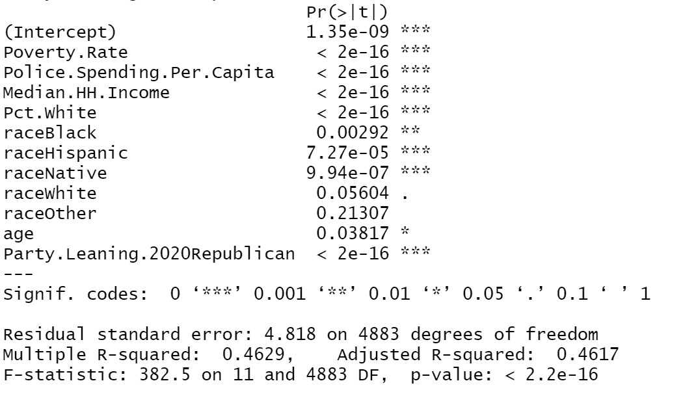**

***模型 2:* 第二个模型是 lasso 模型，这是一种回归分析方法，它比较变量的所有可能选择，将其标准化，并进行变量选择和正则化，以使预测精度更好。这是通过在 R 中使用 cv.glmnet 函数并计算 lambda 系数来完成的，结果如下。我们看到变量比模型 1 少。**

**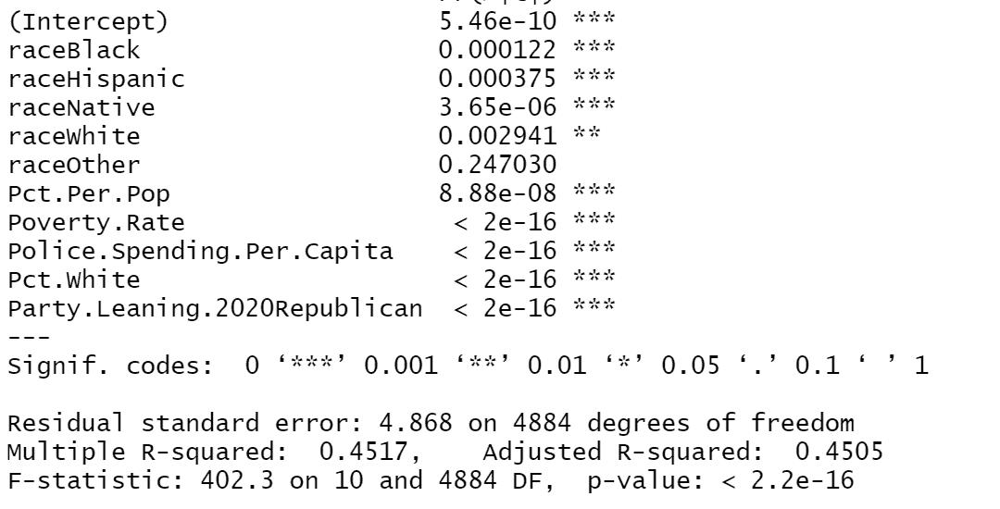**

***模型 3:* 接下来，我们使用了一种与 lasso 类似的岭回归，但与不使用 lasso 的岭相比，它使系数为 0(如果有大量参数，效果最好)，并且有助于具有多重共线性的数据，正如我们通过交互效应看到的那样，它在这里可能适用，通过向回归估计值添加一定程度的偏差，并再次执行交叉验证。这产生了以下结果:**

**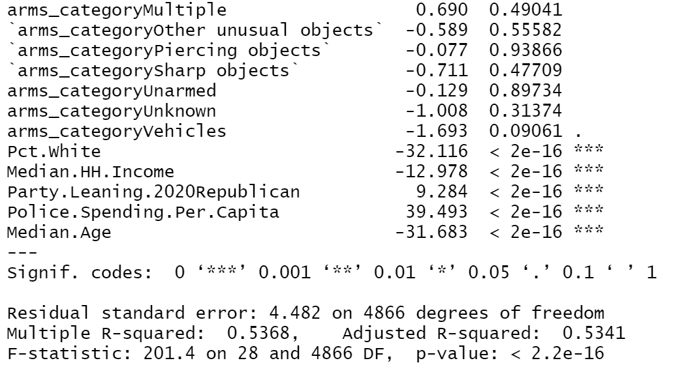**

***模型 4:* 最后创建的模型是一个随机森林模型，它使用 500 棵回归树，在不同的随机选择样本/数据子集上随机选择不同的 3 个变量，以便对其进行训练和测试，并对所有树的输出进行平均，以输出预测的连续值。该模型通过显示包含这些特征的分割(不同的树)数量的总和，输出以下重要的预测值。我们在下面看到这些变量和它们的节点纯度，向我们表明，随着值的范围越大，杂质就越高(*图 9)。***

**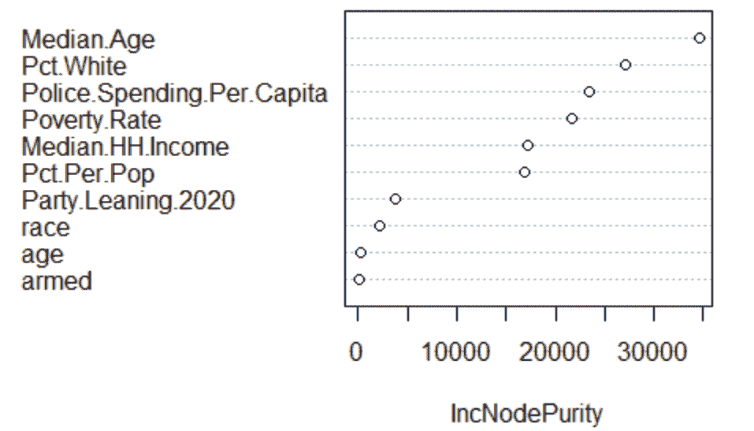**

# **模型评估和部署**

**为了评估哪个模型对预测分析最有用，可以在它们之间进行比较的度量标准是 R 平方(代表回归模型中变量解释的因变量的方差比例，因此越高越好)、RMSE(残差/预测误差的标准偏差，因此越低越好)和 MAE(目标变量和预测变量之间的绝对差之和，因此越低越好)。此外，考虑的要点是模型 1 包括 7 个预测器，2 包括 9 个预测器，3 包括 11 个预测器。图中显示了四个模型的这些指标的比较(*图 10)。***

**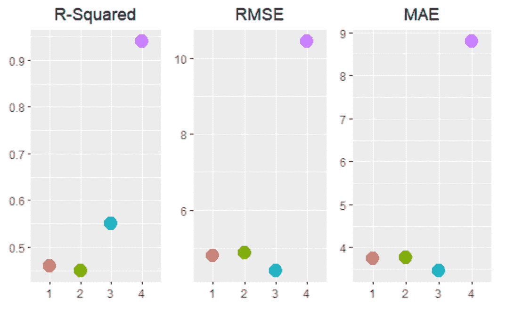**

**基于这一比较，我们可以看到随机森林(模型 4)具有最高的 r 平方，但是由于它明显高于其他森林，这可能是一个值得关注的问题，也是潜在过度拟合的危险信号。模型 3，或岭回归，具有次高的 r 平方以及最低的误差项(RMSE 和梅)。因此，我们可能希望部署模型 3 或利用集成学习(组合多个预测模型以胜过任何单个模型)，来训练和运行模型 3 和随机森林，并平均各个模型的预测。然而，此外，作为所有模型的结果，我们可以有更高的信心，即在不同模型中持续出现的变量——白人百分比、人均警察支出、贫困率、中等家庭收入、党派倾向、种族和武装是警察枪击事件的重要预测因素。**

# **含义和要点**

# **在我们的探索性数据分析和建模之后，我们现在可以更有信心地确认某些因素在警察枪击事件中更具预测性的假设，如受害者的种族(黑人在统计上最重要，男性在统计上最重要，这支持了黑人最有可能被警察射杀的运动信念)， 它们更多地发生在贫困率较高、少数族裔比例较高(白人比例较低)、该国倾向于某个政党(共和党在统计上具有显著意义)、人均警察支出较高(为活动团体减少警察资金的主张提供了更多支持)、受害者可能持有武器以及警察可能没有佩戴人体摄像机的州。 此外，我们还确定了警察枪击事件发生率最高的州，如阿拉斯加州、新墨西哥州、俄克拉荷马州、亚利桑那州、科罗拉多州、内华达州和蒙大纳州，这对于活动组织和政策制定者来说是有用的，他们可以首先将工作重点放在这里，而不是在全国范围内模糊地呼吁变革。这些信息还可以帮助指导需要实施的新的或改革后的警察培训，包括反种族主义培训，如何在不诉诸开枪/杀人的情况下最好地对付持有不同类型武器的嫌疑人，以及强制广泛实施人体摄像机。**

## **从社会政治的角度来看，这些发现也很重要，可以用来促进对贫困程度较高的州的高犯罪率以及这两个州之间可能发生的循环系统的进一步研究，共和党州与民主党州之间可能导致警察枪击事件发生率较高的动态，以及受害者与受害者之间的比较。当然，这种分析的范围是有限制的，因为有很多数据是数据库无法捕捉到的，比如不同的偏见、感知到的威胁、情况的严重性等等。因为这些都是更主观的信息，所以考虑这些很重要。为了继续预测未来几年的警察枪击事件，一旦某些属性或措施在政策方面发生变化(例如，人均警察支出的减少或强制性人体摄像头)，该模型的最佳部署将是岭模型(模型 3)和随机森林模型(模型 4)的集成学习组合，如模型部署部分所述，以评估这些变化是否导致较低的预测。**