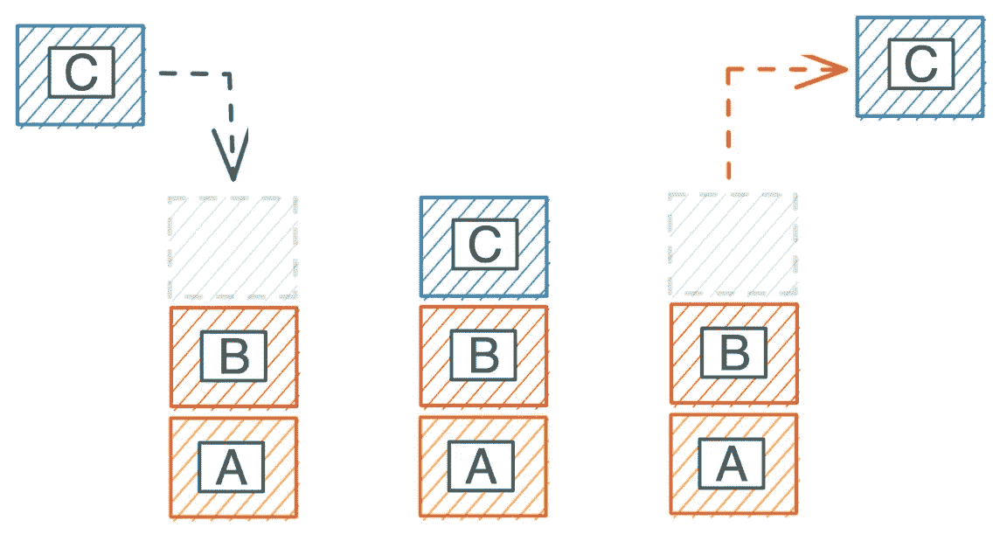
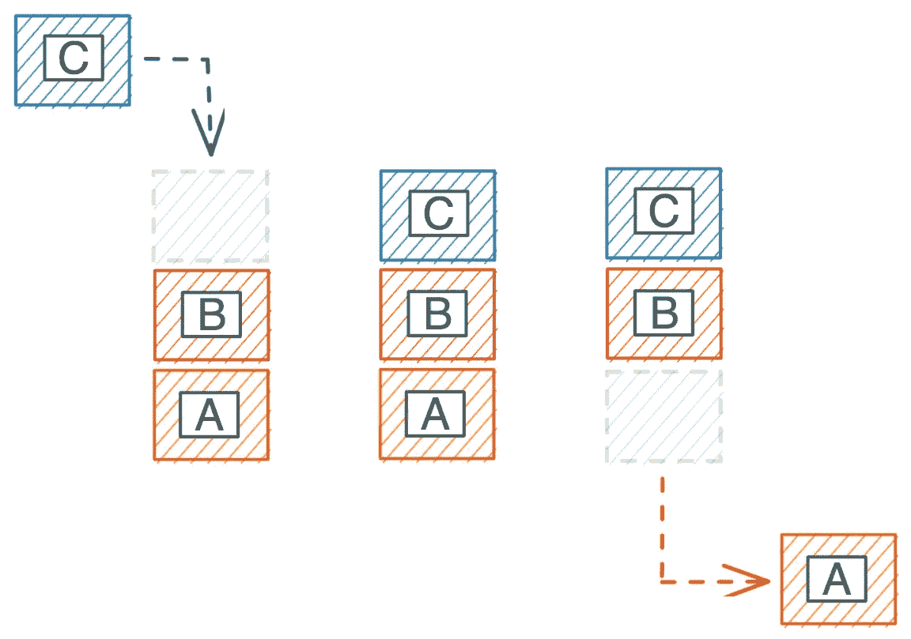
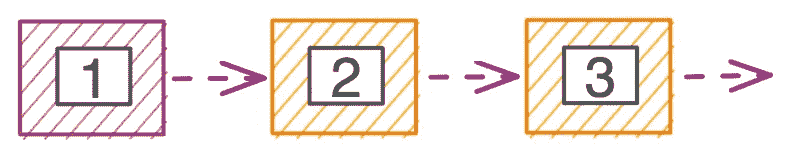
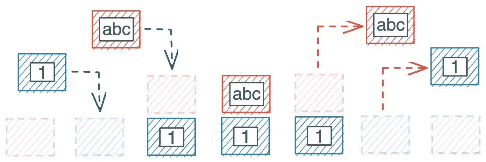
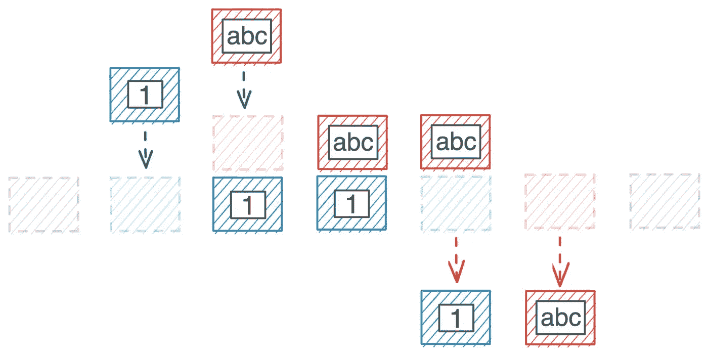
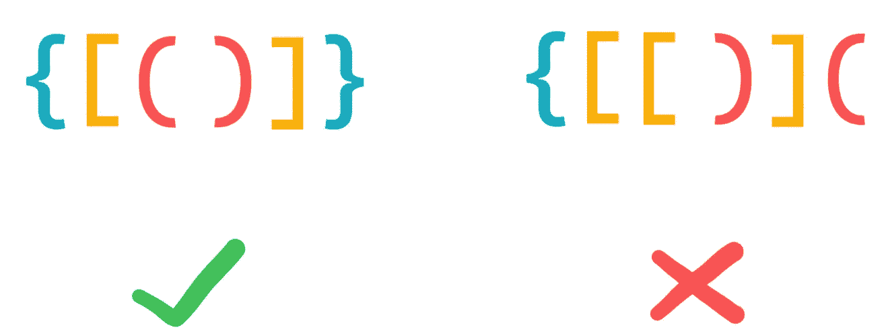
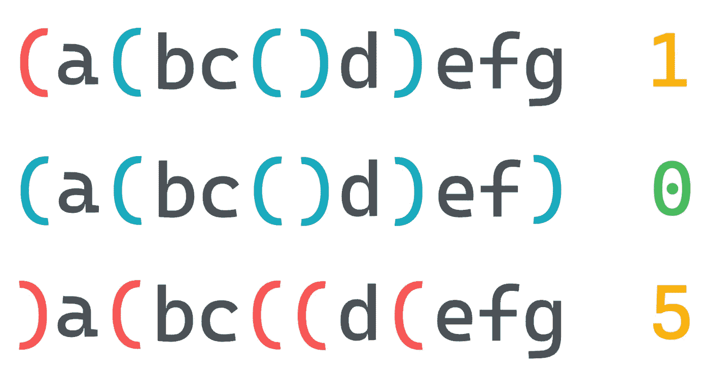
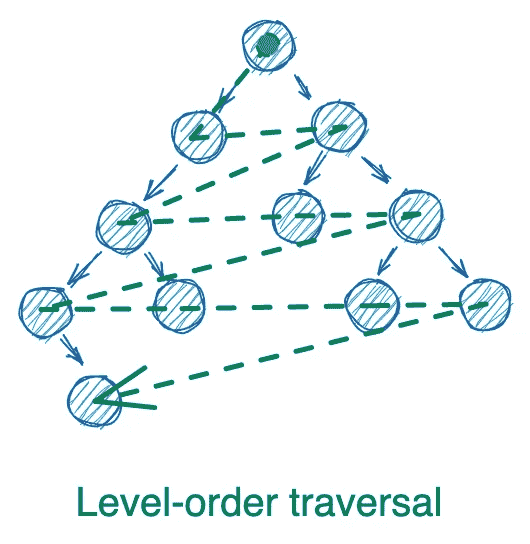
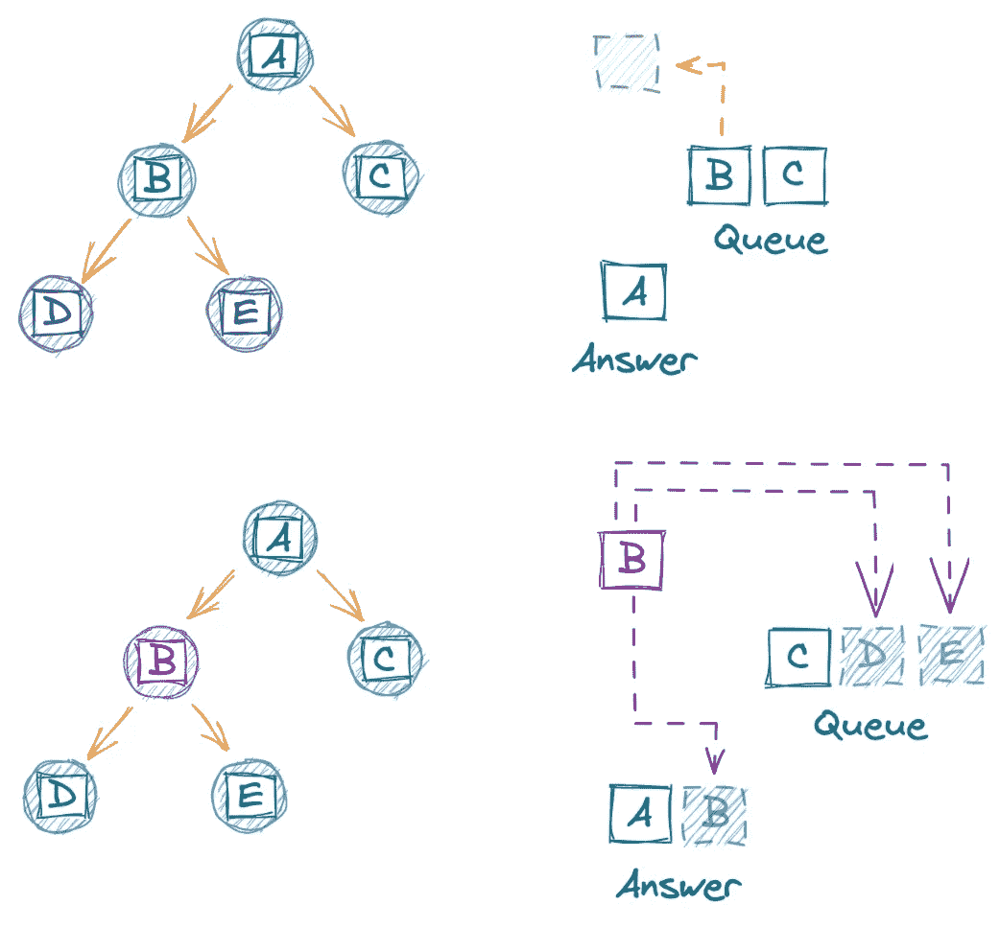
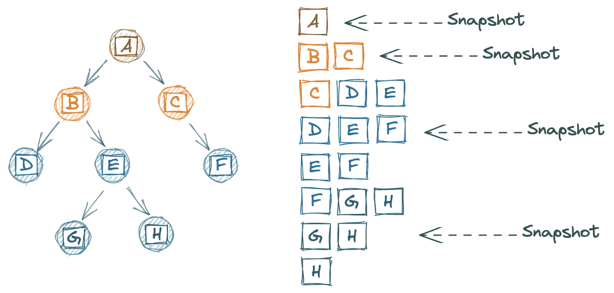

# 探索堆栈和队列

> 原文：<https://towardsdatascience.com/exploring-stacks-and-queues-b18243271d1c?source=collection_archive---------10----------------------->

## [小窍门](https://towardsdatascience.com/tagged/tips-and-tricks)

## 用两个非常有用的工具增强你的程序

照片由[内森·杜姆劳](https://unsplash.com/@nate_dumlao?utm_source=medium&utm_medium=referral)在 [Unsplash](https://unsplash.com?utm_source=medium&utm_medium=referral) 上拍摄

在我们的[上一篇文章](/intro-to-data-structures-2615eadc343d)中，我们讨论了*数据结构*，或者说编程语言在内存中存储数据的方式。我们提到了**抽象数据类型**，即通过数据结构*实现*的理论实体。“车辆”的概念可以被视为一种抽象的数据类型，例如，“自行车”就是一种数据结构。

在本文中，我们将探索两种常见的抽象数据类型:**堆栈**和**队列**。在用 Python 实现它们之前，我们将从这些抽象类型背后的理论开始。最后，我们将访问一些 [Leetcode](https://leetcode.com/) 问题，这些问题最初看起来很有挑战性，但是当使用堆栈或队列时，它们会被巧妙地分解成干净的解决方案。我们开始吧！

# 概观

堆栈和队列是类似数组的值的集合，像`[1, 2, 3]`或`[a, b, c]`。但是与数组不同，集合中的任何值都可以在 O(1)时间内访问，堆栈和队列有一个限制，即只有一个*值立即可用:第一个元素(对于队列)或最后一个元素(对于堆栈)。对于堆栈和队列，值总是添加到末尾。*

视觉可以帮助解释。下面，我们看到了从堆栈**中添加和移除值的过程。块 C 被添加到堆栈中，然后弹出。堆栈遵循一种 [**后进先出**](https://www.geeksforgeeks.org/lifo-last-in-first-out-approach-in-programming/) 的模式:最后一个要添加到堆栈中的元素首先被移除。经典的类比是一堆盘子:最上面的盘子是最后添加的，也是第一个移除的。**

作者图片

与此同时，一个**队列**是 [**先进先出**](https://www.geeksforgeeks.org/fifo-first-in-first-out-approach-in-programming/) 。下面，我们看到块 C 再次被添加到队列的末尾。但是这一次，块 A 离开了:它是第一个进来的，所以它是第一个出去的。一个常见的排队例子是杂货店的结账队伍——在所有排队的人中，最早到达的人将是下一个被看到的人(即“先来先服务”)。

作者图片

仅直接访问第一个或最后一个元素似乎是数组的一个主要缺点。然而，我们并不总是*想要*访问每个元素。**我们处理元素的顺序通常是不同的，这意味着我们只关心对下一个元素的** O(1) **访问。**

我们可以在栈和队列的主要用例中看到这一点。堆栈用于文本编辑器、[编译器语法检查](https://users.ece.cmu.edu/~koopman/stack_computers/sec1_4.html)、[执行递归函数调用](https://users.ece.cmu.edu/~koopman/stack_computers/sec1_4.html)、[深度优先搜索](https://en.wikipedia.org/wiki/Depth-first_search)以及其他我们关心**最后执行的*动作*的情况下的 [*撤销*和*重做*操作。](https://www.geeksforgeeks.org/implement-undo-and-redo-features-of-a-text-editor/)**

同时，队列用于[异步 web 服务通信](https://aws.amazon.com/message-queue/)，[调度 CPU 进程](https://en.wikipedia.org/wiki/Scheduling_(computing))，[跟踪](https://stackoverflow.com/questions/5498865/size-limited-queue-that-holds-last-n-elements-in-java) `[N](https://stackoverflow.com/questions/5498865/size-limited-queue-that-holds-last-n-elements-in-java)` [最近添加的元素](https://stackoverflow.com/questions/5498865/size-limited-queue-that-holds-last-n-elements-in-java)，[广度优先搜索](https://en.wikipedia.org/wiki/Breadth-first_search)，以及任何时候我们关心服务请求**的接收顺序。**

由于堆栈和队列不需要立即访问每个元素，**它们通常用** [**链表**](https://en.wikipedia.org/wiki/Linked_list) **数据结构而不是数组来实现。这使得堆栈或队列可以无限增长，如果我们需要的话，还可以包含多种数据类型。**

# 履行

## 创建链接列表

让我们构建利用链表的`Stack`和`Queue` Python 类。我们首先定义列表节点，它由一个值(`self.val`)和指向列表中下一个节点的指针(`self.next`)组成。我们还将添加一个`__repr__`魔法方法，使节点内容更容易可视化。

我们可以通过将`ListNode`实例链接在一起来创建链表。这里有一个简单的例子，用值`1`、`2`和`3`创建和可视化一个列表。

有了列表节点结构，我们就有了堆栈和队列类的中心构建块。

作者图片

## 创建堆栈

正如我们所见，栈的一个主要操作是添加或删除最近的元素，也称为 [**推送**和**弹出**](https://en.wikipedia.org/wiki/Stack_(abstract_data_type)) 。查看堆栈中的顶部元素而不立即移除它通常也是有帮助的，这一概念称为“扫视”

让我们开始吧。下面，我们用一个属性`_stack`定义一个`Stack`类，它包含我们的链表。该属性以下划线开头，向其他开发人员发出信号，该属性应被视为私有属性，不能在类外直接调用。

相反，我们将只通过我们的`push`、`peek`和`pop`方法与`_stack`交互。[1]为了在 O(1)时间内完成这些操作，我们将把栈中最近的元素放在我们的`Stack`类中链表的*头*处，这样它总是容易访问的。

我们的`push`方法为新值创建一个节点，将节点的`next`属性指向现有列表，然后将`self._stack`重新定义为新节点。

`peek`和`pop`需要一些控制流，以避免在空堆栈上调用它们时引发错误。两者都只允许我们在`self._stack`不为空时调用`val`和`next`属性，否则会抛出错误。

如果堆栈为空，我们的方法返回`None`,但是有一种方法显式声明堆栈是否有数据会很方便。因此，让我们添加一个`is_empty`方法。我们还将添加遍历列表的方法:一个确定堆栈是否包含请求的值(`contains`)，一个打印列表内容(`__repr__`)。注意，遍历方法将在 O(n)时间内执行——列表越长，扫描或打印所有元素的时间就越长。[2]

(我们可以通过引用一个记录我们添加的每个值的实例数量的`dict`来为`contains`实现 O(1)时间，但是现在让事情简单一些。)

`is_empty`只是检查`self._stack`是否有任何值。`contains`和`__repr__`使用一个`while`循环迭代遍历列表，在检查节点的值是否等于我们正在搜索的值，或者将值追加到列表后，将`node`设置为其`next`属性。

下面，我们试验一下我们的类，并确认它如预期的那样工作。

作者图片

## 创建队列

与堆栈一样，我们的`Queue`类需要一种快速添加和移除元素的方法。但是当元素的添加和删除都发生在栈列表的*头*时，这些操作发生在队列列表的*相对端*。

那么链表的头应该是队列中最新的还是最老的元素呢？如果它是最新的，那么添加将花费 O(1)时间，而删除将花费 O(n)时间。如果头部是最老的元素，那么移除会很快，而添加会很慢。

这实际上是一个错误的二分法——如果我们存储指向列表头部和尾部的指针，我们可以在 O(1)时间内实现这两个目标。下面，我们用`_head`和`_tail`属性以及`enqueue`(添加)、`peek`和`dequeue`(移除)元素的方法开始我们的`Queue`类。

这些操作比我们的堆栈稍微复杂一些，尤其是当我们的`_head`和`_tail`指针指向同一个节点时。因此，当队列为空或者只有一个元素时，我们使用额外的逻辑来处理。

注意`is_empty`、`contains`和`__repr__`方法与我们的`Stack`类是多么的相同。一个不同之处是`__repr__`将按照队列接收的顺序打印我们的元素，而不是按照堆栈的相反顺序打印。在这两种情况下，它们都是按照移除的顺序打印的。

我们现在可以这样玩我们的`Queue`类:

作者图片

# 用例

上面，我们为栈和队列定义了 Python 类，使用链表来存储对象的内容。在这一节中，我们将通过解决几个 [Leetcode](https://leetcode.com/) 问题来展示这些抽象数据类型的威力。至少对我来说，当我第一次看到这些问题时，它们似乎是不可能的谜题。然而，一旦我理解了堆栈和队列的工作原理，这些难题就整齐地展开成了清晰的解决方案。希望我能在这篇文章中分享一些“啊哈”的感觉。

## 大量

堆栈非常有用的一个领域是代码验证。毫无疑问，如果你还在阅读这篇博文，你会知道，编程语言利用弯(`( )`)、方(`[ ]`)和弯(`{ }` ) **括号**来实现函数、索引、循环等等。每一个开括号都需要一个匹配的闭括号，你不能在开括号之前有一个闭括号。

你如何在不发疯的情况下跟踪所有的开括号和闭括号，以及它们是弯的、方的还是卷的？怎么才能自动分辨出左下方的括号是对的，而右边的是错的？

作者图片

这个问题， [**LC 20:** 有效括号](https://leetcode.com/problems/valid-parentheses/)，没有栈就存在痛苦，有了栈就奇妙的简单。下面，我们将编写一个函数，它接受一串括号并返回一个括号是否有效的布尔值。

我们的解决方案在高层次上是这样工作的:每当我们看到一个开括号，我们就把它添加到堆栈中。每当我们看到一个右括号，我们就检查我们看到的最后一个左括号*是否与右括号*匹配。如果没有，我们知道这个字符串是无效的。如果是这样，我们就从堆栈中弹出那个开括号，继续扫描字符串。如果我们坚持到最后，最后的检查是确认堆栈是空的，即没有不匹配的开括号。

为了简单起见，我们使用一个内置的 Python `list`作为我们的堆栈，记住总是从末尾推入和弹出。我们还利用 Python `dict`来查找我们的右括号——每当我们看到右括号，我们就可以快速查找它对应的左括号。

我们跟踪两种情况，在这两种情况下我们可以退出`for`循环并声明字符串无效:1)如果我们遇到一个右括号并且堆栈为空，2)如果最后一个左括号与我们的右括号不匹配。最后的检查是确保当我们遍历完字符串后，堆栈是空的。

让我们来看看它的实际应用:

让我们试试这个问题的一个稍微难一点的变体。在 [**LC 1249:** 最小删除以使括号](https://leetcode.com/problems/minimum-remove-to-make-valid-parentheses/)有效，而不是输出一个简单的“是/否”布尔值来判断字符串是否有效，**我们需要*通过删除放错位置的括号使*字符串有效。**字符串也将包含字母和括号的混合，但作为一个小小的让步，我们只需要处理弯括号。在下图中，我们需要删除红色括号，使每个字符串有效。

作者图片

我们是这样做的。在高层次上，我们将遍历字符串，当我们看到一个左括号时添加到堆栈中，当我们看到一个右括号时从堆栈中删除。如果我们遇到一个没有开括号的闭括号，我们会立即删除它——没有开括号可以匹配这个闭括号。一旦我们遍历了字符串，我们就删除所有剩余的左括号，因为它们没有匹配的右括号。

让我们更仔细地看看代码。我们从将字符串转换成列表开始，因为在[可变](https://medium.com/@meghamohan/mutable-and-immutable-side-of-python-c2145cf72747)列表中修改元素要比不可变字符串容易得多。(我们每次都必须创建一个新的字符串，而不是就地修改列表。)

然后，我们实际上在堆栈中存储开括号的*索引*，而不是括号本身，因为我们需要知道在哪里删除放错位置的括号。当我们在字符串中移动时，我们处理放错位置的右括号，因为我们从空堆栈中知道，在字符串的前面没有匹配的左括号。对于左括号，我们需要遍历整个字符串，才能知道它们是否有匹配的右括号。

“移除”是通过用空字符串替换括号来实现的——因为我们正在跟踪放错位置的括号的索引，当我们在列表中移动时，移动现有元素的索引可能会导致巨大的麻烦。相反，在最后一步，当我们用`''.join(s)`将列表转换成字符串时，我们删除所有空字符串。

最后，让我们确保它有效:

## 行列

现在让我们将注意力转移到队列的用例上。队列有用的一个常见问题是树的层次顺序遍历。我们如何逐层打印树中每个节点的值呢？我们通常只得到根节点，所以我们事先不知道树是什么样子。因此，我们希望在探索过程中正确处理树*。*

作者图片

正如在我们的[上一篇文章](/intro-to-data-structures-2615eadc343d)中一样，我们将使用下面的实现来实现一个树节点。这个节点将是一个*二进制*节点，因为它最多有两个子节点，但是我们的层次顺序遍历算法可以很容易地扩展到有任意数量子节点的节点。

定义了我们的`TreeNode`,让我们编写一个函数，在给定树的根节点的情况下，执行层次顺序遍历。如果使用队列，这个解决方案非常简短。

概括地说，我们从根节点入队开始。我们让节点出队，将其值附加到我们的答案中，然后让其子节点入队。然后我们简单地重复这个过程，直到我们处理完所有的节点。就是这样！

与我们的堆栈示例一样，我们再次使用内置的`list`，这一次记住总是在末尾排队(即`.append`)并从前面出列(即`.pop(0)`)。因为新的子节点总是被添加到末尾，所以我们可以保证一个级别上的所有节点在来自较低级别的节点之前被处理。下面我们来看一下节点`B`的出队过程，将它的值添加到答案中，并将其子节点入队。

作者图片

让我们确认它的工作原理:

这个问题的一个更复杂的版本是只返回树中每一层最右边的节点。例如，在上图的树中，我们想要返回`[A, C, E]`。回答 [**LC 199:** 二叉树右侧视图](https://leetcode.com/problems/binary-tree-right-side-view/)的一般结构类似于我们上面的答案，但是我们需要额外的逻辑来检查我们是否在最右边的节点。

注意，现在有两个循环:一个是`while`循环，遍历队列直到队列为空，另一个是`for`循环，处理给定级别的所有节点。这个问题的“诀窍”是认识到，如果我们在开始处理队列的节点(第 12 行)之前拍摄队列的快照(第 9 行)，我们就能够看到给定级别的所有节点，从而允许我们识别最右边的节点。这个快照非常重要，因为我们在移动队列时会修改队列(第 21-24 行)。

下面，当我们的算法处理一棵更大的树(左)时，我们将队列(右)可视化。请注意，当一个队列包含一个级别中的所有节点时，快照是如何发生的。

作者图片

最后，让我们确认代码工作正常:

# 结论

在这篇文章中，我们深入探讨了两种最常见的抽象数据类型:堆栈和队列。在用 Python 实现它们并自己解决一些具有挑战性的问题之前，我们讨论了它们的各种用例。

如果你有兴趣了解更多，那么 [**优先队列**](https://en.wikipedia.org/wiki/Priority_queue) 是一个很好的下一步。这种抽象数据类型为队列中的每个元素分配一个等级，允许我们将某些元素优先于其他元素。例如，当乘客通过金属探测器时，机场的安检线就像一个典型的先进先出队列。但是当有 TSA 预检的乘客到达时，他们可以跳到前面先被处理。乘客是否已经预检决定了他们在队列中的优先顺序。

最后，重要的是要重申，有许多方法可以让*实现*堆栈或队列。我们选择为我们的`Stack`和`Queue`类使用一个链表来反映这些类在 Java 或 C 等语言中是如何实现的，同时我们为我们的 Leetcode 问题使用了一个内置的 Python `list`来简化事情。但是没有什么可以阻止你使用树或者带图的队列来实现栈！转念一想，仅仅因为你*可以*用图实现队列并不意味着你*应该* …

最好，
哑光

# 脚注

## 1.创建堆栈

都是荣誉代码，不会直接调用以下划线开头的方法和属性！Python 实际上并不强制执行这条规则；我们可以很容易地修改内容和肆虐。

在 Python 中实际上没有真正的方法来防止这种情况。我们能得到的最接近的方法是使用`@property`装饰器进行一点模糊处理。我们可以为用户如何访问`_password`的*别名*编写规则，比如通过阻止读访问或者要求输入在覆盖`_password`之前满足某些标准。但是如果用户直接请求`_password`，我们不能阻止他们查看或修改它。

给属性起一个疯狂的名字也没什么希望，因为攻击者可以使用`vars`命令来泄漏所有有趣的内容。虽然他们可能不会立即知道该属性的用途，但他们已经有了一组整洁的键值对可以使用。

最终，任何数据，即使是非常敏感的，也应该存储在具有严格安全要求的 API 后面。如果你的程序*确实*在 Python 类中存储敏感数据，也许是因为它在数据库或 API 之间传递，你应该确保没有办法从前端与这个类交互。

## 2.创建堆栈

重要的是要记住，大 O 符号量化了最差情况下的效率。在*最坏的*情况下，我们的搜索将需要扫描整个堆栈来找到我们要找的值(即所有的 *n* 值)。这不同于*平均值*的情况:如果我们搜索的值随机分布在整个堆栈中，我们应该期望找到中间(即 n/2 步)的平均值。