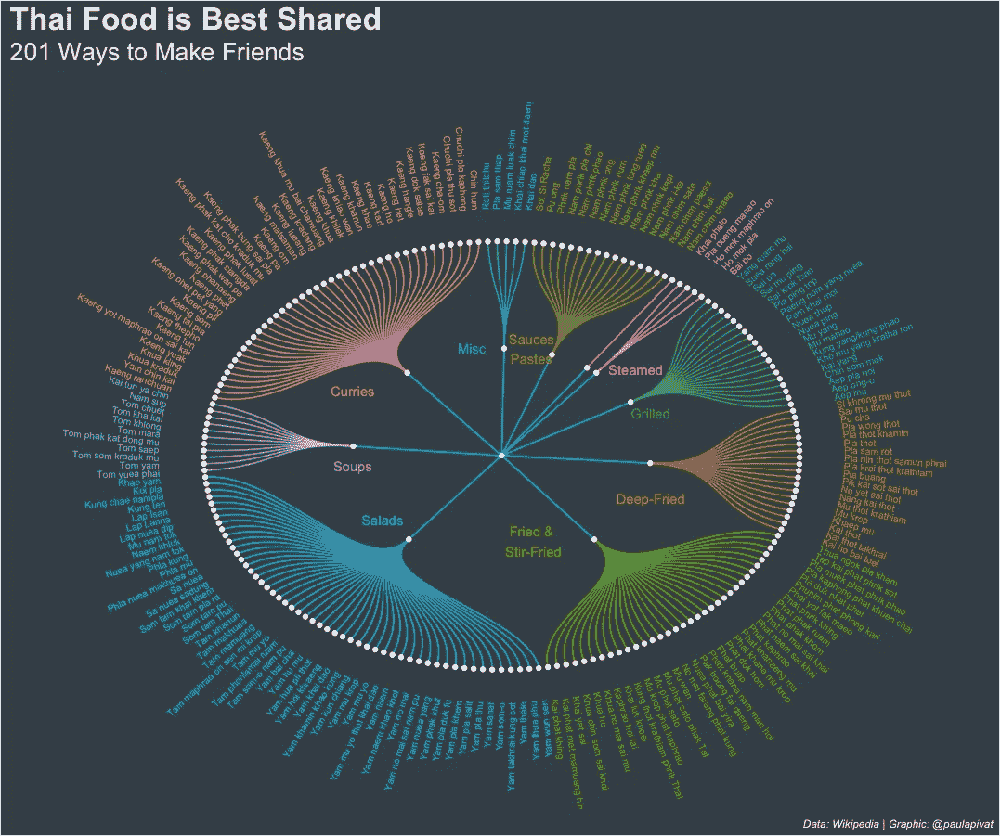
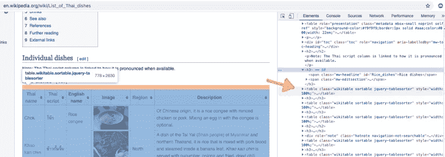
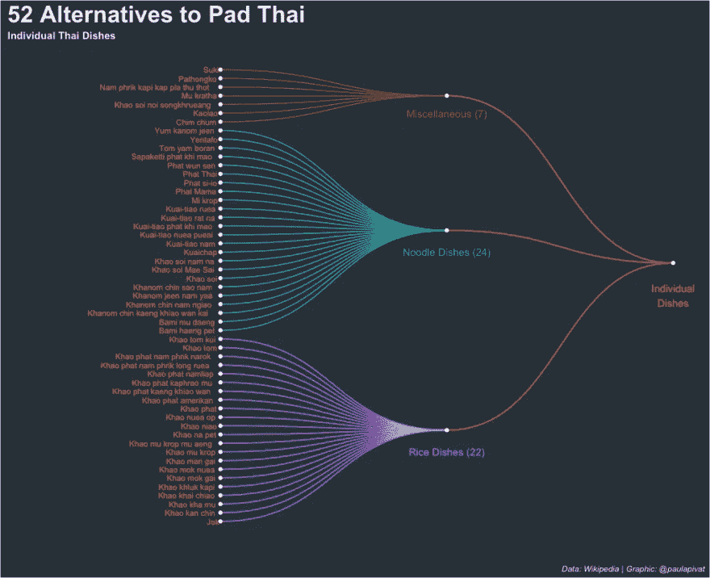
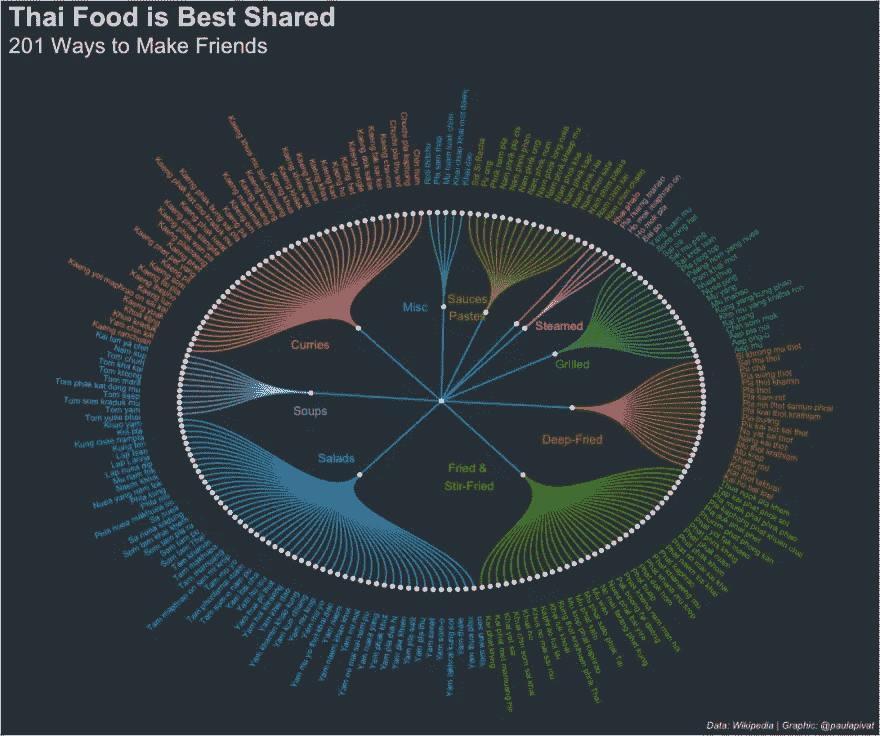
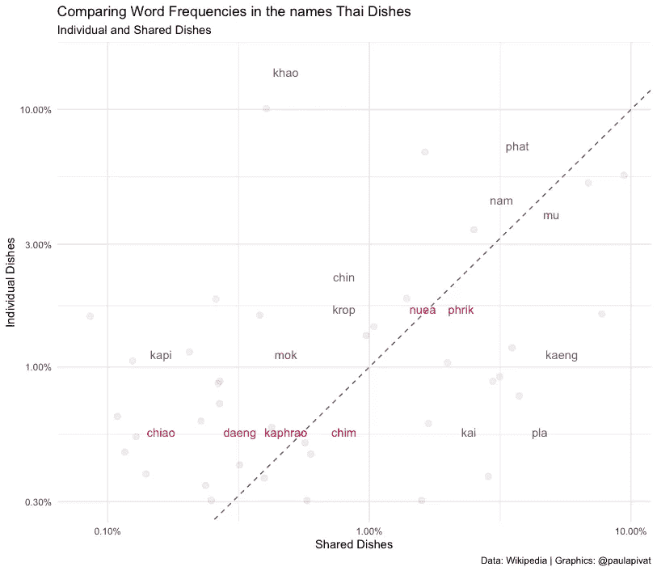
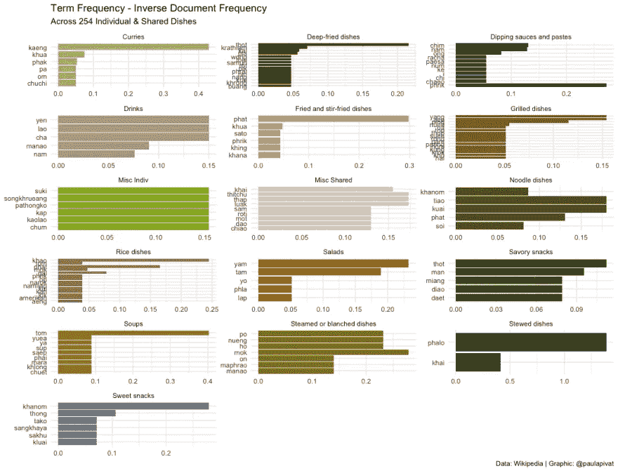
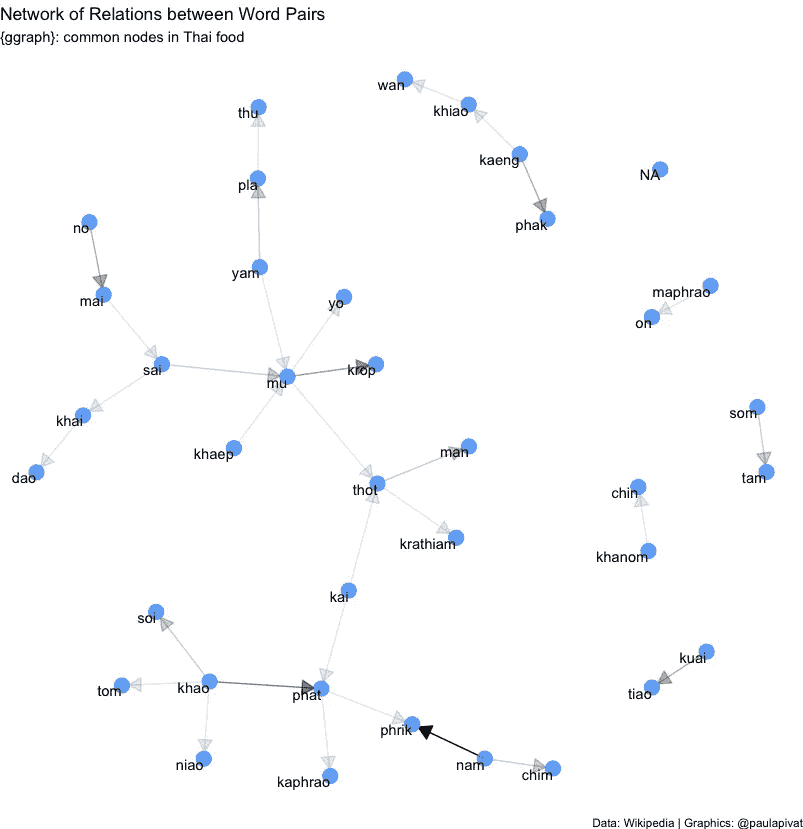
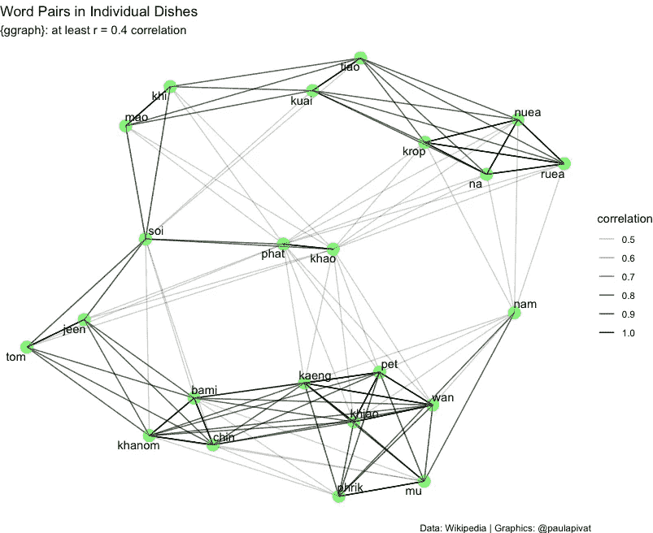

# 用数据探索泰国菜

> 原文：<https://towardsdatascience.com/exploring-thai-food-with-data-fae0193851be?source=collection_archive---------27----------------------->

## 使用 R 和 Python 的端到端探索性数据项目



作者图片

# 概观

“我们点泰国菜吧。”

“太好了，你的拿手好菜是什么？”

"泰式炒面"

这困扰了我多年，也是这个项目的起源。

人们需要知道除了泰式炒面，他们还有其他选择。泰式炒面是 53 道独立菜肴之一，在那里停下来可能会错过至少 201 道共享泰式菜肴(来源:[维基百科](https://en.wikipedia.org/wiki/List_of_Thai_dishes))。

这个项目是一个通过从维基百科中抓取表格来建立泰国菜数据集的机会。我们将使用 Python 进行 web 抓取，使用 R 进行可视化。网页抓取用`Beautiful Soup` (Python)完成，用`dplyr`进一步预处理，用`ggplot2`可视化。

此外，我们将使用 R 中的`tidytext`包来探索泰国菜的名称(英文),看看我们是否可以从文本数据中了解一些有趣的东西。

最后有机会做一个开源[贡献](https://github.com/holtzy/R-graph-gallery/pull/34)。

项目回购这里是[这里是](https://github.com/PaulApivat/thai_dishes)。

# 探索性问题

这种分析的目的是提出问题。

因为**探索性分析**是迭代的，所以这些问题是在操纵和可视化数据的过程中产生的。我们可以用这些问题来组织文章的其余部分:

1.  我们如何组织泰国菜？
2.  组织不同菜肴的最好方法是什么？
3.  哪种原材料最受欢迎？
4.  哪些原材料最重要？
5.  你能仅仅从菜名中了解泰国菜吗？

# 网页抓取

**注意**:维基百科向感兴趣的用户提供所有可用内容的免费副本。他们的[数据库下载](https://en.wikipedia.org/wiki/Wikipedia:Database_download)可以用于个人使用，离线使用或者数据库查询。我们在这里搜集的所有文本内容都是在知识共享署名-共享 3.0 (CC-BY-SA)下获得多项许可的。虽然我们可以在技术上查询数据，但我们在这里是出于教育目的。为了确保**不会**产生繁重的服务器工作负载，我们将会话超时设置为 **10 秒**(参见下面的代码)。另见他们关于通过[机器人](https://en.wikipedia.org/robots.txt)抓取网页的通知。

我们刮了 300 道泰国菜。每道菜，我们都有:

*   泰语名称
*   泰国文字
*   英文名
*   地区
*   描述

首先，我们将使用以下 Python 库/模块:

```
import requests
from bs4 import BeautifulSoup
import urllib.request
import urllib.parse
import urllib.error
import ssl
import pandas as pd# To avoid overloading Wikipedia servers, we set the timeout to 10 secondsurl = "https://en.wikipedia.org/wiki/List_of_Thai_dishes"
s = requests.Session()
response = s.get(url, timeout=10) ctx = ssl.create_default_context()
ctx.check_hostname = False
ctx.verify_mode = ssl.CERT_NONEhtml = urllib.request.urlopen(url, context=ctx).read()
soup = BeautifulSoup(html, 'html.parser')
soup.title.string
```

我们将使用`requests`向我们需要的维基百科 url 发送一个 HTTP 请求。我们将使用“安全套接字层”(SSL)访问网络套接字。然后我们将读入 html 数据，用**美汤**解析它。

在使用**美汤**之前，我们想了解我们要在浏览器上 **inspect 元素**下刮取的页面(和表格)的结构(注:我用的是 Chrome)。我们可以看到，我们需要标签`table`，以及维基可排序的标签`class`。

```
all_tables = soup.findAll('table', {"class": "wikitable sortable"})
```



作者图片

我们将从**美汤**中使用的主函数是`findAll()`，三个参数是`th`(HTML 表格中的表头单元格)、`tr`(HTML 表格中的行)和`td`(标准数据单元格)。

首先，我们将表格标题保存在一个列表中，我们将在创建一个空的`dictionary`来存储我们需要的数据时使用它。

```
header = [item.text.rstrip() for item in all_tables[0].findAll('th')]table = dict([(x, 0) for x in header])
```

最初，我们想要抓取一个表，知道我们需要对所有 16 个表重复这个过程。因此我们将使用一个*嵌套循环*。因为所有的表都有 6 列，所以我们想要创建 6 个空列表。

我们将遍历所有表格行`tr`并检查 6 个单元格(我们应该有 6 列)，然后我们将*将数据追加到我们创建的每个空列表中。*

```
# loop through all 16 tables
a = [0, 1, 2, 3, 4, 5, 6, 7, 8, 9, 10, 11, 12, 13, 14, 15]# 6 empty list (for 6 columns) to store data
a1 = []
a2 = []
a3 = []
a4 = []
a5 = []
a6 = []# nested loop for looping through all 16 tables, then all tables individually
for i in a:
    for row in all_tables[i].findAll('tr'):
        cells = row.findAll('td')
        if len(cells) == 6:
            a1.append([string for string in cells[0].strings])
            a2.append(cells[1].find(text=True))
            a3.append(cells[2].find(text=True))
            a4.append(cells[3].find(text=True))
            a5.append(cells[4].find(text=True))
            a6.append([string for string in cells[5].strings])
```

你会注意到`a1`和`a6`的代码略有不同。回想起来，我发现`cells[0].find(text=True)`没有**而**产生某些文本，特别是如果它们是链接的话，因此做了一点小小的调整。

字符串标签返回一个`NavigableString`类型对象，而文本返回一个`unicode`对象(参见[堆栈溢出](https://stackoverflow.com/questions/25327693/difference-between-string-and-text-beautifulsoup)解释)。

在我们丢弃数据之后，我们需要在转换到`data frame`之前将数据存储在`dictionary`中:

```
# create dictionary
table = dict([(x, 0) for x in header])# append dictionary with corresponding data list
table['Thai name'] = a1
table['Thai script'] = a2
table['English name'] = a3
table['Image'] = a4
table['Region'] = a5
table['Description'] = a6# turn dict into dataframe
df_table = pd.DataFrame(table)
```

对于`a1`和`a6`，我们需要做一个额外的步骤将字符串连接在一起，所以我额外创建了两个对应的列，`Thai name 2`和`Description2`:

```
# Need to Flatten Two Columns: 'Thai name' and 'Description'
# Create two new columns
df_table['Thai name 2'] = ""
df_table['Description2'] = ""# join all words in the list for each of 328 rows and set to thai_dishes['Description2'] column
# automatically flatten the list
df_table['Description2'] = [
    ' '.join(cell) for cell in df_table['Description']]df_table['Thai name 2'] = [
    ' '.join(cell) for cell in df_table['Thai name']]
```

在我们废弃了所有的数据并从`dictionary`转换到`data frame`之后，我们将向 csv 写入，准备在 R 中进行数据清理(**注**:我将 CSV 保存为 thai _ dishes.csv，但你可以选择不同的名称)。

# 数据清理

数据清理通常是非线性的。

我们将操纵数据进行探索，了解*关于*数据的信息，并发现某些东西需要清理，或者在某些情况下，需要返回 Python 重新清理。由于在探测和清理过程中发现**缺失数据**，列`a1`和`a6`与其他列的刮除方式不同。

对于某些链接，使用`.find(text=True)`没有达到预期的效果，所以做了一点小小的调整。

对于本文来说，`R`是清理数据的首选工具。

以下是其他数据清理任务:

*   更改列名(蛇形)

```
# read data
df <- read_csv("thai_dishes.csv")# change column name
df <- df %>%
    rename(
        Thai_name = `Thai name`,
        Thai_name_2 = `Thai name 2`,
        Thai_script = `Thai script`,
        English_name = `English name`
    )
```

*   删除换行符转义序列(\n)

```
# remove  \n from all columns ----
df$Thai_name <- gsub("[\n]", "", df$Thai_name)
df$Thai_name_2 <- gsub("[\n]", "", df$Thai_name_2)
df$Thai_script <- gsub("[\n]", "", df$Thai_script)
df$English_name <- gsub("[\n]", "", df$English_name)
df$Image <- gsub("[\n]", "", df$Image)
df$Region <- gsub("[\n]", "", df$Region)
df$Description <- gsub("[\n]", "", df$Description)
df$Description2 <- gsub("[\n]", "", df$Description2)
```

*   添加/变更新列(主要分组，次要分组):

```
# Add Major AND Minor Groupings ----
df <- df %>%
    mutate(
        major_grouping = as.character(NA),
        minor_grouping = as.character(NA)
        )
```

*   编辑 Thai_name 列中缺少数据的行:26，110，157，234–238，240，241，246

**注意**:这只在第一轮时需要，在我刮的方式`a1`和`a6`改变后，这一步**不再需要**:

```
# If necessary; may not need to do this after scraping a1 and a6 - see above
# Edit Rows for missing Thai_name
df[26,]$Thai_name <- "Khanom chin nam ngiao"
df[110,]$Thai_name <- "Lap Lanna"
df[157,]$Thai_name <- "Kai phat khing"
df[234,]$Thai_name <- "Nam chim chaeo"
df[235,]$Thai_name <- "Nam chim kai"
df[236,]$Thai_name <- "Nam chim paesa"
df[237,]$Thai_name <- "Nam chim sate"
df[238,]$Thai_name <- "Nam phrik i-ke"
df[240,]$Thai_name <- "Nam phrik kha"
df[241,]$Thai_name <- "Nam phrik khaep mu"
df[246,]$Thai_name <- "Nam phrik pla chi"
```

*   保存到“edit _ thai _ dishes.csv”

```
# Write new csv to save edits made to data frame
write_csv(df, "edit_thai_dishes.csv")
```

# 数据可视化

有几种方法可以将数据可视化。因为我们想要传达泰国菜的多样性，除了泰国菜之外，我们想要一个包含许多选项的可视化。

我选择了**树状图**。该图假设数据中存在层次结构，这适合我们的项目，因为我们可以按分组和子分组来组织菜肴。

## 我们如何组织泰国菜？

我们首先区分**个人**和**共享**菜肴，以表明泰式炒面根本不是最好的*个人*菜肴。事实上，更多的菜肴归入**共享**组。

为了避免在一个视图中塞进太多的数据，我们将为单独和共享的菜肴创建两个单独的视图。

这是第一张**树状图**，代表泰式炒面的 52 种不同菜式。



作者图片

创建一个树状图需要使用`ggraph`和`igraph`库。首先，我们将加载库，并通过过滤单个菜肴来子集化数据框:

```
df <- read_csv("edit_thai_dishes.csv")library(ggraph)
library(igraph)df %>%
    select(major_grouping, minor_grouping, Thai_name, Thai_script) %>%
    filter(major_grouping == 'Individual dishes') %>%
    group_by(minor_grouping) %>%
    count()
```

我们创建边和节点(即 from 和 to)来创建单个菜肴(即米饭、面条和其他)中的子分组:

```
# Individual Dishes ----# data: edge list
d1 <- data.frame(from="Individual dishes", to=c("Misc Indiv", "Noodle dishes", "Rice dishes"))d2 <- df %>%
    select(minor_grouping, Thai_name) %>%
    slice(1:53) %>%
    rename(
        from = minor_grouping,
        to = Thai_name
    ) edges <- rbind(d1, d2)# plot dendrogram (idividual dishes)
indiv_dishes_graph <- graph_from_data_frame(edges)ggraph(indiv_dishes_graph, layout = "dendrogram", circular = FALSE) +
    geom_edge_diagonal(aes(edge_colour = edges$from), label_dodge = NULL) +
    geom_node_text(aes(label = name, filter = leaf, color = 'red'), hjust = 1.1, size = 3) +
    geom_node_point(color = "whitesmoke") +
    theme(
        plot.background = element_rect(fill = '#343d46'),
        panel.background = element_rect(fill = '#343d46'),
        legend.position = 'none',
        plot.title = element_text(colour = 'whitesmoke', face = 'bold', size = 25),
        plot.subtitle = element_text(colour = 'whitesmoke', face = 'bold'),
        plot.caption = element_text(color = 'whitesmoke', face = 'italic')
    ) +
    labs(
        title = '52 Alternatives to Pad Thai',
        subtitle = 'Individual Thai Dishes',
        caption = 'Data: Wikipedia | Graphic: @paulapivat'
    ) +
    expand_limits(x = c(-1.5, 1.5), y = c(-0.8, 0.8)) +
    coord_flip() +
    annotate("text", x = 47, y = 1, label = "Miscellaneous (7)", color = "#7CAE00")+
    annotate("text", x = 31, y = 1, label = "Noodle Dishes (24)", color = "#00C08B") +
    annotate("text", x = 8, y = 1, label = "Rice Dishes (22)", color = "#C77CFF") +
    annotate("text", x = 26, y = 2, label = "Individual\nDishes", color = "#F8766D")
```

## 组织不同菜肴的最好方法是什么？

大约有 **4X** 个*共享*个菜肴作为单个菜肴，所以树状图应该是**圆形**以适合一个图形中所有菜肴的名称。

对于这些类型的视觉效果，我经常使用的一个很棒的资源是 R 图库。在如何计算**文本角度**方面有一个小问题，所以我提交了一个 [PR 来修复](https://github.com/holtzy/R-graph-gallery/pull/34)。

也许区分个人菜肴和共享菜肴过于粗略，在 201 种共享泰国菜的树状图中，我们可以看到进一步的细分，包括咖喱、酱/酱、蒸、烤、油炸、油炸和炒菜、沙拉、汤和其他杂项:



作者图片

```
# Shared Dishes ----
df %>%
    select(major_grouping, minor_grouping, Thai_name, Thai_script) %>%
    filter(major_grouping == 'Shared dishes') %>%
    group_by(minor_grouping) %>%
    count() %>%
    arrange(desc(n))d3 <- data.frame(from="Shared dishes", to=c("Curries", "Soups", "Salads",
                                            "Fried and stir-fried dishes", "Deep-fried dishes", "Grilled dishes",
                                            "Steamed or blanched dishes", "Stewed dishes", "Dipping sauces and pastes", "Misc Shared")) d4 <- df %>%
    select(minor_grouping, Thai_name) %>%
    slice(54:254) %>%
    rename(
        from = minor_grouping,
        to = Thai_name
    )edges2 <- rbind(d3, d4)# create a vertices data.frame. One line per object of hierarchy
vertices = data.frame(
    name = unique(c(as.character(edges2$from), as.character(edges2$to)))
)# add column with group of each name. Useful to later color points
vertices$group = edges2$from[ match(vertices$name, edges2$to)]# Add information concerning the label we are going to add: angle, horizontal adjustment and potential flip
# calculate the ANGLE of the labels
vertices$id=NA
myleaves=which(is.na(match(vertices$name, edges2$from)))
nleaves=length(myleaves)
vertices$id[myleaves] = seq(1:nleaves)
vertices$angle = 360 / nleaves * vertices$id + 90 # calculate the alignment of labels: right or left
vertices$hjust<-ifelse( vertices$angle < 275, 1, 0)# flip angle BY to make them readable
vertices$angle<-ifelse(vertices$angle < 275, vertices$angle+180, vertices$angle)# plot dendrogram (shared dishes)
shared_dishes_graph <- graph_from_data_frame(edges2)ggraph(shared_dishes_graph, layout = "dendrogram", circular = TRUE) +
    geom_edge_diagonal(aes(edge_colour = edges2$from), label_dodge = NULL) +
    geom_node_text(aes(x = x*1.15, y=y*1.15, filter = leaf, label=name, angle = vertices$angle, hjust= vertices$hjust, colour= vertices$group), size=2.7, alpha=1) +
    geom_node_point(color = "whitesmoke") +
    theme(
        plot.background = element_rect(fill = '#343d46'),
        panel.background = element_rect(fill = '#343d46'),
        legend.position = 'none',
        plot.title = element_text(colour = 'whitesmoke', face = 'bold', size = 25),
        plot.subtitle = element_text(colour = 'whitesmoke', margin = margin(0,0,30,0), size = 20),
        plot.caption = element_text(color = 'whitesmoke', face = 'italic')
    ) +
    labs(
        title = 'Thai Food is Best Shared',
        subtitle = '201 Ways to Make Friends',
        caption = 'Data: Wikipedia | Graphic: @paulapivat'
    ) +
    #expand_limits(x = c(-1.5, 1.5), y = c(-0.8, 0.8)) +
    expand_limits(x = c(-1.5, 1.5), y = c(-1.5, 1.5)) +
    coord_flip() +
    annotate("text", x = 0.4, y = 0.45, label = "Steamed", color = "#F564E3") +
    annotate("text", x = 0.2, y = 0.5, label = "Grilled", color = "#00BA38") +
    annotate("text", x = -0.2, y = 0.5, label = "Deep-Fried", color = "#DE8C00") +
    annotate("text", x = -0.4, y = 0.1, label = "Fried &\n Stir-Fried", color = "#7CAE00") +
    annotate("text", x = -0.3, y = -0.4, label = "Salads", color = "#00B4F0") +
    annotate("text", x = -0.05, y = -0.5, label = "Soups", color = "#C77CFF") +
    annotate("text", x = 0.3, y = -0.5, label = "Curries", color = "#F8766D") +
    annotate("text", x = 0.5, y = -0.1, label = "Misc", color = "#00BFC4") +
    annotate("text", x = 0.5, y = 0.1, label = "Sauces\nPastes", color = "#B79F00")
```

# 文本挖掘

## 哪种原材料最受欢迎？

回答这个问题的一个方法是使用文本挖掘，通过任一单词对**进行标记化，并通过频率对单词进行计数，作为流行度的一种度量。**

在下面的柱状图中，我们可以看到所有泰国菜的词频。 **Mu** (หมู)在泰语中的意思是猪肉，在所有菜式和子类别中出现频率最高。接下来我们吃แกง咖喱饭，意思是咖喱。(ผัด)名列第三，暗示“炒”是一种受欢迎的烹饪方式。

正如我们看到的**不是**所有的词都是指原材料，所以我们可能无法直接回答这个问题。


作者图片

```
library(tidytext)
library(scales)# new csv file after data cleaning (see above)
df <- read_csv("../web_scraping/edit_thai_dishes.csv")df %>%
    select(Thai_name, Thai_script) %>%
    # can substitute 'word' for ngrams, sentences, lines
    unnest_tokens(ngrams, Thai_name) %>%  
    # to reference thai spelling: group_by(Thai_script)
    group_by(ngrams) %>%  
    tally(sort = TRUE) %>%  # alt: count(sort = TRUE)
    filter(n > 9) %>%
# visualize
# pipe directly into ggplot2, because using tidytools
    ggplot(aes(x = n, y = reorder(ngrams, n))) + 
    geom_col(aes(fill = ngrams)) +
    scale_fill_manual(values = c(
        "#c3d66b",
        "#70290a",
        "#2f1c0b",
        "#ba9d8f",
        "#dda37b",
        "#8f5e23",
        "#96b224",
        "#dbcac9",
        "#626817",
        "#a67e5f",
        "#be7825",
        "#446206",
        "#c8910b",
        "#88821b",
        "#313d5f",
        "#73869a",
        "#6f370f",
        "#c0580d",
        "#e0d639",
        "#c9d0ce",
        "#ebf1f0",
        "#50607b"
    )) +
    theme_minimal() +
    theme(legend.position = "none") +
    labs(
        x = "Frequency",
        y = "Words",
        title = "Frequency of Words in Thai Cuisine",
        subtitle = "Words appearing at least 10 times in Individual or Shared Dishes",
        caption = "Data: Wikipedia | Graphic: @paulapivat"
    )
```

我们还可以看到个人菜肴和共享菜肴共有的词汇。我们还看到了其他一些词，如 nuea(牛肉)、phrik(辣椒)和 kaphrao(罗勒叶)。



作者图片

```
# frequency for Thai_dishes (Major Grouping) ----# comparing Individual and Shared Dishes (Major Grouping)
thai_name_freq <- df %>%
    select(Thai_name, Thai_script, major_grouping) %>%
    unnest_tokens(ngrams, Thai_name) %>% 
    count(ngrams, major_grouping) %>%
    group_by(major_grouping) %>%
    mutate(proportion = n / sum(n)) %>%
    select(major_grouping, ngrams, proportion) %>%
    spread(major_grouping, proportion) %>%
    gather(major_grouping, proportion, c(`Shared dishes`)) %>%
    select(ngrams, `Individual dishes`, major_grouping, proportion) # Expect warming message about missing values
ggplot(thai_name_freq, aes(x = proportion, y = `Individual dishes`,
       color = abs(`Individual dishes` - proportion))) +
    geom_abline(color = 'gray40', lty = 2) +
    geom_jitter(alpha = 0.1, size = 2.5, width = 0.3, height = 0.3) +
    geom_text(aes(label = ngrams), check_overlap = TRUE, vjust = 1.5) +
    scale_x_log10(labels = percent_format()) +
    scale_y_log10(labels = percent_format()) +
    scale_color_gradient(limits = c(0, 0.01), 
                         low = "red", high = "blue") +    # low = "darkslategray4", high = "gray75"
    theme_minimal() +
    theme(legend.position = "none",
          legend.text = element_text(angle = 45, hjust = 1)) +
    labs(y = "Individual Dishes",
         x = "Shared Dishes",
         color = NULL,
         title = "Comparing Word Frequencies in the names Thai Dishes",
         subtitle = "Individual and Shared Dishes",
         caption = "Data: Wikipedia | Graphics: @paulapivat")
```

## 哪些原材料最重要？

我们只能从频率中了解到这么多，因此文本挖掘从业者创造了**术语频率—逆文档频率**来更好地反映一个词在文档或语料库中的重要性(进一步的细节[在此](https://en.wikipedia.org/wiki/Tf%E2%80%93idf))。

还是那句话，不一定指的是原材料，所以这个问题在这里不能直接完全回答。



作者图片

## 你能仅仅从菜名中了解泰国菜吗？

简短的回答是“是的”。

我们仅从频率和“术语频率—逆文档频率”中了解到，不仅是最常见的单词，还有我们用`tidytext`标记的当前单词集中的相对重要性。这不仅告诉我们流行的原材料(猪肉)，还告诉我们菜肴类型(咖喱)和其他流行的准备方式(炒菜)。

我们甚至可以检查单词之间的关系网的**。深色箭头表示单词对之间的关系更强，例如“nam phrik”是一个强配对。这在泰语中是“辣椒酱”的意思，暗示了辣椒酱在许多菜肴中的重要作用。**

我们在上面了解到“目”(猪肉)经常出现。现在我们看到“mu”和“krop”比其他配对关系更密切(注:“mu krop”的意思是“脆皮猪肉”)。我们在上面也看到了“khao”频繁出现在米饭菜肴中。这并不奇怪，因为“khao”在泰语中是米饭的意思，但我们在这里看到“khao phat”与炒饭(“khao phat”)密切相关，表明炒饭非常受欢迎。



作者图片

```
# Visualizing a network of Bi-grams with {ggraph} ----
library(igraph)
library(ggraph)
set.seed(2021)thai_dish_bigram_counts <- df %>%
    select(Thai_name, minor_grouping) %>%
    unnest_tokens(bigram, Thai_name, token = "ngrams", n = 2) %>%
    separate(bigram, c("word1", "word2"), sep = " ") %>%
    count(word1, word2, sort = TRUE) # filter for relatively common combinations (n > 2)
thai_dish_bigram_graph <- thai_dish_bigram_counts %>%
    filter(n > 2) %>%
    graph_from_data_frame() # polishing operations to make a better looking graph
a <- grid::arrow(type = "closed", length = unit(.15, "inches"))set.seed(2021)
ggraph(thai_dish_bigram_graph, layout = "fr") +
    geom_edge_link(aes(edge_alpha = n), show.legend = FALSE,
                   arrow = a, end_cap = circle(.07, 'inches')) +
    geom_node_point(color = "dodgerblue", size = 5, alpha = 0.7) +
    geom_node_text(aes(label = name), vjust = 1, hjust = 1) +
    labs(
        title = "Network of Relations between Word Pairs",
        subtitle = "{ggraph}: common nodes in Thai food",
        caption = "Data: Wikipedia | Graphics: @paulapivat"
    ) +
    theme_void()
```

最后，我们可能会对道菜肴中*的词汇关系感兴趣。*

下图显示了一个中度到高度相关的词对网络。我们可以看到某些单词以相对较暗的线条聚集在一起:kaeng(咖喱)、pet(辣)、wan(甜)、khiao(绿咖喱)、phrik(辣椒)和 mu(猪肉)。这些词代表了通常组合在一起的配料、烹饪方式和描述的集合。



作者图片

```
set.seed(2021)# Individual Dishes
individual_dish_words <- df %>%
    select(major_grouping, Thai_name) %>%
    filter(major_grouping == 'Individual dishes') %>%
    mutate(section = row_number() %/% 10) %>%
    filter(section > 0) %>%
    unnest_tokens(word, Thai_name)  # assume no stop wordsindividual_dish_cors <- individual_dish_words %>%
    group_by(word) %>% 
    filter(n() >= 2) %>%     # looking for co-occuring words, so must be 2 or greater
    pairwise_cor(word, section, sort = TRUE) individual_dish_cors %>%
    filter(correlation < -0.40) %>%
    graph_from_data_frame() %>%
    ggraph(layout = "fr") +
    geom_edge_link(aes(edge_alpha = correlation, size = correlation), show.legend = TRUE) +
    geom_node_point(color = "green", size = 5, alpha = 0.5) +
    geom_node_text(aes(label = name), repel = TRUE) +
    labs(
        title = "Word Pairs in Individual Dishes",
        subtitle = "{ggraph}: Negatively correlated (r = -0.4)",
        caption = "Data: Wikipedia | Graphics: @paulapivat"
    ) +
    theme_void()
```

## 摘要

我们已经完成了一个探索性的数据项目，在这个项目中，我们使用 Python 和 r 的组合来搜集、清理、操作和可视化数据。我们还使用`tidytext`包来完成基本的文本挖掘任务，看看我们是否可以使用从维基百科上搜集的菜名中的单词来深入了解泰国美食。

欲了解更多关于数据科学、R、Python、SQL 等内容，[在 Twitter 上找到我](https://twitter.com/paulapivat)。