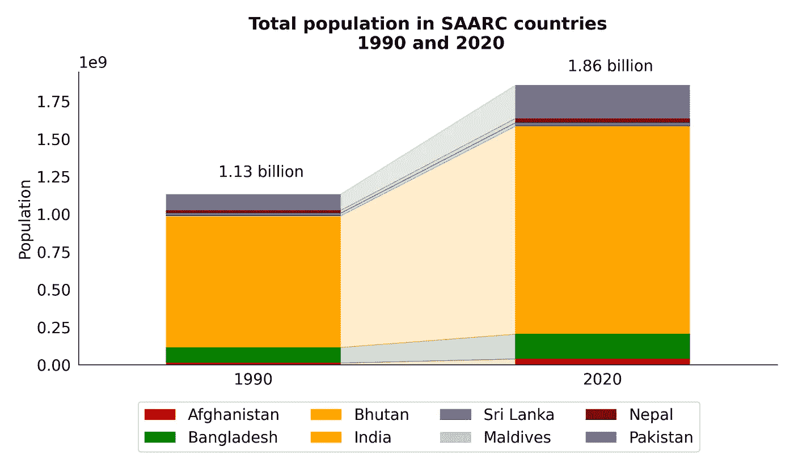
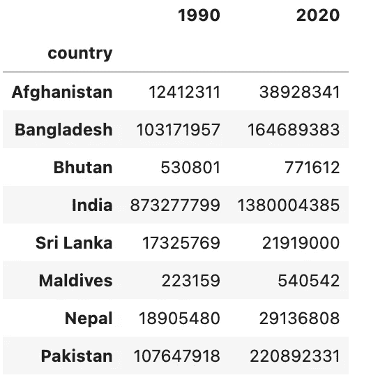
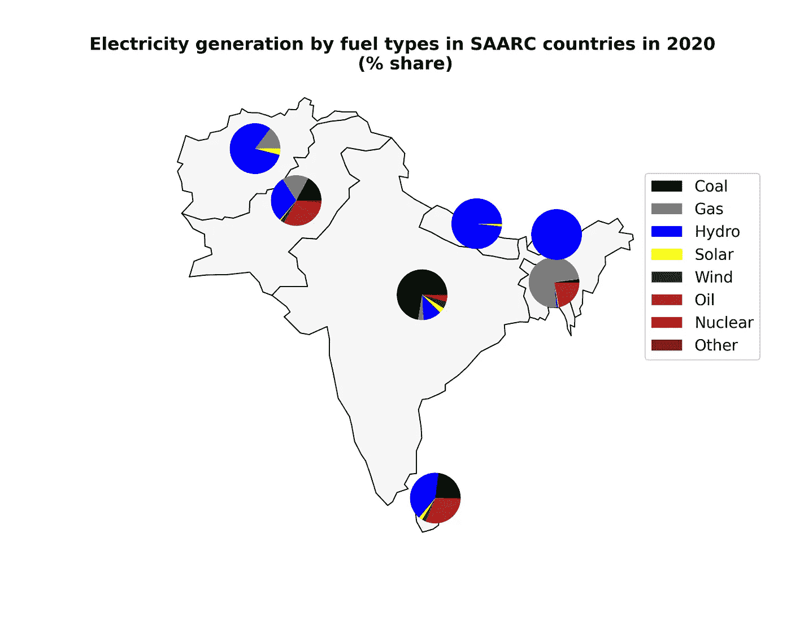
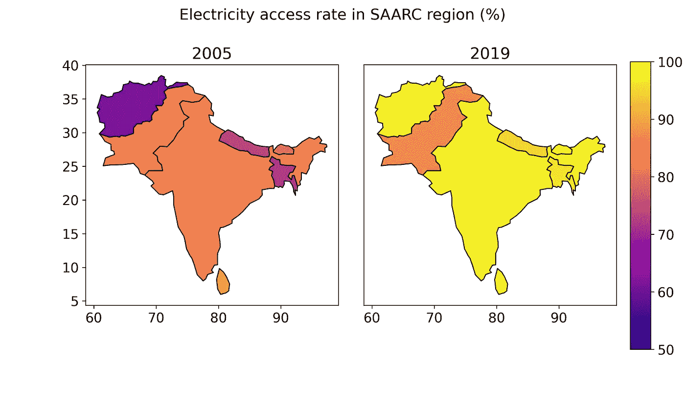
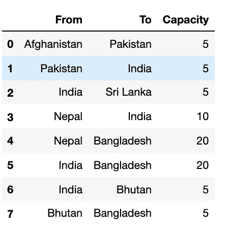
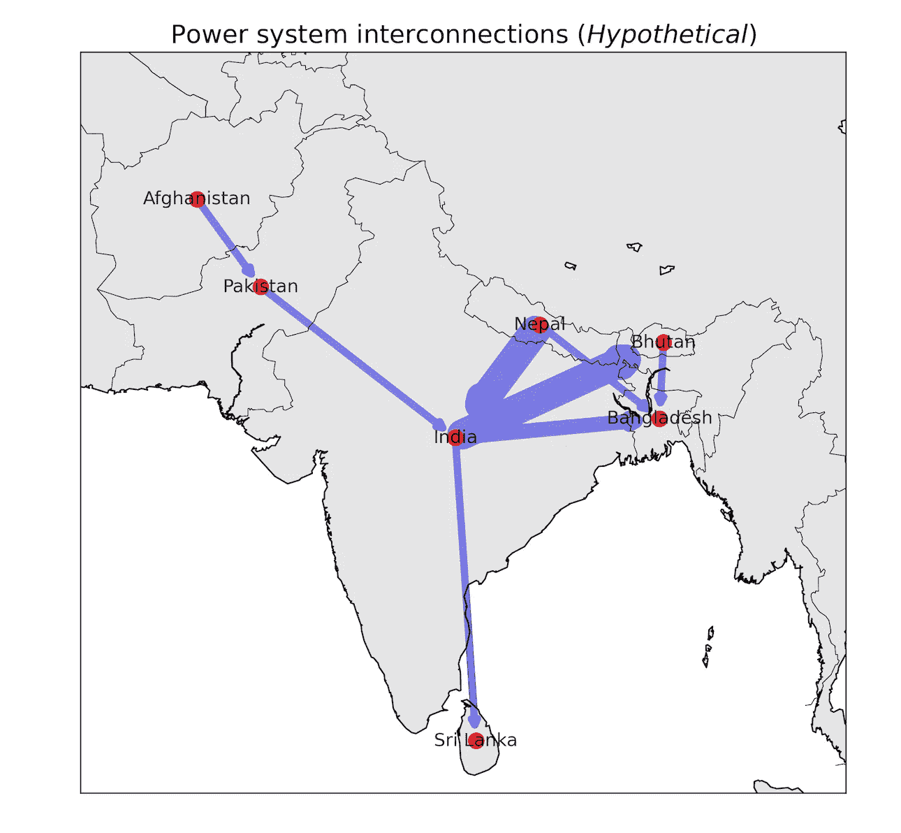
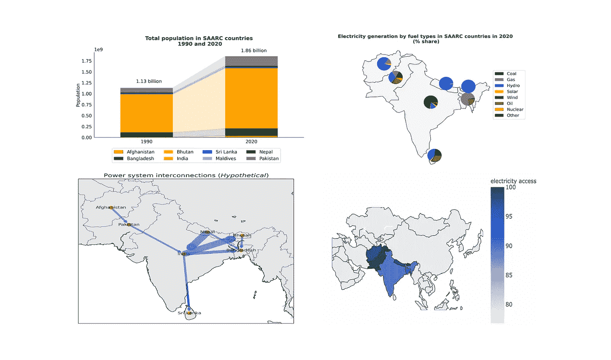

# 探索南亚的人口和权力部门

> 原文：<https://towardsdatascience.com/exploring-the-demography-and-power-sector-of-south-asia-27cca720163c?source=collection_archive---------26----------------------->

## 使用 Python 中的 geopandas、matplotlib、networkx 和 Plotly 进行分析

假设你正在参加一个全球会议，与会者来自世界各地，目的是为了一个特殊的目标。如果你要在这个会议上与一个随机的人见面并互动，这个人很有可能来自南亚。根据[统计](https://data.worldbank.org/indicator/SP.POP.TOTL)，世界上每四个人中就有近一个来自南亚。该区域包括八个国家:阿富汗、孟加拉国、不丹、印度、马尔代夫、尼泊尔、巴基斯坦和斯里兰卡。这些国家共同组成了一个名为[南亚区域合作联盟(SAARC)](https://www.saarc-sec.org/) 的区域性政府间组织。

我来自这个地区的一个国家，一段时间以来，我一直好奇于分析这个地区的人口结构。有了能源系统的背景，我也有兴趣分析该地区国家的电力系统是什么样子，它们彼此之间有什么不同。因此，由于 Covid 相关的限制，这个假期没有旅行，我只是坐在我的笔记本电脑前，检查了一些公开来源的数据，并开始使用我最喜欢的编程语言 Python 处理它们。

*事情是这样的。我将同时描述洞察力和代码。*

## **人口统计**

我仍然记得二十年前，当我在学校里得知世界人口是六十亿的时候。快进到今天，大概几个月或几年后，全球人口将达到 80 亿。



1990 年和 2019 年南亚国家的人口绘制为堆积条形图。条形之间的阴影区域代表两年间每个国家的人口增长。数据基于[世界银行公开数据 2021](https://data.worldbank.org/indicator/SP.POP.TOTL) 。

在南亚，2020 年印度占总人口的四分之三。其次是巴基斯坦和孟加拉国。该地区其余五个国家的人口加起来不到总人口的百分之五。在过去的三十年里，南亚的人口增长了 65%。这种增长的大部分可以归因于印度，因为它反映在上面图中两个堆叠柱之间的阴影区域中。然而，在此期间，该区域所有国家的人口都在稳步增长。

我从[世界银行公开数据](https://data.worldbank.org/indicator/SP.POP.TOTL)中获得了分析数据，并将其存储在`df_pop`数据框架中。



包含南亚八个国家人口数据的 df_pop 数据帧片段。数据基于[世界银行公开数据 2021](https://data.worldbank.org/indicator/SP.POP.TOTL) 。

获得上面的图的代码在下面的要点。在该图中，1990 年和 2020 年的刻度分别代表 x 轴上的 0 和 1 位置。因此，需要指定 x、y1 和 y2 的准确位置，以填充两个堆叠的列之间的区域，并指定相应的颜色来表示每个国家。

作者绘制的南盟国家 1990 年和 2020 年人口比较图。

**按性别分列的人口分布**

接下来，我想检查一下南亚的人口是如何基于性别分布的。我想在该地区的各个国家的地图上绘制一个条形图。

此过程的第一步是使用 geopandas 获取该区域的几何图形。本[故事](/geoplotting-emissions-intensity-of-electricity-generation-in-europe-90c22b378858)中提供了 geopandas 的介绍和应用。首先，我通过读取包的固有数据集生成了`world`地理数据框架。接下来，我取了一个名为`saarc`的`world`子集，它只包含八个南亚国家的几何图形。不幸的是，作为一个位于印度洋的小岛国，马尔代夫的几何数据在该数据集中不可用。

```
world **=** gpd**.**read_file(gpd**.**datasets**.**get_path('naturalearth_lowres'))saarc_countries = ["Nepal","India","Bangladesh","Bhutan","Afghanistan","Pakistan","Sri Lanka","Maldives"]#select only the countries in the list from worldsaarc **=** world[world**.**name**.**isin(saarc_countries)]
```

2020 年基于性别的人口数据来自`df`的[世界银行公开数据](https://data.worldbank.org/)，基于两者都有一个国家名称的公共列，被附加了`saarc`。看起来是这样的:

```
saarc = saarc.join(df)
```


saarc geopandas 数据框架的片段，其中男性和女性人口份额作为列附加在右侧。人口数据基于[世界银行公开数据 2021](https://data.worldbank.org/) 。

接下来，我通过将宽度和高度指定为`parent_axes`的百分比，为各个国家在`parent_axes`中创建了`inset_axes`。对于边界框的位置，我提供了每个国家的几何形心。然后，我在为每个国家创建的`inset_axes`中绘制了男性和女性人口份额的并列条形图。代码如下所示:

作者绘制的南亚性别人口分布图。

结果图如下所示:


在南亚各自国家的地图上，男性和女性人口比例以条形标绘。数据基于[世界银行公开数据 2021](https://data.worldbank.org/) 。

由此得出的图描绘了南亚地区性别人口分布不均的情况。2020 年，尼泊尔和斯里兰卡的女性人口比例高于男性。对孟加拉国来说，几乎是 50:50。在阿富汗、不丹、印度和巴基斯坦，男性人口的比例高于女性人口。

**南亚的发电组合**

我的研究兴趣在于了解不同国家的能源供需结构，更重要的是，这些国家如何满足他们的电力需求。本次分析的数据来源于[我们的数据世界](https://ourworldindata.org/electricity-mix)网站。

不用说，印度的总发电量和发电厂装机容量远远低于该地区任何其他国家，因为它幅员辽阔，人口众多。然而，我想比较一下各国的电力组合。为此，我使用了与上一个相同的方法来构建情节。



发电组合在南亚各国地图上绘制成饼图。数据基于 2021 年数据中的[我们的世界。](https://ourworldindata.org/electricity-mix)

该图表明，到 2020 年，不丹和尼泊尔几乎完全依赖水力发电，这是一种可再生的电力来源。这两个国家拥有利用发源于喜马拉雅山脉的河流进行水力发电的巨大潜力。该区域其他国家的电力组合中水电所占份额相对较低。

一个惊人的事实是，上面的图表描述了其他国家对化石燃料发电的严重依赖。例如，孟加拉国是 T2 地区人口最稠密的国家，几乎所有的电力都来自天然气或石油。印度四分之三的电力来自煤炭，这是碳密度最高的燃料。2020 年，只有印度和巴基斯坦有核电运行。

由于其地理位置，南亚国家全年都有[充足的太阳辐射](https://globalsolaratlas.info/map?c=4.381329,54.969406,3)。有些地点也有[良好的风势](https://globalwindatlas.info/)。为了对全球气候行动做出贡献，这些国家必须挖掘其可再生能源潜力，避免未来可能的碳锁定。

**南亚的电力接入**

仅在过去几十年里，由于政府、私营部门、公用事业公司、智囊团和国际发展合作的努力，南亚各国在向人民提供电力方面取得了显著进展。

为了比较现实中的进展，我更深入地研究了来自[世界银行公开数据](https://data.worldbank.org/indicator/EG.ELC.ACCS.ZS?locations=AF-BD-BT-IN-MV-NP-LK-PK)的电力接入数据，并将其与`saarc`地理数据框架相结合。基于数据可用性，我在每个国家的子图中使用 choropleth 地图绘制了该地区 2005 年和 2019 年的电力接入率。



2005 年和 2019 年南亚国家电力接入率。右边的颜色条是两个支线剧情共有的。数据基于[世界银行公开数据 2021](https://data.worldbank.org/indicator/EG.ELC.ACCS.ZS?locations=AF-BD-BT-IN-MV-NP-LK-PK) 。

该图显示，2005 年至 2019 年间，南亚的电力接入率显著提高。除巴基斯坦外，所有国家的电力供应率都达到了 90%以上。不丹和斯里兰卡已经达到了 100%的电气化率。在所有国家中，与农村人口相比，[城市人口有更高的用电率](https://data.worldbank.org/indicator/EG.ELC.ACCS.UR.ZS?locations=AF-BD-BT-IN-MV-NP-LK-PK)。基础设施发展和技术能力不足是某些国家电力部门发展不佳的原因。

**互联器**

欧洲大陆同步电网覆盖了欧洲传输系统运营商网络(ENTSO-E) 的[区域，连接欧洲部分或全部国家。这种类型的互连允许电力系统的灵活性，因为在一个高供应地区产生的低成本电力可以输送到另一个高需求地区。它不仅有助于在不同的空间和时间层次上维持供需平衡，而且](https://www.entsoe.eu/data/map/)[它还确保了供应的安全性](https://ses.jrc.ec.europa.eu/transcontinental-and-global-power-grids)并有助于降低成本和排放。

目前，南亚国家之间现有和拟议的跨境互联互通有限，如不丹-印度、印度-尼泊尔、印度-孟加拉国等。虽然基础设施需要建立互联网络带来了自己的一系列成本和挑战，但一项研究表明，高收益成本比可能会超过挑战，这可能有助于该地区的长期发展。

我设想了一个该地区不同国家之间的假想互联，并试图在地图上绘制出来，仅供演示之用。我任意选择的假设`interconnectors`数据如下:



包含南亚电力系统间假设互联的互联数据帧片段。基于作者的任意选择(仅供演示)。

首先，我使用 Python 中的 [networkx](https://networkx.org/documentation/stable/index.html) 包将它转换成一个有向图:

```
G = nx.from_pandas_edgelist(interconnectors, source = “From”, target = “To”, create_using = nx.DiGraph()) 
```

接下来，我通过指定[墨卡托投影](https://www.sciencedirect.com/topics/earth-and-planetary-sciences/mercator-projection)(一种圆柱形地图投影)和低分辨率创建了[底图](https://matplotlib.org/basemap/users/intro.html)。我指定了经度和纬度，以便将所有国家都包含在底图中。

```
from mpl_toolkits.basemap import Basemapm = Basemap(projection = “merc”, #Mercator projection
 llcrnrlon = 60, #longitude of lower left corner
 llcrnrlat = 5, #latitude of lower left corner
 urcrnrlon = 100, #longitude of upper right corner
 urcrnrlat = 40, #latitude of upper right corner
 lat_ts = 1, #latitude of true scale
 resolution = “l”,
 suppress_ticks = False)
```

我想在每个国家各自的几何形心中画出每个国家的节点。因此，我创建了一个`positions`字典，其中包括与底图大小成比例的节点位置。

```
positions = {}
for index, row in saarc.iterrows(): #Set positions on the Basemap in proportion to the size of Basemap
      positions[index] = m(row.geometry.centroid.x, row.geometry.centroid.y)
```

我得到了下面的`position`字典:

```
{'India': (2178387.5972047374, 2063020.0475059198),
 'Bangladesh': (3365125.8765982683, 2173785.0707132816),
 'Bhutan': (3387861.379178301, 2616406.810286945),
 'Nepal': (2669735.152648369, 2718429.0071621696),
 'Pakistan': (1046628.9002186056, 2939091.5173554155),
 'Afghanistan': (676705.6727856797, 3447841.160892035),
 'Sri Lanka': (2297740.670615352, 302122.0644451928)}
```

最后，我通过指定节点位置、节点大小和其他参数绘制了有向图。国与国之间的边界宽度反映了我提供的假设容量。接下来，我还绘制了国家边界和海岸线，并填充了大陆，如下面的代码所示。

```
nx.draw_networkx(G, pos = positions,
 node_shape = “o”,
 node_color = “r”,
 alpha = 0.8,
 node_size = 100,
 arrows = True,
 width = [5, 5, 5, 10, 20, 20, 5, 5],
 edge_color = “blue”)m.drawcountries(linewidth = 0.5)
#m.drawstates(linewidth = 1)
m.drawcoastlines(linewidth = 1)
m.fillcontinents(alpha = 0.5)plt.title(“Power system interconnections $(\itHypothetical)$”)plt.show()
```

最后得到了之前设想的国与国之间假设互联互通的情节。



南亚国家电力系统间的假想互联。红点代表节点，蓝线代表边。边缘的宽度反映了两国之间的互联能力。基于作者的任意选择(仅供演示)。

**结论**

随着世界正在经历全球能源转型阶段，研究、分析、建模和规划的作用比以往任何时候都更加重要。对人口统计和基础设施(如本文中描述的电力系统)的分析提供了见解，这对于确定发展需求、政策建议和投资缺口非常重要。这些数据和见解对于模拟一个国家或地区在任何部门的发展路径至关重要。



本故事中分析的人口和电力系统的可视化。图片作者。

这篇文章分析了南亚国家的人口统计和电力系统。这已经使用 Python 中的 geopandas、matplotlib、networkx 和 pandas 等包完成了。这个分析的笔记本可以在这个 [GitHub 库](https://github.com/hbshrestha/Geospatial-Analysis)中找到。