# 探索疫情对纽约市自行车共享使用的影响

> 原文：<https://towardsdatascience.com/exploring-the-effects-of-the-pandemic-on-nyc-bike-share-usage-ab79f67ac2df?source=collection_archive---------38----------------------->

## 使用熊猫和 Seaborn 来比较 2019 年和 2020 年的乘坐次数和旅行持续时间，以了解使用情况如何变化。

通过比较 2019 年和 2020 年的骑行次数，我们可以看到疫情对纽约市自行车份额使用的影响。自行车共享系统 Citi Bike 在其网站上提供 tripdata 文件，以便任何人都可以分析该系统的使用情况。

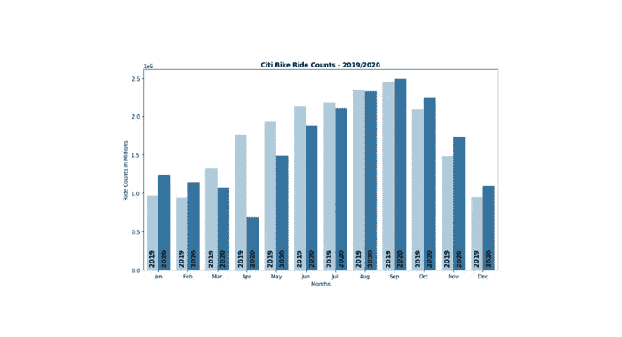

2019/2020 年花旗自行车骑行计数-所有图片由作者提供

在我之前的文章[探索纽约市自行车共享数据](/exploring-bike-share-data-3e3b2f28760c)中，我经历了 2020 年 3 月的探索性数据分析过程，纽约市在这个月关闭。在一篇后续文章中，我使用了 2020 年 9 月的数据，当时乘客人数已经恢复，但我意识到我真的需要查看整整两年的数据才能理解疫情引起的变化。

当我在写这篇文章的时候，我收到了山姆·施瓦茨(纽约人称之为“僵局山姆”)的工作人员发来的一封电子邮件，他最近研究了花旗的自行车骑行情况。可在[变速:花旗自行车骑行人数在冬季持续激增](https://www.samschwartz.com/staff-reflections/2021/2/24/shifting-gears-citi-bike-ridership-surge-continues-over-the-winter)上找到，也有关于这个主题的早期文章的链接。然而，他们的图表是使用商业数据可视化工具制作的。

我想使用我喜欢的开源工具做一些分析:用于分析的 **Pandas** 和用于图形的 **Seaborn** 。然后任何人都可以复制和扩展我的分析。

下面显示的所有源代码都可以在 Github 上的 Jupyter 笔记本中作为 [twoyears](https://github.com/ckran/bikeshare/blob/main/twoyears.ipynb) 获得。

# 下载并准备花旗自行车旅行数据

[花旗自行车系统数据](https://www.citibikenyc.com/system-data)页面描述了花旗自行车提供的信息。每次乘坐的具体信息如下:

*   行程持续时间(秒)
*   开始和结束时间和日期
*   起点和终点站 ID 和名称
*   起点站和终点站的纬度和经度
*   自行车 ID
*   用户类型(客户=日票或单程票；订户=年度会员)
*   性别(零=未知；1 =男性；2 =女性)
*   出生年

这可以用一些派生列来扩充，以简化分析:

*   行程持续时间(分钟)
*   开始年份，一个月中的某一天，一天中的某个小时
*   周末指示器(布尔型)
*   年龄(省略 75 岁及以上的骑手，默认年份为 1969 年)
*   距离(使用哈弗辛公式计算)

这些计算是探索性数据分析过程的一部分。现在我需要对两年的月度数据进行同样的计算。我把 Python 程序保存在 GitHub 上的一个 Jupyter 笔记本里，名为 [gettripdata](https://github.com/ckran/bikeshare/blob/main/gettripdata.ipynb) 。

每个月的 tripdata 文件被保存为一个 Parquet 文件，其名称与原始 CSV 文件相同，但扩展名为`.parquet`。我将所有 24 个月的文件保存到一个`tripdata`子目录中。这让我可以使用完整的文件名读取单个月份，使用目录名读取所有数据。

Parquet 是一个列存储，它使用的空间比 CSV 文件少得多。它的阅读速度也快了很多，尤其是在只选择几列的时候，所以我可以只阅读任何特定分析所需的列。

拼花地板和熊猫很好的融合在一起。要读写拼花文件，您只需安装一个库:

```
conda install pyarrow 
```

# 每月乘客量

为了查看每月的乘客总数，我需要`year`和`month`列，但是为了进一步分解数据，我还需要`usertype`和`gender.`，我将它们读入数据帧:

```
df = pd.read_parquet('tripdata',\
     columns=['year','month','gender','usertype'])
df.shape
```

`shape`告诉我在两年内有超过 4000 万次乘坐。

```
(40058554, 4)
```

虽然我可以使用 Seaborn `countplot`但它必须扫描整个数据帧。由于获得图表是一个迭代的过程，我发现只汇总一次数据会更快，使用 Pandas `groupby`来计算年和月的乘坐次数。使用`unstack()`以宽格式显示数据。

```
counts = df.groupby(["year", "month"]).size()
counts.unstack()
```

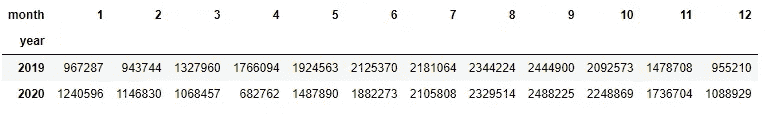

按年份和月份统计乘坐次数

由`groupby`创建的对象在`year`和`month`上有多重索引。我想在图表中使用这些值，所以我将它们转换成列。我还将重命名`Ride Count`列。

```
counts=counts.reset_index( level = ['year','month'])
counts.rename(columns = {0:'Ride Count'}, inplace=True)
```

现在我可以使用`barplot`来可视化数据，但是创建一个类似于“换挡”文章中的有吸引力的图表需要几个额外的步骤:

*   为了将月份显示为文本而不是数字，创建一个包含三个字母的月份缩写的变量`months`。
*   使用`hue=’year’, palette=’Paired’`将条形变成两种蓝色以显示年份
*   要让年份垂直出现在每个条形上，使用`annotate`并在条形间循环以注释每个条形。
    注意:大多数参考资料显示了如何用高度来注释一个条，但是这不是使用这个特性的唯一方法。这里我使用了一个计数器`y`来存放`year`的当前值。

```
months = ['Jan','Feb','Mar','Apr','May','Jun','Jul','Aug','Sep','Oct','Nov','Dec']plt.figure(figsize=(12,5))
ax=sns.barplot(data=counts, x="month" , y='Ride Count',  hue='year', palette='Paired' )
ax.set_xlabel("Months") 
ax.set_ylabel("Ride Counts in Millions") 
ax.set_xticklabels(months)
ax.legend_.remove()
y=0
for p in  ax.patches: 
    ax.annotate(counts.year[y], (p.get_x() + p.get_width()/ 2, 0),\ 
    rotation=90, ha='center', size=12, fontweight='bold',\
    xytext=(0, 10),  textcoords='offset points')  
    y+=1
```

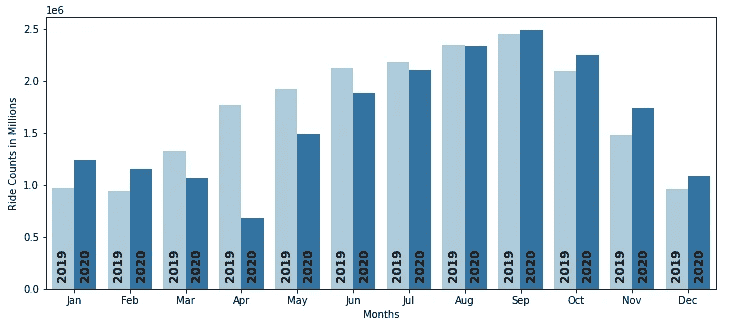

花旗自行车每月骑行次数— 2019 年和 2020 年

经过春季和夏季的下降后，乘客人数在 9 月份开始增长，并在秋季和冬季继续增长。要计算百分比变化，请使用:

```
100 * counts.unstack().pct_change().round(3)[1:]
```

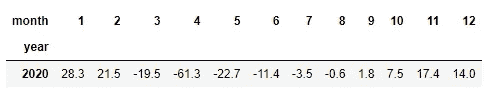

从 2019 年到 2020 年的乘客百分比变化

# 按性别和用户类型划分的乘客数量

分析师指出，女性骑手的比例有所增加。要查看这一变化，我可以使用相同的数据框架，并按`usertype`和`gender`汇总乘坐次数。

```
countsg=df.groupby(["usertype","year", "month","gender"])\
  .size().unstack()
countsg.head()
```

提醒一下，Citi Bike 区分订户(年度会员)和客户(一次出行或每日用户)，性别值为 0(未指定)、1(男性)和 2(女性)。

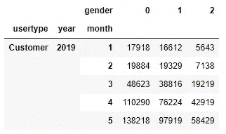

按用户类型和性别划分的乘客数量

计算女性骑手的百分比，首先对各列求和，得出骑手总数，然后将女性骑手总数除以总数，再乘以 100，得出百分比:

```
countsg['total'] = countsg.sum(axis=1)
countsg['pct female'] = countsg[2] / countsg.total * 100
countsg.head()
```

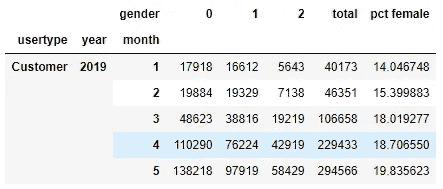

女骑手的百分比

为了制作图表，我将把多索引转换成列:

```
countsg=countsg.reset_index( level = ['usertype','year','month'])
```

为了并排显示年份，我使用了`catplot`并分别显示订户和客户，我创建了一个两种类型的列表`usertypes`，然后我可以对其进行迭代。为了便于比较，我将两个图表的最大值设为相同的值，40%。

```
usertypes=['Subscriber','Customer']
sns.set(font_scale = 2)for u in usertypes:
    ax=sns.catplot(data=countsg[countsg.usertype==u],\
           x="month", y="pct female", col="year",\
           color='Green', kind='bar', height=5, aspect=12/5 ) 
    ax.set_axis_labels("", u + a"\n% Female")
    ax.set_xticklabels(months)
    ax.set_titles('{col_name}')
    ax.set(ylim=(0,40))
```

这确实显示了女性骑手的比例在增加，对于这两种类型的用户来说都是如此，但对于订户(年度会员)来说尤其如此。

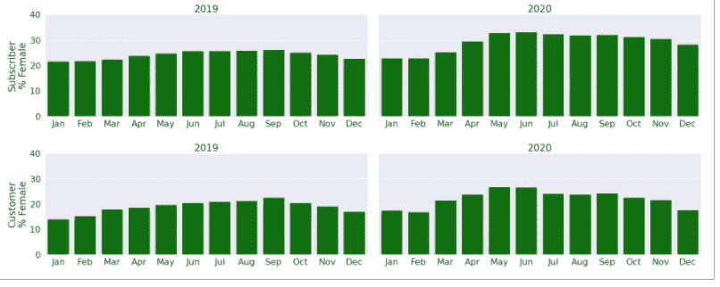

女骑手的百分比

然而，有一点它没有显示出来，那就是客户(每日用户)的乘车比例，这一比例一直远低于订户(年度会员)。为了查明这是否随着时间的推移而改变，我在`usertype`上做了另一个`groupby`:

```
count_type=df.groupby(["year", "month", "usertype"])\
  .size().unstack()
count_type.head()
```

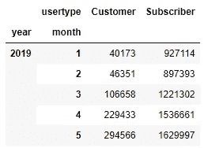

按年份、月份和用户类型划分的乘客人数

然后我创建了另一个数据框架，显示了顾客乘坐的百分比:

```
custpct = count_type.Customer / (count_type.Customer +\
    count_type.Subscriber) * 100
custpct = custpct.reset_index(level = ['year','month'])\
custpct.rename(columns = {0:'Customer Percent'}, inplace=True)
```

再次使用`catplot`获得两张并列图表:

```
sns.set(font_scale = 3)
ax = sns.catplot(data=custpct,\
       x="month", y="Customer Percent", col="year", dodge=False, \
       color='blue', kind='bar', height=10, aspect=20/10 ) 
ax.set_axis_labels("", "Customer\n% Rides")
ax.set_xticklabels(months)
ax.set_titles('{col_name}')
ax.set(ylim=(0,40)) ;
```

在这里我可以看到，从 2019 年到 2020 年，客户与订户的比率有所增加，尤其是在夏季。

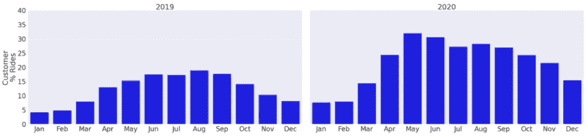

顾客乘坐的百分比

# 一天中各小时的乘客量

分析师注意到的另一个变化是一天中乘车次数的分布。这个分析需要与上面不同的列，所以我将返回到文件并使用`year`、`weekday`和`start hour`创建一个新的 DataFrame。

```
df = pd.read_parquet('tripdata',\
     columns=['year','weekday','start hour'])
```

按相同的列进行聚合，将多索引更改为列，并重命名`Ride Count`列。

```
count_hr = df.groupby(["year", "weekday","start hour"]).size()
count_hr=count_hr.reset_index(level=['year','weekday','start hour'])
count_hr.rename(columns = {0:'Ride Count'}, inplace=True)count_hr['Ride Count'] /= 1000
```

由于`catplot`没有折线图，我使用`subplot`为一周中的每一天创建一个`lineplot`。我将迭代天数，从 0(星期一)到 6(星期日)，使用星期几来自定义图表和标签。

```
sns.set(font_scale = 1)
fig, ax = plt.subplots(1,7, figsize=(20,5))days=['Mon','Tue','Wed','Thu','Fri','Sat','Sun']for d in range(len(days)):
    sns.lineplot(ax=ax[d], data=count_hr[count_hr.weekday==d],\
     linewidth=4,x="start hour", y="Ride Count", hue='year',\
     palette='Paired')\
     .set_title(days[d]) ;
    if ~d:
        ax[d].set_ylabel('Ride Count in Thousands')
    if d:
        ax[d].set_ylabel('')
        ax[d].set_yticklabels('')
    if d != 3:
        ax[d].set_xlabel('')
    if d < 6:
        ax[d].legend_.remove()
```

这里可以看到 2019 年到 2020 年的变化。2020 年的高峰时间比 2019 年要少得多，尤其是早高峰。周末的乘车次数也增加了。这两种趋势都表明了从通勤旅行到休闲骑行的转变。

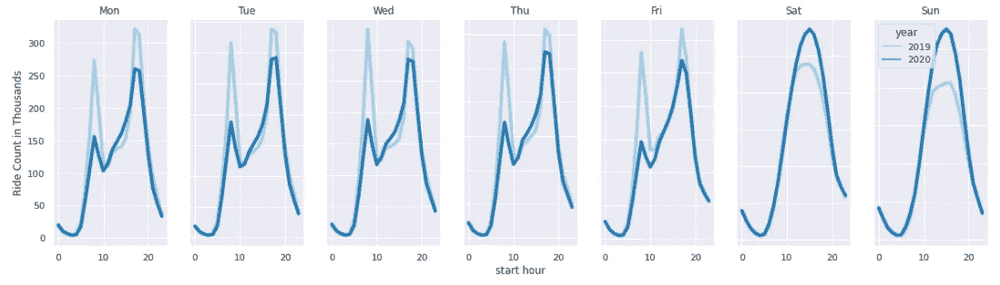

2019 年和 2020 年——按一周中的每一天和一天中的每一小时计算乘车次数

请注意，这些图表反映了全年的情况；个别月份看起来会有所不同。

# 行程持续时间

这种转变的另一个迹象是乘坐时间的长短。分析师指出，在 12 月，“平均旅行持续时间延长了 20%以上——17 分钟比 14 分钟长。”虽然我确认这个数字是正确的，但我认为它有误导性。在我的分析中，我看到了旅行持续时间的异常值:自行车没有被归还或正确停靠，导致旅行时间过长。

我认为使用*中值*旅行持续时间比平均值更好，因为平均值被那些大值抛弃了。

我将重新读取 tripdata 文件以获取`year`、`month`和`tripduration`，并将持续时间从秒转换为分钟。然后执行一个`groupby`，但是我将使用`agg('median')`来获得每组的平均旅行持续时间，而不是使用`size()`来获得记录数。

```
df = pd.read_parquet('tripdata',\
    columns=['year','month','tripduration'])
df.tripduration /= 60
dur = df.groupby(["year", "month"]).agg('median')
dur.unstack().round(2) # just to display 
```

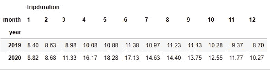

按年份和月份划分的旅行持续时间中位数(分钟)

然后我可以创建一个类似于第一个的图表:

```
dur.reset_index( level = ['year','month'], inplace=True)
sns.set(font_scale = 1)
plt.figure(figsize=(12,5))

ax=sns.barplot(data=counts, x="month" , y='tripminutes',  hue='year', palette='Paired' )
ax.set_xlabel("Months") 
ax.set_ylabel("Trip Duration in Minutes") 
ax.set_xticklabels(months)
ax.legend_.remove()
y=0
for p in  ax.patches: 
    ax.annotate(dur.year[y], (p.get_x()+p.get_width()/ 2, 0),\
    rotation=90, ha='center', size=12, fontweight='bold',\
    xytext=(0, 10), textcoords='offset points')  
    y+=1
```

使用中位数而不是平均值确实表明，从 2019 年到 2020 年，旅行持续时间增加了。然而，这种增长在夏季比在 12 月更加明显。

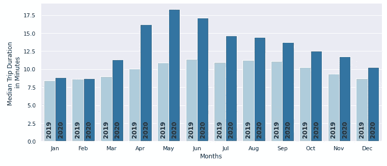

按年份和月份划分的旅行持续时间中位数(分钟)

事实上，如果我看一下从 2019 年到 2020 年的百分比变化，我看到 12 月的变化仅为 18%。

```
dur.unstack().pct_change().round(2)[1:] * 100
```

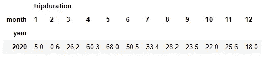

2019-2020 年中值出行持续时间的百分比变化

# 结论

使用 Pandas 和 Seaborn，我可以进行与商业产品相同的分析和可视化。通过用这些库分析数据，任何人都可以复制我的结果，并做他们自己的额外分析。

在 2020 年春天最初的封锁期间，疫情导致花旗自行车使用量大幅下降。乘客量在夏季反弹，并在秋季超过了去年的使用量。

工作日的使用已经发生了变化，高峰时段的高峰值较低，而下午和晚上的乘客较多，这表明从通勤到休闲骑行的转变。