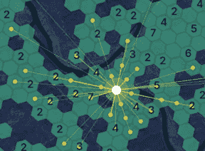
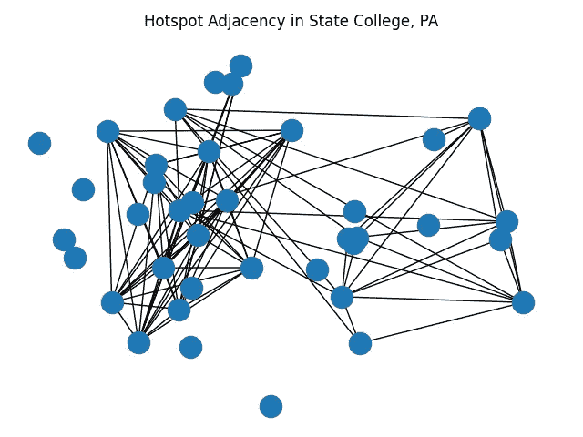
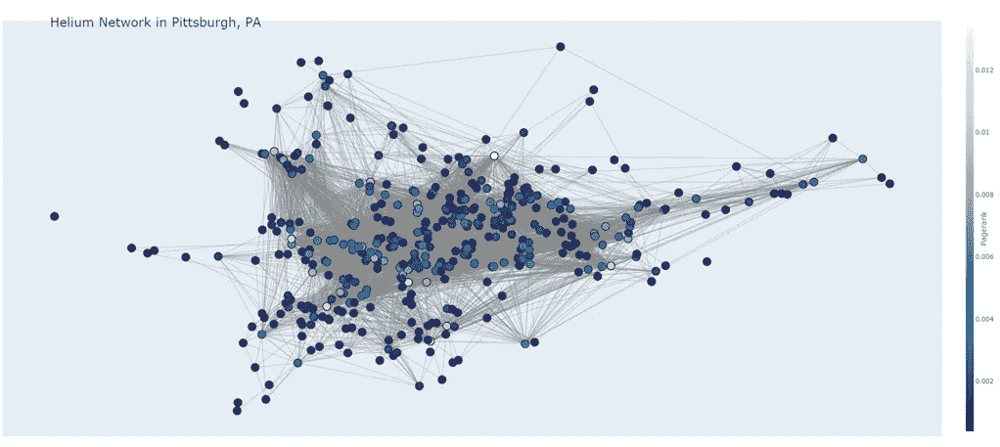
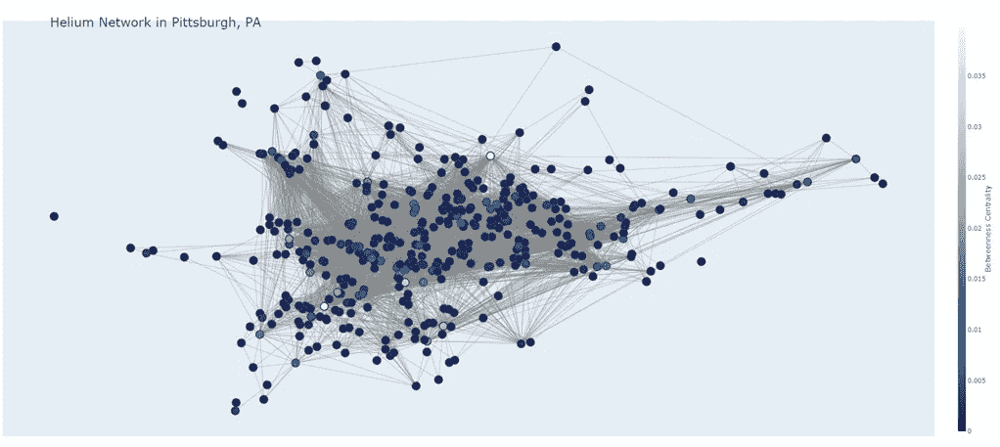
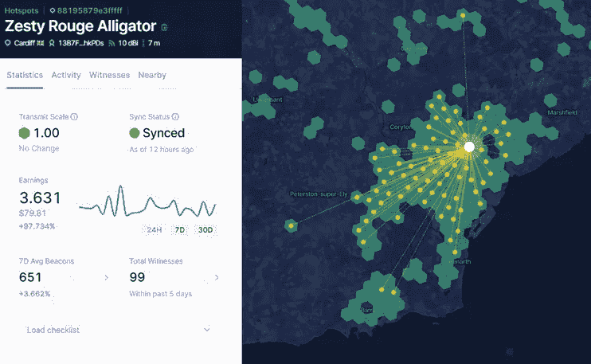
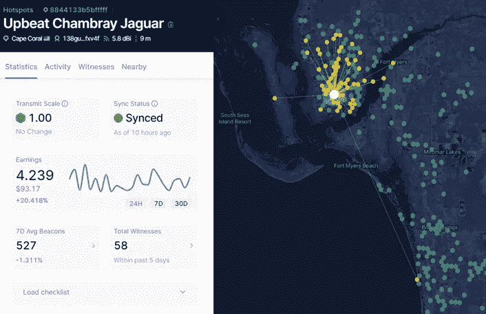
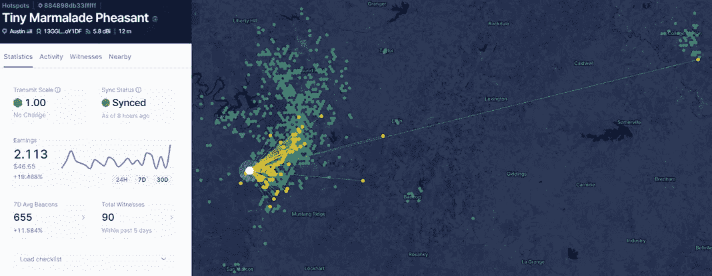
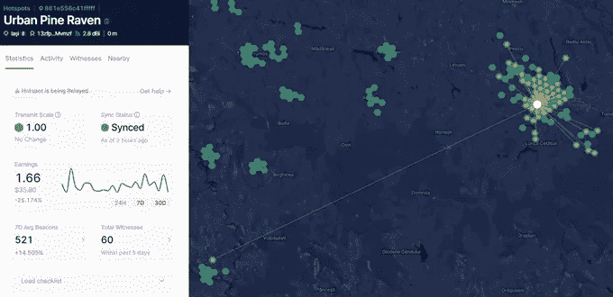
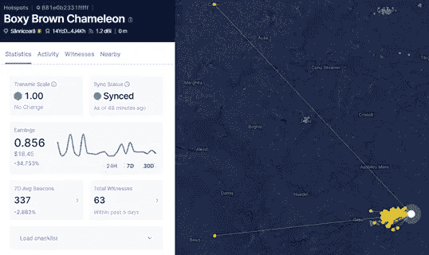

# 用图论探索氦网络

> 原文：<https://towardsdatascience.com/exploring-the-helium-network-with-graph-theory-66cbb8bffff9?source=collection_archive---------10----------------------->

## 使用区块链数据提取关于网络覆盖和“可疑”热点的见解

照片由[阿丽娜·格鲁布尼亚](https://unsplash.com/@alinnnaaaa?utm_source=medium&utm_medium=referral)在 [Unsplash](https://unsplash.com?utm_source=medium&utm_medium=referral) 上拍摄

## 氦网络快速入门

本文假设您对[氦区块链](https://www.helium.com/)有一些基本的了解，特别是它专门构建的工作算法，称为[覆盖证明](https://docs.helium.com/blockchain/proof-of-coverage)。从本质上讲，网络中的每个无线电台都会定期广播“信标”，也就是加密数据的小数据包。任何“见证”(接收)该传输的热点在收据中将其报告给区块链。附近热点之间的这种持续通信有助于证明在给定的地理区域中提供了足够的覆盖，并且矿工以诚实的方式提供这种服务会得到奖励。我鼓励你阅读更多关于氦的[文档](https://docs.helium.com/)。

## 数据集管理

你在这里看到的所有数据都是通过向公开可用的[氦区块链 API](https://docs.helium.com/api/blockchain/introduction/) 发出请求而生成的。[开源](https://github.com/helium/blockchain-http/blob/master/LICENSE)分类账提供了容错和可审计性，但它们也是数据挖掘的绝佳数据集。以下是我用 Python 中的`requests`库实现的一些 API 调用示例:

## 什么是图？

通常，我们选择表示数据集的方式与数据本身一样重要。一些输入，如图像和金融时间序列，适合定义明确的表示，如数组、向量和张量。由于许多 ML 模型，如卷积神经网络，严重依赖于线性代数，我们通常更喜欢类似矩阵的数据结构。然而，对于许多复杂的应用，比如药物发现、推荐系统，当然还有 ***【无线网络】*** 我们会受益于少一点的结构。

**图**是由离散点定义的数据结构，称为**节点**，节点间邻接关系的表达式，称为**边**。例如，您可以生成分子图，其中节点是单个原子，边是它们之间的键。出于我们的目的，我们可以将氦网络视为一个巨大的图形，具有 200，000+个节点(热点)和数百万条边(见证路径)。幸运的是，有许多开源库可以帮助构建和分析图表；在本文中，我将使用 Python 模块 [NetworkX](https://networkx.org/) 和 [PyTorch Geometric](https://pytorch-geometric.readthedocs.io/en/latest/) 。

给定氦热点的目击者示例(图片由作者提供)。

## 为城市生成氦网络图

下面的代码片段定义了`CityGraph`类，我们将使用它来生成给定城市的 NetworkX 图。首先，我们为每个热点创建一个节点，包括它们的位置、海拔、天线增益和最近收入等特性。每个节点的索引是其唯一的热点地址。接下来，我们遍历每个热点的所有最近见证收据，并在该节点及其唯一见证之间创建边。我们甚至可以对边缘应用权重，例如关于信号强度的度量(例如 RSSI 或信噪比)或数据包所报告的传输距离。

然后我们可以用`nx.draw()`函数来可视化图形。下面是宾夕法尼亚州州立大学氦网络的一个例子:

宾夕法尼亚州州立大学氦网络图。节点代表单个热点，边代表见证路径(即热点可以“听到”彼此)。“孤狼”无法证明他们的覆盖面，因此，赚取最低限度的奖励(图片由作者提供)。

## 特征提取:PageRank 和中间中心性

一旦我们有了这种表示，我们就可以利用数十年的图论研究来提取关于数据集的见解。**原本为完全不同的领域开发的算法，甚至可能适用于我们对无线网络的分析。**举个例子， [**PageRank**](http://ilpubs.stanford.edu:8090/422/1/1999-66.pdf) 的度量是在 1999 年设计的！)作为搜索引擎找到与给定查询最相关的网站的一种方式。在这些引用图中，单个站点是节点，站点之间的超链接表示相邻关系。最有影响力的网站是用户最终最常浏览的网站。这与物联网网络有什么关联吗？让我们使用`plotly`来看看匹兹堡氦网络的 PageRank 值。

Pittsburgh 的氦网络存在，用 PageRank 评分着色(图片由作者提供)。

亮黄色的节点是 PageRank 分数最高的节点，而深蓝色的节点分数较低。有很多见证人当然有助于你的 PageRank 值，但不是唯一的因素。该算法还考虑了任何连接节点的相对影响，因为这是流量流向该枢纽的指标(例如，来自高价值网站(如 CNN.com)的流量比来自我的博客的流量加权更大)。另一方面，热点位于最密集的区域，但性能相对低于其邻居，被 PageRank 分数视为无关紧要。

另一个潜在的相关度量被称为<https://en.wikipedia.org/wiki/Betweenness_centrality>****(或简称为“中间性”)。在这种情况下，该算法使用最短路径来识别有影响的节点。你可以把这个应用到航空旅行上。由于位于美国大陆的中心位置，芝加哥奥黑尔是东西和南北航班的常见中途停留目的地。中间性也被用来识别对病毒趋势影响最大的 reddit 社区，因为这些社区在看似不同的主题之间提供了最直接的联系，如政治和流行文化。同样，让我们来看看这个指标，因为它与匹兹堡的氦网络有关。****

********

****匹兹堡的氦网络，由中间中心性着色。****

******具有最高介数分数的热点是那些唯一连接地理上稀疏的区域**的热点，例如那些在匹兹堡市中心和南部丘陵之间提供唯一见证路径的热点。我认为这些热点是网络的关键；虽然他们可能没有最高的见证人计数，但他们执行关键的覆盖范围证明。****

## ****离群点检测:图形神经网络****

****让我们把这些概念和一些深度学习结合起来。“图形神经网络”(GNNs)包含 DL 模型的一个子集，旨在从基于图形的数据集中提取洞察力——你猜对了。就像基于图像和 NLP 的人工智能一样，研究人员不断推出 GNN 算法、优化器和激活函数的新变体，以适应各种任务。与其纠缠于方法本身，我想把重点放在我们将如何把它们应用到我们的数据集上，在其他地方[会有更好的解释。](/a-gentle-introduction-to-graph-neural-network-basics-deepwalk-and-graphsage-db5d540d50b3)****

****在氦网络中，工程团队面临的首要挑战之一是**识别出可能会欺骗系统以增加奖励的坏演员**。这种游戏可以采取多种形式，但最流行的方法之一是让热点看起来比实际情况更分散。通过稀疏放置，矿工受益于最佳奖励比例，因为覆盖证明[抑制了密集热点](https://github.com/helium/HIP/blob/master/0017-hex-density-based-transmit-reward-scaling.md)。虽然网络使用[无线电传播的物理限制](http://whitepaper.helium.com/)来剔除一些不诚实的活动(即，在给定距离内传播的信号强度有一个上限)，但在许多情况下，绕过这些相对保守的阈值并不是非常困难。**深度学习的非线性本质意味着决策边界更难预测，因此可能更难规避。******

****回到模型本身。我们的输入将是我们之前收集的城市图表。在我生成这个数据集时，热点分布在全球超过 11，000 个独特的城市，这些城市的规模、地理特征和监管条件各不相同。对于每个热点，我们将使用 PageRank 分数和中间中心性作为特征，并且每个见证路径将使用所报告的信标的 RSSI 和 SNR 作为边权重。最后，我们的模型的输出将是每个节点的奖励等级值的回归预测。**你可以在这里** **下载完整数据集(存储为泡菜二进制)** [**。**](https://drive.google.com/file/d/1fOvY_l8bPuM_uDuxnVSx78Y7HJJUu58H/view?usp=sharing)****

****我的想法是，我们的模型应该概括一个“名义上”的城市是什么样子，但它将很难对异常情况进行分类。换句话说，在给定特定特征集的情况下，当奖励等级可疑地高(或低)时，**我们的模型将显示高损失**(以预测和实际之间的均方误差衡量)。说到模型，这里是我们的 GNN 的代码，使用 PyTorch Geometric 的 [GCNConv](https://arxiv.org/abs/1609.02907) 层和 Adam 优化器:****

****这将打印出我们测试集中损失最高的城市*和*单个热点，因为我们是在逐个节点的基础上进行预测的。让我们使用[氦探测器](https://explorer.helium.com/)来仔细看看我们的一些异常值:****

******离群城市#1:威尔士卡迪夫******

********

****卡迪夫无可挑剔的热点(图片由作者提供)。****

******离群城市#2:佛罗里达州珊瑚角******

********

****另一个沿海城市佛罗里达州珊瑚角令人印象深刻的信号传播(图片由作者提供)。****

****你可以看到这个模型在暗示什么。在这两个地势低洼的沿海城市，大多数热点都有接近最优的回报规模和令人印象深刻的信号传播。有可能这里发生了一些欺骗，或者这只是无线电波在水上传播的人为现象。在未来的模型中，我想考虑地理因素，如当地的海拔和重要的水体。****

******异常热点#1:微小的橘子酱山鸡******

********

****图片作者。****

******离群热点#2:城市松鸦******

********

****图片作者。****

******离群热点#3:方方正正的棕色变色龙******

********

****图片作者。****

****现在，我们正在查看损失最高的*个热点*。在这种情况下，模型捕捉的情况是热点位于人口相对密集的区域(即附近有许多其他矿工)，但他们仍然管理着完美的传输规模。我们在这里看到的另一个现象是一些非常远的见证路径，大约数百公里。也许这些热点只是拥有极其强大的天线和绝佳的位置，或者这是可疑活动的迹象。****

## ****结束语****

****在本文中，我们利用图论来提取关于氦网络的见解。我们发现，像 PageRank 和 Betweenness 这样的指标，最初是为完全不同的应用领域设计的，对于在给定的城市中找到最重要(和最不重要)的热点有一定的相关性。利用这些特征和最先进的基于图形神经网络的模型，我们可以开始处理识别氦区块链上“可疑”活动的艰巨任务。我期待着进一步优化模型架构和特征提取方法，以及将分类任务扩展到其他领域，如覆盖范围映射。在短短几年的时间里，氦网络已经发展成为地球上最大的公共 LoRaWAN 网络。对于那些对去中心化和廉价物联网覆盖感到兴奋的人们来说，这已经是一个巨大的胜利。对于试图对这个庞大的(公开可用的)数据集建模的数据科学家来说，工作才刚刚开始。****

## ****参考****

****[氦白皮书](http://whitepaper.helium.com/)****

****[NetworkX 文档](https://networkx.org/)****

****[PyTorch 几何文档](https://pytorch-geometric.readthedocs.io/en/latest/index.html)****

****[城市图表数据集(111 MB)](https://drive.google.com/file/d/1fOvY_l8bPuM_uDuxnVSx78Y7HJJUu58H/view?usp=sharing)****