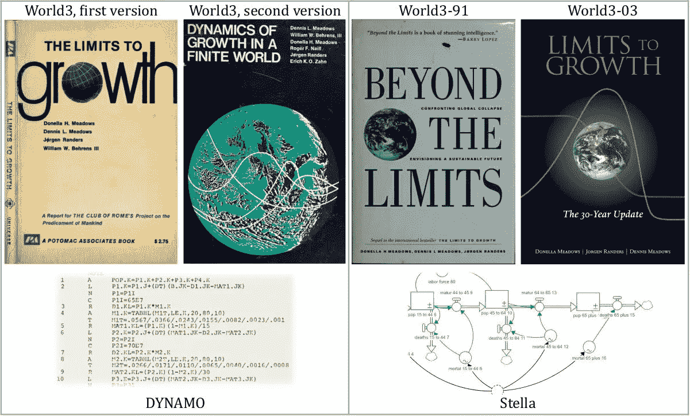
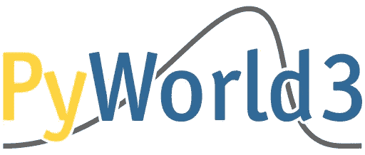
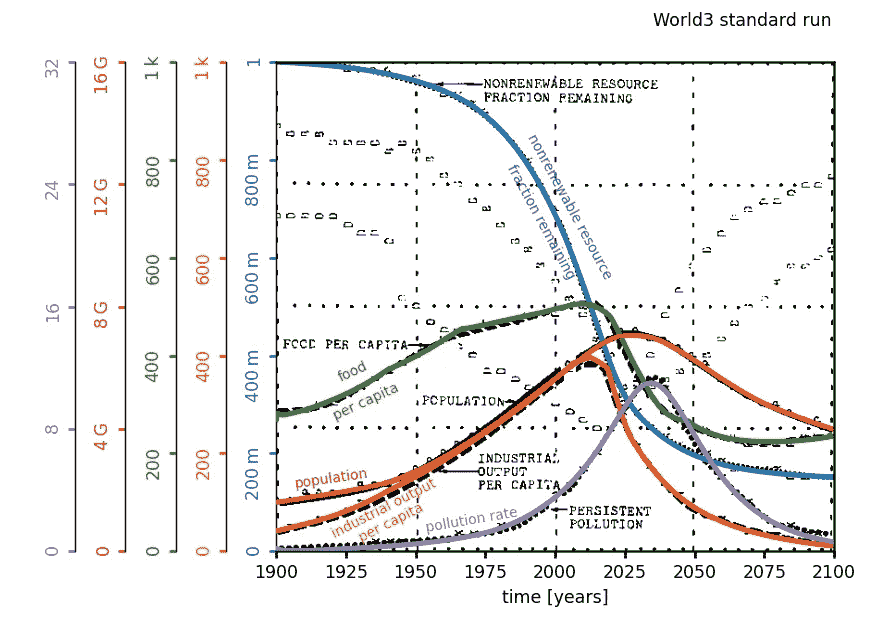
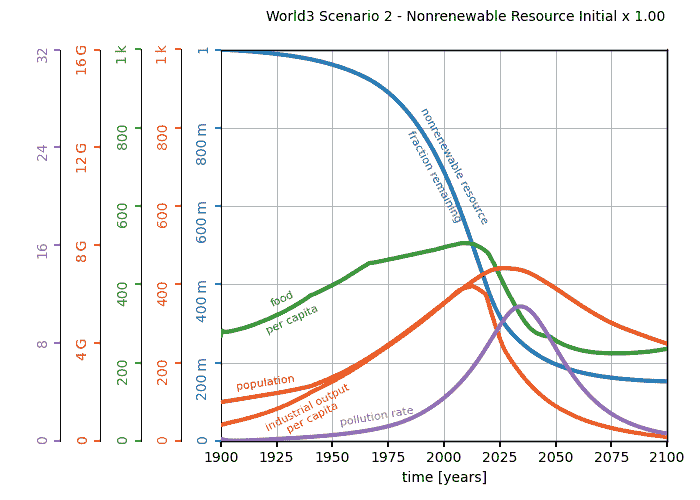
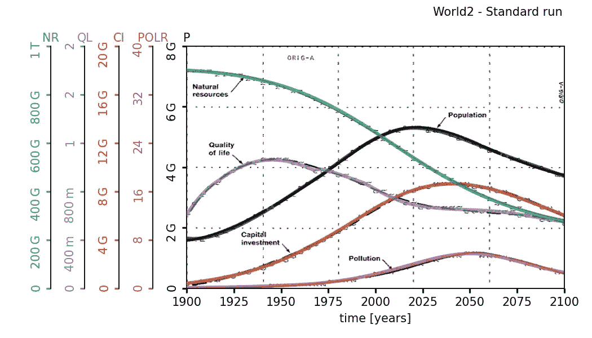

# 用 Python 探索增长的极限

> 原文：<https://towardsdatascience.com/exploring-the-limits-to-growth-with-python-674133874eed?source=collection_archive---------18----------------------->


“中国内陆工业城镇”——[Jerry Zhang](https://unsplash.com/@z734923105?utm_source=medium&utm_medium=referral)摄影

## 一瞥[py world 3](https://github.com/cvanwynsberghe/pyworld3)&[py world 2](https://github.com/cvanwynsberghe/pyworld2)

梅多斯等人写的《增长的极限》一书于 1972 年出版，因其对当前世界进化的可持续性的惊人预测而享誉世界。然而，它很快就从人们的记忆中消失了，可能是因为它的结论受到了很多不好的批评，被认为过于悲观和以末日为导向。另一个可以理解的原因是，所有科学证据的核心依赖于一个名为 World3 的独特模型的模拟，而这个模型乍一看非常复杂。事实上，在一个人能够合理地掌握定义世界 3 的整个系统方法之前，需要花费很多时间:除了阅读这本书之外，还需要一些额外的努力。

尽管如此,*增长极限*中的主张显示了兴趣的复苏，特别是因为不同的有形信号严重质疑我们今天生活的世界的可持续性。它可能涉及[、新冠肺炎疫情及其对经济和物理流量的所有影响](https://mahb.stanford.edu/blog/limits-to-growth-and-the-covid-19-epidemic/)、[气候趋势](https://www.nasa.gov/press-release/2020-tied-for-warmest-year-on-record-nasa-analysis-shows)，或[人类世指标的演变](https://futureearth.org/2015/01/16/the-great-acceleration/)，仅举几例。今天，甚至欧洲环境署也是正式的，并承认在物理和系统的限制下，现在**-如果不发生**以后**的情况下，走向“没有经济增长的[增长的道路是必要的。](https://www.eea.europa.eu/themes/sustainability-transitions/drivers-of-change/growth-without-economic-growth/)[经常性](https://www.sciencedirect.com/science/article/pii/S0959378008000435?casa_token=8RfpXMFhskUAAAAA:xs-1MZZ1pdCrdTQXORzjI6hkGvbR3uaxKoo9HUejZ4KeLyitl6boeYSn0Ad2YSCUvDLdZA__qA) [研究](https://www.linkedin.com/pulse/i-did-data-check-world-model-forecast-global-collapse-branderhorst/) [显示](https://sustainable.unimelb.edu.au/publications/research-papers/is-global-collapse-imminent)我们从现实世界状态中所能衡量的东西与世界 3 情景的变量极度吻合，导致*超调和崩溃*:**

*   **零政策情景称为*一切如常*，或者**
*   **假设经济增长仍然是一个目标，在这种情况下，密集的技术发展旨在抵消所有不良影响的持续增长。**

**除了这些事实之外，似乎比以往任何时候都更重要的是，这个在系统动力学框架下定义的复杂模型，应该更容易被任何人理解和理解。**

## **深入模型**

**由于 World3 现有的不同版本和实现，新手可能会迷失在选择正确的版本来学习 T2 的道路上。
首先注意**在模型参数和结构方面存在 4 个不同版本**。每当梅多斯等人出版一本书时，他们都会重新校准模型，使其与当时的真实世界相匹配。
其次，**不同的软件实现**可以在网上找到。众所周知的 world 3–03 实现(2004 年至今的最新版本)使用带有图形用户界面的软件工具:**

*   **Stella 上的**官方**实现——[CD](https://www.bookfinder.com/book/9781931498852/)随 2004 年的书*增长的极限:30 年更新*一起提供，但现在似乎脱销了；**
*   ****针对 [Vensim](https://metasd.com/tag/world3/) 和 [Modelica](https://build.openmodelica.org/Documentation/SystemDynamics.WorldDynamics.World3.html) 的非官方**实现。**

**请注意，第一个实现是在技术书籍《有限世界中的增长动力》中提供的，它是一种叫做 DYNAMO 的语言的源代码。然而，由于它对系统动力学和当时使用的计算机硬件有很强的特异性，DYNAMO 没有成为一种流行的语言，现在已被弃用。**

****

**World3 有 4 个版本，2 个正式实现。从左至右，出版于 1972 年、1974 年、1992 年和 2004 年。图片作者。**

# **我做了什么，为什么**

**尽管该模型取得了成功，但在当今的主流科学编程语言中，World3 的源代码却少得惊人。我找到了这些:**

*   **在 [Javascript](https://github.com/bit-player/limits) 中，由布莱恩·海因斯编写；**
*   **同样的 Javascript 代码是用 Python 包装的[，但是具有因果推理和强化学习的特定特性；](https://github.com/zykls/whynot)**
*   **一个由 INRIA 制作的 [Python 版本](https://gitlab.inria.fr/arasoldi/world3-03_python)，基于由 [PySD](https://pysd.readthedocs.io/en/master/) 翻译的 Vensim 模型。**

**出于研究目的，最后一个选项似乎很有趣，但是源代码仍然很难理解。这就是为什么我更喜欢从零开始实现 World3，因为我想要一些东西:**

1.  **基于技术报告*中给出的**对原迪纳摩脚本**的直接翻译【有限世界中的增长动力】，***
2.  **能够运行不同的可配置场景，**
3.  **在广泛使用的编程语言中，**
4.  ***希望*尽可能的**清晰最小**！**

****

**PyWorld3 在 [GitHub](https://github.com/cvanwynsberghe/pyworld3) 上有售。图片作者。**

**我最终选择了具有最小依赖性的 Python 3 代码。它不是纯粹的 Python，因为它从库调用函数来轻松处理数组操作和插值函数。该代码可在 [GitHub](https://github.com/cvanwynsberghe/pyworld3) 上获得。**

## **使用 PyWorld3 或 PyWorld2**

**[PyWorld3](https://github.com/cvanwynsberghe/pyworld3) 可以通过命令`pip install pyworld3`安装。由于参数和功能的不同性质，模拟设置分为 5 个部分。所有默认变量返回*正常业务*场景:**

```
from pyworld3 import World3world3 = World3()
world3.init_world3_constants()
world3.init_world3_variables()
world3.set_world3_table_functions()
world3.set_world3_delay_functions()
world3.run_world3()
```

**如下图所示，模拟输出与显示污染、人口、食品、工业产出和剩余不可再生资源的原始图相当吻合。**

****

**World3 &“照常营业”的场景:将 PyWorld3 与原始印刷品进行比较(有限世界中的增长动力学，1974)。图片作者。**

**可以通过指定设置功能的输入来配置模拟。例如,*增长极限*的第一个结论是，不可再生资源存量翻倍只会导致更严重的污染危机。它在书中被描述为第二种分析场景，并且可以通过简单地改变第二行以使不可更新的资源初始常数`nri`加倍来获得模拟:**

```
world3.init_world3_constants(nri=2e12)  # default is 1e12
```

**随着`nri`的逐渐增加，污染很快就超过了极限，人口的下降速度变得越来越重要，超过了之前的增长率。乌戈·巴尔迪将这种轨迹称为**塞内卡效应**，这是对塞内卡名言的回应:“财富增长缓慢、*但毁灭迅速*。请注意，塞内卡效应也出现在食品和工业产出库存的演变上。**

****

**所谓的“污染危机”情景:增加初始不可再生资源存量放大了塞内卡效应对人口和食物的影响。图片作者。**

**在 PyWorld3 的基础上，剩下的所有场景应该都是可行的。从教育的角度来看，这可能是一个有趣的项目。对于系统动力学中更柔和的学习曲线，我建议从 [**PyWorld2**](https://github.com/cvanwynsberghe/pyworld2) **开始，我之前的项目是 Forrester 的 World2 模型的 Python 实现**。如下所示，计算出的变量揭示了类似的*过冲和坍缩*演化，尽管 **World2 比它的继任者** **要简单得多**。关于《世界 2》历史的更多细节，请参见优秀的 [A .米格南的博文](/world2-model-from-dynamo-to-r-2e44fdbd0975)。**

****

**world 2 & py world 2 的“照常营业”场景。与原始照片相比。变量名称对应于自然资源(NR)、生活质量(QL)、资本投资(CI)、污染率(POLR)。图片作者。**

# **关于您应该考虑哪种实现的最后一点说明**

**当我决定编写 py world 3——和 py world 2——时，我想要一个没有不必要的复杂性的代码，用于教育或研究目的。它可能满足你的需求，但它应该取决于你真正需要做什么。**

**如果你有机器学习或统计分析的想法，从源代码实现开始似乎是一个不错的选择，因为**你可能需要高效的函数调用**，而**避免了包装第三方软件的繁琐任务**。然而，如果你想从头开始设计你自己的模型，我绝对不建议你用文本编辑器来开始你的项目，除非你喜欢头痛…用顺序编程范例来编码一个系统动力学模型会变得很麻烦，因为所有的模型方程都是相互依赖的。相反，任何具有图形单元界面的软件都有助于关注模型的设计。**

**如果您需要两者兼得，那么用 Vensim 设计以方便使用，然后用 PySD 自动移植到 Python 以保持效率，似乎是理论上最直接的解决方案。**

# **一些参考**

*   **梅多斯、多内拉·h 等人*《增长的极限》*，1972 年。**
*   **丹尼斯·l·梅多斯等人*有限世界中的增长动力学*，1974 年。**
*   **巴尔迪，乌戈。*塞内卡效应*，2017。**
*   **海因斯布莱恩。 [*计算与人情*(视频+幻灯片)](http://bit-player.org/2012/world3-the-video)，2012。**
*   **米格南阿诺。 [*World2 模型，从迪纳摩到 R*](/world2-model-from-dynamo-to-r-2e44fdbd0975) ，2020。**